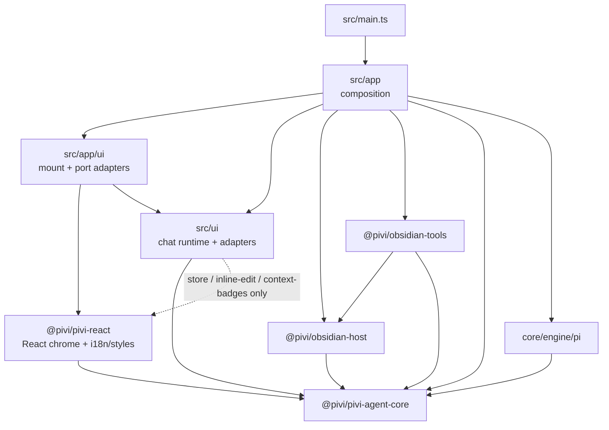
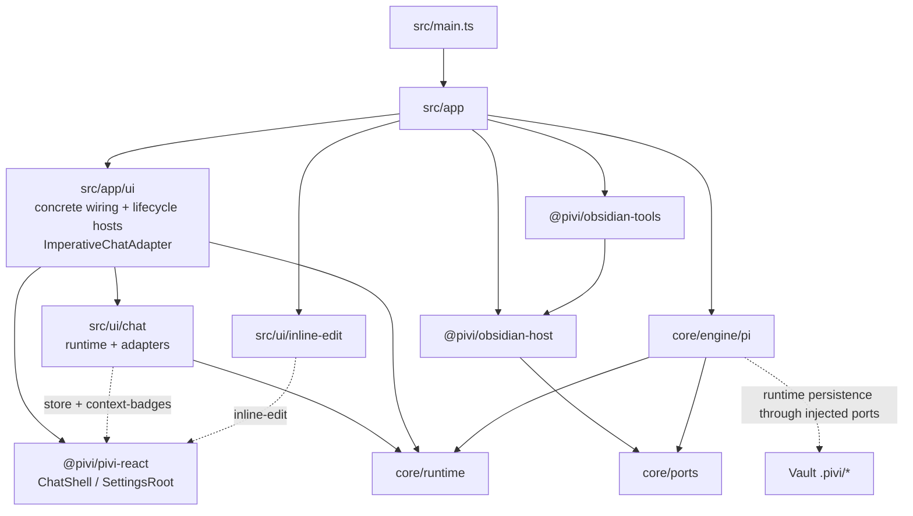
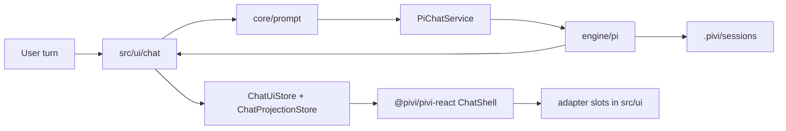
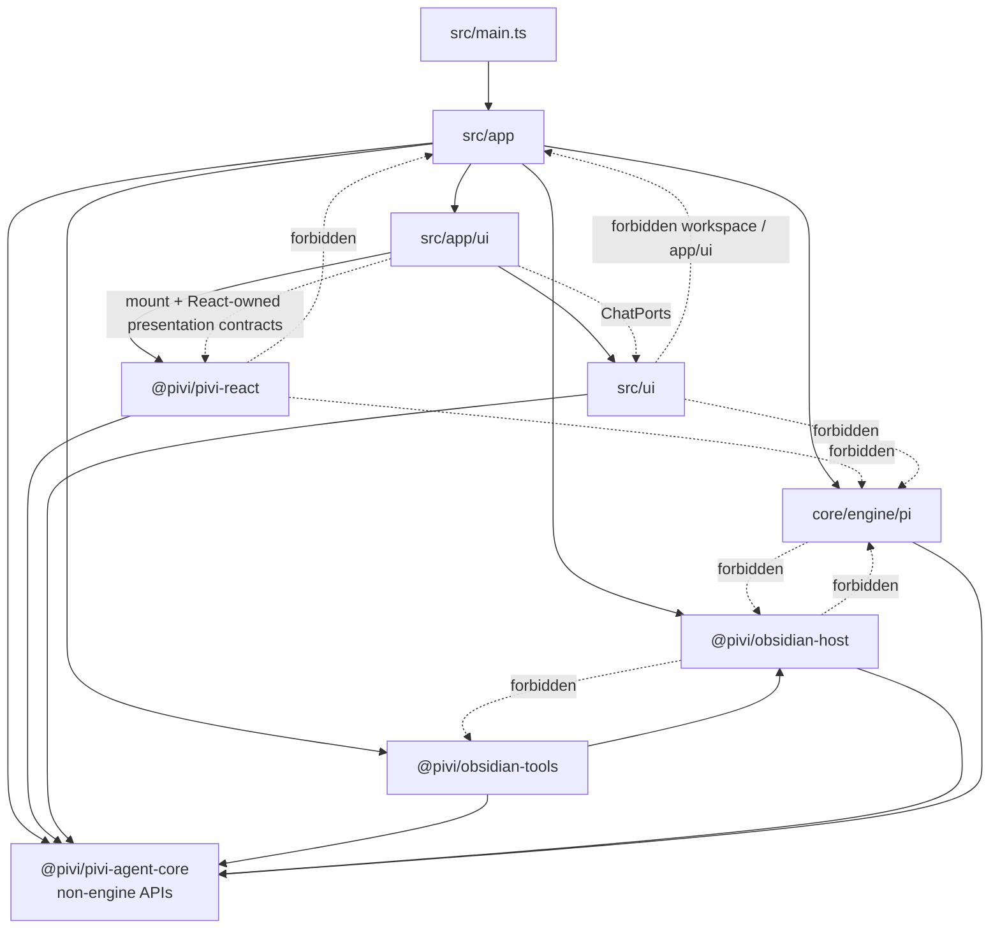

# Pivi Developer Guide

Welcome to the **Pivi** developer reference guide. This document is the **operational** entry point for build, test, lint, release, project glossary, quality review, and repo-wide seam rules.

---

## 📚 Project guidance

Pivi keeps the new-developer architecture, technology rationale, end-to-end flows, and contribution routes in the [`docs/` handbook](docs/README.md). Durable operational guidance remains in layered `AGENTS.md` files: root guidance covers repo-wide build, test, release, and seam rules; package-local files cover package purpose, public entrypoints, boundaries, and verification notes.

For README architecture / workflow diagrams, prefer fenced Mermaid diagrams (` ```mermaid `) because GitHub renders them natively.

| Layer | Location | When to update |
|-------|----------|----------------|
| Developer handbook | `docs/README.md`, `docs/[0-9][0-9]-*.md` | User-visible behavior, end-to-end flows, public interfaces, persistence/configuration, boundaries, technology choices, development/release routes, or roadmap changes |
| Long-running specs | `specs/README.md`, `specs/NNN-*.md` | Multi-agent work breakdown, decisions, handoffs, verification, and completion tracking |
| Repo operations | `AGENTS.md` | Build/test/release/spec workflow changes |
| Package contracts | `packages/*/AGENTS.md`, `packages/pivi-agent-core/src/engine/pi/AGENTS.md` | Package entrypoints, dependency boundaries, or gotchas change |
| Feature maps | `src/ui/AGENTS.md`, `src/ui/chat/AGENTS.md`, `src/ui/chat/rendering/AGENTS.md`, `src/ui/shared/AGENTS.md`, `src/ui/inline-edit/AGENTS.md`, `src/app/AGENTS.md`, `packages/pivi-react/AGENTS.md`, `packages/pivi-react/src/i18n/AGENTS.md`, `packages/pivi-react/styles/AGENTS.md`, `src/ui/chat/ui/file-context/AGENTS.md` | Local UI/runtime flow or seam rules change |
| Glossary/overview | `AGENTS.md` | Project identity or canonical terminology changes |
| Releases | GitHub Releases / generated `CHANGELOG.md` | User-visible release history |

**Workflow**

1. Explore in Obsidian / Heptabase (optional).
2. For long-running or multi-agent work, create and index a tracked spec from [`specs/000-template.md`](specs/000-template.md) before delegating work. Keep its decisions, workstreams, verification, and handoffs current.
3. Implement in the owning package or app area.
4. Update the closest `AGENTS.md` whenever code invalidates its map, seam rules, terminology, or gotchas. Start with the directory you changed and walk upward until guidance remains accurate.
5. Update the relevant numbered developer document in the same change whenever code changes user-visible behavior, an end-to-end flow, a public interface/type, configuration or persistence, a package boundary, a technology choice, development/release commands, or roadmap status. Keep package-local operational invariants in the owning `AGENTS.md` and link to the handbook for narrative detail.
6. Before completing and archiving a spec, synchronize every durable conclusion into the relevant numbered docs and the nearest affected `AGENTS.md` files, walking upward until the guidance remains accurate.
7. Before committing, review the staged diff and confirm the active spec, handbook, and nearest `AGENTS.md` files still describe it. Behavior-preserving internal refactors and test-only changes do not require documentation churn unless they invalidate a path, command, map, or verification rule.
8. Let release-please generate release notes and `CHANGELOG.md` from Conventional Commits in release PRs; keep README version changes in `node scripts/sync-version.js`, not release-please README markers.

For UI or runtime changes that the user needs to inspect inside Obsidian, run the project build and reload the plugin before handing back control. The normal path is `npm run build` followed by `obsidian plugin:reload id=pivi`, unless the user explicitly asks not to reload or the Obsidian CLI is unavailable.

**PR checklist** (include in description when applicable):

```markdown
Related guidance:
- Package: packages/<name>/AGENTS.md
- Local: <nearest>/AGENTS.md
```

| Change size | Documentation |
|-------------|----------------|
| Small fix | Code comment only when the why is non-obvious |
| Medium feature | Active spec when work is long-running/multi-agent; relevant numbered developer doc plus owning package/local `AGENTS.md` when its map or rules change |
| Architecture / framework | Active spec, developer handbook, root guidance, and affected package/local `AGENTS.md` |
| Stable module API | Relevant developer doc plus owning package `AGENTS.md` |
| User-visible UI text | Always `packages/pivi-react/src/i18n/` in the **same commit** (see Coding Standards) |

---

## 🤖 Agent skills

This repo does not track repo-local agent skills. Keep developer narrative in `docs/` and operational project guidance in this file and package/local `AGENTS.md` files; runtime vault skills live under each vault's `.pivi/skills/` directory.

| Skill | When to load |
|-------|----------------|
| (future) `pivi-*` | Pi-only runtime/workspace simplification, vault MCP |

**Vault default bundle** (end users, not this repo): first vault load may prompt to install [kepano/obsidian-skills](https://github.com/kepano/obsidian-skills) into `<vault>/.pivi/skills/`, but installation/updating must happen only after explicit user confirmation.

If a future repo-local skill is needed, add it intentionally with a matching lockfile entry and update this section in the same change.

Nested `AGENTS.md` files under `src/`, `tests/`, `packages/`, and `packages/pivi-agent-core/src/engine/pi/` are directory/package maps (`init-deep` or hand-maintained); treat root `AGENTS.md` as authoritative for cross-cutting rules. The hierarchy is:

- **Root** `AGENTS.md` — repo-wide build, test, release, seam rules, glossary, quality snapshot.
- **Package** `packages/*/AGENTS.md` — package purpose, entrypoints, boundaries, verification. `packages/pivi-agent-core/src/engine/pi/AGENTS.md` covers the Pi engine adapter boundary.
- **App** `src/app/AGENTS.md` — composition shell, host contracts, workspace services.
- **UI** `src/ui/AGENTS.md` → `src/ui/chat/AGENTS.md` → `src/ui/chat/rendering/AGENTS.md`, `src/ui/shared/AGENTS.md`, `src/ui/inline-edit/AGENTS.md` — app-side runtime and imperative adapter maps.
- **React UI** `packages/pivi-react/AGENTS.md` — presentation boundary, locale catalogs, styles, and React ownership rules.
- **i18n** `packages/pivi-react/src/i18n/AGENTS.md` — translator API, locale catalogs, translation commit policy.
- **Styles** `packages/pivi-react/styles/AGENTS.md` — CSS architecture, manifest order, build flow, conventions.
- **Tests** `tests/AGENTS.md` — Jest topology, commands, layout.
- **Scripts** `scripts/AGENTS.md` — build/test/version helper scripts.

---

## 🚀 Project Overview

**Pivi** (ID: `pivi`) is an Obsidian community plugin that embeds the **Pi agent** (`@earendil-works/pi-agent-core`) as its sole agent runtime inside an Obsidian sidebar view and inline-edit modal.

**Minimum Obsidian:** `1.12.0` (provider API keys use `app.secretStorage` / keychain).

### Architecture Status
- **React presentation boundary**: `@pivi/pivi-react` follows the Pivi product and owns chat, settings, and inline-edit presentation independently of a note-host SDK. `src/app` owns Obsidian lifecycle shells, the injected `PresentationPlatform` (localized host/workspace/secure-storage terminology, icons, and tooltips), host tool/integration/featured-skill descriptors, and concrete feature-port adapters (`createChatUiPorts` / `createSettingsUiPorts`). React ports use host-neutral `workspace` / `secureStorage` names, and React-owned DOM/CSS use only `pivi-*` classes plus `--pivi-host-*` theme tokens. Application-facing `ChatPorts` are owned by `@pivi/pivi-agent-core/runtime/chatPorts` and are captured by the app-owned imperative adapter closure; `mountChatView` never imports, receives, or forwards them, while `ChatShell` consumes snapshots/actions. Live chrome flows through immutable `ChatUiStore` snapshots, while virtualized messages use `ChatProjectionStore` structure subscriptions for row shells and reconciled block/tool/Agent-run subscriptions for hot interiors; unchanged entity identities are preserved across whole-message upserts. `ChatState` emits one sequenced in-memory projection event plane, while the store rejects ownership/order anomalies and publishes active visible work by owner-window animation frame or hidden/inactive work by a 250 ms owner-realm timer. `ActiveChatUiBridge` selects both stores plus explicit portal/viewport targets and marks projection surface activity. Product UI may reach React only through the exact `store`, `inline-edit`, and `context-badges` presentation subpaths; mention parsing, slash matching, streaming-math transforms, and usage projection live in core domain subpaths. React snapshots stay free of DOM/runtime objects; Obsidian Markdown, CodeMirror, uncontrolled contenteditable, rich tool bodies, and stored nested subagents remain explicit imperative adapters mounted into isolated empty containers and updated in place for a stable entity generation.
- **Registration-first lifecycle**: plugin load reads required settings and registers views/commands/settings before workspace I/O. A single-flight, retryable workspace readiness promise starts from a visible surface or `onLayoutReady`; fully initialized services are injected into mounts. Unload invalidates in-flight initialization and disposes instance-owned MCP OAuth, provider, bridge, and connection-pool resources, including connections that complete during shutdown.
- **Pi-only Architecture**: `src/main.ts` is the Obsidian plugin composition root; `src/app/` owns lifecycle, service graph, commands, views, and workspace services; `src/ui/chat/` owns chat runtime orchestration and imperative adapters, while `src/ui/inline-edit/` owns the app-side CodeMirror bridge. Chat runtime/session/model/catalog/settings capabilities arrive only through core-owned application `ChatPorts`; its `PiviChatHost` contains only the Obsidian `app`. Wide settings, facades, view enumeration, and tab-state persistence stay on composition-only `PiviChatCompositionHost`. App code controls a mounted chat view through semantic `PiviChatViewHandle.commands` / `.maintenance` operations and must not inspect `TabManager`, `TabData`, controller, UI, or DOM aggregates; `ImperativeChatAdapter` is the sole owner allowed to translate those semantic operations onto the internal graph. App composition reaches the concrete Pi engine through `@pivi/pivi-agent-core/engine/pi`; React settings consume React-owned `SettingsPorts` implemented by app wiring, while product orchestration reaches Pi through injected `ChatPorts`, `PiChatService` / `AuxQueryRunner`, and other non-engine `@pivi/*` APIs.
- **Pivi Agent Core Package**: `@pivi/pivi-agent-core` is the host-neutral aggregate entrypoint for reusable agent foundations. It exposes package namespaces (`foundation`, `tools`, `session`, `mcp`, `skills`, `context`, `prompt`, `runtime`, `engine`, `auth`, `plugins`, `ports`, and `workspace`) plus the Pi engine implementation under `engine/pi`; concrete host/tool wiring stays in app and adapter packages.
- **Pi Engine**: Located in `packages/pivi-agent-core/src/engine/pi/`, the Pi engine owns in-process `Agent` construction, pi-ai model/provider setup, Pi chat runtime, settings/auth facades over canonical ports, tool adapters, JSONL compatibility, and auxiliary query runners.
- **Vault-local MCP**: `.pivi/mcp.json` and `.pivi/mcp-oauth/` only—no global host MCP configs. Settings enable/disable owns availability; the system prompt auto-lists enabled servers/tools. Optional `/server` slash tokens remain composer emphasis (`/server` → `/server MCP` in the API prompt). Tools are prefetched on plugin startup and MCP settings save.
- **External read tools**: `obsidian_read_external` and `obsidian_list_external` read/list files by absolute path outside the vault using `@pivi/obsidian-host/externalFileApi`. They require `allowExternalRead` plus at least one allowed external directory from the device-local settings overlay or the current turn's external context folders; host-side realpath containment prevents reads outside those roots. Absolute paths never enter synced `.pivi/settings.json` or session JSONL; Obsidian's public vault-scoped local-storage API supplies the per-device cache and historical UI overlay.
- **Optional Bash tool**: `obsidian_bash` is disabled by default and controlled by the Bash tool toggle (`allowBash`) plus `bashAllowlist`. It accepts one allowlisted single-line command only and rejects shell control syntax before invoking `@pivi/obsidian-host/systemProcessRunner`.
- **UI-package i18n/styles**: Locale runtime and JSON live in `packages/pivi-react/src/i18n/`; app-owned imperative adapters share the translator through `@/app/i18n`, while React roots receive the same instance through `I18nProvider`. CSS source and its ordered manifest live in `packages/pivi-react/styles/` and still build to the root `styles.css` release artifact via `npm run build:css`.
- **CLI, Web Search, Model, and Subagent Settings**: Pivi settings support official CLI integration settings (`cliEnabled`, `cliPath`, `cliTimeoutMs` for tools like tasks and history), an ordered Web provider queue (`webSearchTools.providerOrder` / `disabledProviders`) shared by WebSearch and WebFetch across Brave, Tavily, Exa, and AnySearch, a sortable model-provider queue whose `addedProviders` order also controls composer model groups, and Subagents limits/toggles (`subagents.enabled`, `subagents.maxConcurrentSubagents`, `subagents.allowBackground`, default-off `subagents.showActiveWorkShelf`). Provider failures fall through in user order; Exa public MCP and direct HTTP remain fixed terminal fallbacks for search and fetch respectively. The background subagent limit is plugin-wide across tabs: admission reserves a slot atomically before async agent construction, overflow waits FIFO, and completed-job retention is independent of concurrency. The Active Work Shelf is derived across the mounted view's tabs and never persists run state.

### Repo terminology glossary

Use this glossary as the source of truth when naming docs, UI concepts, types, and persistence fields. Prefer the canonical term for new code.

#### Architecture and runtime terms

| Term | Meaning | Use in code/docs | Avoid / legacy wording |
|---|---|---|---|
| **PiChatService** | Narrow UI/app-facing contract for the one Pi chat lifecycle: prepare turns, stream, sync session, rewind, cleanup. | UI and app service typing; only contract product UI may depend on for chat. | Generic `PiChatService` as a new abstraction. |
| **PiChatRuntime** | Concrete `PiChatService` implementation backed by an in-process Pi `Agent`. Constructed only in app composition (`createChatService`). | Runtime implementation, app factories, and engine tests. | Importing `PiChatRuntime` from `src/ui/**`. |
| **Pi engine subpath** | `@pivi/pivi-agent-core/engine/pi`, the owner of low-level Pi SDK imports, Pi prompts consumption, event adaptation, auth/model helpers, auxiliary queries, tool adaptation, and Obsidian-safe Pi SDK shims. | Package boundary docs and imports. | Scattering raw `@earendil-works/*` imports into UI/tools/host packages. |
| **Pivi ToolSpec** | Minimal tool protocol type owned by `@pivi/pivi-agent-core/tools`; concrete implementations return `ToolSpec` values before runtime adaptation. | Tool protocol, Obsidian tools, runtime registry. | Raw Pi `AgentTool` outside `@pivi/pivi-agent-core/engine/pi`. |
| **ObsidianHost** | Host aggregate in `@pivi/obsidian-host` for the vault API, vault/home file stores, shared/secret storage, and vault identity. | Obsidian-facing package boundaries. | Treating workspace/editor UI capabilities as part of this aggregate, or importing Obsidian APIs in platform-neutral packages. |
| **Obsidian tool package** | `@pivi/obsidian-tools`, the concrete implementation package for Obsidian-backed Pivi tools. | Tool execution docs and imports. | Putting Obsidian tool execution in `@pivi/pivi-agent-core/tools` or UI renderers. |
| **Auxiliary query** | Short Pi run for title generation, refine, or inline edit, without a full chat session lifecycle. | Inline edit, title generation, refine flows. | Calling it a session or chat turn unless it persists into session history. |
| **Runtime state** | In-memory Pi `Agent` / `PiChatRuntime` state for an active tab. Rebuildable from session data. | Runtime sync and hydration. | Treating runtime state as the source of truth. |
| **Activity row** | Compact transcript row for a tool or Agent run: icon, human name, current summary, elapsed time, and canonical lifecycle status. | Tool/Agent execution presentation and `pivi-activity-*` class contracts. | Full nested cards, decorative per-profile motion, or protocol status text without localization. |
| **AgentRun** | Stable derived read model for one delegated execution, keyed by the persisted spawn-tool ID with owner, parent/child, status, activity, timing, usage, and terminal references. | Projection entities, Agent Group/timeline presentation, shelf derivation. | Runtime `agentId` as durable identity or a second persisted run log. |
| **Agent Group** | Collapsed summary of related top-level Agent runs owned by one assistant message, expandable to Activity rows and per-run timelines. | Transcript execution presentation. | Independent cards without aggregate status or grouping unrelated messages. |
| **Active Work Shelf** | Optional default-off composer chrome derived from active top-level background runs across tabs in one mounted view. | Persistent visibility and owner navigation; transcript remains canonical. | Persisting shelf items or treating the shelf as an execution registry. |
| **Memory boundary** | Low-contrast transcript divider/chip for compaction, recovery, or older-history paging; it is context metadata rather than a message. | Approximation-marked context transitions and paging boundaries. | Fake assistant messages or invented token values. |

#### Session and message terms

| Term | Meaning | Use in code/docs | Avoid / legacy wording |
|---|---|---|---|
| **Session** | Durable chat conversation persisted as JSONL under `.pivi/sessions/`. | User-facing history/resume/fork docs, storage specs, persisted state. | Old chat-thread wording for durable identity. |
| **Session file** | Vault-relative `.jsonl` path for one persisted conversation. | Persisted tab state, session stores, history list. | Hiding it inside opaque `agentState`. |
| **SessionRef** | Pivi durable session identity, normally `{ sessionFile }` plus the JSONL header session id. | Runtime/UI/session handoff and tab restore. | Runtime ids, UI tab ids, or `leafId` as durable history identity. |
| **Leaf** / **leafId** | Pi JSONL compatibility detail for old tree-shaped session files. Pivi no longer restores a specific leaf; opening history restores the complete linear session. Fork creates a new session file from a selected entry. | Low-level Pi session compatibility only. | Using leaf selection as product history/restore state. |
| **Tab binding** | UI tab's durable binding to `sessionFile` plus draft UI state such as selected model. | `.pivi/tab-manager-state.json` and tab restore logic; `data.json.tabManagerState` is legacy migration input only. | Deprecated chat-id fields or `leafId` as durable tab identity. |
| **Open session state** / **OpenSessionState** | In-memory UI projection of a session used while rendering and streaming an open tab. Rebuildable from JSONL. | Controllers, presenters, transient UI state. | Treating it as durable identity. |
| **openSessionId** | In-memory identifier for open session state. | Feature-layer tab/state lookup only. | Persisting it as tab restore identity. |
| **Checkpoint** | Versioned structured continuation state stored additively in `compaction.details.piviCheckpoint` while retaining the readable Pi summary. | Compaction persistence, chained decision/artifact ledger, future checkpoint presentation. | Replacing Pi compaction fields or treating malformed details as required context. |
| **Agent report** | Versioned compact result emitted by a subagent for parent context: objective/outcome plus optional summary, findings, decisions, vault-relative artifacts, and open questions. | `spawn_agent` parent handoff and persisted recovery; terminal text remains fallback/UI trace. | Treating the complete child trace as the structured report or persisting absolute artifact paths. |
| **Turn** | One user submission plus resulting assistant/tool stream and persisted updates. | Runtime, prompt, streaming, tests. | “Message” when referring to the whole request/response cycle. |
| **Message** | A user/assistant/tool content item inside a turn/session. | Rendering, JSONL message entries, chat state. | “Message” for the whole session or turn lifecycle. |

#### Prompt, MCP, and tool terms

| Term | Meaning | Use in code/docs | Avoid / legacy wording |
|---|---|---|---|
| **System prompt** | Long-lived agent instructions assembled by `@pivi/pivi-agent-core/prompt` and consumed by the Pi engine. | Runtime configuration, prompt architecture docs. | Per-message context payloads. |
| **Turn prompt** | Per-message payload built by runtime prompt helpers; may include context files XML and MCP mention transforms. | Turn preparation, prompt/context specs. | API-transformed prompt text as user-visible history. |
| **MCP mention** | User-facing `/server` or `/server/tool` slash token; turn finalization may append ` MCP` for the API prompt. Optional emphasis — settings-enabled servers are already available. | Composer slash badges, prompt transforms. | Requiring toolbar selection or an at-sign server token as the only activation path. |
| **Built-in tool mention** | A slash token backed by a Settings > Tools capability rather than a prompt command. `/generate-image` is currently the sole built-in tool mention and maps to `obsidian_generate_image` only while that tool is enabled. | Slash selector, composer/history badge, API-only prompt transform. | Storing an expanded prompt template in the composer/session or listing the token under Commands settings. |
| **Proxy MCP tool** | Single Pi tool `mcp` that searches/calls vault MCP servers instead of exposing one Pi tool per MCP tool. | Pi tool registry, MCP bridge docs. | Describing vault MCP tools as top-level Pi tools. |
| **Vault-local MCP** | `.pivi/mcp.json` plus `.pivi/mcp-oauth/`; Pivi does not read or write host-global MCP configs. | MCP settings, OAuth, storage docs. | Global paths such as `~/.config/mcp` or IDE host MCP configs. |
| **TodoVisualizationModel** | UI-facing todo projection derived from TodoWrite tool input: items, active item, progress counts, and source. | `@pivi/pivi-agent-core/tools`, todo presenters/renderers, session restore. | Parsing raw TodoWrite payloads in renderers. |


### Current module map

#### L0 — packages and `src/` (boundary overview)



Allowed edges at this layer: composition (`src/app`) may depend on every package and on `src/ui`. Presentation (`@pivi/pivi-react`) may depend on non-engine core contracts/models. Product adapters (`src/ui`) may depend on non-engine core APIs, the three approved React presentation subpaths, public Obsidian APIs, narrowly scoped Node `fs`/`os`/`path` modules used by imperative adapters, `@/app/i18n`, `@/app/hostPlatform`, and type-only host contracts. Host and tools never import UI or `engine/pi`. `engine/pi` never imports `@pivi/obsidian-host` and its `PiRuntimeHost` has no workspace peek. Only `src/app/ui` may call chat/settings package mount APIs or implement their feature ports; package-owned inline-edit widgets mount their own React surface internally. `src/ui` must not import `src/app/ui` or call `getPiWorkspace()`, `getUiFacades()`, `saveSettings()`, or `getAllViews()` (enforced by architecture checks). Chat ports take an explicit workspace argument from composition; `PiviChatHost` remains an `app`-only runtime host, while `PiviChatCompositionHost` carries composition-only capabilities.

#### L1 — module map (composition detail)



#### L1 — chat turn data flow



Chat chrome and settings live in `@pivi/pivi-react`. The app-owned imperative adapter closure captures core-owned `ChatPorts` for `TabManager`; the React mount contract never sees them. `ChatShell` consumes snapshots/actions, while `SettingsRoot` consumes React-owned `SettingsPorts` implemented in `src/app/ui`. Chrome/usage state reaches React through `ChatUiStore`; virtual message order/entities reach it through `ChatProjectionStore`; `ActiveChatUiBridge` selects both. `src/ui/chat` owns runtime orchestration and imperative content adapters only.

#### L1 — package dependency direction



`src/app` composes everything. `@pivi/obsidian-host` implements host capabilities against `core/ports` and may consume host-relevant core `foundation`, `session`, and `auth` contracts, but must not import engine, skills, or tools. Product UI must not construct `PiChatRuntime` or import `src/app/workspace/**`; the app-owned chat adapter receives core-owned `ChatPorts`, the settings root receives React-owned `SettingsPorts`, and `src/ui` uses `PiChatService` / `ChatPorts` (no `getPiWorkspace()`).

## 🛠️ Development & Build Commands

**Node.js:** `>=24` (see `package.json` `engines` and `.nvmrc`). CI and release workflows use Node 24.x.

Use `npm ci` for a clean install. `.npmrc` enables `legacy-peer-deps=true`; `postinstall` creates `.env.local` from `.env.local.example` outside CI when missing.

### TypeScript and dependency resolution

- `typescript` is the TS6 compatibility compiler (`npm:@typescript/typescript6`), used by ESLint and ts-jest. Editors should use this project compiler.
- `typescript-native` is TS7 and is the authoritative root CLI checker: `npm run typecheck` runs source and test projects through `node_modules/typescript-native/bin/tsc`.
- Do not add workspace `typecheck` forwarding scripts: the root command owns all `src/` and `packages/` source, while `tests/tsconfig.json` owns Jest types.
- Keep `legacy-peer-deps=true` until `npm install --dry-run --ignore-scripts --legacy-peer-deps=false` succeeds. As of 2026-07-11, `obsidian@1.13.1` requires exact `@codemirror/state@6.5.0` while Pivi uses `^6.7.1`; `eslint-plugin-obsidianmd` also brings ESLint-9-only peers under an ESLint 10 root.
- Consolidate onto TS7 only after ts-jest, typescript-eslint, and dependent plugins explicitly support its compiler API. If TS7 CLI checking regresses, temporarily point root `typecheck` at `node_modules/typescript/bin/tsc6 --noEmit`; retain both aliases for rollback.

All development flows should be managed using the following standard `npm` scripts (the lint script covers `src/`, `tests/`, and `packages/`):

```bash
# Install exact dependencies
npm ci

# Start esbuild and build:css in watch mode
npm run dev

# Concatenate and validate CSS import graph
npm run build:css

# Run typechecking (tsc)
npm run typecheck

# Run linter checks (ESLint + simple-import-sort + obsidianmd rules)
npm run lint

# Automatically fix linting and import-sorting issues
npm run lint:fix

# Run all unit tests with Jest
npm run test

# Run tests in watch mode
npm run test:watch

# Generate test coverage reports
npm run test:coverage

# Compile production CSS and package bundle (main.js + styles.css)
npm run build

# Generate metafile.json for bundle inspection
npm run analyze:bundle

`build/` owns shared esbuild options, externals, runtime compatibility shims, dynamic `node:` import postprocessing, and Obsidian artifact deployment. Production and bundle analysis must both use `createBuildOptions`; change output rewrite regexes only with a matching fixture and regression test.

# Sync package version into manifest.json, versions.json, and the README badge
node scripts/sync-version.js
```

### Focused Jest commands

Always run Jest through `npm run test` / `scripts/run-jest.js`; the wrapper supplies the Node localStorage file used by tests.

```bash
# One file
npm run test -- tests/unit/pi/piMcpBridge.test.ts

# One file in-band
npm run test -- --runInBand tests/unit/pi/piMcpBridge.test.ts

# By test name
npm run test -- -t "merges toolbar-enabled servers"

# By directory/path fragment
npm run test -- tests/unit/utils
```

### Agent default post-implementation workflow

Unless the user opts out, after completing an implementation in this repo the agent should deploy to the configured vault and reload Obsidian:

```bash
npm run build && obsidian reload
```

Requires `.env.local` with `OBSIDIAN_VAULT` (see manual integration testing below). Optional sanity check: `obsidian dev:errors` (expect `No errors captured.`).

**Obsidian plugin folder layout:** Deploy only `main.js`, `manifest.json`, and `styles.css`. Obsidian may also create `data.json` at runtime. Do not copy CLI entrypoints, `node_modules`, or other pi-coding-agent artifacts into `.obsidian/plugins/pivi/` — the esbuild `copy-to-obsidian` plugin prunes stale files on each build.

---

## 🧪 Testing Workflows

### 1. Automated Testing (Unit & Integration Tests)
We use Jest (multi-project config) for unit and integration tests. Unit tests live under `tests/unit/**` and integration tests under `tests/integration/**`, both using mocks in `tests/__mocks__/` and helpers in `tests/helpers/`.

To run all tests:
```bash
npm run test
```

The test runner automatically mounts `tests/setupWindow.ts` to mock renderer globals (`window`, `requestAnimationFrame`, `cancelAnimationFrame`) and maps `obsidian` plus Pi package imports to unified mocks under `tests/__mocks__/`.

CI runs the stronger coverage command across all Jest projects:

```bash
npm run test:coverage
```

---

### 2. Manual Integration Testing (Obsidian CLI & Auto-Deploy)
To verify the plugin in a live Obsidian vault environment, utilize the built-in esbuild auto-deploy pipeline and the `obsidian` CLI:

#### Step A: Configure local vault path
Create a `.env.local` file in the root of the project and specify your active vault's absolute path:
```env
OBSIDIAN_VAULT=/path/to/your/vault
```

#### Step B: Build and auto-deploy
Run the production build command. The `copy-to-obsidian` esbuild plugin will automatically copy the generated files (`main.js`, `manifest.json`, `styles.css`) directly into your vault:
```bash
npm run build
```

#### Step C: Reload Obsidian vault
Force Obsidian to scan the plugins directory and detect your newly copied/updated community plugin:
```bash
obsidian reload
```

#### Step D: Enable the plugin
Turn on `pivi` using the CLI:
```bash
obsidian plugin:enable id=pivi
```

#### Step E: Trigger active commands
Open the sidebar chat view via the CLI:
```bash
obsidian command id=pivi:open-view
```

#### Step F: Verify stability (Console Logs)
Check Obsidian developer errors log to confirm initialization ran cleanly with zero errors:
```bash
obsidian dev:errors
# Output should return: "No errors captured."
```

---

## 📈 Quality review snapshot

**Current snapshot:** 2026-07-16. Scope: repository config/source scan plus `npm run test:coverage -- --runInBand`; bundle metrics are refreshed separately by `npm run analyze:bundle`. Global coverage = `src/**` + `packages/*/src/**` (see `jest.config.js` `collectCoverageFrom` / thresholds). Re-run both commands before treating these metrics as release-authoritative after later source changes.

### Current metrics

| Metric | Current value |
|--------|---------------|
| Test files (`tests/**/*.{test.ts,test.tsx}`) | 243 (230 `.test.ts` + 13 `.test.tsx`); latest full run: 243 suites / 1,859 tests |
| Coverage — statements / lines (global) | 68.96% / 70.42% (thresholds 61% / 62%) |
| Coverage — functions / branches (global) | 66.04% / 58.35% (thresholds 58% / 51%) |
| Coverage — lines (app `src/**` only) | 53.47% (still the weaker surface) |
| Source files (`src/**/*.ts`) | 202 (CSS lives in `packages/pivi-react/styles/`, not `src/**/*.css`) |
| CSS `!important` in all build inputs | 0; `build-css.mjs` enforces zero tolerance across the host theme and React styles |
| ESLint `obsidianmd/ui/sentence-case` warnings | 0 |
| Silent swallowed async catches (heuristic scan) | ~11 empty/comment-only `.catch` bodies; more comment-only `try/catch` cleanup paths elsewhere |
| `main.js` bundle size | 3,071,059 bytes on disk after the 2026-07-16 production build |
| Chat performance regression gates | Real-Obsidian baseline and three-run ceilings are recorded in `docs/11-chat-ui-evolution.md`; Jest locks 100-message pages, ≤20 mounted rows in the fixed 5K viewport, ≤67 commits for the 100KB stream, persistence-free 10-tab switching, and isolated 20-Agent fixture restoration/cleanup |

### Current high-value issues
1. **Coverage still uneven.** Global lines are 70.42%, but app `src/**` is 53.47%. View activation/cold-open behavior, native external-directory picking, queued/running subagent cancellation and dynamic capacity, slash-controller async/IME cleanup, navigation-mapping debounce, subagent hydrate retry cancellation/rejection, Activity presentation, AgentRun derivation, and the Active Work Shelf now have focused regression tests. Priority gaps remain settings hotkeys/port wiring and the imperative mention controller's wider interaction surface. Do not treat the global percentage as complete chat UI coverage.
2. ~~Large controller/UI classes (2026-07-03 wave)~~ **Resolved** for the original nine files. **2026-07-13 follow-up:** `TabManager.ts` (~786→604 via `tabManager*.ts` helpers), `createUiPorts.ts` (~607→548), `main.ts` (~516→438). Split further only when next touched.
3. **`PiChatService` narrowness** remains a standing boundary: keep injected factories; never import `PiChatRuntime` from `src/ui/**` (currently holding). Optional capability methods on `PiChatService` stay intentional where used (`syncThinkingLevel`, `getAuxiliaryModel`, subagent loaders). Dead `tabRuntime` `onReadyStateChange(() => {})` subscription removed (2026-07-13).
4. ~~Silent cleanup catches and inconsistent Pivi logging~~ **Addressed** (2026-07-14): high-divergence fire-and-forget paths report through the shared `PluginLogger`; intentional best-effort warmups/cleanup remain comment-only.
5. **`main.js` is now ~2.93 MB.** The verified artifact is 248,206 bytes (-7.48%) below the earlier 3,319,265-byte baseline. React 18 avoids React 19's unused dynamic script-resource paths, and MCP validation uses the no-codegen provider instead of bundling AJV. **`@google/genai` audit (2026-07-14):** fresh `metafile.json` `bytesInOutput` attributes 284,402 bytes to `@google/genai` and 110,686 bytes to `google-auth-library` (395,088 bytes combined), reached at runtime through `piAiModels.ts` → `googleProvider`; keep both bundled unless a replacement provider shim is introduced.
6. **The 0.7.0 → HEAD release-candidate matrix has two environment-dependent live rows left.** A deterministic fixture generated by the immutable `0.7.0` tag writer now closes the repository provenance gap without claiming captured user-vault bytes. Live 2026-07-16 checks passed for main/pop-out multi-view ownership, plugin and vault reload, full app quit/relaunch, inline-edit mount/disposal, and the isolated 20-Agent stored-run workload; deterministic tests explicitly cover the 98% near-limit Context Inspector. Hover Editor is not installed in the configured vault, and no MCP OAuth server is configured, so those two live integration rows remain scoped limitations while their automated contracts stay green. See `docs/10-roadmap-release-and-maintenance.md` for the evidence matrix.
7. ~~Release-review correctness follow-ups~~ **Resolved** (2026-07-14): locale placeholder parity is enforced across catalogs; every JSONL `message_ui` append strips `externalContextPaths`; the Pi shim version is checked against the installed `0.80.6` dependency; malformed startup sessions are isolated; and pre-prompt persistence now fails loudly before the model runs.
8. ~~Owner-realm and CSS cleanup~~ **Resolved** (2026-07-14): message scrolling schedules through the element's active window, product animations use the `pivi-*` prefix, and the two unused glow animations were removed.
9. ~~CSS `!important` exceptions~~ **Removed** (2026-07-14): host-theme and React CSS inputs are all zero-tolerance and enforced during `build:css`.
10. Sentence-case lint is clean (0 warnings); keep new settings/UI copy compliant.
11. **i18n dead-key gate** is enforced by `scripts/check-i18n-dead-keys.mjs` (also in `npm run check:boundaries`). Remove unused keys from every locale when deleting UI; do not leave orphan catalog entries.

### Prioritized quality actions

| Priority | Action | Target / status |
|----------|--------|-----------------|
| P0 | Keep `npm run typecheck && npm run lint && npm run test:coverage && npm run build` green before releases. | Release readiness |
| P0 | Treat new `any`, `console`, complexity, and max-lines warnings as review blockers unless justified. | Review discipline |
| P0 | Update this section or the relevant owning `AGENTS.md` when a major quality item is resolved or deliberately deferred. | Avoid stale audit state |
| P0 | Validate the external-context session migration against authentic 0.7.0 writer output; keep captured-user-vault provenance distinct. | **Done** (2026-07-16) — the immutable `0.7.0` tag writer generated the checked fixture from deterministic synthetic inputs; HEAD integration tests verify migration, restore, privacy-safe device overlay, and byte-idempotent reopen. The fixture is explicitly not captured user data. |
| P0 | Stress reload, vault close/reload, and app quit while multi-view persistence and workspace disposal run. | **Done** (2026-07-16) — three live views across two owner realms survived plugin reload, vault reload, and full app quit/relaunch with zero captured errors; temporary leaves were removed afterward. |
| P0 | Verify external absolute paths cannot reach any JSONL append path; add a regression test around the Pi `message_ui` snapshot. | **Done** (2026-07-14) — sanitizer is enforced in `SessionTreeStore.appendMessageUi` and runtime/store tests cover direct writes |
| P0 | Fix locale placeholder parity and add a test that compares interpolation names, not only catalog key paths. | **Done** (2026-07-14) |
| P1 | Add regression tests for view activation, native directory picking, queued subagent abort/dynamic capacity, and low-covered imperative controller paths. | **Partial** — requested seams plus slash controller covered; mention controller remains thin |
| P1 | Finish tab/session lifecycle coverage. | **Done** (2026-07-13) — `sessionControllerLifecycle.test.ts` covers createNew/loadActive/switchTo/save/initializeWelcome; prior TabManager/tabFork/tabRuntime suites remain |
| P1 | Expand MCP OAuth unhappy-path tests. | **Done** (2026-07-13) — vault/store/service unhappy paths + Settings `McpTab` auth/logout failure alerts (`authFailed` vs `saveReloadFailed`) |
| P1 | Narrow no-op / optional runtime callbacks. | **Partial** — removed dead `tabRuntime` `onReadyStateChange(() => {})`; optional `PiChatService` capability methods intentionally retained (used) |
| P1 | Expand stored-history renderer smoke tests. | **Done** (2026-07-13) — `writeEditRenderer.test.ts` + `toolCallAskUserExpanded.test.ts`; React shells + subagent stored render already covered |
| P2 | Extract small, behavior-named helpers only when touching that flow. | **Done** (2026-07-13) — `TabManager` / `createUiPorts` / `main` reduced; further splits opportunistic |
| P2 | Add comments/logging for remaining silent cleanup catches. | **Done** (2026-07-13) — high-divergence paths warn/error; intentional warmups stay comment-only |
| — | ~~Move remaining UI `engine/pi` facades behind app ports~~ **Resolved**: `getUiFacades()` wraps chat UI config, settings projection, model catalog, credential migration. | `piUiFacades`, architecture boundary |
| — | ~~Sentence-case lint~~ **Resolved** (2026-07-03). `!important` retained intentionally in `tabs.css` + `inline-edit.css` (20 decls). | `packages/pivi-react/styles/**`, settings UI |
| — | ~~Split max-lines files and reduce complexity~~ **Resolved** (2026-07-03 + 2026-07-13 follow-up). | `src/ui/chat/**`, `src/app/ui/**`, `src/main.ts` |

---

## 📝 Coding Standards & Guidelines

1. **Pi-only Service Boundary**: Feature/app code uses Pivi-owned package APIs (`@pivi/*`) and the app shell. Avoid importing low-level external Pi SDK packages or MCP SDKs outside the Pi engine/tooling layer.
2. **Ports & DI for host capabilities**: `packages/pivi-agent-core` (including `engine/pi`) depends on `ports/` contracts, not `@pivi/obsidian-host`. App composition injects host adapters (files, secrets, HTTP, process).
3. **UI over service contracts**: `src/ui/**` may use `PiChatService` / `AuxQueryRunner` from `@pivi/pivi-agent-core/runtime`, injected core-owned `ChatPorts`, and the `app`-only `PiviChatHost`. Chat runtime/session/model/catalog/settings behavior must use `ChatPorts`; `PiviChatCompositionHost` and `PiviSettingsHost` stay in app composition. UI must not import `@pivi/pivi-agent-core/engine/pi/**`, `src/app/workspace/**`, `@/app/ui/**`, or `@pivi/obsidian-host/**` (use `@/app/hostPlatform` instead), and must never call `getPiWorkspace()`, `getUiFacades()`, `saveSettings()`, or `getAllViews()`.
4. **One-way app → UI composition**: `src/app/workspace/**` must not import `@/ui/**`. Host contracts must not import concrete `PiviViewHost`, app workspace implementation modules, or `engine/pi` types. Composition root (`serviceGraph`, registrations, `src/app/ui`) may import UI modules to mount React roots and wire adapters. Do not inject a settings renderer into the service graph—settings mount only via `PiviSettingTabHost` + `SettingsPorts`.
5. **Comment Why, Not What**: Code should be self-documenting for "what" it does. Write comments specifically to describe "why" design choices, protocols, or edge cases were handled.
6. **No `console.log` in Production**: Use `console.error` strictly for caught initialization errors. Avoid dumping logging outputs in the production build.
7. **Pi Dependency Boundary**: `packages/pivi-agent-core/src/engine/pi/` is the Pi SDK boundary. UI, tools, host, MCP, and skills packages depend on Pivi-owned contracts, not raw Pi SDK packages.
8. **Pre-push Integrity Check**: CI-equivalent local check is `npm run typecheck && npm run lint && npm run check:boundaries && npm run test:coverage && npm run build && npm run check:bundle-size`. Husky pre-commit runs `typecheck` + `lint` + `check:architecture`. CI runs the combined boundary checks before tests and enforces the bundle-size ceiling after the production build.
9. **Document decisions**: Keep architecture rationale and end-to-end flows in the relevant numbered `docs/` page. Keep enforceable boundaries, local invariants, gotchas, and verification notes in the nearest owning `AGENTS.md`; prefer package-local guidance over growing root guidance.
10. **UI text requires i18n (every commit)**: Any change that adds or edits **user-visible** UI copy (settings labels/descriptions, buttons, Notices, placeholders, aria-labels, command/ribbon names, chat chrome, empty states, tool display labels, modals, etc.) **must** ship i18n in the **same commit**:
   - Add/update keys in `packages/pivi-react/src/i18n/locales/en.json` (canonical), then mirror the key tree in **all** other locale JSON files with translations.
   - Legacy imperative UI uses the app-owned translator from `@/app/i18n`; React package components use `useT()` under `I18nProvider`. Do not leave new hard-coded English (or any single language) in product UI.
   - Prefer sentence case for settings/UI copy (ESLint `obsidianmd/ui/sentence-case`).
   - Packages other than `@pivi/pivi-react` receive translated strings when host/package code surfaces Notices or labels; they must not import app translator state.
   - Intentional exceptions: technical identifiers (tool ids, model/provider ids), brand names used as identifiers, and raw user content.
   - Details and catalog workflow: `packages/pivi-react/src/i18n/AGENTS.md`.

### File naming

- Use `PascalCase.ts` for UI files whose primary export is a PascalCase class, component, modal, controller, manager, presenter, renderer, or similarly named UI object (for example `MessageRenderer.ts`, `InputController.ts`, `SlashCommandDropdown.ts`).
- Use `lowerCamelCase.ts` for helper modules, parsing/formatting utilities, data mappers, state helpers, and modules whose primary exports are functions or constants.
- Keep package-layer modules under `packages/*/src` lowerCamelCase by default; reserve PascalCase there only for a primary exported type/object that benefits from matching file and symbol names.
- Do not keep UI-named facade files that only re-export package-layer helpers. Import those helpers from the owning `@pivi/*` package instead, or delete the unused facade.

### CI/CD and release

- `.github/workflows/ci.yaml` runs on PRs and pushes to `main`: `npm ci`, `npm run typecheck`, `npm run lint`, `npm run check:boundaries`, `npm run test:coverage`, `npm run build`, and `npm run check:bundle-size`.
- **Obsidian release invariant:** the Git tag and GitHub Release tag must exactly equal `manifest.json.version` with **no leading `v`** (for example `0.3.0`, not `v0.3.0`). Obsidian scans and installs assets from the release whose tag matches the manifest version exactly.
- **Standard release path (preferred):** use Conventional Commits on `main`, let Release Please open the release PR, review/merge that PR, and let `.github/workflows/release-please.yaml` create the GitHub Release and upload `main.js`, `manifest.json`, and `styles.css`. While Pivi is pre-1.0, `fix` commits produce patch releases and `feat` commits produce minor releases. README version badge updates come from `node scripts/sync-version.js`; do not add release-please README markers.
- **Manual patch/hotfix path:** only when explicitly requested, bump with the appropriate `npm version patch|minor|major --no-git-tag-version`, run `node scripts/sync-version.js`, update `.release-please-manifest.json` and `CHANGELOG.md`, commit as `chore(release): prepare x.y.z`, push `main`, create/push tag `x.y.z` (no `v`), then run `.github/workflows/release.yaml` with that tag. That workflow reads release notes from the matching `CHANGELOG.md` section and uploads the same three plugin artifacts.
- Both release publishing paths must generate GitHub artifact attestations for `main.js`, `manifest.json`, and `styles.css` before uploading/re-uploading assets. Keep `id-token: write` and `attestations: write` permissions on artifact-upload jobs so users can verify release asset provenance.
- Do **not** mix the two paths for the same version. Manual `chore(release): ...` commits are ignored by Release Please to avoid stale release PRs.
- `.github/workflows/release.yaml` is the manual/release-event fallback for rebuilding and uploading Obsidian plugin artifacts; it should not be used for normal Release Please releases.

#### Version metadata SOP

Release Please is responsible for deciding the next version, updating package/release metadata that belongs in the release PR, generating `CHANGELOG.md`, creating the GitHub Release, and publishing release notes. It must not edit README via generic `extra-files` markers because Obsidian review scans treat those markers as unfilled template content.

`node scripts/sync-version.js` is the local source of truth for derived version metadata. It copies `package.json.version` into `manifest.json`, adds the matching `versions.json` entry, and rewrites the README version badge. Run it after any manual `npm version --no-git-tag-version` bump and let the release-please workflow run it on release PR branches to keep Obsidian metadata aligned.


### Obsidian Plugin API reference

Pivi-native agent tools (`packages/obsidian-tools/`) prefer the **in-process Obsidian Plugin API**; CLI is fallback only when the public API cannot satisfy the call (currently history/task operations and optional `command` / `eval`).

| Resource | URL |
|----------|-----|
| **API repo (types)** | [github.com/obsidianmd/obsidian-api](https://github.com/obsidianmd/obsidian-api) |
| **DeepWiki (Q&A)** | [deepwiki.com/obsidianmd/obsidian-api](https://deepwiki.com/obsidianmd/obsidian-api) |
| **Hybrid tool guidance** | `packages/obsidian-tools/AGENTS.md` |

Public API covers `app.vault`, `app.metadataCache` (links, tags, frontmatter), `app.fileManager` (rename, trash, frontmatter, attachment paths), and `app.workspace` (open files). There is **no** public vault-wide full-text search API — Pivi implements scan-based search in `ObsidianVaultApi.searchNotes()`. There is also no public task index/mutation API, so `obsidian_tasks` remains CLI-backed.
