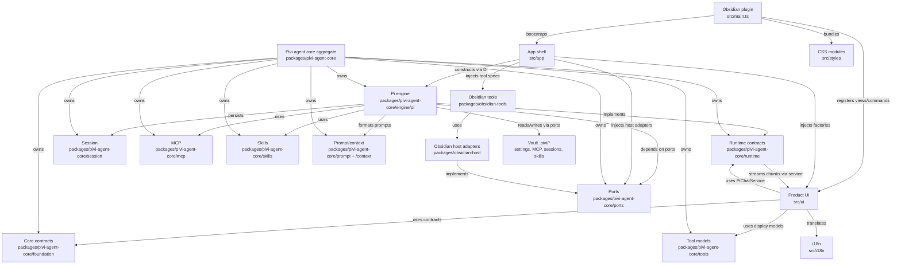
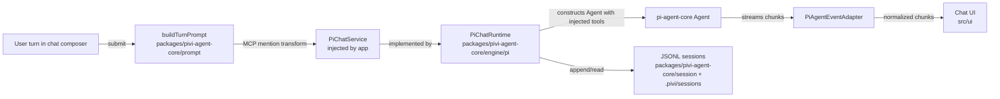
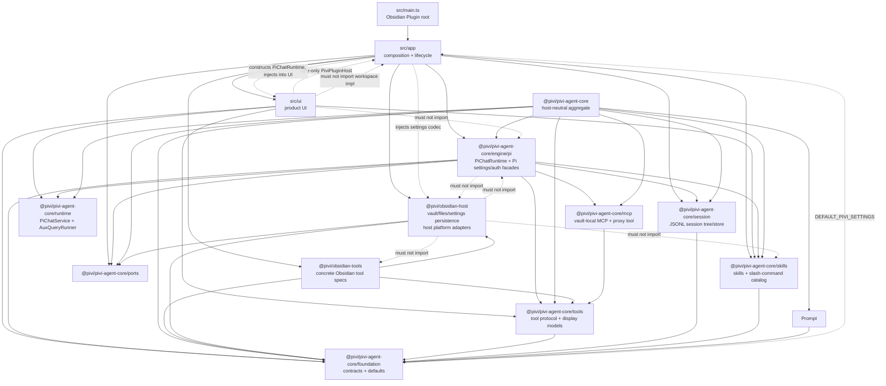

# Pivi Developer Guide

Welcome to the **Pivi** developer reference guide. This document is the **operational** entry point for build, test, lint, release, project glossary, quality review, and repo-wide seam rules.

---

## 📚 Project guidance

Pivi keeps durable operational guidance in layered `AGENTS.md` files. Root guidance covers repo-wide build, test, release, and seam rules; package-local `AGENTS.md` files cover package purpose, public entrypoints, boundaries, and verification notes.

For README architecture / workflow diagrams, prefer fenced Mermaid diagrams (` ```mermaid `) because GitHub renders them natively.

| Layer | Location | When to update |
|-------|----------|----------------|
| Repo operations | `AGENTS.md` | Build/test/release workflow changes |
| Package contracts | `packages/*/AGENTS.md` | Package entrypoints, dependency boundaries, or gotchas change |
| Feature maps | Nested `src/**/AGENTS.md` | Local UI/runtime flow or seam rules change |
| Glossary/overview | `AGENTS.md` | Project identity or canonical terminology changes |
| Releases | GitHub Releases / generated `CHANGELOG.md` | User-visible release history |

**Workflow**

1. Explore in Obsidian / Heptabase (optional).
2. Implement in the owning package or app area.
3. Update the closest `AGENTS.md` whenever code invalidates its map, seam rules, terminology, or gotchas. Start with the directory you changed and walk upward until guidance remains accurate.
4. Keep durable package/module explanations in the owning package `AGENTS.md`; avoid separate architecture/spec/note docs for package-local behavior.
5. Let release-please generate release notes and `CHANGELOG.md` from Conventional Commits in release PRs.

**PR checklist** (include in description when applicable):

```markdown
Related guidance:
- Package: packages/<name>/AGENTS.md
- Local: <nearest>/AGENTS.md
```

| Change size | Documentation |
|-------------|----------------|
| Small fix | Code comment only when the why is non-obvious |
| Medium feature | Owning package or local `AGENTS.md` |
| Architecture / framework | Root and affected package `AGENTS.md` |
| Stable module API | Owning package `AGENTS.md` |
| User-visible UI text | Always `src/i18n/` in the **same commit** (see Coding Standards) |

---

## 🤖 Agent skills

This repo does not track repo-local agent skills. Keep durable project guidance in this file and package/local `AGENTS.md` files; runtime vault skills live under each vault's `.pivi/skills/` directory.

| Skill | When to load |
|-------|----------------|
| (future) `pivi-*` | Pi-only runtime/workspace simplification, vault MCP |

**Vault default bundle** (end users, not this repo): first vault load may prompt to install [kepano/obsidian-skills](https://github.com/kepano/obsidian-skills) into `<vault>/.pivi/skills/`, but installation/updating must happen only after explicit user confirmation.

If a future repo-local skill is needed, add it intentionally with a matching lockfile entry and update this section in the same change.

Nested `AGENTS.md` files under `src/`, `tests/`, and `packages/` are directory/package maps (`init-deep` or hand-maintained); treat root `AGENTS.md` as authoritative for cross-cutting rules.

---

## 🚀 Project Overview

**Pivi** (ID: `pivi`) is an Obsidian community plugin that embeds the **Pi agent** (`@earendil-works/pi-agent-core`) as its sole agent runtime inside an Obsidian sidebar view and inline-edit modal.

**Minimum Obsidian:** `1.12.0` (provider API keys use `app.secretStorage` / keychain).

### Architecture Status
- **Pi-only Architecture**: `src/main.ts` is the Obsidian plugin composition root; `src/app/` owns lifecycle, service graph, commands, views, and workspace services; `src/ui/` owns sidebar chat, settings, and inline-edit UI. App workspace composition reaches the concrete Pi engine through `@pivi/pivi-agent-core/engine/pi`; UI reaches Pi through injected `PiChatService` / `AuxQueryRunner`, host contracts, `getUiFacades()`, and other non-engine `@pivi/*` package APIs — not raw `@earendil-works/*` or `engine/pi` imports.
- **Pivi Agent Core Package**: `@pivi/pivi-agent-core` is the host-neutral aggregate entrypoint for reusable agent foundations. It exposes package namespaces (`foundation`, `tools`, `session`, `mcp`, `skills`, `context`, `prompt`, `runtime`, `engine`, `auth`, `plugins`, `ports`, and `workspace`) plus the Pi engine implementation under `engine/pi`; concrete host/tool wiring stays in app and adapter packages.
- **Pi Engine**: Located in `packages/pivi-agent-core/src/engine/pi/`, the Pi engine owns in-process `Agent` construction, pi-ai model/provider setup, Pi chat runtime, settings/auth facades over canonical ports, tool adapters, JSONL compatibility, and auxiliary query runners.
- **Vault-local MCP**: `.pivi/mcp.json` and `.pivi/mcp-oauth/` only—no global host MCP configs. MCP mentions: `@server` in UI → `@server MCP` in API prompt.
- **External read tools**: `obsidian_read_external` and `obsidian_list_external` read/list files by absolute path outside the vault using `@pivi/obsidian-host/externalFileApi`. They require `allowExternalRead` plus at least one allowed external directory from Obsidian tools settings or the current session's external context folders; host-side realpath containment prevents reads outside those roots.
- **Optional Bash tool**: `obsidian_bash` is disabled by default and controlled by the Bash tool toggle (`allowBash`) plus `bashAllowlist`. It accepts one allowlisted single-line command only and rejects shell control syntax before invoking `@pivi/obsidian-host/systemProcessRunner`.
- **Plugin-local i18n/styles**: Locale runtime and JSON live in `src/i18n/` (`@/i18n`); CSS source modules live in `src/styles/` and still build to the root `styles.css` release artifact via `npm run build:css`.
- **CLI, Web Search, and Subagent Settings**: Pivi settings support official CLI integration settings (`cliEnabled`, `cliPath`, `cliTimeoutMs` for tools like tasks and history), Web Search configuration (`webSearchTools.searchProvider` and `webSearchTools.fetchProvider` supporting Brave/Tavily/Exa), and Subagents limits/toggles (`subagents.enabled`, `subagents.maxConcurrentSubagents`, `subagents.allowBackground`).

### Repo terminology glossary

Use this glossary as the source of truth when naming docs, UI concepts, types, and persistence fields. Prefer the canonical term for new code.

#### Architecture and runtime terms

| Term | Meaning | Use in code/docs | Avoid / legacy wording |
|---|---|---|---|
| **PiChatService** | Narrow UI/app-facing contract for the one Pi chat lifecycle: prepare turns, stream, sync session, rewind, cleanup. | UI and app service typing; only contract product UI may depend on for chat. | Generic `PiChatService` as a new abstraction. |
| **PiChatRuntime** | Concrete `PiChatService` implementation backed by an in-process Pi `Agent`. Constructed only in app composition (`createChatService`). | Runtime implementation, app factories, and engine tests. | Importing `PiChatRuntime` from `src/ui/**`. |
| **Pi engine subpath** | `@pivi/pivi-agent-core/engine/pi`, the owner of low-level Pi SDK imports, Pi prompts consumption, event adaptation, auth/model helpers, auxiliary queries, tool adaptation, and Obsidian-safe Pi SDK shims. | Package boundary docs and imports. | Scattering raw `@earendil-works/*` imports into UI/tools/host packages. |
| **Pivi ToolSpec** | Minimal tool protocol type owned by `@pivi/pivi-agent-core/tools`; concrete implementations return `ToolSpec` values before runtime adaptation. | Tool protocol, Obsidian tools, runtime registry. | Raw Pi `AgentTool` outside `@pivi/pivi-agent-core/engine/pi`. |
| **ObsidianHost** | Host abstraction/API wrapper in `@pivi/obsidian-host` for Obsidian vault, workspace, file store, paths, and editor selection. | Obsidian-facing package boundaries. | Direct Obsidian API imports in platform-neutral packages. |
| **Obsidian tool package** | `@pivi/obsidian-tools`, the concrete implementation package for Obsidian-backed Pivi tools. | Tool execution docs and imports. | Putting Obsidian tool execution in `@pivi/pivi-agent-core/tools` or UI renderers. |
| **Auxiliary query** | Short Pi run for title generation, refine, or inline edit, without a full chat session lifecycle. | Inline edit, title generation, refine flows. | Calling it a session or chat turn unless it persists into session history. |
| **Runtime state** | In-memory Pi `Agent` / `PiChatRuntime` state for an active tab. Rebuildable from session data. | Runtime sync and hydration. | Treating runtime state as the source of truth. |

#### Session and message terms

| Term | Meaning | Use in code/docs | Avoid / legacy wording |
|---|---|---|---|
| **Session** | Durable chat conversation persisted as JSONL under `.pivi/sessions/`. | User-facing history/resume/fork docs, storage specs, persisted state. | Old chat-thread wording for durable identity. |
| **Session file** | Vault-relative `.jsonl` path for one persisted conversation. | Persisted tab state, session stores, history list. | Hiding it inside opaque `agentState`. |
| **SessionRef** | Pivi durable session identity, normally `{ sessionFile }` plus the JSONL header session id. | Runtime/UI/session handoff and tab restore. | Runtime ids, UI tab ids, or `leafId` as durable history identity. |
| **Leaf** / **leafId** | Pi JSONL compatibility detail for old tree-shaped session files. Pivi no longer restores a specific leaf; opening history restores the complete linear session. Fork creates a new session file from a selected entry. | Low-level Pi session compatibility only. | Using leaf selection as product history/restore state. |
| **Tab binding** | UI tab's durable binding to `sessionFile` plus draft UI state such as selected model. | Plugin `loadData` / `saveData` state and tab restore logic. | Deprecated chat-id fields or `leafId` as durable tab identity. |
| **Open session state** / **OpenSessionState** | In-memory UI projection of a session used while rendering and streaming an open tab. Rebuildable from JSONL. | Controllers, presenters, transient UI state. | Treating it as durable identity. |
| **openSessionId** | In-memory identifier for open session state. | Feature-layer tab/state lookup only. | Persisting it as tab restore identity. |
| **Turn** | One user submission plus resulting assistant/tool stream and persisted updates. | Runtime, prompt, streaming, tests. | “Message” when referring to the whole request/response cycle. |
| **Message** | A user/assistant/tool content item inside a turn/session. | Rendering, JSONL message entries, chat state. | “Message” for the whole session or turn lifecycle. |

#### Prompt, MCP, and tool terms

| Term | Meaning | Use in code/docs | Avoid / legacy wording |
|---|---|---|---|
| **System prompt** | Long-lived agent instructions assembled by `@pivi/pivi-agent-core/prompt` and consumed by the Pi engine. | Runtime configuration, prompt architecture docs. | Per-message context payloads. |
| **Turn prompt** | Per-message payload built by runtime prompt helpers; may include context files XML and MCP mention transforms. | Turn preparation, prompt/context specs. | API-transformed prompt text as user-visible history. |
| **MCP mention** | User-facing `@server` token that becomes `@server MCP` in the API prompt via turn finalization. | Composer mentions, MCP context-saving semantics. | Exposing transformed API wording in visible user messages. |
| **Proxy MCP tool** | Single Pi tool `mcp` that searches/calls vault MCP servers instead of exposing one Pi tool per MCP tool. | Pi tool registry, MCP bridge docs. | Describing vault MCP tools as top-level Pi tools. |
| **Vault-local MCP** | `.pivi/mcp.json` plus `.pivi/mcp-oauth/`; Pivi does not read or write host-global MCP configs. | MCP settings, OAuth, storage docs. | Global paths such as `~/.config/mcp` or IDE host MCP configs. |
| **TodoVisualizationModel** | UI-facing todo projection derived from TodoWrite tool input: items, active item, progress counts, and source. | `@pivi/pivi-agent-core/tools`, todo presenters/renderers, session restore. | Parsing raw TodoWrite payloads in renderers. |


### Current module map





### Package dependency direction

Dependency direction is explicit: `src/main.ts` and `src/app/` compose product semantics, while packages expose narrower capabilities. `@pivi/obsidian-host` is host persistence/platform only and implements `@pivi/pivi-agent-core/ports`; product settings defaults come from `@pivi/pivi-agent-core/foundation`. The Pi engine must not import `@pivi/obsidian-host`—host capabilities arrive through ports and app-layer DI. Product UI must not construct `PiChatRuntime` or import `src/app/workspace/**`; it receives `PiChatService` / `AuxQueryRunner` factories via the plugin host.



---

## 🛠️ Development & Build Commands

**Node.js:** `>=24` (see `package.json` `engines` and `.nvmrc`). CI and release workflows use Node 24.x.

Use `npm ci` for a clean install. `.npmrc` enables `legacy-peer-deps=true`; `postinstall` creates `.env.local` from the example outside CI when missing.

All development flows should be managed using the following standard `npm` scripts (the lint script covers `src/`, `tests/`, and `packages/`):

```bash
# Install exact dependencies
npm ci

# Start esbuild and build:css in watch mode
npm run dev

# Concatenate and validate CSS import graph
npm run build:css

# Run typechecking (tsc)
npm run typecheck

# Run linter checks (ESLint + simple-import-sort + obsidianmd rules)
npm run lint

# Automatically fix linting and import-sorting issues
npm run lint:fix

# Run all unit tests with Jest
npm run test

# Run tests in watch mode
npm run test:watch

# Generate test coverage reports
npm run test:coverage

# Compile production CSS and package bundle (main.js + styles.css)
npm run build

# Generate metafile.json for bundle inspection
npm run analyze:bundle

# Sync package version into manifest.json and versions.json
node scripts/sync-version.js
```

### Focused Jest commands

Always run Jest through `npm run test` / `scripts/run-jest.js`; the wrapper supplies the Node localStorage file used by tests.

```bash
# One file
npm run test -- tests/unit/pi/piMcpBridge.test.ts

# One file in-band
npm run test -- --runInBand tests/unit/pi/piMcpBridge.test.ts

# By test name
npm run test -- -t "merges toolbar-enabled servers"

# By directory/path fragment
npm run test -- tests/unit/utils
```

### Agent default post-implementation workflow

Unless the user opts out, after completing an implementation in this repo the agent should deploy to the configured vault and reload Obsidian:

```bash
npm run build && obsidian reload
```

Requires `.env.local` with `OBSIDIAN_VAULT` (see manual integration testing below). Optional sanity check: `obsidian dev:errors` (expect `No errors captured.`).

**Obsidian plugin folder layout:** Deploy only `main.js`, `manifest.json`, and `styles.css`. Obsidian may also create `data.json` at runtime. Do not copy CLI entrypoints, `node_modules`, or other pi-coding-agent artifacts into `.obsidian/plugins/pivi/` — the esbuild `copy-to-obsidian` plugin prunes stale files on each build.

---

## 🧪 Testing Workflows

### 1. Automated Testing (Unit & Integration Tests)
We use Jest (multi-project config) for unit and integration tests. Unit tests live under `tests/unit/**` and integration tests under `tests/integration/**`, both using mocks in `tests/__mocks__/` and helpers in `tests/helpers/`.

To run all tests:
```bash
npm run test
```

The test runner automatically mounts `tests/setupWindow.ts` to mock renderer globals (`window`, `requestAnimationFrame`, `cancelAnimationFrame`) and maps `obsidian` plus Pi package imports to unified mocks under `tests/__mocks__/`.

CI runs the stronger coverage command across all Jest projects:

```bash
npm run test:coverage
```

---

### 2. Manual Integration Testing (Obsidian CLI & Auto-Deploy)
To verify the plugin in a live Obsidian vault environment, utilize the built-in esbuild auto-deploy pipeline and the `obsidian` CLI:

#### Step A: Configure local vault path
Create a `.env.local` file in the root of the project and specify your active vault's absolute path:
```env
OBSIDIAN_VAULT=/path/to/your/vault
```

#### Step B: Build and auto-deploy
Run the production build command. The `copy-to-obsidian` esbuild plugin will automatically copy the generated files (`main.js`, `manifest.json`, `styles.css`) directly into your vault:
```bash
npm run build
```

#### Step C: Reload Obsidian vault
Force Obsidian to scan the plugins directory and detect your newly copied/updated community plugin:
```bash
obsidian reload
```

#### Step D: Enable the plugin
Turn on `pivi` using the CLI:
```bash
obsidian plugin:enable id=pivi
```

#### Step E: Trigger active commands
Open the sidebar chat view via the CLI:
```bash
obsidian command id=pivi:open-view
```

#### Step F: Verify stability (Console Logs)
Check Obsidian developer errors log to confirm initialization ran cleanly with zero errors:
```bash
obsidian dev:errors
# Output should return: "No errors captured."
```

---

## 📈 Quality review snapshot

**Current snapshot:** 2026-07-07. Scope: repository config/source scan plus `npm run test:coverage -- --runInBand`.

### Current metrics

| Metric | Current value |
|--------|---------------|
| Unit test suites | 143 passed |
| Unit tests | 956 passed |
| Coverage — lines | 26.10% |
| Coverage — functions | 21.79% |
| Coverage — branches | 17.36% |
| Source/style files (`src/**/*.ts`, `src/**/*.css`) | 239 |
| Test files (`tests/**/*.test.ts`) | 143 |
| CSS `!important` in `src/styles/` | 4 (intentional CodeMirror button overrides in `inline-edit.css`) |
| ESLint `obsidianmd/ui/sentence-case` warnings | 0 |
| Bare swallowed async catches found by scan | 9 |
| `main.js` bundle size (`npm run analyze:bundle`) | ~2.8 MB (~2,781,469 bytes); re-run after provider/runtime dependency changes |

### Current high-value issues
1. Test count and suite coverage grew substantially (143 suites / 956 tests); line coverage (~26%) is still weak around chat controllers, renderers, settings modals, MCP UI, and tab lifecycle.
2. ~~Large controller/UI classes~~ **Resolved** (2026-07-03): `ToolCallRenderer` (1350→225), `StreamController` (1157→404), `Tab.ts` (920→325), `MessageRenderer` (900→319), `InlineEditModal` (859→75), `InputController` (798→255), `PiviSettings` (792→184), `SlashCommandDropdown` (756→516), `InlineAskUserQuestion` (702→214) all split into focused modules under 600 lines; 3 complexity functions (`getToolLabel` 33→≤25, `handleKeyDown` 30→≤25, `renderAssistantContent` 29→≤25) reduced via dispatcher maps. Remaining large files: `SubagentManager`, `InputToolbar`, and the app composition root — split when next touched.
3. `PiChatService` should stay narrow; do not reintroduce placeholder callbacks or generic runtime capability flags. UI must keep using injected `PiChatService` factories—do not re-import `PiChatRuntime` from `src/ui/**`.
4. Remaining swallowed catches are mostly cleanup/fire-and-forget paths; add comments or low-noise warnings where user state could be affected.
5. `main.js` is ~2.8 MB; still worth watching after Pi/provider dependency changes.
6. CSS `!important` is down to 4 intentional overrides in `inline-edit.css`; do not add new `!important` elsewhere.
7. Sentence-case lint is clean (0 warnings); keep new settings/UI copy compliant.

### Prioritized quality actions

| Priority | Action | Target |
|----------|--------|--------|
| P0 | Keep `npm run typecheck && npm run lint && npm run test:coverage && npm run build` green before releases. | Release readiness |
| P0 | Treat new `any`, `console`, complexity, and max-lines warnings as review blockers unless justified. | Review discipline |
| P0 | Update this section or the relevant owning `AGENTS.md` when a major quality item is resolved or deliberately deferred. | Avoid stale audit state |
| P1 | Add focused tests for tab/session lifecycle. | `TabManager`, `SessionController`, `tabRuntime`, `tabFork` |
| P1 | Add MCP OAuth unhappy-path tests. | `packages/pivi-agent-core/src/mcp/oauth/`, `McpVaultAuthStore`, settings auth UI boundaries |
| P1 | Narrow no-op runtime callbacks during Pi-only simplification. | `PiChatService`, `PiChatRuntime`, tab service callbacks |
| — | ~~Move remaining UI `engine/pi` facades behind app ports~~ **Resolved**: `getUiFacades()` wraps chat UI config, settings projection, model catalog, credential migration. | `piUiFacades`, architecture boundary |
| P1 | Add renderer smoke tests for stored history. | tool calls, subagents, ask-user, history recovery actions, write/edit blocks |
| P2 | Extract small, behavior-named helpers only when touching that flow. | `SubagentManager`, `InputToolbar`, app composition root |
| P2 | Add comments/logging for remaining swallowed cleanup catches. | OAuth cleanup, autosave/delete fire-and-forget paths |
| — | ~~Reduce `!important` / fix sentence-case~~ **Resolved** (2026-07-03 maintenance wave). | `src/styles/**`, settings UI |
| — | ~~Split max-lines files and reduce complexity~~ **Resolved** (2026-07-03): 9 files split, 3 complexity functions reduced. | `src/ui/chat/**`, `src/ui/settings/**`, `src/ui/inline-edit/**` |

---

## 📝 Coding Standards & Guidelines

1. **Pi-only Service Boundary**: Feature/app code uses Pivi-owned package APIs (`@pivi/*`) and the app shell. Avoid importing low-level external Pi SDK packages or MCP SDKs outside the Pi engine/tooling layer.
2. **Ports & DI for host capabilities**: `packages/pivi-agent-core` (including `engine/pi`) depends on `ports/` contracts, not `@pivi/obsidian-host`. App composition injects host adapters (files, secrets, HTTP, process).
3. **UI over service contracts**: `src/ui/**` may use `PiChatService` / `AuxQueryRunner` from `@pivi/pivi-agent-core/runtime` and host factories (`createChatService`, `createAuxQueryRunner`, `getUiFacades`). Prefer narrow hosts (`PiviChatHost` / `PiviSettingsHost`) from `src/app/hostContracts.ts`. It must not import `@pivi/pivi-agent-core/engine/pi/**`, `src/app/workspace/**`, or `@pivi/obsidian-host/**` (use `@/app/hostPlatform` instead).
4. **One-way app → UI composition**: `src/app/workspace/**` must not import `@/ui/**`. Host contracts must not import concrete `PiviView`. Composition root (`serviceGraph`, registrations) may import UI modules to inject renderers/factories.
5. **Comment Why, Not What**: Code should be self-documenting for "what" it does. Write comments specifically to describe "why" design choices, protocols, or edge cases were handled.
6. **No `console.log` in Production**: Use `console.error` strictly for caught initialization errors. Avoid dumping logging outputs in the production build.
7. **Pi Dependency Boundary**: `packages/pivi-agent-core/src/engine/pi/` is the Pi SDK boundary. UI, tools, host, MCP, and skills packages depend on Pivi-owned contracts, not raw Pi SDK packages.
8. **Pre-push Integrity Check**: CI-equivalent local check is `npm run typecheck && npm run lint && npm run check:boundaries && npm run test:coverage && npm run build`. Husky pre-commit runs `typecheck` + `lint` + `check:architecture`. CI also runs `check:architecture` and `check:package-readmes` as an explicit step before tests.
9. **Document decisions**: Keep important boundary or framework choices in the nearest owning `AGENTS.md`. Prefer updating package-local guidance over growing root guidance.
10. **UI text requires i18n (every commit)**: Any change that adds or edits **user-visible** UI copy (settings labels/descriptions, buttons, Notices, placeholders, aria-labels, command/ribbon names, chat chrome, empty states, tool display labels, modals, etc.) **must** ship i18n in the **same commit**:
   - Add/update keys in `src/i18n/locales/en.json` (canonical), then mirror the key tree in **all** other `src/i18n/locales/*.json` with translations.
   - Wire UI through `t('…')` from `@/i18n`; do not leave new hard-coded English (or any single language) in product UI.
   - Prefer sentence case for settings/UI copy (ESLint `obsidianmd/ui/sentence-case`).
   - Packages under `packages/*` must not import `@/i18n`; pass translated strings from `src/` when host/package code surfaces Notices or labels.
   - Intentional exceptions: technical identifiers (tool ids, model/provider ids), brand names used as identifiers, and raw user content.
   - Details and catalog workflow: `src/i18n/AGENTS.md`.

### File naming

- Use `PascalCase.ts` for UI files whose primary export is a PascalCase class, component, modal, controller, manager, presenter, renderer, or similarly named UI object (for example `MessageRenderer.ts`, `InputController.ts`, `SlashCommandDropdown.ts`).
- Use `lowerCamelCase.ts` for helper modules, parsing/formatting utilities, data mappers, state helpers, and modules whose primary exports are functions or constants.
- Keep package-layer modules under `packages/*/src` lowerCamelCase by default; reserve PascalCase there only for a primary exported type/object that benefits from matching file and symbol names.
- Do not keep UI-named facade files that only re-export package-layer helpers. Import those helpers from the owning `@pivi/*` package instead, or delete the unused facade.

### CI/CD and release

- `.github/workflows/ci.yaml` runs on PRs and pushes to `main`: `npm ci`, `npm run typecheck`, `npm run lint`, `npm run test:coverage`, `npm run build`.
- **Obsidian release invariant:** the Git tag and GitHub Release tag must exactly equal `manifest.json.version` with **no leading `v`** (for example `0.3.0`, not `v0.3.0`). Obsidian scans and installs assets from the release whose tag matches the manifest version exactly.
- **Standard release path (preferred):** use Conventional Commits on `main`, let Release Please open the release PR, review/merge that PR, and let `.github/workflows/release-please.yaml` create the GitHub Release and upload `main.js`, `manifest.json`, and `styles.css`.
- **Manual patch/hotfix path:** only when explicitly requested, bump with `npm version patch --no-git-tag-version`, run `node scripts/sync-version.js`, update `.release-please-manifest.json`, `CHANGELOG.md`, and user-facing version markdown, commit as `chore(release): prepare x.y.z`, push `main`, create/push tag `x.y.z` (no `v`), then run `.github/workflows/release.yaml` with that tag. That workflow reads release notes from the matching `CHANGELOG.md` section and uploads the same three plugin artifacts.
- Both release publishing paths must generate GitHub artifact attestations for `main.js`, `manifest.json`, and `styles.css` before uploading/re-uploading assets. Keep `id-token: write` and `attestations: write` permissions on artifact-upload jobs so users can verify release asset provenance.
- Do **not** mix the two paths for the same version. Manual `chore(release): ...` commits are ignored by Release Please to avoid stale release PRs.
- `.github/workflows/release.yaml` is the manual/release-event fallback for rebuilding and uploading Obsidian plugin artifacts; it should not be used for normal Release Please releases.


### Obsidian Plugin API reference

Pivi-native agent tools (`packages/obsidian-tools/`) prefer the **in-process Obsidian Plugin API**; CLI is fallback only when the public API cannot satisfy the call (currently history/task operations and optional `command` / `eval`).

| Resource | URL |
|----------|-----|
| **API repo (types)** | [github.com/obsidianmd/obsidian-api](https://github.com/obsidianmd/obsidian-api) |
| **DeepWiki (Q&A)** | [deepwiki.com/obsidianmd/obsidian-api](https://deepwiki.com/obsidianmd/obsidian-api) |
| **Hybrid tool guidance** | `packages/obsidian-tools/AGENTS.md` |

Public API covers `app.vault`, `app.metadataCache` (links, tags, frontmatter), `app.fileManager` (rename, trash, frontmatter, attachment paths), and `app.workspace` (open files). There is **no** public vault-wide full-text search API — Pivi implements scan-based search in `ObsidianVaultApi.searchNotes()`. There is also no public task index/mutation API, so `obsidian_tasks` remains CLI-backed.
