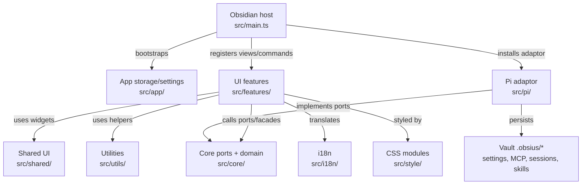
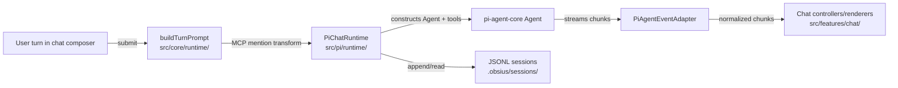

# Obsius Developer Guide

Welcome to the **Obsius** developer reference guide. This document is the **operational** entry point: build, test, lint, and seam rules. **Design decisions and module architecture** live in [`docs/`](docs/README.md) (versioned with the repo).

---

## 📚 Design documentation

Obsius uses a lightweight doc system. Treat design docs as **decision assets** (why), not only descriptions (what).

For README architecture / workflow diagrams, prefer fenced Mermaid diagrams (` ```mermaid `) because GitHub renders them natively.

| Layer | Location | When to update |
|-------|----------|----------------|
| Overview | [`docs/overview.md`](docs/overview.md), [`docs/glossary.md`](docs/glossary.md) | Rarely |
| Architecture | [`docs/architecture/`](docs/architecture/) | Module contract changes |
| Specs | [`docs/specs/`](docs/specs/) | Medium+ features |
| Notes | [`docs/notes/`](docs/notes/) | Gotchas; promote when stable |
| Releases | [GitHub Releases](https://github.com/shuuul/obsius2/releases) / generated `CHANGELOG.md` | User-visible release history |

**Workflow**

1. Explore in Obsidian / Heptabase (optional).
2. Write or update a **spec** (`docs/specs/`) before implementing non-trivial features.
3. Implement in `src/`; PR references relevant specs / architecture docs.
4. Update the relevant layered `AGENTS.md` files whenever changed code invalidates their maps, seam rules, terminology, or gotchas. Start with the directory you changed and walk upward to repo root until the guidance remains accurate.
5. Update **architecture** docs when the module’s public story stabilizes.
6. Let release-please generate release notes and `CHANGELOG.md` from Conventional Commits in release PRs.

**PR checklist** (include in description when applicable):

```markdown
Related docs:
- Spec: docs/specs/…
- Architecture: docs/architecture/…
```

| Change size | Documentation |
|-------------|----------------|
| Small fix | Comment or `docs/notes/` |
| Medium feature | `docs/specs/` |
| Architecture / framework | `docs/architecture/` and/or `docs/specs/` |
| Stable module API | `docs/architecture/` |

**Index:** [`docs/README.md`](docs/README.md)

---

## 🤖 Agent skills

Repo-local skills live under [`.agents/skills/`](.agents/skills/). Cursor and Pi discover them from that path (see `VaultSkillsService`); do not mirror into `.cursor/skills/` unless you need Cursor-only discovery on a machine that ignores `.agents/`.

| Skill | When to load |
|-------|----------------|
| [`obsidian`](.agents/skills/obsidian/SKILL.md) | Obsidian plugin API, ESLint/scorecard, manifest, a11y, CSS, submission |
| (future) `obsius-*` | Hexagonal seams, Pi adaptor, vault MCP — see `docs/` until added |

**Vault default bundle** (end users, not this repo): first vault load seeds [kepano/obsidian-skills](https://github.com/kepano/obsidian-skills) into `<vault>/.obsius/skills/` via `ensureDefaultVaultSkills` — see [`docs/specs/context-layers-spec.md`](docs/specs/context-layers-spec.md).

**Install / update** (pins versions in [`skills-lock.json`](skills-lock.json)):

```bash
npx skills add gapmiss/obsidian-plugin-skill
```

For Obsidian-specific quality rules (logging, `requestUrl`, `registerEvent`, touch targets), prefer the **obsidian** skill over repeating them here. This file stays **repo ops + architecture seams**.

Nested `AGENTS.md` files under `src/` and `tests/` are auto-generated directory maps (`init-deep`); treat root `AGENTS.md` and `docs/` as authoritative for cross-cutting rules.

---

## 🚀 Project Overview

**Obsius** (ID: `obsius2`) is an Obsidian community plugin that embeds the **Pi agent** (`@earendil-works/pi-agent-core`) as its sole agent runtime inside an Obsidian sidebar view and inline-edit modal.

**Minimum Obsidian:** `1.11.4` (provider API keys use `app.secretStorage` / keychain).

### Architecture Status
- **Hexagonal Architecture**: Strictly adheres to the ports-and-adapters design pattern. Runtimes, settings, and command catalogs are isolated behind agent ports (`src/core/agent/`). See [docs/architecture/system-architecture.md](docs/architecture/system-architecture.md).
- **Pi Adaptor**: Located in `src/pi/`, this adaptor runs an in-process `Agent` from `pi-agent-core`, streams turns via `pi-ai`, and provides Pi-specific settings and UI selectors. See [docs/architecture/agent-runtime.md](docs/architecture/agent-runtime.md).
- **Vault-local MCP**: `.obsius/mcp.json` and `.obsius/mcp-oauth/` only—no global host MCP configs. MCP mentions: `@server` in UI → `@server MCP` in API prompt. See [docs/specs/mcp-integration-spec.md](docs/specs/mcp-integration-spec.md).

### Repo terminology glossary

Use this table as the source of truth when naming docs, UI concepts, types, and persistence fields. Prefer the canonical term for new code.

| Canonical term | Meaning | Use in code/docs | Avoid / legacy wording |
|----------------|---------|------------------|------------------------|
| **Session** | Durable chat tree persisted as JSONL under `.obsius/sessions/`. The session file is the durable identity. | User-facing history/resume/fork docs, storage specs, persisted state. | Do not use old chat-thread wording for durable identity. |
| **Session file** | Vault-relative `.jsonl` path for one persisted session tree. | Persisted tab state, session stores, history list. | Avoid hiding it inside opaque `agentState`. |
| **Leaf** / **leafId** | Active node/tip inside a session tree. Rewind changes the active leaf; fork creates a new session file from a checkpoint. | Session tree APIs, tab binding, rewind/fork logic. | Avoid old chat-id wording for tree position. |
| **Tab binding** | The UI tab’s durable binding to `(sessionFile, leafId)` plus draft UI state such as selected model. | Plugin `loadData` / `saveData` state and tab restore logic. | Do not persist deprecated chat-id fields as durable tab identity. |
| **Open session state** / **OpenSessionState** | In-memory UI projection of a session leaf used while rendering and streaming an open tab. Rebuildable from JSONL. | Feature/controller types and transient UI state. | Do not treat it as durable identity; durable identity is `sessionFile` + `leafId`. |
| **openSessionId** | In-memory identifier for open session state. It mirrors `OpenSessionState.id`, normally the JSONL session id. | Feature-layer tab/state lookup only. | Do not persist it as tab restore identity. |
| **Turn** | One user submission plus resulting assistant/tool stream and persisted updates. | Runtime, prompt, streaming, tests. | Avoid mixing with “message” when referring to the whole request/response cycle. |
| **Message** | A user/assistant/tool content item inside a turn/session. | Rendering, JSONL message entries, chat state. | Do not use “message” for the whole session or turn lifecycle. |
| **Runtime state** | In-memory Pi `Agent` / `ChatRuntime` state for an active tab. Rebuildable from session data. | `src/pi/runtime/`, runtime sync/hydration. | Do not treat runtime state as the source of truth. |

### Current module map





---

## 🛠️ Development & Build Commands

**Node.js:** `>=24` (see `package.json` `engines` and `.nvmrc`). CI and release workflows use Node 24.x.

Use `npm ci` for a clean install. `.npmrc` enables `legacy-peer-deps=true`; `postinstall` creates `.env.local` from the example outside CI when missing.

All development flows should be managed using the following standard `npm` scripts:

```bash
# Install exact dependencies
npm ci

# Start esbuild and build:css in watch mode
npm run dev

# Concatenate and validate CSS import graph
npm run build:css

# Run typechecking (tsc)
npm run typecheck

# Run linter checks (ESLint + simple-import-sort + obsidianmd rules)
npm run lint

# Automatically fix linting and import-sorting issues
npm run lint:fix

# Run all unit tests with Jest
npm run test

# Run tests in watch mode
npm run test:watch

# Generate test coverage reports
npm run test:coverage

# Compile production CSS and package bundle (main.js + styles.css)
npm run build

# Generate metafile.json for bundle inspection
npm run analyze:bundle

# Sync package version into manifest.json and versions.json
node scripts/sync-version.js
```

### Focused Jest commands

Always run Jest through `npm run test` / `scripts/run-jest.js`; the wrapper supplies the Node localStorage file used by tests.

```bash
# One file
npm run test -- tests/unit/pi/PiMcpBridge.test.ts

# One file in-band
npm run test -- --runInBand tests/unit/pi/PiMcpBridge.test.ts

# By test name
npm run test -- -t "merges toolbar-enabled servers"

# By directory/path fragment
npm run test -- tests/unit/utils
```

### Agent default post-implementation workflow

Unless the user opts out, after completing an implementation in this repo the agent should deploy to the configured vault and reload Obsidian:

```bash
npm run build && obsidian reload
```

Requires `.env.local` with `OBSIDIAN_VAULT` (see manual integration testing below). Optional sanity check: `obsidian dev:errors` (expect `No errors captured.`).

**Obsidian plugin folder layout:** Deploy only `main.js`, `manifest.json`, and `styles.css`. Obsidian may also create `data.json` at runtime. Do not copy CLI entrypoints, `node_modules`, or other pi-coding-agent artifacts into `.obsidian/plugins/obsius2/` — the esbuild `copy-to-obsidian` plugin prunes stale files on each build.

---

## 🧪 Testing Workflows

### 1. Automated Testing (Unit Tests)
We use Jest for unit testing. Tests live under `tests/unit/**` and use mocks in `tests/__mocks__/` plus helpers in `tests/helpers/`.

To run the unit tests:
```bash
npm run test
```
The test runner automatically mounts `tests/setupWindow.ts` to mock renderer globals (`window`, `requestAnimationFrame`, `cancelAnimationFrame`) and maps `obsidian` plus Pi package imports to unified mocks under `tests/__mocks__/`.

CI runs the stronger coverage command:

```bash
npm run test:coverage
```

---

### 2. Manual Integration Testing (Obsidian CLI & Auto-Deploy)
To verify the plugin in a live Obsidian vault environment, utilize the built-in esbuild auto-deploy pipeline and the `obsidian` CLI:

#### Step A: Configure local vault path
Create a `.env.local` file in the root of the project and specify your active vault's absolute path:
```env
OBSIDIAN_VAULT=/path/to/your/vault
```

#### Step B: Build and auto-deploy
Run the production build command. The `copy-to-obsidian` esbuild plugin will automatically copy the generated files (`main.js`, `manifest.json`, `styles.css`) directly into your vault:
```bash
npm run build
```

#### Step C: Reload Obsidian vault
Force Obsidian to scan the plugins directory and detect your newly copied/updated community plugin:
```bash
obsidian reload
```

#### Step D: Enable the plugin
Turn on `obsius2` using the CLI:
```bash
obsidian plugin:enable id=obsius2
```

#### Step E: Trigger active commands
Open the sidebar chat view via the CLI:
```bash
obsidian command id=obsius2:open-view
```

#### Step F: Verify stability (Console Logs)
Check Obsidian developer errors log to confirm initialization ran cleanly with zero errors:
```bash
obsidian dev:errors
# Output should return: "No errors captured."
```

---

## 📝 Coding Standards & Guidelines

1. **Strict Hexagonal Seam**: Components (`src/features/`) and hooks must only interact with abstract ports (`src/core/`) and **never** import from the Pi adaptor (`src/pi/`) directly. Bootstrap (`main.ts` via `bootstrapPiAgent()`) wires `src/pi/` at startup; app settings storage uses core agent registrations for runtime-specific normalization. Install defaults: `core/settings/agentDefaults.ts`.
2. **Comment Why, Not What**: Code should be self-documenting for "what" it does. Write comments specifically to describe "why" design choices, protocols, or edge cases were handled.
3. **No `console.log` in Production**: Use `console.error` strictly for caught initialization errors. Avoid dumping logging outputs in the production build.
4. **Core Dependency Boundary**: Files under `src/core/` must not import Pi, Obsidian UI features, or runtime SDKs. `src/core/types/` should stay dependency-free; framework-neutral helpers from `src/utils/` are allowed where existing core code already uses them.
5. **Pre-push Integrity Check**: CI-equivalent local check is `npm run typecheck && npm run lint && npm run test:coverage && npm run build`. The Husky pre-commit hook is intentionally lighter (`typecheck` + `lint`).
6. **Document decisions**: Keep important boundary or framework choices in `docs/architecture/` or `docs/specs/`. Prefer updating docs over growing this file.

### CI/CD and release

- `.github/workflows/ci.yaml` runs on PRs and pushes to `main`: `npm ci`, `npm run typecheck`, `npm run lint`, `npm run test:coverage`, `npm run build`.
- Release Please is primary: it updates `CHANGELOG.md`, bumps package/manifest metadata, and uploads `main.js`, `manifest.json`, `styles.css` on release creation.
- `.github/workflows/release.yaml` is the manual/release-event fallback for rebuilding and uploading the same three Obsidian plugin artifacts.

### Key architecture docs

| Topic | Doc |
|-------|-----|
| System map | [docs/architecture/system-architecture.md](docs/architecture/system-architecture.md) |
| Adapter layer | [docs/architecture/framework-adapters.md](docs/architecture/framework-adapters.md) |
| Agent runtime | [docs/architecture/agent-runtime.md](docs/architecture/agent-runtime.md) |
| Context & turns | [docs/architecture/context-management.md](docs/architecture/context-management.md) |
| MCP & tools | [docs/architecture/tool-system.md](docs/architecture/tool-system.md) |
| Prompts | [docs/architecture/prompt-system.md](docs/architecture/prompt-system.md) |
| UI | [docs/architecture/ui-integration.md](docs/architecture/ui-integration.md) |

### Obsidian Plugin API reference

Obsius-native agent tools (`src/pi/tools/`) prefer the **in-process Obsidian Plugin API**; CLI is fallback only when API cannot satisfy the call.

| Resource | URL |
|----------|-----|
| **API repo (types)** | [github.com/obsidianmd/obsidian-api](https://github.com/obsidianmd/obsidian-api) |
| **DeepWiki (Q&A)** | [deepwiki.com/obsidianmd/obsidian-api](https://deepwiki.com/obsidianmd/obsidian-api) |
| **Hybrid tool spec** | [docs/specs/obsidian-tools-spec.md](docs/specs/obsidian-tools-spec.md) |

Public API covers `app.vault`, `app.metadataCache` (links, tags, frontmatter), and `app.fileManager`. There is **no** public vault-wide full-text search API — Obsius implements scan-based search in `ObsidianVaultApi.searchNotes()`.
