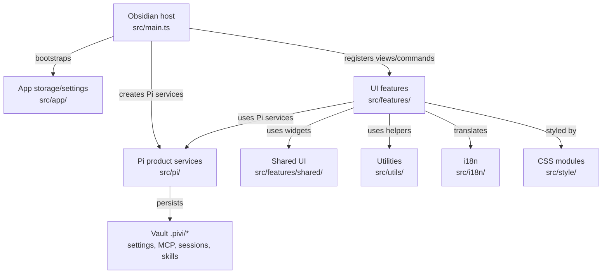

# Pivi Developer Guide

Welcome to the **Pivi** developer reference guide. This document is the **operational** entry point: build, test, lint, and seam rules. **Design decisions and module architecture** live in [`docs/`](docs/README.md) (versioned with the repo).

---

## 📚 Design documentation

Pivi uses a lightweight doc system. Treat design docs as **decision assets** (why), not only descriptions (what).

For README architecture / workflow diagrams, prefer fenced Mermaid diagrams (` ```mermaid `) because GitHub renders them natively.

| Layer | Location | When to update |
|-------|----------|----------------|
| Overview | [`docs/overview.md`](docs/overview.md), [`docs/glossary.md`](docs/glossary.md) | Rarely |
| Architecture | [`docs/architecture/`](docs/architecture/) | Module contract changes |
| Specs | [`docs/specs/`](docs/specs/) | Medium+ features |
| Notes | [`docs/notes/`](docs/notes/) | Gotchas; promote when stable |
| Releases | [GitHub Releases](https://github.com/shuuul/obsidian-pivi/releases) / generated `CHANGELOG.md` | User-visible release history |

**Workflow**

1. Explore in Obsidian / Heptabase (optional).
2. Write or update a **spec** (`docs/specs/`) before implementing non-trivial features.
3. Implement in `src/`; PR references relevant specs / architecture docs.
4. Update the relevant layered `AGENTS.md` files whenever changed code invalidates their maps, seam rules, terminology, or gotchas. Start with the directory you changed and walk upward to repo root until the guidance remains accurate.
5. Update **architecture** docs when the module’s public story stabilizes.
6. Let release-please generate release notes and `CHANGELOG.md` from Conventional Commits in release PRs.

**PR checklist** (include in description when applicable):

```markdown
Related docs:
- Spec: docs/specs/…
- Architecture: docs/architecture/…
```

| Change size | Documentation |
|-------------|----------------|
| Small fix | Comment or `docs/notes/` |
| Medium feature | `docs/specs/` |
| Architecture / framework | `docs/architecture/` and/or `docs/specs/` |
| Stable module API | `docs/architecture/` |

**Index:** [`docs/README.md`](docs/README.md)

---

## 🤖 Agent skills

This repo does not track repo-local agent skills. Keep durable project guidance in this file and `docs/`; runtime vault skills live under each vault's `.pivi/skills/` directory.

| Skill | When to load |
|-------|----------------|
| (future) `pivi-*` | Pi-only runtime/workspace simplification, vault MCP — see `docs/` until added |

**Vault default bundle** (end users, not this repo): first vault load may prompt to install [kepano/obsidian-skills](https://github.com/kepano/obsidian-skills) into `<vault>/.pivi/skills/`, but installation/updating must happen only after explicit user confirmation — see [`docs/specs/context-layers-spec.md`](docs/specs/context-layers-spec.md).

If a future repo-local skill is needed, add it intentionally with a matching lockfile entry and update this section in the same change.

Nested `AGENTS.md` files under `src/` and `tests/` are auto-generated directory maps (`init-deep`); treat root `AGENTS.md` and `docs/` as authoritative for cross-cutting rules.

---

## 🚀 Project Overview

**Pivi** (ID: `pivi`) is an Obsidian community plugin that embeds the **Pi agent** (`@earendil-works/pi-agent-core`) as its sole agent runtime inside an Obsidian sidebar view and inline-edit modal.

**Minimum Obsidian:** `1.11.4` (provider API keys use `app.secretStorage` / keychain).

### Architecture Status
- **Pi-only Architecture**: Pivi no longer maintains a multi-SDK runtime seam. `main.ts` creates Pi workspace/runtime/settings services directly, and feature/app code uses Pivi-owned Pi product modules through explicit dependencies. See [docs/architecture/system-architecture.md](docs/architecture/system-architecture.md).
- **Pi Runtime**: Located in `src/pi/`, the runtime runs an in-process `Agent` from `pi-agent-core`, streams turns via `pi-ai`, and provides Pi-specific settings and UI selectors. See [docs/architecture/agent-runtime.md](docs/architecture/agent-runtime.md).
- **Vault-local MCP**: `.pivi/mcp.json` and `.pivi/mcp-oauth/` only—no global host MCP configs. MCP mentions: `@server` in UI → `@server MCP` in API prompt. See [docs/specs/mcp-integration-spec.md](docs/specs/mcp-integration-spec.md).

### Repo terminology glossary

Use [`docs/glossary.md`](docs/glossary.md) as the source of truth when naming docs, UI concepts, types, and persistence fields. Prefer the canonical term for new code.

### Current module map




---

## 🛠️ Development & Build Commands

**Node.js:** `>=24` (see `package.json` `engines` and `.nvmrc`). CI and release workflows use Node 24.x.

Use `npm ci` for a clean install. `.npmrc` enables `legacy-peer-deps=true`; `postinstall` creates `.env.local` from the example outside CI when missing.

All development flows should be managed using the following standard `npm` scripts:

```bash
# Install exact dependencies
npm ci

# Start esbuild and build:css in watch mode
npm run dev

# Concatenate and validate CSS import graph
npm run build:css

# Run typechecking (tsc)
npm run typecheck

# Run linter checks (ESLint + simple-import-sort + obsidianmd rules)
npm run lint

# Automatically fix linting and import-sorting issues
npm run lint:fix

# Run all unit tests with Jest
npm run test

# Run tests in watch mode
npm run test:watch

# Generate test coverage reports
npm run test:coverage

# Compile production CSS and package bundle (main.js + styles.css)
npm run build

# Generate metafile.json for bundle inspection
npm run analyze:bundle

# Sync package version into manifest.json and versions.json
node scripts/sync-version.js
```

### Focused Jest commands

Always run Jest through `npm run test` / `scripts/run-jest.js`; the wrapper supplies the Node localStorage file used by tests.

```bash
# One file
npm run test -- tests/unit/pi/PiMcpBridge.test.ts

# One file in-band
npm run test -- --runInBand tests/unit/pi/PiMcpBridge.test.ts

# By test name
npm run test -- -t "merges toolbar-enabled servers"

# By directory/path fragment
npm run test -- tests/unit/utils
```

### Agent default post-implementation workflow

Unless the user opts out, after completing an implementation in this repo the agent should deploy to the configured vault and reload Obsidian:

```bash
npm run build && obsidian reload
```

Requires `.env.local` with `OBSIDIAN_VAULT` (see manual integration testing below). Optional sanity check: `obsidian dev:errors` (expect `No errors captured.`).

**Obsidian plugin folder layout:** Deploy only `main.js`, `manifest.json`, and `styles.css`. Obsidian may also create `data.json` at runtime. Do not copy CLI entrypoints, `node_modules`, or other pi-coding-agent artifacts into `.obsidian/plugins/pivi/` — the esbuild `copy-to-obsidian` plugin prunes stale files on each build.

---

## 🧪 Testing Workflows

### 1. Automated Testing (Unit & Integration Tests)
We use Jest (multi-project config) for unit and integration tests. Unit tests live under `tests/unit/**` and integration tests under `tests/integration/**`, both using mocks in `tests/__mocks__/` and helpers in `tests/helpers/`.

To run all tests:
```bash
npm run test
```

The test runner automatically mounts `tests/setupWindow.ts` to mock renderer globals (`window`, `requestAnimationFrame`, `cancelAnimationFrame`) and maps `obsidian` plus Pi package imports to unified mocks under `tests/__mocks__/`.

CI runs the stronger coverage command across all Jest projects:

```bash
npm run test:coverage
```

---

### 2. Manual Integration Testing (Obsidian CLI & Auto-Deploy)
To verify the plugin in a live Obsidian vault environment, utilize the built-in esbuild auto-deploy pipeline and the `obsidian` CLI:

#### Step A: Configure local vault path
Create a `.env.local` file in the root of the project and specify your active vault's absolute path:
```env
OBSIDIAN_VAULT=/path/to/your/vault
```

#### Step B: Build and auto-deploy
Run the production build command. The `copy-to-obsidian` esbuild plugin will automatically copy the generated files (`main.js`, `manifest.json`, `styles.css`) directly into your vault:
```bash
npm run build
```

#### Step C: Reload Obsidian vault
Force Obsidian to scan the plugins directory and detect your newly copied/updated community plugin:
```bash
obsidian reload
```

#### Step D: Enable the plugin
Turn on `pivi` using the CLI:
```bash
obsidian plugin:enable id=pivi
```

#### Step E: Trigger active commands
Open the sidebar chat view via the CLI:
```bash
obsidian command id=pivi:open-view
```

#### Step F: Verify stability (Console Logs)
Check Obsidian developer errors log to confirm initialization ran cleanly with zero errors:
```bash
obsidian dev:errors
# Output should return: "No errors captured."
```

---

## 📝 Coding Standards & Guidelines

1. **Pi-only Service Boundary**: Feature/app code may use Pivi-owned `src/pi/**` product modules when that is the simplest path. Avoid importing low-level external Pi SDK packages (`@earendil-works/pi-*`) or MCP SDKs outside the Pi runtime/tooling layer.
2. **Comment Why, Not What**: Code should be self-documenting for "what" it does. Write comments specifically to describe "why" design choices, protocols, or edge cases were handled.
3. **No `console.log` in Production**: Use `console.error` strictly for caught initialization errors. Avoid dumping logging outputs in the production build.
4. **Pi Dependency Boundary**: Files under `src/pi/` must not import Obsidian UI features (`src/features/**`). `src/pi/types/` should stay dependency-free; framework-neutral helpers from `src/utils/` are allowed where existing code already uses them. Low-level Pi SDK imports (`@earendil-works/pi-*`) and MCP SDKs belong only in `src/pi/**`.
5. **Pre-push Integrity Check**: CI-equivalent local check is `npm run typecheck && npm run lint && npm run test:coverage && npm run build`. The Husky pre-commit hook is intentionally lighter (`typecheck` + `lint`).
6. **Document decisions**: Keep important boundary or framework choices in `docs/architecture/` or `docs/specs/`. Prefer updating docs over growing this file.

### CI/CD and release

- `.github/workflows/ci.yaml` runs on PRs and pushes to `main`: `npm ci`, `npm run typecheck`, `npm run lint`, `npm run test:coverage`, `npm run build`.
- **Obsidian release invariant:** the Git tag and GitHub Release tag must exactly equal `manifest.json.version` with **no leading `v`** (for example `0.3.0`, not `v0.3.0`). Obsidian scans and installs assets from the release whose tag matches the manifest version exactly.
- **Standard release path (preferred):** use Conventional Commits on `main`, let Release Please open the release PR, review/merge that PR, and let `.github/workflows/release-please.yaml` create the GitHub Release and upload `main.js`, `manifest.json`, and `styles.css`.
- **Manual patch/hotfix path:** only when explicitly requested, bump with `npm version patch --no-git-tag-version`, run `node scripts/sync-version.js`, update `.release-please-manifest.json`, `CHANGELOG.md`, and user-facing version markdown, commit as `chore(release): prepare x.y.z`, push `main`, create/push tag `x.y.z` (no `v`), then run `.github/workflows/release.yaml` with that tag. That workflow reads release notes from the matching `CHANGELOG.md` section and uploads the same three plugin artifacts.
- Do **not** mix the two paths for the same version. Manual `chore(release): ...` commits are ignored by Release Please to avoid stale release PRs.
- `.github/workflows/release.yaml` is the manual/release-event fallback for rebuilding and uploading Obsidian plugin artifacts; it should not be used for normal Release Please releases.

### Key architecture docs

| Topic | Doc |
|-------|-----|
| System map | [docs/architecture/system-architecture.md](docs/architecture/system-architecture.md) |
| Pi integration boundaries | [docs/architecture/framework-adapters.md](docs/architecture/framework-adapters.md) |
| Agent runtime | [docs/architecture/agent-runtime.md](docs/architecture/agent-runtime.md) |
| Context & turns | [docs/architecture/context-management.md](docs/architecture/context-management.md) |
| MCP & tools | [docs/architecture/tool-system.md](docs/architecture/tool-system.md) |
| Prompts | [docs/architecture/prompt-system.md](docs/architecture/prompt-system.md) |
| UI | [docs/architecture/ui-integration.md](docs/architecture/ui-integration.md) |

### Obsidian Plugin API reference

Pivi-native agent tools (`src/pi/tools/`) prefer the **in-process Obsidian Plugin API**; CLI is fallback only when the public API cannot satisfy the call (currently task operations and optional `command` / `eval`).

| Resource | URL |
|----------|-----|
| **API repo (types)** | [github.com/obsidianmd/obsidian-api](https://github.com/obsidianmd/obsidian-api) |
| **DeepWiki (Q&A)** | [deepwiki.com/obsidianmd/obsidian-api](https://deepwiki.com/obsidianmd/obsidian-api) |
| **Hybrid tool spec** | [docs/specs/obsidian-tools-spec.md](docs/specs/obsidian-tools-spec.md) |

Public API covers `app.vault`, `app.metadataCache` (links, tags, frontmatter), `app.fileManager` (rename, trash, frontmatter, attachment paths), and `app.workspace` (open files). There is **no** public vault-wide full-text search API — Pivi implements scan-based search in `ObsidianVaultApi.searchNotes()`. There is also no public task index/mutation API, so `obsidian_tasks` remains CLI-backed.
