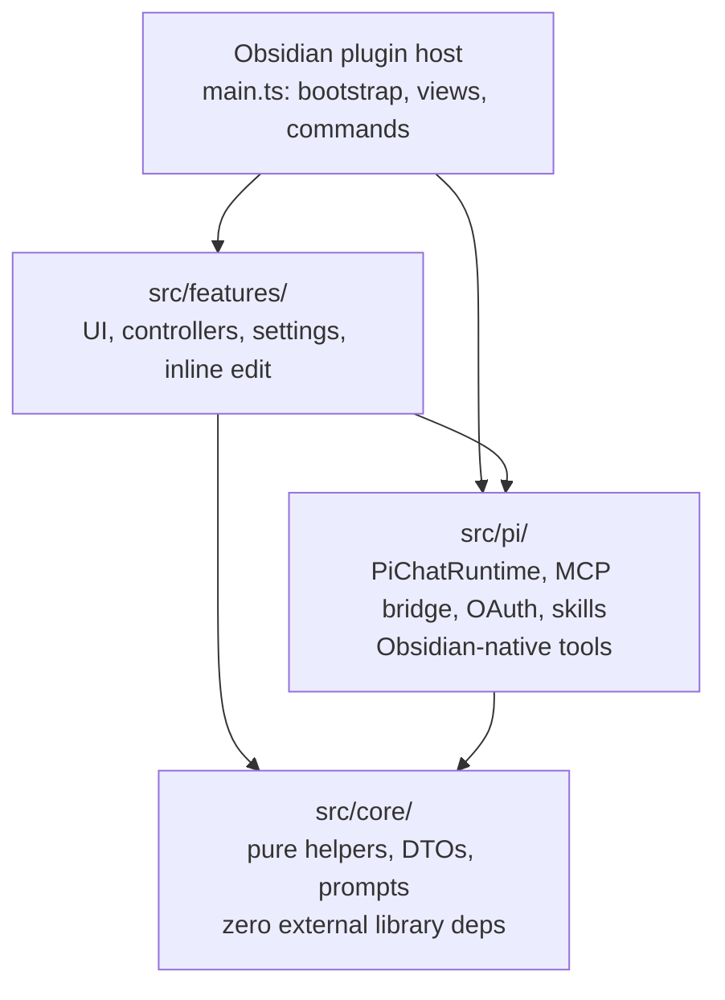

# Pivi — Pi as the Vault Intelligence

[](https://github.com/shuuul/obsidian-pivi/releases)
[](LICENSE)
[](https://obsidian.md/plugins)

---

Pivi (formerly Obsius) is **Pi as the Vault Intelligence**: it embeds the **Pi agent** directly inside your Obsidian vault — no separate desktop app, no CLI tools to configure, no external terminal needed. Chat with an AI agent in the sidebar, edit inline with precision, and manage your knowledge through tools built for Obsidian, not for coding.

Read the [white paper](https://github.com/shuuul/obsidian-pivi/blob/master/WHITEPAPER.md) for the design philosophy behind precise context control in AI-assisted writing.

## What makes Pivi different

- **Pi agent core** — one focused, in-process runtime for chat, inline edit, tools, planning, and subagents.
- **Obsidian-native tools** — read, edit, search, links, tasks, and properties operate through Obsidian-aware APIs.
- **Vault-local configuration** — MCP servers, OAuth data, skills, and sessions live under `.pivi/` in the vault.
- **Vault skills** — install [kepano/obsidian-skills](https://github.com/kepano/obsidian-skills) or other Agent Skills into `.pivi/skills/` after confirmation.
- **Pi-only product architecture** — `main.ts` composes concrete Pi services, `src/pi/` owns runtime/tooling, `src/features/` owns UI, and `src/core/` keeps reusable pure helpers.

## Key features

- **Sidebar chat** — Multi-tab conversational AI with streaming, file context, and slash commands.
- **Inline editing** — Selection-aware rewrites using Pi auxiliary queries.
- **Obsidian-native tools** — Read, write, search, and manage notes through tools that understand wikilinks, frontmatter, and vault semantics — not bash.
- **Vault skills** — [Agent Skills](https://agentskills.io) spec-compliant. Pivi can install [kepano/obsidian-skills](https://github.com/kepano/obsidian-skills) after confirmation, and install more via `npx skills add`.
- **MCP support** — Vault-local MCP servers (`.pivi/mcp.json`), remote servers with OAuth, `@server` mention transform.
- **Session tree** — Pi-compatible JSONL session persistence. Fork, branch, and resume conversations.
- **Approval manager** — Writes require confirmation; sensitive tools (`command`, `eval`) are disabled by default.
- **Provider keychain** — API keys stored in Obsidian's `app.secretStorage` (Electron safeStorage on desktop).

## Screenshots

> *(Coming soon — see [assets/](./assets/) for icons.)*

## Requirements

- **Obsidian** v1.11.4+ (desktop only)
- **macOS** (tested; Windows/Linux should work but not officially supported)

## Installation

### Via BRAT (recommended)

1. Install and enable [Obsidian42 - BRAT](https://github.com/TfTHacker/obsidian42-brat).
2. Open BRAT settings → **Add Beta plugin**.
3. Paste: `https://github.com/shuuul/obsidian-pivi`
4. Enable **Pivi** in Community Plugins.

### Manual

1. Download `main.js`, `manifest.json`, and `styles.css` from the [latest release](https://github.com/shuuul/obsidian-pivi/releases).
2. Copy them to `<vault>/.obsidian/plugins/pivi/`.
3. Enable **Pivi** in Community Plugins.

## Quick start

1. Open **Settings → Community plugins → Pivi**.
2. Add a model provider API key (OpenAI, Anthropic, etc.) via the **keychain** UI.
3. Click the Pivi ribbon icon (or run command `Pivi: Open view`).
4. Start chatting.

On first launch with no vault skills installed, Pivi asks before installing [kepano/obsidian-skills](https://github.com/kepano/obsidian-skills) into `.pivi/skills/`. You can skip the prompt and install skills later from settings.

## How it works



## Registered tools

| Tool | Purpose | Mutates | Default |
|------|---------|---------|---------|
| `obsidian_read` | Read note bodies by vault-relative `path` or wikilink-style `file` | No | On |
| `obsidian_edit` | Preferred partial edit tool: replace exact `old_string` text in an existing note | Yes | On |
| `obsidian_write` | Create notes, append/prepend content, or deliberately overwrite a full note | Yes | On |
| `obsidian_search` | Substring search, simplified `tag:` search, or folder listing via `query=*` / `path:` | No | On |
| `obsidian_note_info` | Read metadata: size, dates, tags, outgoing links, and frontmatter | No | On |
| `obsidian_links` | Read outgoing links or backlinks for one note | No | On |
| `obsidian_properties` | List, read, set, or remove YAML frontmatter properties | Yes | On |
| `obsidian_tasks` | List or toggle Markdown task status | Yes | On |
| `obsidian_delete` | Move a vault file or folder to trash via Obsidian `FileManager.trashFile()` | Yes | On |
| `obsidian_move` | Rename or move a vault file/folder and update links according to Obsidian settings | Yes | On |
| `obsidian_list` | List direct children of a vault folder, including notes, folders, and attachments | No | On |
| `obsidian_mkdir` | Create a vault folder | Yes | On |
| `obsidian_open` | Open a vault file in the Obsidian workspace | No | On |
| `obsidian_attachment` | Get attachment metadata/resource URLs or resolve an available attachment path | No | On |
| `obsidian_command` | Execute an Obsidian palette command by id | Yes | **Off** |
| `obsidian_eval` | Run arbitrary JavaScript in the Obsidian context | Yes | **Off** |
| `mcp` | Invoke vault-local MCP servers from `.pivi/mcp.json` | Varies | On when configured |
| `skill` | Load vault-local skill instructions from `.pivi/skills/` | No | On |
| `Agent` | Spawn a focused subagent for a delegated task | Varies | On |

Mutating tools go through Pivi approval rules. `obsidian_delete` intentionally moves items to trash instead of permanently deleting them, following the user's Obsidian trash settings.

## Project guidance

| Topic | Source |
|-------|--------|
| Repo workflow, build, test, release | [AGENTS.md](AGENTS.md) |
| Package architecture and boundaries | `packages/*/AGENTS.md` |
| Local feature maps | Nested `AGENTS.md` files under the owning source tree |
| Terms and project overview | [AGENTS.md](AGENTS.md) |
| Releases | [GitHub Releases](https://github.com/shuuul/obsidian-pivi/releases) |

## Security & privacy

- **Account/API key required** — to use hosted AI providers, you need an account, API key, or supported OAuth session for the provider you choose.
- **Model provider network use** — chat prompts, selected vault context, attachments, inline-edit text, tool results, and MCP results may be sent to the selected model provider for generation.
- **MCP network and process use** — configured MCP servers are user-provided. Remote HTTP/SSE servers receive requests when enabled or mentioned; stdio servers run local commands you configure.
- **Skills network use** — listing, installing, or updating remote skills uses `npx skills` / skills.sh and may access GitHub or the skill source you enter. The default skills prompt accesses `kepano/obsidian-skills` only after you confirm installation.
- **External file access** — if you add external context directories, Pivi reads files from those user-selected directories outside the vault and may include selected content in model prompts.
- **API keys and static MCP secrets** are stored via Obsidian's `secretStorage` (Electron `safeStorage` on desktop) — not in plugin settings JSON or `.pivi/mcp.json`.
- **MCP config is vault-local** — `.pivi/mcp.json` only; no global host MCP discovery. MCP OAuth tokens are stored under `.pivi/mcp-oauth/` in the vault.
- **Write operations require approval** — the ApprovalManager prompts before any mutation.
- **`command` and `eval` tools are disabled by default** — must be explicitly enabled in settings, with optional allowlists.
- **Skills are vault-local** — installed under `.pivi/skills/`; no cross-vault or global skill directories.
- **No Pivi telemetry** — Pivi does not send telemetry to this project or the plugin author. Your configured model providers, MCP servers, GitHub, and skills.sh may have their own logging and privacy policies.

## Development

```bash
# Install dependencies
npm install

# Development (watch mode)
npm run dev

# Build for production
npm run build

# Type-check
npm run typecheck

# Lint
npm run lint

# Test
npm run test
```

### CI and releases

Pull requests and pushes to `main` run [CI](.github/workflows/ci.yaml) (typecheck, lint, test coverage, build).

Releases are normally managed by [release-please](.github/workflows/release-please.yaml). Use Conventional Commits on `main`; release-please opens a release PR that updates version metadata and generates `CHANGELOG.md`. Merging that PR creates the GitHub release notes and uploads plugin artifacts. Obsidian requires the GitHub release tag to exactly match `manifest.json.version` with no leading `v` (for example `0.3.0`, not `v0.3.0`).

The [release workflow](.github/workflows/release.yaml) is a manual/tag fallback. It builds the plugin, reads notes from the matching `CHANGELOG.md` section, and uploads `main.js`, `manifest.json`, and `styles.css` to GitHub Releases.

## License

MIT. This repo is adapted from [Claudian](https://github.com/YishenTu/claudian) (MIT).

See [LICENSE](LICENSE) for details.

## Acknowledgments

- [Pi agent core](https://github.com/earendil-works/pi-mono) — The Pi agent runtime that powers Pivi
- [kepano/obsidian-skills](https://github.com/kepano/obsidian-skills) — Agent Skills for Obsidian
- [Claudian](https://github.com/YishenTu/claudian) — Code lineage this version is adapted from
- [Agent Skills](https://agentskills.io) — The Agent Skills specification
- [skills.sh](https://skills.sh) — Skills distribution CLI
- [obsidianmd/obsidian-api](https://github.com/obsidianmd/obsidian-api) — Obsidian plugin API

---

*Built for writers who want AI collaboration with nanometer precision, not black-box generation.*
