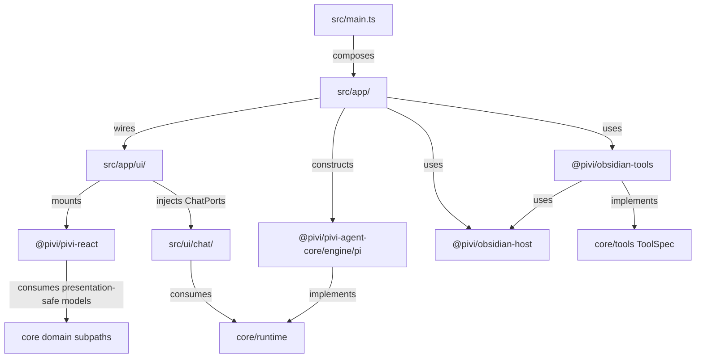

# Architecture and technology

[Back to the developer handbook](README.md)

Pivi uses a layered monorepo so the Obsidian host, product UI, reusable agent foundations, and concrete Pi integration remain independently understandable. The primary design goal is one obvious owner for each behavior.

## Package topology

`src/app` may compose all layers. Other dependencies flow toward host-neutral contracts:

- `src/ui/**` uses injected `ChatPorts`, `PiChatService`, and `AuxQueryRunner`; it does not import the Pi engine, app workspace implementations, or concrete host/tool packages.
- `@pivi/pivi-react` consumes presentation-safe core models and its own ports. It does not receive `ChatPorts`, runtime objects, Obsidian APIs, or application implementations.
- `@pivi/obsidian-host` implements host ports. It does not import UI, tools, or the Pi engine.
- `@pivi/obsidian-tools` implements Pivi `ToolSpec` values using host contracts.
- Raw `@earendil-works/*` use belongs in `packages/pivi-agent-core/src/engine/pi/`.

The build enforces important edges through `scripts/check-architecture-boundaries.mjs`. Treat `npm run check:boundaries` as an architecture test, not a style check.

## Technology choices

### Pi-only runtime

Pivi exposes one agent lifecycle through the narrow `PiChatService` contract. `PiChatRuntime` is the concrete engine implementation and is constructed only by app workspace composition. This prevents provider/SDK details from becoming UI dependencies and keeps durable session data authoritative over rebuildable runtime state.

`PiChatRuntime` constructs the low-level Pi `Agent` directly rather than adopting pi-coding-agent `AgentSession`. `AgentSession` also owns persistence, compaction, tools, prompts, resources, models, and extensions, which overlaps Pivi's established boundaries. Its complete static dependency graph also expands the Obsidian artifact materially: with the installed `@earendil-works/pi-coding-agent@0.80.10`, a production build experiment grew `main.js` from roughly 3.0 MiB to 7.9 MiB. Pivi therefore keeps provider recovery narrow: retryable network, rate-limit, timeout, and 5xx assistant failures are discarded from durable/model history, their live partial projection is replaced, and the request is retried up to three times with abortable 2/4/8-second backoff. Legacy persisted error attempts remain inspectable history but are excluded from future LLM context. Context overflow remains under the existing compaction policy.

### Ports and dependency injection

Runtime, sessions, model catalogs, slash catalogs, and projected settings enter chat orchestration through core-owned `ChatPorts`. React settings use React-owned `SettingsPorts`. Host file, secret, HTTP, process, and storage capabilities are injected through core ports. Explicit ports make ownership testable and prevent a wide plugin object from becoming a service locator.

### React 18 with imperative islands

React owns stable product chrome: tabs, settings, composer selectors, message shells, and status. Some host surfaces are intentionally imperative:

- Obsidian Markdown rendering;
- uncontrolled contenteditable input and mention badges;
- CodeMirror widgets;
- rich tool, diff, ask-user, and stored subagent bodies;
- owner-document behavior for pop-out windows.

React reserves empty containers for these adapters and consumes immutable snapshots. It never reconciles adapter-owned children. React 18 is bundled intentionally and avoids unused React 19 resource machinery in the plugin artifact.

### Pi-compatible JSONL sessions

Durable conversations live under `.pivi/sessions/` as Pi-compatible JSONL. A session file and its header identity are durable; open-session projections, UI tabs, controllers, DOM, and runtimes are rebuildable. Pivi appends a `message_ui` overlay for presentation data that the Pi message format does not own, such as structured subagent cards. On restore, a complete content-block overlay may replace the reconstructed presentation, but a partial final-segment overlay only enriches matching entities and cannot discard the earlier Pi-native tool/text order.

### Device-local absolute paths

External directory roots are capabilities tied to one device. Obsidian vault-scoped local storage holds pinned roots and per-turn overlays. Writers strip absolute external paths from synchronized `.pivi/settings.json` and session JSONL, while readers overlay device-local state. This is a privacy boundary, not merely a storage preference.

### TypeScript and module resolution

The repository is strict TypeScript targeting ES2022 with bundler resolution, isolated modules, no implicit returns, and unchecked-index protection. npm workspaces expose small package subpaths rather than relying on internal relative imports. TypeScript 6 compatibility supports current lint/test tooling; TypeScript 7's native CLI is the authoritative source and test checker.

### esbuild and runtime compatibility

Shared build options under `build/` produce the Obsidian-compatible bundle, apply Electron/Node compatibility shims, manage externals, deduplicate bundled dependencies, rewrite supported dynamic `node:` imports, and deploy the three plugin artifacts. Production and bundle analysis use the same `createBuildOptions` path so measurements describe the shipped bundle.

### Jest and architecture tests

Jest has two projects: Node-oriented unit/integration tests and a jsdom `pivi-react` project. Tests use repository mocks for Obsidian and Pi dependencies. Coverage includes `src/**` and package source. Structural boundary scripts complement behavior tests by rejecting forbidden dependency edges, invalid package README state, and dead i18n keys.

### Localization and CSS

English JSON is the canonical locale, and every locale mirrors its key structure and interpolation names. React uses `useT()`; app-owned imperative surfaces share the same translator through app wiring.

CSS source lives in `packages/pivi-react/styles/`. An ordered manifest controls concatenation into root `styles.css`; the build rejects missing inputs, invalid order, and `!important`. React DOM and CSS use the `pivi-*` vocabulary plus `--pivi-host-*` theme tokens rather than Obsidian-private class names.

## Public boundaries

Prefer the narrowest exported subpath:

| Need | Boundary |
|---|---|
| Chat application capabilities | `@pivi/pivi-agent-core/runtime/chatPorts` |
| Chat lifecycle | `@pivi/pivi-agent-core/runtime` |
| Auxiliary queries | `@pivi/pivi-agent-core/runtime/auxQueryRunner` |
| Messages, settings, session identities | Core `foundation` and `session` subpaths |
| Prompt construction | `@pivi/pivi-agent-core/prompt` |
| Tool protocol and display models | `@pivi/pivi-agent-core/tools` |
| React snapshots | `@pivi/pivi-react/store` |
| Context badge presentation | `@pivi/pivi-react/context-badges` |
| Concrete Pi construction | `@pivi/pivi-agent-core/engine/pi`, app composition only |

Do not introduce a wrapper solely to rename one of these APIs. Add a boundary only when it validates, normalizes, composes operations, or adds domain meaning.
