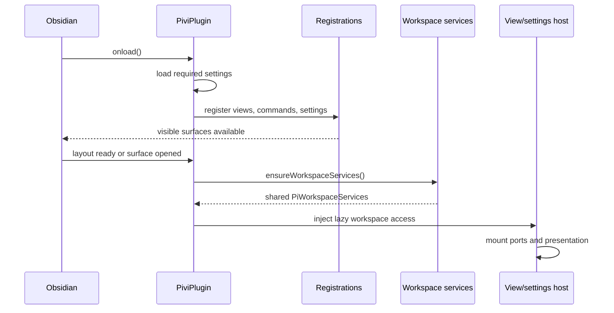
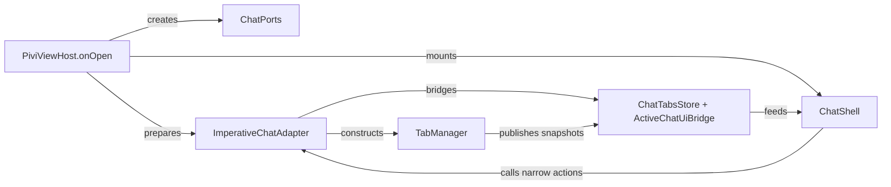
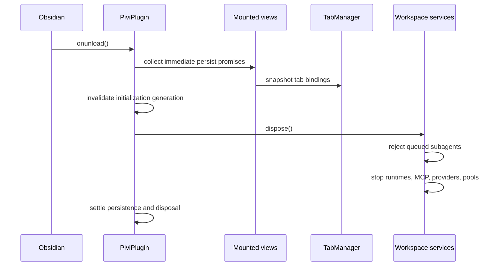

# Plugin lifecycle and composition

[Back to the developer handbook](README.md)

Pivi registers visible Obsidian surfaces before performing workspace I/O. Expensive services are initialized once, lazily, and shared by views and settings surfaces.

## Startup

`initializePiviPlugin()` loads required settings, registers commands/views/settings, registers the editor selection toolbar (`registerEditorExtension` + overlay host) and its React surface controller, and then starts the retryable single-flight workspace promise from `workspace.onLayoutReady` or the first visible surface. `PiviViewHost` and `PiviSettingTabHost` receive a lazy `getWorkspace` callback, so registration never captures a partially initialized service graph.

`PiviPlugin` constructs purpose-scoped network clients at composition (`createPiviNetworkClients`) and passes them through `WorkspaceInitContext.network` into MCP/OAuth, web tools, image generation, custom providers, and connectivity. Pivi does not patch `window.fetch`; the production bundle injects a scoped `fetch` shim for upstream SDK identifiers only. The shared `systemProcessRunner` is injected into Obsidian tools, Skills, CLI transport, and MCP stdio cwd policy so one-shot process work and vault mutation containment stay on host primitives rather than ad hoc `spawn` calls.

Generation guards invalidate late initialization after a view closes or the plugin unloads. A failed workspace initialization clears the single-flight state so a later visible action can retry.

## Composition contracts

| Contract | Owner and purpose |
|---|---|
| `PiviChatHost` | App-only runtime host containing the Obsidian `app`; used by `src/ui/chat` for UI context |
| `PiviChatCompositionHost` | Wider app composition surface for settings, facades, view enumeration, and tab-state persistence |
| `ChatPorts` | Core-owned runtime, session, catalog, models, and settings capabilities injected into `TabManager` |
| `SettingsPorts` | React-owned settings capabilities implemented by `src/app/ui` |
| `PiviChatViewHandle` | Semantic app control surface split into user `commands` and lifecycle `maintenance` operations |
| `PiWorkspaceServices` | Plugin-wide service graph: stores, tools, MCP, skills, providers, runtime factories, and subagent limiter |

`createChatUiPorts(host, workspace)` adapts app facades and workspace services into `ChatPorts`. The app-owned imperative adapter closure captures those ports and constructs `TabManager`; the React mount contract never receives or forwards them.

App callers control a mounted chat through behavior-named operations such as creating a chat, persisting state, refreshing models, synchronizing external roots, or submitting an inline-edit turn. Only the `imperativeChat*.ts` adapter family may inspect the internal `TabManager`, `TabData`, controller, runtime, UI, or DOM graph.

## View mount

The adapter restores `.pivi/tab-manager-state.json` or creates a blank tab. Each tab owns controllers, state, imperative input/context adapters, subscriptions, timers, optional runtime, and cleanup callbacks. React owns the shell and portals the active tab's input and adapter slots into the presentation tree.

Settings mount independently through `PiviSettingTabHost` and `SettingsRoot`. On Obsidian 1.13 or newer, the host exposes one localized custom setting definition so settings search can index the React page; `display()` remains the Obsidian 1.12 fallback. Both routes share the same generation guard and disposal path. The service graph does not contain a settings renderer.

`loadPluginSettings()` runs device-local provider and environment migration before session-store construction or workspace services. The coordinator reads raw `.pivi/settings.json`, migrates legacy provider fields into `pivi.providers.v1` and required secrets, migrates free-form environment text into the structured device-local registry (`pivi.environment.v1`) with `plain`, `secret`, and `systemEnvironment` sources, overlays runtime settings, and strips device-local fields from the synced file only after local state and secret writes succeed. Runtime still projects resolved `sharedEnvironmentVariables` and `agentSettings.environmentVariables` maps in memory for consumers, but synced `.pivi/settings.json` must not persist those fields. A synced save failure after a successful local commit keeps the local registry authoritative and shows a localized Notice.

Before constructing the session store, startup also reconciles the vault-scoped device-local session journal (`pivi.session-journal.v1`) against on-disk JSONL. Confirmed or pending continuations that still match the source are dropped; append-compatible gaps are reapplied; non-append-compatible cloud replacement/rollback creates an explicit recovered session with visible provenance and never overwrites the externally changed file. A corrupt device-local journal blob resets to an empty journal with a warning rather than blocking startup. Rebuildable JSONL indexes live under a device-local home cache (`~/.pivi/session-indexes/<vault-key>/`), not beside synced `.pivi/sessions/*.jsonl`.

## Runtime creation and refresh

Blank and cold tabs do not create `PiChatService`. `src/ui/chat/tabs/tabRuntime.ts` is the sole UI factory call and uses `ports.runtime.createChatService()` on the first turn or another operation that requires an active runtime.

Settings saves use explicit refresh paths:

- tool, MCP, skill, prompt, and model changes refresh the affected registries or open runtimes;
- MCP save/reload invalidates slash catalogs and warms enabled remote tool inventories without starting stdio servers;
- external-root pinning is broadcast to all open views and tabs;
- environment changes restart affected runtimes through semantic maintenance operations;
- tab-bar position republishes snapshots and moves the portal without reloading the plugin.

Refresh code must preserve lazy runtime creation and must not reach into tabs from arbitrary app modules.

## Persistence and shutdown

View close persists before adapter disposal. Adapter disposal destroys tabs and releases bridges, stores, portals, listeners, and render adapters even when cleanup fails. Plugin unload starts persistence for every mounted view before invalidating workspace services, then disposes instance-owned MCP OAuth, provider, connection-pool, runtime, and subagent resources. Unload persistence remains best-effort: the device-local session journal and source fingerprints are left so the next startup can reconcile deterministically even when a final asynchronous flush does not complete. The deterministic `npm run smoke:obsidian` host check reloads Pivi, opens the view, exercises disposable note/session artifacts, stops a fake stdio listener without PID leaks, and asserts `window.fetch` identity plus zero captured runtime errors.

Cleanup must tolerate partial initialization and repeated calls. Connections or agents that finish construction during shutdown must still be disposed. Failures that can cause state divergence are logged or propagated; best-effort cleanup is narrow and documented.

## Change checklist

- Register new visible surfaces before workspace I/O.
- Keep concrete Pi construction in app workspace composition.
- Inject capabilities through the existing narrow port or add a domain-bearing port method.
- Preserve lazy tab runtime creation.
- Add generation or lifecycle checks after asynchronous construction.
- Define who owns cancellation, timers, subscriptions, and partially created resources.
- Test startup failure/retry, close-during-init, and unload ordering when those paths change.
