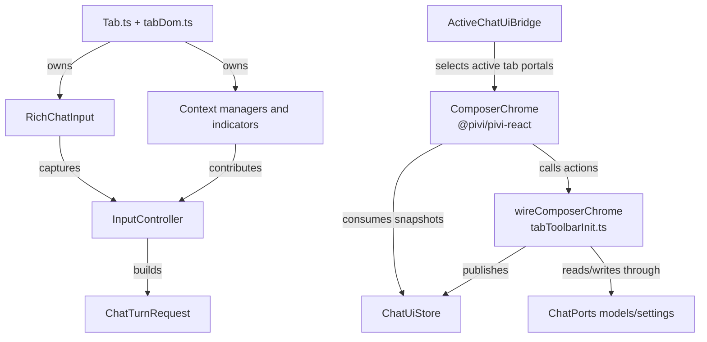
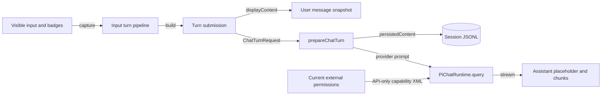

# Input panel and context

[Back to the developer handbook](README.md)

The input panel is a mixed React/imperative surface. React owns serializable chrome and selectors; tab-owned adapters retain control of contenteditable input, inline badges, attachments, host selections, and cursor-relative menus.

## Ownership map



React owns model, thinking, mode, external-context, send/queue/stop, and usage presentation. `wireComposerChrome()` adapts the active tab's model catalog, projected settings, and external selector into immutable composer snapshots and narrow actions.

`RichChatInput` is an uncontrolled contenteditable adapter with a textarea-like API. It owns mention badges, plain-text paste, cursor placement, Markdown-list continuation, and IME-safe synchronization. React must not reconcile its children. File, image, inline-context, editor, browser, and canvas adapters follow the same owner-realm rule.

## State and persistence

| Capability | State source | Update path | Persistence and privacy |
|---|---|---|---|
| Model | `ChatModelsPort` plus projected settings | React action → `wireComposerChrome` → settings commit | Blank tabs persist `draftModel` in tab layout; bound changes use settings/runtime synchronization |
| Thinking | Model capabilities and projected `thinkingLevel` or `thinkingBudget` | Selector action → settings commit → runtime sync | Stored through settings projection, not as a separate tab binding |
| Mode/reasoning | Model catalog and projected settings | Selector action → settings commit | Settings-owned; capability-gated by the active model |
| Usage | Active message/runtime usage plus model context metadata | Stream/model refresh → `ChatUiStore` | Rebuildable UI projection |
| Current note/files | `FileContextState` and host workspace events | File chips, mentions, or first-turn current-note capture | Vault-relative context enters that turn; current note is auto-sent on the first turn only, while later file cards must be added explicitly per turn |
| Images | `ImageContextManager` | Paste/drag → send or queue snapshot | Turn attachment content; composer attachments are cleared after capture |
| Inline context | Structured badges in `RichChatInput` | Badge extraction at send time | Structured turn context; badge token is removed from runtime prompt text |
| Ambient editor selection | `SelectionController` and active Markdown view polling | Context indicator; queued-turn capture while another turn streams | Selected text plus note/line metadata; direct sends use an explicit inline-context badge instead |
| Browser/canvas selection | Tab controllers and host selection state | Active-tab polling/events → structured context | Captured into direct and queued turns; stale host selections are cleared |
| External directories | Per-tab `ExternalContextSelector` | Add/select/pin actions and cross-view synchronization | Absolute paths live only in vault-scoped device-local storage and per-turn overlays |
| MCP/tool/skill slash tokens | Slash catalog and rich-input badges | Resolved at send time | Visible token stays in history; provider-only transforms are not persisted |

Model changes apply provider defaults, persist the projected settings, refresh context-window metadata before and after asynchronous model preparation, and synchronize thinking capability. A blank tab keeps only its draft model and does not create a runtime merely because the selector changed.

## Context indicators

The context indicator is a row of tab-owned adapters rather than one React component. It can include current-note/file chips, image previews, editor selection, browser selection, and canvas selection. `contextRowVisibility.ts` shows the row only when one of those adapters has content.

File cards are consumed when a user submission—or a queued user submission—snapshots its request. A new session may show one automatically attached current-note card before the first turn; after that send, the card is cleared and is not restored for an already-started session. Explicit file cards are likewise per-turn and never leak into the next prompt. Programmatic redo/replay uses its captured request without clearing an unrelated composer draft.

File and folder mentions are resolved at send time. Folder mentions expand to the eligible paths used by prompt construction, but visible user-message history continues to render the single folder token from `displayContent` rather than enumerating those expanded files. The only request metadata supplemented as a historical badge is the first-turn auto-attached current note; every other visible file/folder badge comes from what the user entered. Inline contexts are structured tokens embedded in the input. Explicit selected-text contexts preserve exact source positions, complete touched lines, and selection markers. Ambient editor polling records selected text with note and available line metadata; browser and canvas controllers capture their host-specific structured context.

IME composition is a correctness boundary. Key handling and badge rebuilding must not mutate the contenteditable tree while `isComposing` is true; synchronization happens after composition ends.

## External context

Each tab tracks pinned roots, session-only roots, and selected keys. An added path must be absolute, exist, be a directory, and not duplicate or overlap an existing parent/child root. Unavailable saved roots remain visible as warnings instead of silently disappearing.

New/load session flows reset session-only choices to current pinned device-local roots. A runtime restart preserves the tab's current selection. Pin/unpin persists through the app's device-local external-context store and broadcasts to every mounted view.

At execution time, selected roots become `ChatTurnRequest.externalContextPaths`. A queued turn snapshots its content, but permissions are refreshed from the current UI when it actually runs. Writers remove absolute paths from `.pivi/settings.json` and JSONL `message_ui`; readers overlay the device-local data after loading.

## Keyboard, focus, and overlays

Input key handling follows this precedence:

1. Slash and mention menus consume navigation/selection keys.
2. Escape during streaming requests cooperative cancellation.
3. Unmodified Enter continues or exits an ordered Markdown list when applicable.
4. The configured Enter or Cmd/Ctrl+Enter shortcut submits.
5. Composition events prevent submission and badge rewriting.

Composer model and thinking selectors are `listbox` menus with `option` rows. They keep hover preview plus click-to-pin behavior, but pinned menus also support Escape dismissal, outside-pointer close, Arrow/Home/End roving highlight, and Enter to select. Escape returns focus to the trigger.

Imperative slash and mention dropdowns dismiss on outside `pointerdown` (capture phase), cancel pending mention debounce on hide, and recompute or dismiss when the owner viewport/container scrolls. Narrow slash detail panels stack below the list inside container queries instead of clipping off-screen.

The input wrapper shows a host-accent `:focus-within` ring. The virtual transcript exposes a focusable messages panel with a matching `:focus-visible` ring for keyboard navigation.

Ask-user prompts localize title, hints, option fallbacks, and waiting/result chrome. Rendering focuses the prompt root only when no other editable or IME composition owns focus. When the root owns focus and no text field is active, digit keys `1`–`9` select the matching numbered option.

Message images open a React `ModalLayer` lightbox from keyboard-focusable buttons. The dialog traps focus, dismisses on Escape/backdrop, and restores the triggering control.

When Send is disabled, its tooltip is attached to a non-disabled wrapper so hover still explains why submission is blocked.

## Queue behavior

Each submission made while a turn is streaming appends an independent FIFO queued-turn snapshot; content, images, and captured context are never merged with adjacent submissions. While streaming, an empty composer keeps the stop action; entering content replaces it with the queue-message action, whose click follows the normal submission path instead of cancelling the active run. Queue actions republish the composer state synchronously, so deleting the last queued row with an empty input immediately restores the stop action, while restoring a row for editing immediately shows the queue action. A single queued turn appears as one compact bar inside the chat surface. Multiple turns appear as separate rows in a tab-switcher-style expanded surface, ordered by execution, with the queue constrained to the left column and the input-position tab switcher protected on the right. Dragging a row changes its execution position; keyboard users can focus a row, press Space or Enter to pick it up, move it with Arrow Up/Down, then drop with Space/Enter or cancel with Escape. Row action buttons remain independent from drag initiation. Every row can steer the active Pi run, restore that snapshot to the composer for editing, or delete it. Steering uses Pi's one-at-a-time steering queue and preserves the user-visible message overlay when the API prompt differs. Cancelling the foreground turn restores queued content and images to the composer. External-root permissions are deliberately re-read when a queued turn begins or steers.

## Turn construction



There are three content layers:

- `displayContent` preserves what the user typed and the product-visible badges.
- Persisted content combines the original request with stable context XML needed to rebuild the session.
- The provider prompt additionally applies API-only transformations: MCP emphasis, `/generate-image` instructions, and live external-capability availability. These transformations must never leak into visible history.

`/compact [instructions]` is a special pass-through command and does not attach normal turn context. Without a matching background draft it synchronously runs both compaction passes; its optional instructions affect only the final `NOTE₂`. Workspace-command tokens stay visible but resolve their templates and variables into runtime text at capture time.

## Note Toolbar selection capture

The stable Obsidian command is:

```text
pivi:add-selection-to-chat-input
```

It opens or reuses Pivi and inserts an inline context badge containing the note path/name, exact selection positions, complete touched lines, and markers around the exact selected text. It supports Source mode and Live Preview because those modes provide a stable Obsidian `Editor`; reading-mode selections are not attached.

Note Toolbar setup and CLI requirements are covered in [Tools, skills, MCP, and integrations](07-tools-skills-mcp-and-integrations.md).

## Editor selection toolbar and inline edit

Edit-mode Markdown selections (Live Preview and Source) open a body-appended floating toolbar registered through `registerEditorExtension` in app composition when Settings → Toolbar uses the **Pivi** selected-text provider. The same registration also installs the inline-edit surface and diff-review `StateField`s into every markdown editor so same-leaf file switches and mode toggles cannot wipe a lazy `appendConfig` install. Choosing **Note Toolbar** or **Disabled** suppresses this overlay so selected-text chrome never doubles up. Selection ownership is scoped to the active editor view and owner document, including pop-out windows; pointer tracking runs in the capture phase so CodeMirror or third-party event handling cannot leave toolbar triggering suppressed. The CM6 `ViewPlugin` and geometry helpers live under `src/ui/shared/selectionToolbar/`; React chrome mounts only through `src/app/ui` via `mountSelectionToolbarSurface`.

The editor-only `pivi:inline-edit-selection` command opens the same inline-edit surface for the current non-empty selection even when the floating toolbar is disabled. It is listed in the shortcut links under Settings → General; users can assign `Mod+K` (`Command+K` on macOS and `Ctrl+K` on Windows/Linux) or another shortcut in Obsidian Hotkeys. Pivi does not claim a default plugin hotkey that could override an existing user or host binding.

The floating overlay passes Escape through to the host when invisible and consumes it only while visible. Scroll listeners recompute live selection geometry when possible and dismiss when the selection is invalid or outside the editor. Ordinary toolbar actions restore editor focus after dispatch unless the action intentionally opens another durable surface. Source-mode pointer drag is suppressed like Live Preview. Inline edit handles Escape during prompt input as well as diff review.

The Pivi toolbar always offers **Ask AI** and **Add to chat**, plus enabled shortcuts from synced `editorSelectionToolbar` settings:

- Obsidian command shortcuts call `app.commands.executeCommandById`.
- Pivi command shortcuts run the matching Settings → Commands workspace command (selection-aware via `WorkspaceCommandRegistry`).
- Ask AI sends through `PiviChatViewHandle.commands.submitInlineEditTurn`, which creates a temporary **archived** transport tab without activating it, then force-closes that tab when the turn ends so repeated Ask AI turns do not accumulate archived tabs. The session JSONL remains available in history. Each processed assistant text chunk is forwarded directly from the normal chat turn pipeline; inline edit does not poll tab state or wait for the turn promise to resolve before publishing output.

Ask AI inserts a CM6 block widget above the selection instead of opening another floating overlay. The embedded surface contains a mention-capable prompt, `/` commands, model and thinking selectors, send/stop, progressively Markdown-rendered replies, and a transparent Copy Markdown action. Its reply uses the sidebar's canonical assistant message shell and streaming Markdown adapter: completed blank-line prefixes render once, the mutable unclosed tail remains escaped text, and turn completion performs one full-fidelity Markdown render. The shared message-content boundary explicitly restores the Sidebar's normal text layout, so CodeMirror's inherited `break-spaces`, line-breaking, tab, or caret rules cannot alter embedded Markdown while the live escaped tail retains its own `pre-wrap`. The incremental Markdown scanner retains an unterminated final line until its newline arrives, so provider chunk boundaries cannot split ordered-list markers, item text, or nested list content into separate rendered segments. While waiting for the first visible assistant text, the bottom rule between the surface and source selection shows the Subagent-style running light and the lower-left corner shows an elapsed-only `* x.xs` timer using the Sidebar response-metadata typography. Both stop together on first visible output, stop, failure, completion, or disposal, but the frozen timer remains visible like Sidebar response metadata until the inline surface closes or a new turn resets it; edit responses move that same metadata node into the Diff Review action row. Reduced-motion mode leaves the status line static without disabling elapsed time. Edit protocol responses swap the input widget for rendered deletion/insertion review blocks. **Accept** applies one mapped `editor.replaceRange`; the surface's own **x** or diff **Reject** closes that session without mutating the note.

Inline edit sessions are persistent and keyed independently from the transient selection toolbar (opening Ask AI dismisses only the toolbar snapshot, never sibling inline-edit sessions). Editor clicks, selection changes, toolbar dismissal, and active-tab changes do not close them; one editor can host multiple input or diff-review sessions whose mapped ranges, cancellation, streaming, and close paths do not affect siblings. Reading/preview mode remains out of scope because it does not expose a trustworthy source-editor range.

Workspace commands may persist `{{selected_text}}`. The Settings command Prompt editor exposes **Selected text** as the first `@` suggestion and renders the token as a removable badge. Invoking such a command from a source editor materializes the current selection as the same structured inline-context badge used by **Add to chat**. Composer and historical user-message badges can navigate back to the source note, restore and center the range, and briefly flash it; sending extracts the encoded reference into `ChatTurnRequest.inlineContexts` instead of flattening it into prompt text. Sidebar and inline-edit mention menus do not expose the Settings-only selected-text suggestion.

## Change checklist

- Keep React snapshots immutable, serializable, and free of DOM/runtime objects.
- Preserve visible/persisted/provider prompt separation.
- Sanitize external absolute paths at every settings and JSONL write boundary.
- Preserve IME, dropdown, list-continuation, queue, cancel, and stream-generation ordering.
- Test lazy first-send initialization and close/reset after asynchronous boundaries.
- Add focused coverage for new context sources and direct external-selector validation behavior.
