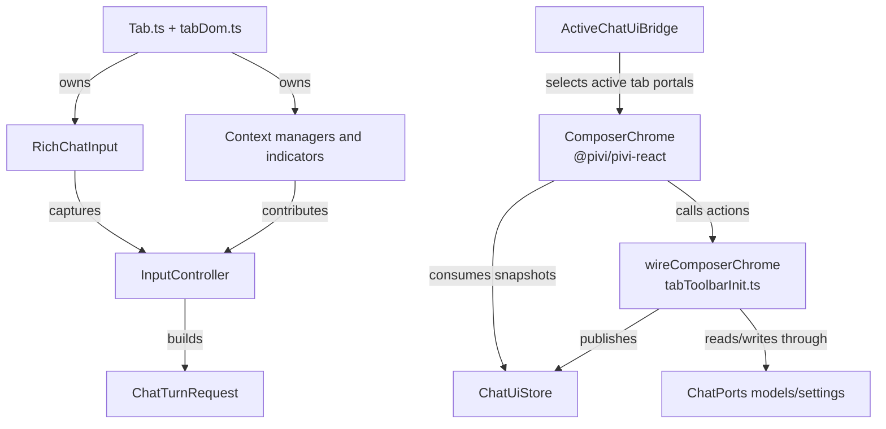
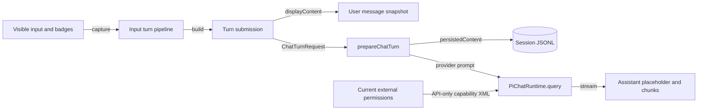

# Input panel and context

[Back to the developer handbook](README.md)

The input panel is a mixed React/imperative surface. React owns serializable chrome and selectors; tab-owned adapters retain control of contenteditable input, inline badges, attachments, host selections, and cursor-relative menus.

## Ownership map



React owns model, thinking, mode, external-context, send/stop, and usage presentation. `wireComposerChrome()` adapts the active tab's model catalog, projected settings, and external selector into immutable composer snapshots and narrow actions.

`RichChatInput` is an uncontrolled contenteditable adapter with a textarea-like API. It owns mention badges, plain-text paste, cursor placement, Markdown-list continuation, and IME-safe synchronization. React must not reconcile its children. File, image, inline-context, editor, browser, and canvas adapters follow the same owner-realm rule.

## State and persistence

| Capability | State source | Update path | Persistence and privacy |
|---|---|---|---|
| Model | `ChatModelsPort` plus projected settings | React action → `wireComposerChrome` → settings commit | Blank tabs persist `draftModel` in tab layout; bound changes use settings/runtime synchronization |
| Thinking | Model capabilities and projected `thinkingLevel` or `thinkingBudget` | Selector action → settings commit → runtime sync | Stored through settings projection, not as a separate tab binding |
| Mode/reasoning | Model catalog and projected settings | Selector action → settings commit | Settings-owned; capability-gated by the active model |
| Usage | Active message/runtime usage plus model context metadata | Stream/model refresh → `ChatUiStore` | Rebuildable UI projection |
| Current note/files | `FileContextState` and host workspace events | File chips, mentions, or first-turn current-note capture | Vault-relative context enters the turn/session; current note is auto-sent once per session |
| Images | `ImageContextManager` | Paste/drag/attach → send or queue snapshot | Turn attachment content; composer copy is cleared after capture |
| Inline context | Structured badges in `RichChatInput` | Badge extraction at send time | Structured turn context; badge token is removed from runtime prompt text |
| Editor/browser/canvas selection | Tab controllers and host selection state | Active-tab polling/events → structured context | Captured into the outgoing turn; stale host selections are cleared |
| External directories | Per-tab `ExternalContextSelector` | Add/select/pin actions and cross-view synchronization | Absolute paths live only in vault-scoped device-local storage and per-turn overlays |
| MCP/tool/skill slash tokens | Slash catalog and rich-input badges | Resolved at send time | Visible token stays in history; provider-only transforms are not persisted |

Model changes apply provider defaults, persist the projected settings, refresh context-window metadata before and after asynchronous model preparation, and synchronize thinking capability. A blank tab keeps only its draft model and does not create a runtime merely because the selector changed.

## Context indicators

The context indicator is a row of tab-owned adapters rather than one React component. It can include current-note/file chips, image previews, editor selection, browser selection, and canvas selection. `contextRowVisibility.ts` shows the row only when one of those adapters has content.

File and folder mentions are resolved at send time. Folder mentions expand to the eligible paths used by prompt construction. Inline contexts are structured tokens embedded in the input. Editor selections preserve source positions and touched lines; browser and canvas controllers capture their host-specific structured context.

IME composition is a correctness boundary. Key handling and badge rebuilding must not mutate the contenteditable tree while `isComposing` is true; synchronization happens after composition ends.

## External context

Each tab tracks pinned roots, session-only roots, and selected keys. An added path must be absolute, exist, be a directory, and not duplicate or overlap an existing parent/child root. Unavailable saved roots remain visible as warnings instead of silently disappearing.

New/load session flows reset session-only choices to current pinned device-local roots. A runtime restart preserves the tab's current selection. Pin/unpin persists through the app's device-local external-context store and broadcasts to every mounted view.

At execution time, selected roots become `ChatTurnRequest.externalContextPaths`. A queued turn snapshots its content, but permissions are refreshed from the current UI when it actually runs. Writers remove absolute paths from `.pivi/settings.json` and JSONL `message_ui`; readers overlay the device-local data after loading.

## Keyboard and queue behavior

Input key handling follows this precedence:

1. Slash and mention menus consume navigation/selection keys.
2. Escape during streaming requests cooperative cancellation.
3. Unmodified Enter continues or exits an ordered Markdown list when applicable.
4. The configured Enter or Cmd/Ctrl+Enter shortcut submits.
5. Composition events prevent submission and badge rewriting.

Submitting while a turn is streaming creates one queued-turn snapshot. Further submissions merge through core queue helpers. The queue UI can edit by restoring content to the composer or discard the snapshot. Cancelling the foreground turn restores queued content and images to the composer. External-root permissions are deliberately re-read when a queued turn begins.

## Turn construction



There are three content layers:

- `displayContent` preserves what the user typed and the product-visible badges.
- Persisted content combines the original request with stable context XML needed to rebuild the session.
- The provider prompt additionally applies API-only transformations: MCP emphasis, `/generate-image` instructions, and live external-capability availability. These transformations must never leak into visible history.

`/compact` is a special pass-through command and does not attach normal turn context. Workspace-command tokens stay visible but resolve their templates and variables into runtime text at capture time.

## Note Toolbar selection capture

The stable Obsidian command is:

```text
pivi:add-selection-to-chat-input
```

It opens or reuses Pivi and inserts an inline context badge containing the note path/name, exact selection positions, complete touched lines, and markers around the exact selected text. It supports Source mode and Live Preview because those modes provide a stable Obsidian `Editor`; reading-mode selections are not attached.

Note Toolbar setup and CLI requirements are covered in [Tools, skills, MCP, and integrations](07-tools-skills-mcp-and-integrations.md).

## Change checklist

- Keep React snapshots immutable, serializable, and free of DOM/runtime objects.
- Preserve visible/persisted/provider prompt separation.
- Sanitize external absolute paths at every settings and JSONL write boundary.
- Preserve IME, dropdown, list-continuation, queue, cancel, and stream-generation ordering.
- Test lazy first-send initialization and close/reset after asynchronous boundaries.
- Add focused coverage for new context sources and direct external-selector validation behavior.
