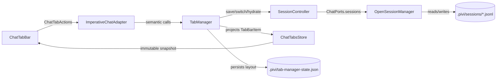
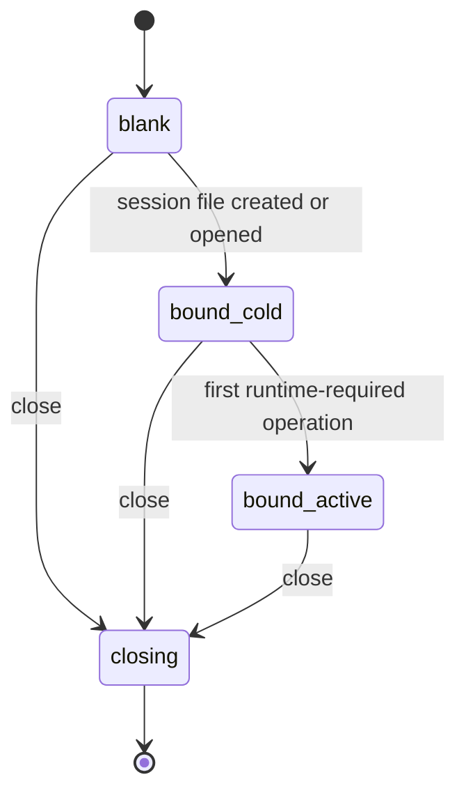

# Tabs, sessions, and history

[Back to the developer handbook](README.md)

A Pivi tab is an in-view conversation surface managed by `TabManager`; it is not an Obsidian `WorkspaceLeaf`. A session is a durable JSONL conversation. One or more Pivi views can exist, and opening history first looks for an existing tab binding before creating another surface.

## Layer flow

The app adapter is the only application boundary allowed to inspect the tab aggregate. React consumes serializable items and actions. `TabManager` owns ordering, active identity, the switching lock, session bindings, controller/runtime aggregates, and persistence projection.

## Lifecycle

- `blank` has draft UI state but no session file or runtime.
- `bound_cold` has a durable session binding but no `PiChatService`.
- `bound_active` owns a synchronized runtime.
- `closing` rejects new work and disposes tab resources.
- `isArchived` and `needsAttention` are independent UI flags, not lifecycle states.

## Identity and persistence

| Identifier | Meaning | Durable session identity? |
|---|---|---|
| `tab.id` | UI key retained across layout restore | No |
| `openSessionId` | In-memory `OpenSessionManager` projection ID | No |
| JSONL session ID | Header/Pi-compatible session identifier | Yes, but not the tab binding key |
| `sessionFile` | Vault-relative JSONL path | Yes; source of truth for a tab binding |
| `leafId` | Legacy tree-shaped JSONL compatibility field | No; not used by current product restore |

Tab layout is stored in `.pivi/tab-manager-state.json`. `data.json.tabManagerState` is read only for legacy migration and removed after successful migration.

The layout stores `tabId`, optional `sessionFile`, blank-tab `draftModel` and `draftTitle`, `isArchived`, `needsAttention`, and `activeTabId`. It does not store messages, runtime state, `openSessionId`, bound-session titles, DOM/controllers, or absolute external paths. Current writes omit `leafId`; readers accept it only for legacy compatibility, and restore ignores it.

Session titles and messages belong to JSONL. A blank `draftTitle` moves into session metadata when the tab first binds. Background title generation keeps the first-prompt fallback when the model query fails; after a successful query, Pivi appends `pivi/session-meta` with `titleSource: "model"` before updating memory or UI. If that append fails, the fallback remains visible and a localized Notice reports the error.

## User behavior

| Operation | Behavior |
|---|---|
| New | Reuses the active empty blank tab; preserves a text/image draft by creating another tab; does not create an empty session |
| Switch | Deactivates the old tab, activates the target, restores an archived target, clears attention, and lazily hydrates session messages |
| Open history | Reuses the same-view binding, then reveals another view's binding, then creates/rebinds a tab |
| Rename | Updates `draftTitle` for blank tabs or JSONL session metadata for bound tabs |
| Archive | Hides the tab without destroying its runtime or session; selecting it restores it |
| Close | Saves, selects or creates a fallback, then destroys the tab; the sole empty blank tab cannot close |
| Fork | Requires persisted source entry IDs and creates a new session file opened in a new tab |
| Redo | Uses persisted entry ancestry and may require lazy runtime activation |

Switches are single-flight. A concurrent second request waits for the active switch; it is not a queued request to a later target. Code that adds switch callers must not assume otherwise.

The React switcher groups open tabs before archived tabs, supports title editing, attention/stream indicators, exit animation, owner-window event handling, reduced motion, and configurable header/input placement. Rows share the queue/provider direct-manipulation sorter: dragging within a group changes persisted order, while crossing the Archived boundary also changes archive membership. Moving the active tab into Archived switches to an open fallback first, and moving the last open tab into Archived creates a blank open fallback. Space picks up a focused row, Arrow Up/Down moves it—including across the boundary—and Space drops it; Escape cancels. Archived rows are otherwise revealed by downward wheel progress; keyboard-only browsing of already archived rows without beginning a reorder remains a known accessibility gap tracked in the roadmap.

## Session switching and recovery

Switching a bound tab saves the current session, dismisses inline prompts, invalidates queued/stream state, orphans active subagent presentation, resets transient state, synchronizes the runtime if present, hydrates messages/usage/todo/current-note projections, and resets session-only external roots to current pinned roots.

### Long-session projection

Session UI hydration is recent-first. `SessionController` requests the newest 100 projected messages through `ChatPorts.sessions.openRecent()` and asks `readOlder()` for stable-ID pages when the virtual viewport reaches the top. `OpenSessionState` retains durable total/older counts and the first-message preview without holding the complete transcript. `ChatProjectionStore` may first reveal an already-loaded boundary message, then prepends each fetched page without replacing the visible range; stable message IDs let TanStack Virtual preserve the visible anchor. Concurrent requests for the same cursor are coalesced, and results that outlive a session switch or tab disposal are discarded.

Session identity, history summaries, usage, and UI context are also read through the JSONL sidecar index rather than a full Pi snapshot. Restored running asynchronous subagents are marked orphaned as each page appears. The Pi runtime still assembles complete model context from authoritative JSONL independently of this bounded UI projection.

Compaction entries keep Pi's readable `summary`, `firstKeptEntryId`, and `tokensBefore` fields. When the compaction model returns the required section set, Pivi normalizes the dedicated checkpoint fence, a whole-response JSON fence, or a whole-response JSON object, then stores a version-1 checkpoint under `details.piviCheckpoint`: continuation summary, goal/constraints, durable decisions, vault-relative artifacts, open work/questions, next steps, source bounds, and estimates. Schema completeness and path safety determine validity; checkpoint length alone does not. A later checkpoint carries forward the durable decision/artifact ledger and renders the merged state back into the plain summary, so old Pi consumers and old sessions remain valid. Missing, unknown, malformed, or device-absolute structured data uses the summary-only path.

Saving, switching, truncating, and disposing synchronously flush pending projection events first. Durable `ChatMessage[]`, session identity, and the JSONL wire format remain unchanged.

Restore creates tabs inactive, isolates individual failures, and activates the persisted target only after construction finishes. This avoids accidentally warming the first restored tab. If every entry fails, Pivi creates a blank tab.

Closing an active tab selects the visually adjacent open tab or creates a blank tab before destruction, avoiding an empty-shell flash. If creating the new tab for a fork throws, Pivi deletes the newly created session; cleanup failures are logged without hiding the original error.

Late stream chunks are guarded by generation and session ownership. Runtime state is never treated as the durable source of truth.

## Layout persistence triggers

Tab creation, switching, close/archive, attention/streaming changes, and session binding changes schedule a debounced layout snapshot. View close cancels the debounce and persists immediately before disposal. Plugin unload starts immediate snapshot persistence for every mounted view while workspace disposal proceeds.

Multiple views share the same layout file, so callers must use the provided semantic persistence path rather than inventing view-local storage.

## Change checklist

- Keep session identity on `sessionFile`, not tab/runtime/open-session IDs.
- Preserve lazy runtime creation and the four lifecycle states.
- Keep archive and close semantically distinct.
- Preserve persisted user/assistant entry IDs through hydration for fork/redo.
- Keep checkpoint fields additive to the Pi compaction entry and artifact paths vault-relative.
- Isolate restore failures and always leave a usable blank fallback.
- Verify focus, pop-out owner realm, reduced motion, and archived-tab accessibility when changing the React switcher.
