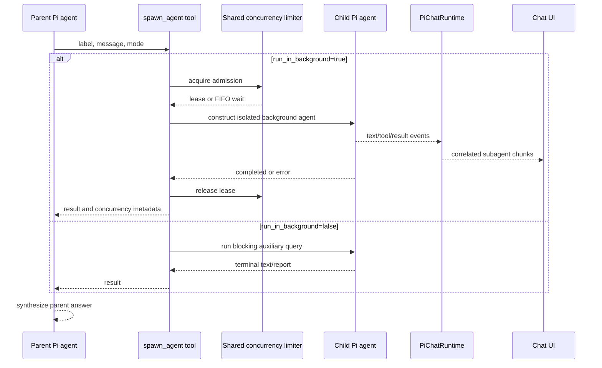

# Subagents, streaming, and rendering

[Back to the developer handbook](README.md)

Pivi exposes one delegation tool, `spawn_agent`. It creates an isolated Pi worker for a focused task while the parent agent remains responsible for integrating the result.

## Contract and isolation

The model-facing input is:

```ts
{
  label: string;
  message: string;
  run_in_background: boolean;
}
```

The tool is registered only when Subagents are enabled. Empty messages, `/compact`, disallowed background execution, or missing runtime capabilities fail explicitly. New code should not add aliases for old field names.

The child receives the current selected model and authentication, a focused system prompt, low thinking, and an empty message history. It can use the app-injected base and MCP tools, but `spawn_agent` is filtered to prevent recursive delegation. External-file tools are rebuilt from the active runtime's allowed external roots. The parent must still put all task-specific context in `message`; the child does not inherit the parent conversation.

## Execution flow



`run_in_background=false` uses a blocking auxiliary query. Background mode creates a tracked job and supports parallel execution when one assistant response emits multiple parallel tool calls. “Background” does not mean the parent turn completes early: the tool waits for the worker's terminal state, returns its report, and the parent agent synthesizes before the turn finishes.

## Concurrency

One `SubagentConcurrencyLimiter` belongs to the plugin workspace and is injected into every runtime and auxiliary runner, so the limit spans tabs and views. Admission is atomic and FIFO. A lease covers asynchronous agent construction, prompting, and terminal cleanup.

Increasing capacity immediately drains eligible waiters. Decreasing it does not kill running workers; new admission waits until active leases fall below the new limit. Completed-job retention is fixed independently of concurrency.

A background tool result includes the final status/report and concurrency metadata such as the configured maximum, queue position, whether the request queued, and running counts at request/start time. A blocking result contains its terminal text or compact structured report without background admission metadata.

The child is asked to end with one fenced version-1 `pivi-agent-report` JSON block. Only `objective` and `outcome` are required; summary, findings, decisions, vault-relative artifacts, and open questions are optional. The runtime corrects the reported outcome from the actual completion state. A valid report becomes compact parent-model text, while the complete terminal output remains in tool details for the visible trace. Missing, malformed, unknown-version, or unsafe-path reports leave the terminal text behavior unchanged.

## Event and presentation flow

```mermaid
flowchart LR
  Child["Child agent events"] -- "adapt" --> Runtime["PiChatRuntime"]
  Runtime -- "active-turn chunks" --> Stream["StreamController"]
  Runtime -- "late-turn listener" --> Stream
  Stream -- "correlates IDs" --> Lifecycle["StreamSubagentCoordinator<br/>streamSubagentLifecycle.ts"]
  Lifecycle -- "updates records" --> Manager["SubagentManager"]
  Manager -- "writes pure state" --> Message["ChatMessage content block"]
  Message -- "snapshot" --> React["React message shell"]
  React -- "empty adapter slot" --> Adapter["Stored subagent renderer"]
```



The stable parent tool-call ID is the UI key; background jobs also have an agent ID. `SubagentManager` maps those identities, nested child tools, partial text, results, and lifecycle state. It is a presentation record layer, not a second executor.

Background child `text`, `tool_use`, and `tool_result` events become subagent stream chunks. Terminal background events become `async_subagent_result`. Active-turn events enter the current query queue only when the spawn ID was registered for that turn. Older or post-turn events use the runtime listener and are routed back to the owning assistant message, preventing contamination of a later turn. A blocking child returns only its terminal result through the parent `spawn_agent` tool call.

Foreground provider recovery uses transcript-neutral `retry_start` and `retry_end` chunks. A retryable assistant error is written to JSONL before it is removed from active model context, so diagnostics remain durable without poisoning the continuation. Classification starts from pi-ai's retryable set and also treats Node TLS handshake disconnects (`Client network socket disconnected before secure TLS connection was established`) and bare `ECONNRESET` as retryable. The live thinking indicator temporarily shows the retry number and backoff countdown, then switches to an active-retry label until recovery settles; it restores the prior thinking label afterward. The transcript does not render the failed attempt as a terminal error while recovery is pending; only a failure that exhausts the three-retry budget reaches the normal error projector. Cancelling the turn aborts both the active Agent request and any 2/4/8-second retry wait and clears the indicator with the rest of the turn state.

Chat state maintains reverse indexes from subagent, runtime-agent, and tool IDs to the owning message. Creation, hydration, mutation, truncation, session switching, and clearing rebuild or update those indexes. Background and late events therefore resolve their owner directly rather than scanning assistant history.

React owns message ordering and one empty content-adapter slot per subagent tool entity. `ToolCallView` mounts the imperative renderer through `ImperativeContentSlot`; sync and async stored bodies share `createSubagentShell()` for the `pivi-subagent-card` header/content chrome. The app bridge updates each mounted imperative subagent renderer incrementally rather than remounting it on every chunk. One or many siblings therefore use the same individual-card path, keyed by the persisted spawn-tool ID. Stored and live subagents converge on the same pure `ChatMessage` representation, and composer chrome never duplicates active work.

Generic tool calls are unboxed disclosure rows everywhere: their outer shell has no static border or background in either the transcript or a subagent. Nested tool steps reuse the same unboxed summary and compact tool-row treatment as transcript-level step groups. Every step-group header reports truthful per-status counts at the far right (`3 Completed / 1 Failed`) instead of reducing mixed outcomes to one aggregate label. Expanding a subagent step group reveals contiguous rows with no additional group card, subagent-specific rectangular tool cards, inter-row gap, or row margins; the subagent card remains the sole enclosing bordered/background surface. Expanded result content may retain its inline rule to communicate hierarchy.

Collapsed tool and subagent cards construct only their header chrome. First expansion parses and mounts the complete content already held by the snapshot; collapsed updates mark that body dirty, and reopening rebuilds from the latest snapshot. Presentation never replaces available content with `... N more`, while provider/tool truncation remains explicit and no expansion re-executes work or reads a new source. Each expanded top-level tool or steps group is capped at one third of its actual messages viewport, while an expanded subagent card uses two thirds of that viewport via `--pivi-subagent-expanded-max-height` (fallback `min(640px, 66vh)`), with `overflow: hidden` and its direct body child owning the sole internal scrollbar; the direct title is layout-fixed at the card top and never sticks to the transcript. Nested titles inside the body scrollport use sticky positioning with measured offsets. Reaching the internal scroll end never mutates disclosure state or card height; continued scrolling chains to the transcript so the fixed-height card moves upward as a whole. Inside a subagent, the steps title sticks at `top: 0` in the content scrollport and tool titles stick below it at the measured steps height; top-level steps groups keep the steps title on the card while tools stick at `top: 0` inside the scrolling steps body.

Streaming Markdown uses one stable adapter mount per content block. Completed safe prefixes are sealed only at neutral blank-line boundaries and rendered once through Obsidian; the unsealed tail is appended as escaped plain text. Fenced code, display math, HTML blocks, lists, tables, blockquotes, and callouts remain in the tail until a safe boundary. Rewrites rebuild that block, while terminal state replaces the temporary segments with one complete Obsidian fidelity render. Every rendered segment owns an independent Obsidian `Component` scope so virtual-row unmount removes postprocessors, observers, and timers.

## Lifecycle and failure semantics

Stored asynchronous lifecycle states are pending, running, completed, error, and orphaned. The shared presentation vocabulary is queued, running, waiting, completed, failed, cancelled, and orphaned; synchronous/background mode is tracked separately.

- Aborting a queued worker removes it from FIFO without consuming a slot.
- Aborting a running worker aborts the child, records cancellation/error, and releases its lease.
- Construction or prompt failure releases the lease and produces an explicit error result.
- `runtime.cancel()` and cleanup abort all owned workers.
- User Esc/Stop interrupt aborts workers and terminalizes in-flight presentation cards as Cancelled (via `cancelAllActive` plus a message-model sweep). Session end/switch/reopen still maps unresolved cards to Orphaned.
- Workspace disposal rejects queued and future admissions before providers, MCP, and session resources are released.
- A late event without an owning message is ignored rather than attached to the current turn.
- Terminal UI hydration retries a missing final result on bounded delays; generation changes and disposal cancel stale retries.
- Ending, switching, or reopening a session turns unresolved presentation records into orphaned errors. Pivi does not pretend to restore a process that no longer exists.

## Persistence and restore

Pi assistant/tool entries are written to session JSONL. Structured subagent content blocks, nested tool calls, and presentation fields are appended as the session's `message_ui` overlay. On restore, the message mapper merges both layers. If an older, interrupted, or externally produced session has a Pi-native `spawn_agent` call/result but lacks the richer subagent overlay, the mapper reconstructs the card identity, mode, task label/prompt, terminal status, runtime agent ID, and result from those native fields. Complete overlay data still wins, so recovery never discards nested tool traces or richer presentation state. Cloud-file replacement of the parent session JSONL follows the same device-local journal and explicit recovered-session rules as other turns; subagent overlays inside a recovered fork remain vault-relative and do not invent a merged linear history across devices.

When a background result completes, Pivi also repairs the restored parent tool result so future LLM context sees the final report rather than only an initial job-start acknowledgement. Completed and error cards can therefore be rendered and reasoned about after reopening. Unresolved jobs become an explicit orphaned record with any partial output preserved.

`message_ui` validates any persisted `agent_report` again and removes invalid structured payloads without discarding unrelated legacy tool details. The legacy/external subagent JSONL reader can extract a valid report from its final text result, but live Pi background jobs remain in-memory and do not create a second event log.

The strict parser also protects terminal presentation. Persisted structured reports and fenced terminal reports remain available to parent recovery, but the individual card strips every `pivi-agent-report` fence—including malformed or incomplete fences—from visible result text. It never stringifies protocol JSON as a fallback. The complete terminal trace and session overlay remain authoritative and unmodified.

## Change checklist

- Keep execution in the Pi engine and presentation correlation in UI services/stream code.
- Do not let child agents recursively expose `spawn_agent`.
- Preserve plugin-wide FIFO admission and release leases on every terminal path.
- Keep active-turn and late-turn event routing separate.
- Persist structured UI overlays without replacing Pi-compatible message history.
- Keep compact parent reports separate from complete terminal trace persistence and preserve text fallback.
- Test queued abort, running abort, capacity changes, construction failure, late events, hydrate retries, session orphaning, and restore when changing this feature.
- Test turn interrupt terminalizes in-flight subagent presentation as Cancelled (not left Running).
