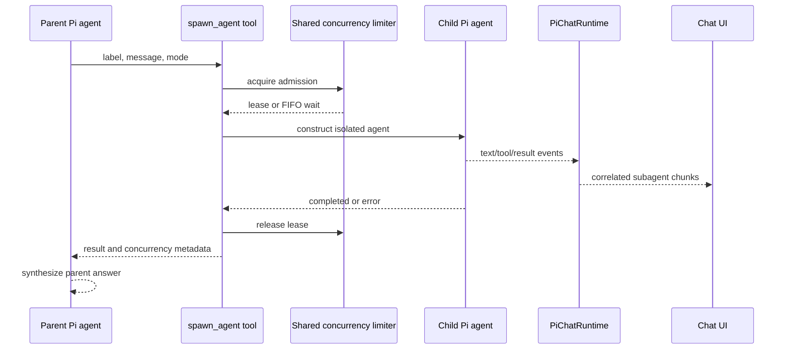

# Subagents, streaming, and rendering

[Back to the developer handbook](README.md)

Pivi exposes one delegation tool, `spawn_agent`. It creates an isolated Pi worker for a focused task while the parent agent remains responsible for integrating the result.

## Contract and isolation

The model-facing input is:

```ts
{
  label: string;
  message: string;
  run_in_background: boolean;
}
```

The tool is registered only when Subagents are enabled. Empty messages, `/compact`, disallowed background execution, or missing runtime capabilities fail explicitly. New code should not add aliases for old field names.

The child receives the current selected model and authentication, a focused system prompt, low thinking, and an empty message history. It can use the app-injected base and MCP tools, but `spawn_agent` is filtered to prevent recursive delegation. External-file tools are rebuilt from the active runtime's allowed external roots. The parent must still put all task-specific context in `message`; the child does not inherit the parent conversation.

## Execution flow



`run_in_background=false` uses a blocking auxiliary query. Background mode creates a tracked job and supports parallel execution when one assistant response emits multiple parallel tool calls. “Background” does not mean the parent turn completes early: the tool waits for the worker's terminal state, returns its report, and the parent agent synthesizes before the turn finishes.

## Concurrency

One `SubagentConcurrencyLimiter` belongs to the plugin workspace and is injected into every runtime and auxiliary runner, so the limit spans tabs and views. Admission is atomic and FIFO. A lease covers asynchronous agent construction, prompting, and terminal cleanup.

Increasing capacity immediately drains eligible waiters. Decreasing it does not kill running workers; new admission waits until active leases fall below the new limit. Completed-job retention is fixed independently of concurrency.

The tool result includes the final status/report and concurrency metadata such as the configured maximum, queue position, whether the request queued, and running counts at request/start time.

## Event and presentation flow

```mermaid
flowchart LR
  Child["Child agent events"] -- "adapt" --> Runtime["PiChatRuntime"]
  Runtime -- "active-turn chunks" --> Stream["StreamController"]
  Runtime -- "late-turn listener" --> Stream
  Stream -- "correlates IDs" --> Lifecycle["streamSubagentLifecycle"]
  Lifecycle -- "updates records" --> Manager["SubagentManager"]
  Manager -- "writes pure state" --> Message["ChatMessage content block"]
  Message -- "snapshot" --> React["React message shell"]
  React -- "empty adapter slot" --> Adapter["Stored subagent renderer"]
```



The stable parent tool-call ID is the UI key; background jobs also have an agent ID. `SubagentManager` maps those identities, nested child tools, partial text, results, and lifecycle state. It is a presentation record layer, not a second executor.

Child `text`, `tool_use`, and `tool_result` events become subagent stream chunks. Terminal background events become `async_subagent_result`. Active-turn events enter the current query queue only when the spawn ID was registered for that turn. Older or post-turn events use the runtime listener and are routed back to the owning assistant message, preventing contamination of a later turn.

Chat state maintains reverse indexes from subagent, runtime-agent, and tool IDs to the owning message. Creation, hydration, mutation, truncation, session switching, and clearing rebuild or update those indexes. Background and late events therefore resolve their owner directly rather than scanning assistant history.

React owns message ordering and an empty content-adapter slot. The app bridge updates the mounted imperative subagent renderer incrementally rather than remounting it on every chunk. Stored and live subagents converge on the same pure `ChatMessage` representation.

Streaming Markdown uses one stable adapter mount per content block. Completed safe prefixes are sealed only at neutral blank-line boundaries and rendered once through Obsidian; the unsealed tail is appended as escaped plain text. Fenced code, display math, HTML blocks, lists, tables, blockquotes, and callouts remain in the tail until a safe boundary. Rewrites rebuild that block, while terminal state replaces the temporary segments with one complete Obsidian fidelity render. Every rendered segment owns an independent Obsidian `Component` scope so virtual-row unmount removes postprocessors, observers, and timers.

## Lifecycle and failure semantics

Presentation states include pending, running, completed, error, and orphaned, with synchronous/background mode tracked separately.

- Aborting a queued worker removes it from FIFO without consuming a slot.
- Aborting a running worker aborts the child, records cancellation/error, and releases its lease.
- Construction or prompt failure releases the lease and produces an explicit error result.
- `runtime.cancel()` and cleanup abort all owned workers.
- Workspace disposal rejects queued and future admissions before providers, MCP, and session resources are released.
- A late event without an owning message is ignored rather than attached to the current turn.
- Terminal UI hydration retries a missing final result on bounded delays; generation changes and disposal cancel stale retries.
- Ending, switching, or reopening a session turns unresolved presentation records into orphaned errors. Pivi does not pretend to restore a process that no longer exists.

## Persistence and restore

Pi assistant/tool entries are written to session JSONL. Structured subagent content blocks, nested tool calls, and presentation fields are appended as the session's `message_ui` overlay. On restore, the message mapper merges both layers.

When a background result completes, Pivi also repairs the restored parent tool result so future LLM context sees the final report rather than only an initial job-start acknowledgement. Completed and error cards can therefore be rendered and reasoned about after reopening. Unresolved jobs become an explicit orphaned record with any partial output preserved.

## Change checklist

- Keep execution in the Pi engine and presentation correlation in UI services/stream code.
- Do not let child agents recursively expose `spawn_agent`.
- Preserve plugin-wide FIFO admission and release leases on every terminal path.
- Keep active-turn and late-turn event routing separate.
- Persist structured UI overlays without replacing Pi-compatible message history.
- Test queued abort, running abort, capacity changes, construction failure, late events, hydrate retries, session orphaning, and restore when changing this feature.
