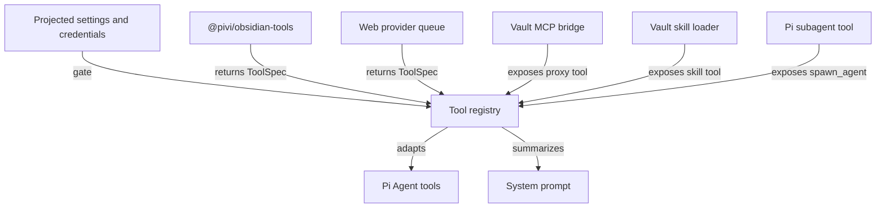

# Tools, skills, MCP, and integrations

[Back to the developer handbook](README.md)

Pivi tools implement the host-neutral `ToolSpec` protocol. Concrete Obsidian execution belongs to `@pivi/obsidian-tools`; Pi SDK adaptation belongs to the Pi engine. A capability is registered only when its settings, credentials, platform support, and runtime dependencies are available.

## Registration architecture



Settings saves refresh the affected registries and open-runtime prompts. Disabled or unavailable tools disappear from subsequent turns; callers must not keep a silent fallback implementation registered under the same name.

## Obsidian tools

| Area | Tools | Operation semantics |
|---|---|---|
| Read and explore | `obsidian_read`, `obsidian_markdown_structure`, `obsidian_search`, `obsidian_note_info`, `obsidian_links`, `obsidian_list`, `obsidian_attachment` | Read-only |
| Edit and organize | `obsidian_edit`, `obsidian_write`, `obsidian_properties`, `obsidian_delete`, `obsidian_move`, `obsidian_mkdir` | Mutating; delete follows Obsidian trash settings |
| History and tasks | `obsidian_history`, `obsidian_tasks` | List/read operations are read-only; restore/toggle operations mutate; require enabled official CLI integration |
| Daily, graph, tags, Bases | `obsidian_daily`, `obsidian_graph`, `obsidian_tags`, `obsidian_base` | Depends on operation; daily and Base query use the official CLI where required |
| Navigation | `obsidian_open` | Changes workspace navigation, not vault content |
| External access | `obsidian_read_external`, `obsidian_list_external` | Read-only but disabled by default and restricted to explicit roots |
| Host execution | `obsidian_bash`, `obsidian_command`, `obsidian_eval` | Potentially mutating and disabled by default |
| Image generation | `obsidian_generate_image` | Writes an attachment and may insert an embed |

Large-note reads start with `obsidian_read` in stats mode, then use `obsidian_markdown_structure` and bounded line ranges instead of loading an entire note into context.

Prefer Obsidian's public in-process API for vault, metadata, file-manager, and workspace behavior. Use the official CLI only for capabilities the public API does not expose or for explicitly configured integrations. Pivi implements vault text search by scanning because Obsidian has no public vault-wide full-text search API.

## External access and process execution

External reads require `allowExternalRead` and at least one allowed directory from device-local pinned settings or current-turn context. Host-side realpath containment rejects traversal outside those roots. Absolute paths are stripped from synchronized settings and JSONL.

`obsidian_bash` requires `allowBash`, accepts one allowlisted single-line command, and rejects shell-control syntax before calling the host process runner. `obsidian_command` and `obsidian_eval` require their individual gates plus the official Obsidian CLI. Do not broaden one capability because another is enabled.

## Web search and fetch

`WebSearch` and `WebFetch` share an ordered provider queue configured by `webSearchTools.providerOrder` and `disabledProviders`. Supported configured providers are Brave, Tavily, Exa, and AnySearch. Failures fall through in user order. Exa public MCP is the fixed terminal search fallback; direct HTTP is the fixed terminal fetch fallback.

Provider keys and availability are resolved at the app/engine boundary. Tool implementations should preserve useful provider errors while allowing only the configured, explicit fallthrough behavior.

## Image generation

`obsidian_generate_image` registers only when the `openai-codex` provider has usable credentials and the tool is enabled. It generates through Codex, saves through Obsidian attachment handling, and can insert a standard Markdown embed.

When available, `/generate-image` appears as a built-in tool mention. The visible token is persisted unchanged; core prompt preparation expands only the provider prompt into an explicit tool request. It is not a workspace command template.

## Skills

Vault skills live under `.pivi/skills/`. The `skill` tool loads their instructions for an agent turn. A first vault load may offer the `kepano/obsidian-skills` bundle, but installation and updates require explicit user confirmation. This repository does not track runtime vault skills.

Skill listing or installation may invoke the configured external distribution tooling. Keep remote activity explicit and do not introduce a global or cross-vault skill directory.

## Vault-local MCP

MCP configuration lives only in `.pivi/mcp.json`; OAuth material lives under `.pivi/mcp-oauth/`. Pivi does not read or write host-global MCP configuration.

The Pi registry exposes one proxy tool named `mcp` rather than one top-level Pi tool per server tool. The proxy searches and calls enabled vault servers. Settings own server/tool availability. `/server` and `/server/tool` composer tokens are optional emphasis: enabled servers are already available, and prompt finalization changes only the provider prompt.

MCP settings save/reload invalidates slash caches, authenticates or diagnoses as requested, warms tool inventories, and reloads open runtime bridges. Anonymous remote probes can report authentication as not applicable; explicitly OAuth-configured servers always enter the OAuth flow.

## Subagents

`spawn_agent` is registered from the Pi engine when Subagents are enabled and the required runtime capabilities exist. It is described in detail in [Subagents, streaming, and rendering](06-subagents-streaming-and-rendering.md).

## Note Toolbar

Pivi can add the current Markdown editor selection or a custom Pivi command to Note Toolbar. The stable selection command ID is:

```text
pivi:add-selection-to-chat-input
```

Automatic command-item setup currently requires:

- Obsidian 1.12.2 or newer;
- Note Toolbar 1.31.06 or newer;
- the official Obsidian CLI enabled;
- a Note Toolbar assigned to the Selected text display location.

Pivi detects the installed manifest before enabling setup. It never installs Note Toolbar automatically and never rewrites Note Toolbar's `data.json`. If the plugin is installed but disabled, Pivi asks the official CLI to enable it when available; otherwise it opens the community-plugin page. New command items go through Note Toolbar's official CLI so that plugin remains responsible for UUIDs, defaults, migrations, and refresh.

Pivi can add `message-square-plus` with a visible `Pivi` label or as icon-only. Setup is idempotent for a matching command/style. For an existing item, Pivi first uses Note Toolbar's runtime item API to synchronize its icon, label, and tooltip. If that API is unavailable and the style differs, Pivi opens the relevant item or plugin settings for manual adjustment; it still does not rewrite configuration directly.

Without automatic setup, add a Command item manually in the toolbar assigned to Selected text, choose **Pivi: Add selection to chat input**, and use `message-square-plus`. Custom slash-command cards can similarly save and add their stable icon-only commands.

Troubleshooting:

- If setup opens Note Toolbar settings, assign a Selected text toolbar and retry.
- If it opens the community-plugin page, install, enable, or update Note Toolbar.
- If it requests manual configuration, enable the official CLI or add the item manually.
- If the command exists, Pivi intentionally avoids creating a duplicate.

The attached selection payload and editor-mode limits are documented in [Input panel and context](04-input-panel-and-context.md).

## Recovery and safety

Pivi does not add per-edit permission prompts. Mutating tools must preserve explicit failure signals. Deletes use Obsidian trash behavior. `obsidian_history` can restore a retained snapshot when the CLI and a matching history entry exist, but recovery is not guaranteed for every mutation.

When adding a tool:

1. Define the smallest host-neutral `ToolSpec` and validate external input at execution boundaries.
2. Put Obsidian execution in `@pivi/obsidian-tools` and Pi adaptation in the engine.
3. Define registration prerequisites and settings refresh behavior.
4. Document mutation, privacy, credentials, network, and recovery semantics.
5. Add focused implementation, registry, prompt, and failure-path tests.
