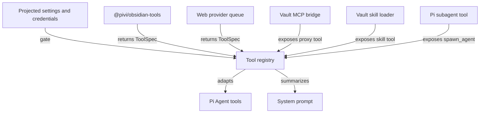

# Tools, skills, MCP, and integrations

[Back to the developer handbook](README.md)

Pivi tools implement the host-neutral `ToolSpec` protocol. Concrete Obsidian execution belongs to `@pivi/obsidian-tools`; Pi SDK adaptation belongs to the Pi engine. A capability is registered only when its settings, credentials, platform support, and runtime dependencies are available.

## Registration architecture



Settings saves refresh the affected registries and open-runtime prompts. Disabled or unavailable tools disappear from subsequent turns; callers must not keep a silent fallback implementation registered under the same name.

The base system prompt keeps note-backed answers concise: when requested information already exists in vault notes, the assistant returns only verified note wikilinks instead of repeating, quoting, or summarizing the stored content.

## Obsidian tools

| Area | Tools | Operation semantics |
|---|---|---|
| Read and explore | `obsidian_read`, `obsidian_markdown_structure`, `obsidian_search`, `obsidian_note_info`, `obsidian_links`, `obsidian_list`, `obsidian_attachment` | Read-only |
| Edit and organize | `obsidian_edit`, `obsidian_write`, `obsidian_properties`, `obsidian_delete`, `obsidian_move`, `obsidian_mkdir` | Mutating; delete follows Obsidian trash settings |
| History and tasks | `obsidian_history`, `obsidian_tasks` | List/read operations are read-only; restore/toggle operations mutate; require enabled official CLI integration |
| Daily, graph, tags, Bases | `obsidian_daily`, `obsidian_graph`, `obsidian_tags`, `obsidian_base` | Depends on operation; daily and Base query use the official CLI where required |
| Navigation | `obsidian_open` | Changes workspace navigation, not vault content |
| External access | `obsidian_read_external`, `obsidian_list_external` | Read-only but disabled by default and restricted to explicit roots |
| Host execution | `obsidian_bash`, `obsidian_command`, `obsidian_eval` | Potentially mutating and disabled by default |
| Image generation | `obsidian_generate_image` | Writes an attachment and may insert an embed |

Large-note reads start with `obsidian_read` in stats mode, then use `obsidian_markdown_structure` and bounded line ranges instead of loading an entire note into context. Explicit ranges automatically stop at the largest complete-line page that fits `maxChars`; a truncated result reports `nextStartLine` for the next non-overlapping page. Content reads reserve one shared allowance per Agent turn before execution, so sibling calls cannot each claim the full context headroom; subagents calculate that allowance from their own model/context rather than the parent session. Every content read clamps `maxChars` to a 1,000-character minimum so an exhausted runtime allowance or smaller explicit value can cross the compaction threshold and advance to the next Memory boundary instead of failing with `maxChars=0`.

Prefer Obsidian's public in-process API for vault, metadata, file-manager, and workspace behavior. Use the official CLI only for capabilities the public API does not expose or for explicitly configured integrations; the CLI integration is disabled when its setting is absent. Pivi implements vault text search by scanning because Obsidian has no public vault-wide full-text search API. Base lookup by file/path uses direct vault and metadata-cache resolution, and an unresolved-links-only graph request reads `MetadataCache.unresolvedLinks` without enumerating vault files.

## External access and process execution

External reads require `allowExternalRead` and at least one allowed directory from device-local pinned settings or current-turn context. Host-side realpath containment rejects traversal outside those roots. Absolute paths are stripped from synchronized settings and JSONL.

`obsidian_bash` requires `allowBash`, accepts one allowlisted executable plus argument vector (matched by canonical path and argument schema, not command-string prefixes), rejects shell-control syntax, runs without a login shell, and constrains cwd to the vault before calling the host process runner. Bash and `obsidian_eval` also require turn-scoped high-risk confirmation before execution. The system prompt lists the effective Bash allowlist, classifies Bash as a lowest-priority host diagnostic, forbids using it to read/search/list/modify vault files, and forbids another Bash attempt in the same turn after validation rejection. Multi-file vault work stays on Obsidian tools and subagents. `obsidian_command` and `obsidian_eval` require their individual gates plus the official Obsidian CLI. Do not broaden one capability because another is enabled.

## High-risk confirmation

Delete, overwrite of an existing file, bulk mutation above the documented threshold (more than 10 direct folder children or more than 10 paths), Bash/eval, first launch of a configured stdio MCP server, and oversized MCP artifact writes require turn-scoped confirmation. Grants bind to session, turn, operation kind, and normalized resource fingerprint; argument changes and session switches invalidate them. Denial, timeout, cancellation, view disposal, session switch, and plugin unload fail closed with no pending execution. Subagents inherit only parent-turn grants and cannot open hidden approval UI. App-owned approval previews show normalized paths, executable/args, MCP server/tool, and origin metadata without secrets or document bodies. Bounded diagnostics audit records under `.pivi/diagnostics/` store decision/outcome metadata only.

Pivi is a desktop-only plugin with optional filesystem, process, and environment-backed integrations. Direct filesystem access is confined to explicit external roots, vault-local Pivi data, provider compatibility stores, and configured Skills/CLI paths. Vault mutations require canonical vault-relative paths via `requireVaultRelativeMutationPath` and reject absolute/UNC/traversal/symlink-parent escape before Obsidian APIs run. Process execution uses the bounded host `ProcessRunner` for CLI, allowlisted Bash, Skills distribution tooling, and related one-shot work; MCP stdio spawns a long-lived child with vault cwd and rejects shell-control characters in the executable field. Opening an external authentication URL remains a detached opener, not a shell. Environment values are read at those integration boundaries for provider credentials, MCP authentication/stdio variables, CLI discovery, and Skills tooling; Pivi does not collect or transmit machine identity to its author.

Vault-wide enumeration remains operation-driven: full-text search, tag and graph analysis, Base listing, and mention discovery inspect the paths required for the requested result. Direct Base lookup and unresolved-links-only graph lookup use indexed host data instead. Clipboard writes happen only after an explicit copy action; MCP import never invokes the clipboard-read API.

## Web search and fetch

`WebSearch` and `WebFetch` share an ordered provider queue configured by `webSearchTools.providerOrder` and `disabledProviders`. Supported configured providers are Brave, Tavily, Exa, and AnySearch. Failures fall through in user order. Exa public MCP is the fixed terminal search fallback; direct HTTP is the fixed terminal fetch fallback.

`WebFetch` tries enabled third-party extractors (Tavily, Exa, AnySearch) in the user-configured provider order before the direct HTTP terminal fallback. Extraction shares the full target URL—including paths and query data—with the configured provider. Terminal fetch errors redact the target URL.

Provider keys and availability are resolved at the app/engine boundary. Tool implementations should preserve useful provider errors while allowing only the configured, explicit fallthrough behavior. Both tools use injected scoped HTTP clients with shared egress policy (see [SECURITY.md](../SECURITY.md)).

## Image generation

`obsidian_generate_image` registers only when the `openai-codex` provider has usable credentials and the tool is enabled. It generates through Codex, saves through Obsidian attachment handling, and can insert a standard Markdown embed.

When available, `/generate-image` appears as a built-in tool mention. The visible token is persisted unchanged; core prompt preparation expands only the provider prompt into an explicit tool request. It is not a workspace command template.

## Skills

Vault skills live under `.pivi/skills/`. The `skill` tool loads their instructions for an agent turn. A first vault load may offer the `kepano/obsidian-skills` bundle, but installation and updates require explicit user confirmation. This repository does not track runtime vault skills.

Skill install/update invokes the exact installed `skills` package as `node <cli.mjs …>` through the bounded host process runner with `shell: forbidden` on every platform. Runtime never resolves an implicit latest package via `npx`. Publication validates a temporary staged tree (rejects symlinks and path escapes; enforces file-count/per-file/total-size limits; requires a valid bounded `SKILL.md`) and atomically replaces the prior version only after validation succeeds. Failure at any staging/publication boundary leaves the previous install and active state unchanged.

Keep remote activity explicit and do not introduce a global or cross-vault skill directory.

## Vault-local MCP

MCP configuration lives only in `.pivi/mcp.json`; OAuth material lives under `.pivi/mcp-oauth/`. Pivi does not read or write host-global MCP configuration. Remote `headers` and stdio `env` use structured `ConfigValueRef` maps (`plain`, `secret`, `systemEnvironment`); secret-like values are referenced by ID in `SecretStorage` (`pivi-mcp-v-*`) and are absent from synced JSON. Publication stages new secrets first, atomically publishes config, then clears obsolete secrets. Malformed JSON is preserved as a `.corrupt-*` artifact and surfaced through diagnostics instead of silently substituting defaults.

New stdio MCP definitions remain inactive until Settings confirms the exact executable, arguments, cwd, and environment variable names. The first process launch during an agent turn also requires turn-scoped high-risk confirmation. Settings diagnostics may connect after activation confirmation without opening a chat approval UI.

The Pi registry exposes one proxy tool named `mcp` rather than one top-level Pi tool per server tool. The proxy searches and calls enabled vault servers. Settings own server/tool availability. `/server` and `/server/tool` composer tokens are optional emphasis: enabled servers are already available, and prompt finalization changes only the provider prompt.

MCP tool results enforce fixed budgets (32 blocks, 256 KiB encoded, 100_000 text characters, JSON depth 32, 8 resources) before entering model context or session persistence. Oversized results fail explicitly or, after write confirmation, produce a bounded Vault-local reference under `.pivi/artifacts/mcp/`; full oversized payloads never enter JSONL or context.

MCP settings save/reload invalidates slash caches, authenticates or diagnoses as requested, warms enabled remote tool inventories, and reloads open runtime bridges. Automatic startup/runtime prefetch never starts stdio servers; a configured and activation-confirmed stdio command starts only when the user explicitly chooses **Connect / refresh tools** or the agent first searches, lists, or calls its tools. Configuration import opens a JSON editor and parses only text the user pastes and confirms; it does not read the system clipboard. Anonymous remote probes can report authentication as not applicable; explicitly OAuth-configured servers always enter the OAuth flow.

Remote MCP transports and OAuth use injected scoped `fetch` clients from composition, not a global renderer fetch patch. Configured private MCP origins receive short-lived origin grants for the active operation.

Stdio MCP children inherit only a documented cross-platform parent-environment allowlist plus values explicitly configured for that server; `KEY=$NAME` bulk import stores a `systemEnvironment` reference and never copies the host value into Pivi stores. Remote MCP URLs accept only `http:`/`https:`, with plaintext `http:` limited to loopback hosts; server names reject reserved prototype keys; and the settings editor stores stdio executable and argument vector as separate structured fields rather than reparsing a shell string. The OAuth callback server accepts only `GET`, returns explicit UTF-8 responses with browser hardening headers, and never interpolates authorization-server error text into HTML.

## Subagents

`spawn_agent` is registered from the Pi engine when Subagents are enabled and the required runtime capabilities exist. Multi-file vault changes divide the concrete exhaustive `<context_files>` paths into non-overlapping batches rather than delegating globs or directory prefixes. Workers report modified, unchanged, and failed paths; the parent reconciles complete one-time coverage before claiming completion. Structural Markdown markers such as YAML `---`, code fences, and table separators require read-only sampling and clarification when structural and target meanings overlap. Subagents are described in detail in [Subagents, streaming, and rendering](06-subagents-streaming-and-rendering.md).

## Note Toolbar

Pivi can add the current Markdown editor selection or a custom Pivi command to Note Toolbar. Settings → Toolbar chooses a single selected-text toolbar provider: **Pivi**, **Note Toolbar**, or **Disabled**. Note Toolbar setup UI appears only when the provider is Note Toolbar (and the plugin is installed); with Pivi or Disabled selected, Note Toolbar content is hidden.

The stable selection command ID is:

```text
pivi:add-selection-to-chat-input
```

Automatic command-item setup currently requires:

- Obsidian 1.12.2 or newer;
- Note Toolbar 1.31.06 or newer;
- the official Obsidian CLI enabled;
- a Note Toolbar assigned to the Selected text display location.

Pivi detects the installed manifest before enabling setup. It never installs Note Toolbar automatically and never rewrites Note Toolbar's `data.json`. If the plugin is installed but disabled, Pivi asks the official CLI to enable it when available; otherwise it opens the community-plugin page. New command items go through Note Toolbar's official CLI so that plugin remains responsible for UUIDs, defaults, migrations, and refresh.

Pivi can add `message-square-plus` with a visible `Pivi` label or as icon-only. Setup is idempotent for a matching command/style. For an existing item, Pivi first uses Note Toolbar's runtime item API to synchronize its icon, label, and tooltip. If that API is unavailable and the style differs, Pivi opens the relevant item or plugin settings for manual adjustment; it still does not rewrite configuration directly.

Without automatic setup, add a Command item manually in the toolbar assigned to Selected text, choose **Pivi: Add selection to chat**, and use `message-square-plus`. Custom slash-command cards can similarly save and add their stable icon-only commands.

Troubleshooting:

- If setup opens Note Toolbar settings, assign a Selected text toolbar and retry.
- If it opens the community-plugin page, install, enable, or update Note Toolbar.
- If it requests manual configuration, enable the official CLI or add the item manually.
- If the command exists, Pivi intentionally avoids creating a duplicate.

The attached selection payload and editor-mode limits are documented in [Input panel and context](04-input-panel-and-context.md).

## Recovery and safety

Pivi does not add per-edit permission prompts. Mutating tools must preserve explicit failure signals. Before changing an existing `.md` or `.canvas` note, Pivi best-effort captures the current content into Obsidian File Recovery via the internal `forceAdd` API when that core plugin is enabled; snapshot failure does not block the write. Deletes use Obsidian trash behavior. `obsidian_history` can restore a retained snapshot when the CLI and a matching history entry exist, but recovery still depends on File Recovery being enabled and the snapshot succeeding.

When adding a tool:

1. Define the smallest host-neutral `ToolSpec` and validate external input at execution boundaries.
2. Put Obsidian execution in `@pivi/obsidian-tools` and Pi adaptation in the engine.
3. Define registration prerequisites and settings refresh behavior.
4. Document mutation, privacy, credentials, network, and recovery semantics.
5. Add focused implementation, registry, prompt, and failure-path tests.
