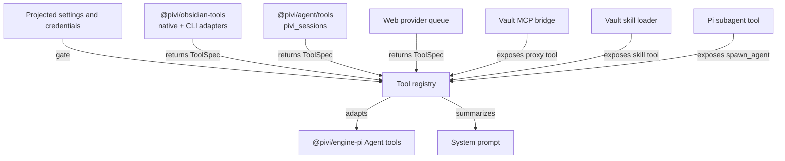
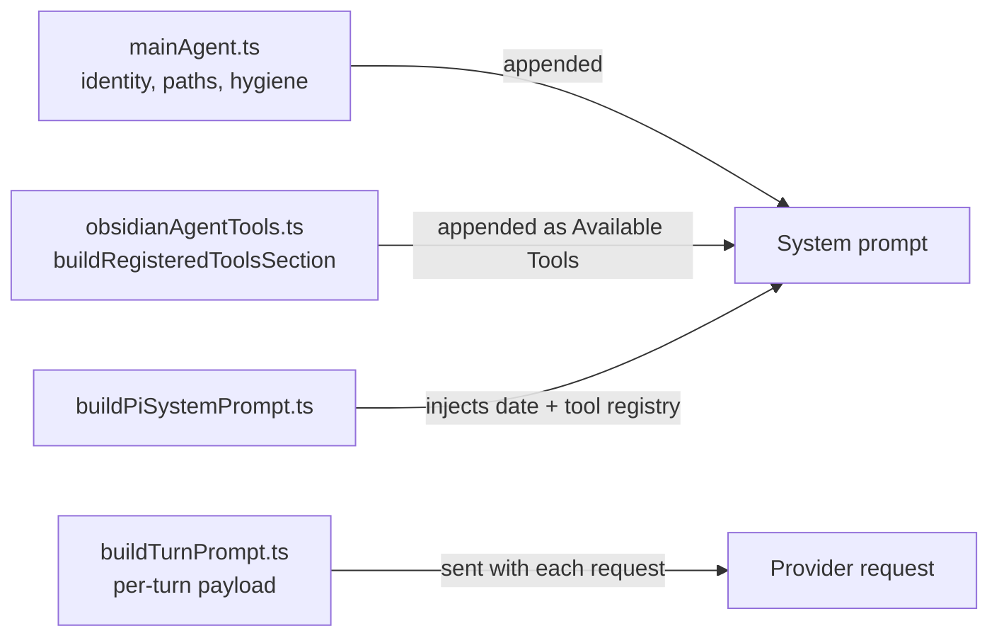

# Tools, skills, MCP, and integrations

[Back to the developer handbook](README.md)

Pivi tools implement the host-neutral `ToolSpec` protocol. Concrete Obsidian execution belongs to `@pivi/obsidian-tools`; Pi SDK adaptation belongs to `@pivi/engine-pi`. A capability is registered only when its settings, credentials, platform support, and runtime dependencies are available.

## Registration architecture


```mermaid
flowchart TD
  Settings["Projected settings and credentials"] -- "gate" --> Registry["Tool registry"]
  Obsidian["@pivi/obsidian-tools<br/>native + CLI adapters"] -- "returns ToolSpec" --> Registry
  Sessions["@pivi/agent/tools<br/>pivi_sessions"] -- "returns ToolSpec" --> Registry
  Web["Web provider queue"] -- "returns ToolSpec" --> Registry
  MCP["Vault MCP bridge"] -- "exposes proxy tool" --> Registry
  Skills["Vault skill loader"] -- "exposes skill tool" --> Registry
  Subagents["Pi subagent tool"] -- "exposes spawn_agent" --> Registry
  Registry -- "adapts" --> Pi["@pivi/engine-pi Agent tools"]
  Registry -- "summarizes" --> Prompt["System prompt"]
```

Settings saves refresh the affected registries and open-runtime prompts. Disabled or unavailable tools disappear from subsequent turns; callers must not keep a silent fallback implementation registered under the same name.

The base system prompt keeps note-backed answers concise: when requested information already exists in vault notes, the assistant returns only verified note wikilinks instead of repeating, quoting, or summarizing the stored content.

## System prompt layers

The agent system prompt is assembled in three layers under `packages/agent/src/prompt/`:


```mermaid
flowchart LR
  Base["mainAgent.ts<br/>identity, paths, hygiene"] -- "appended" --> Full["System prompt"]
  Tools["obsidianAgentTools.ts<br/>buildRegisteredToolsSection"] -- "appended as Available Tools" --> Full
  Turn["buildTurnPrompt.ts<br/>per-turn payload"] -- "sent with each request" --> Request["Provider request"]
  Pi["buildPiSystemPrompt.ts"] -- "injects date + tool registry" --> Full
```

- `mainAgent.ts` owns the static base prompt: Pivi identity, path conventions, vault mutation rules, Markdown hygiene, link verification, and the `<context_files>` delegation paragraph. It interpolates only `vaultPath` and `userName`.
- `obsidianAgentTools.ts` builds the dynamic `## Available Tools` section from the actual registered `ToolSpec` values plus capability inventory. Detailed tool-specific prose and parameter guidance are owned by each factory's optional `ToolSpec.promptUsage` beside its schema; the prompt builder renders those descriptors and only falls back to schema-derived parameter text. It must not reintroduce a central tool-name switch that duplicates argument contracts.
- `buildTurnPrompt.ts` builds the per-turn payload from user input and context; it is not part of the system prompt.
- `buildPiSystemPrompt.ts` composes the base prompt with the current ISO date and the registered-tools section.

**Prompt/schema invariant:** A detailed usage descriptor lives with the owning factory/schema and is consumed from the registered `ToolSpec`; required fields and conditional contracts in that descriptor must agree with the schema. Schema-level and generated-prompt tests enforce this for contracts such as required `catalogRevision`, the `pivi_commands` move-anchor XOR, and `spawn_agent.run_in_background`.

## Obsidian tools

| Area | Tools | Operation semantics |
|---|---|---|
| Read and explore | `obsidian_read`, `obsidian_markdown_structure`, `obsidian_search`, `obsidian_note_info`, `obsidian_links`, `obsidian_list`, `obsidian_attachment` | Read-only |
| Edit and organize | `obsidian_edit`, `obsidian_write`, `obsidian_properties`, `obsidian_delete`, `obsidian_move`, `obsidian_mkdir` | Mutating; delete follows Obsidian trash settings |
| History and tasks | `obsidian_history`, `obsidian_tasks` | List/read operations are read-only; restore/toggle operations mutate; require enabled official CLI integration |
| Daily, graph, tags, Bases | `obsidian_daily`, `obsidian_graph`, `obsidian_tags`, `obsidian_base` | Depends on operation; daily and Base query use the official CLI where required |
| Navigation | `obsidian_open` | Changes workspace navigation, not vault content |
| External access | `obsidian_read_external`, `obsidian_list_external` | Read-only but disabled by default and restricted to explicit roots |
| Host execution | `obsidian_bash`, `obsidian_command`, `obsidian_eval` | Potentially mutating and disabled by default |
| Image generation | `obsidian_generate_image` | Writes an attachment and may insert an embed |

Large-note reads start with `obsidian_read` in stats mode, then use `obsidian_markdown_structure` and bounded line ranges instead of loading an entire note into context. Explicit ranges automatically stop at the largest complete-line page that fits `maxChars`; a truncated result reports `nextStartLine` for the next non-overlapping page. If one physical line cannot fit, Vault note reads switch to character pagination instead of failing. A standalone `startChar` is a file-global 1-based UTF-16 position; combined with `startLine`, it is a 1-based UTF-16 position within that physical line, and `endLine` may bound the read. Each truncated line-relative result reports the exact `nextStartLine` + `nextStartChar` pair to use with the same `maxChars`; Agents must not calculate the next coordinates themselves. The model-visible continuation marker counts inside the cap. Content reads reserve one shared allowance per Agent turn before execution, so sibling calls cannot each claim the full context headroom; subagents calculate that allowance from their own model/context rather than the parent session. Every content read clamps `maxChars` to a 1,000-character minimum so an exhausted runtime allowance or smaller explicit value can cross the compaction threshold and advance to the next Memory boundary instead of failing with `maxChars=0`.

`obsidian_edit` owns exact local replacement, including splitting a very long physical line. The Agent does not need to send the whole line: it copies the shortest unique substring spanning the intended boundary and repeats that local substring in `new_string` with `\n` or `\n\n` inserted. For example, `old_string: "sentence.Second"` with `new_string: "sentence.\n\nSecond"` splits the boundary without copying the surrounding thousands of characters. Replacement remains unique by default; `replace_all: true` is required only when every exact occurrence should receive the identical replacement.

`obsidian_edit` is literal rather than Markdown-aware: text outside `old_string` remains immediately adjacent to `new_string`. Before a replacement introduces a block construct—heading, list, blockquote/callout, fenced code block, or thematic break—the Agent must inspect both physical-line boundaries and include the required line endings in the replacement. The Session regression that motivated this rule replaced only `Target` inside `>> Target` with `### Heading`, which correctly produced the literal text `>> ### Heading` but not a Markdown heading. The correct edit includes the delimiter in `old_string`, writes the desired `\n\n` boundary in `new_string`, and reads back the changed span to verify structure.

Prefer Obsidian's public in-process API for vault, metadata, file-manager, and workspace behavior. Use the official CLI only for capabilities the public API does not expose or for explicitly configured integrations; the CLI integration is disabled when its setting is absent. Pivi implements vault text search by scanning because Obsidian has no public vault-wide full-text search API. Base lookup by file/path uses direct vault and metadata-cache resolution, and an unresolved-links-only graph request reads `MetadataCache.unresolvedLinks` without enumerating vault files.

`pivi_sessions` is a host-neutral `@pivi/agent` tool over an injected `SessionRecoveryPort`, composed into the shared base provider by the app rather than returned by `createObsidianTools`. `@pivi/agent` Skills owns skill/command frontmatter parsing. The host package owns exact vault-edit occurrence matching and mismatch diagnostics used by `ObsidianVaultApi`; the concrete tools package does not maintain duplicate helpers for this responsibility.

## External access and process execution

External reads require `allowExternalRead` and at least one allowed directory from device-local pinned settings or current-turn context. Host-side realpath containment rejects traversal outside those roots. Absolute paths are stripped from synchronized settings and JSONL.

`obsidian_bash` requires `allowBash`, resolves the exact login shell before authorization, runs single-line commands through it, and constrains cwd to the vault before calling the host process runner. Settings encode new grants as `exact: <complete shell command>` or `prefix: <quoted safe argv prefix>`. Prefix authorization uses a shell-specific safe argv parser for POSIX shells and Windows `cmd.exe`; it rejects control operators, substitution, pipelines, redirects, expansion, and extra commands. When a command is not authorized, Pivi shows a sidebar inline confirmation (not a modal) with Deny, Allow once, Allow for this session, and Always allow. Exact interactive review may approve shell syntax such as a pipeline or redirect; only safe single commands can offer prefix persistence. The system prompt lists pre-approved allowlist commands, tells the agent not to run non-allowlisted commands on its own initiative, and permits `obsidian_bash` for user-explicit requests pending sidebar approval. It classifies Bash as a lowest-priority host diagnostic, forbids using it to read/search/list/modify vault files, and forbids another Bash attempt in the same turn after user denial or validation rejection. Multi-file vault work stays on Obsidian tools and subagents. `obsidian_command` and `obsidian_eval` require their individual gates plus the official Obsidian CLI. Do not broaden one capability because another is enabled.

`obsidian_read_external` and `obsidian_list_external` require `allowExternalRead`. When a path is outside configured external roots, Pivi shows the same four-option sidebar inline confirmation; Always allow appends the directory root to device-local `externalReadDirectories`, pins it for the current tab, and refreshes runtime tools. Session-scoped grants clear on session switch, tab close, and plugin unload.

Pivi is a desktop-only plugin with optional filesystem, process, and environment-backed integrations. Direct filesystem access is confined to explicit external roots, vault-local Pivi data, provider compatibility stores, and configured Skills/CLI paths. Vault mutations require canonical vault-relative paths via `requireVaultRelativeMutationPath` and reject absolute/UNC/traversal/symlink-parent escape before Obsidian APIs run. Process execution uses the bounded host `ProcessRunner` for CLI, allowlisted Bash, Skills distribution tooling, and related one-shot work; MCP stdio spawns a long-lived child with vault cwd and rejects shell-control characters in the executable field. Opening an external authentication URL remains a detached opener, not a shell. Environment values are read at those integration boundaries for provider credentials, MCP authentication/stdio variables, CLI discovery, and Skills tooling; Pivi does not collect or transmit machine identity to its author.

Vault-wide enumeration remains operation-driven: full-text search, tag and graph analysis, Base listing, and mention discovery inspect the paths required for the requested result. Direct Base lookup and unresolved-links-only graph lookup use indexed host data instead. Clipboard writes happen only after an explicit copy action; MCP import never invokes the clipboard-read API.

## Web search and fetch

`WebSearch` and `WebFetch` share an ordered provider queue configured by `webSearchTools.providerOrder` and `disabledProviders`. Supported configured providers are Brave, Tavily, Exa, and AnySearch. Failures fall through in user order. Exa public MCP is the fixed terminal search fallback; direct HTTP is the fixed terminal fetch fallback.

`WebFetch` tries enabled third-party extractors (Tavily, Exa, AnySearch) in the user-configured provider order before the direct HTTP terminal fallback. Extraction shares the full target URL—including paths and query data—with the configured provider. Terminal fetch errors redact the target URL.

Provider keys and availability are resolved at the app/engine boundary. Tool implementations should preserve useful provider errors while allowing only the configured, explicit fallthrough behavior. Both tools use injected scoped HTTP clients with shared egress policy (see [SECURITY.md](../SECURITY.md)).

## Image generation

`obsidian_generate_image` registers only when the `openai-codex` provider has usable credentials and the tool is enabled. It generates through Codex, saves through Obsidian attachment handling, and can insert a standard Markdown embed.

When available, `/generate-image` appears as a built-in tool mention. The visible token is persisted unchanged; `@pivi/agent` prompt preparation expands only the provider prompt into an explicit tool request. It is not a workspace command template.

## Skills

Vault skills live under `.pivi/skills/`. The `skill` tool loads their instructions for an agent turn. Install/update/remove uses the exact pinned `skills` dependency (`node <cli.mjs>`, `shell: forbidden`), validates isolated operation trees (no symlinks/escapes; size/`SKILL.md` limits), then publishes atomically. Runtime and settings inventory reads skip a transiently missing or locked skill entry while an external copy is completing. A locked skills directory keeps the last successful inventory so the next refresh can pick up the completed tree without blanking the surface. Open-view skill refresh is isolated per chat view so one disposed view cannot fail the publication commit. Agent-facing vault mutation policy reserves `.pivi/skills/**` plus every `skills-<operation>-*` staging, CLI-metadata, and transaction root, including remove/rollback roots. A first vault load may offer the `kepano/obsidian-skills` bundle, but installation and updates require explicit user confirmation. This repository does not track runtime vault skills.

Keep remote activity explicit and do not introduce a global or cross-vault skill directory.

## Vault-local MCP

MCP configuration lives only in `.pivi/mcp.json`; OAuth material lives under `.pivi/mcp-oauth/`. Pivi does not read or write host-global MCP configuration. Remote `headers` and stdio `env` use structured `ConfigValueRef` maps (`plain`, `secret`, `systemEnvironment`); secret-like values are referenced by ID in `SecretStorage` (`pivi-mcp-v-*`) and are absent from synced JSON. Publication stages new secrets first, atomically publishes config, then clears obsolete secrets. Malformed JSON is preserved as a `.corrupt-*` artifact and surfaced through diagnostics instead of silently substituting defaults.

The Pi registry exposes one proxy tool named `mcp` rather than one top-level Pi tool per server tool. The proxy searches and calls enabled vault servers. Settings own server/tool availability. `/server` and `/server/tool` composer tokens are optional emphasis: enabled servers are already available, and prompt finalization changes only the provider prompt.

MCP settings save/reload invalidates slash caches, authenticates or diagnoses as requested, warms enabled remote tool inventories, and reloads open runtime bridges. Automatic startup/runtime prefetch never starts stdio servers; a configured stdio command starts only when the user explicitly chooses **Connect / refresh tools** or the agent first searches, lists, or calls its tools. Configuration import opens a JSON editor and parses only text the user pastes and confirms; it does not read the system clipboard. Anonymous remote probes can report authentication as not applicable; explicitly OAuth-configured servers always enter the OAuth flow.

Remote MCP transports and OAuth use injected scoped `fetch` clients from composition, not a global renderer fetch patch. Configured private MCP origins receive session-scoped origin grants re-issued on settings save and cleared on unload; WebFetch rejects local/private targets before any extractor or direct attempt.

Stdio MCP children inherit only a documented cross-platform parent-environment allowlist plus values explicitly configured for that server; `KEY=$NAME` bulk import stores a `systemEnvironment` reference and never copies the host value into Pivi stores. Remote MCP URLs accept only `http:`/`https:`, with plaintext `http:` limited to loopback hosts; server names reject reserved prototype keys; and the settings editor stores stdio executable and argument vector as separate structured fields rather than reparsing a shell string. The OAuth callback server accepts only `GET`, returns explicit UTF-8 responses with browser hardening headers, and never interpolates authorization-server error text into HTML.

## Subagents

`spawn_agent` is registered from the Pi engine when Subagents are enabled and the required runtime capabilities exist. Multi-file vault changes divide the concrete exhaustive `<context_files>` paths into non-overlapping batches rather than delegating globs or directory prefixes. Workers report modified, unchanged, and failed paths; the parent reconciles complete one-time coverage before claiming completion. Structural Markdown markers such as YAML `---`, code fences, and table separators require read-only sampling and clarification when structural and target meanings overlap. Subagents are described in detail in [Subagents, streaming, and rendering](06-subagents-streaming-and-rendering.md).

## Note Toolbar

Pivi can add the current Markdown editor selection or a custom Pivi command to Note Toolbar. Settings → Toolbar chooses a single selected-text toolbar provider: **Pivi**, **Note Toolbar**, or **Disabled**. Note Toolbar setup UI appears only when the provider is Note Toolbar (and the plugin is installed); with Pivi or Disabled selected, Note Toolbar content is hidden.

The stable selection command ID is:

```text
pivi:add-selection-to-chat-input
```

Automatic command-item setup currently requires:

- Obsidian 1.12.2 or newer;
- Note Toolbar 1.31.06 or newer;
- the official Obsidian CLI enabled;
- a Note Toolbar assigned to the Selected text display location.

Pivi detects the installed plugin and its enabled state through the host's in-memory plugin registry before enabling setup. It never installs Note Toolbar automatically and never rewrites Note Toolbar's `data.json`. If the plugin is installed but disabled, Pivi asks the official CLI to enable it when available; otherwise it opens the community-plugin page. New command items go through Note Toolbar's official CLI so that plugin remains responsible for UUIDs, defaults, migrations, and refresh.

Pivi can add `message-square-plus` with a visible `Pivi` label or as icon-only. Setup is idempotent for a matching command/style. For an existing item, Pivi first uses Note Toolbar's runtime item API to synchronize its icon, label, and tooltip. If that API is unavailable and the style differs, Pivi opens the relevant item or plugin settings for manual adjustment; it still does not rewrite configuration directly.

Without automatic setup, add a Command item manually in the toolbar assigned to Selected text, choose **Pivi: Add selection to chat**, and use `message-square-plus`. Custom slash-command cards can similarly save and add their stable icon-only commands.

Troubleshooting:

- If setup opens Note Toolbar settings, assign a Selected text toolbar and retry.
- If it opens the community-plugin page, install, enable, or update Note Toolbar.
- If it requests manual configuration, enable the official CLI or add the item manually.
- If the command exists, Pivi intentionally avoids creating a duplicate.

The attached selection payload and editor-mode limits are documented in [Input panel and context](04-input-panel-and-context.md).

## Recovery and safety

Pivi does not add per-edit permission prompts. Mutating tools must preserve explicit failure signals. Before changing an existing `.md` or `.canvas` note, Pivi best-effort captures the current content into Obsidian File Recovery via the internal `forceAdd` API when that core plugin is enabled; snapshot failure does not block the write. Deletes use Obsidian trash behavior. `obsidian_history` can restore a retained snapshot when the CLI and a matching history entry exist, but recovery still depends on File Recovery being enabled and the snapshot succeeding.

When adding a tool:

1. Define the smallest host-neutral `ToolSpec` and validate external input at execution boundaries.
2. Put Obsidian execution in `@pivi/obsidian-tools` and Pi adaptation in the engine.
3. Define registration prerequisites and settings refresh behavior.
4. Document mutation, privacy, credentials, network, and recovery semantics.
5. Put detailed prompt guidance in `ToolSpec.promptUsage` beside the owning schema/factory, and test the generated registered-tool section against that actual spec. Do not add a second central schema description keyed by tool name.
6. Add focused implementation, registry, prompt, and failure-path tests.
