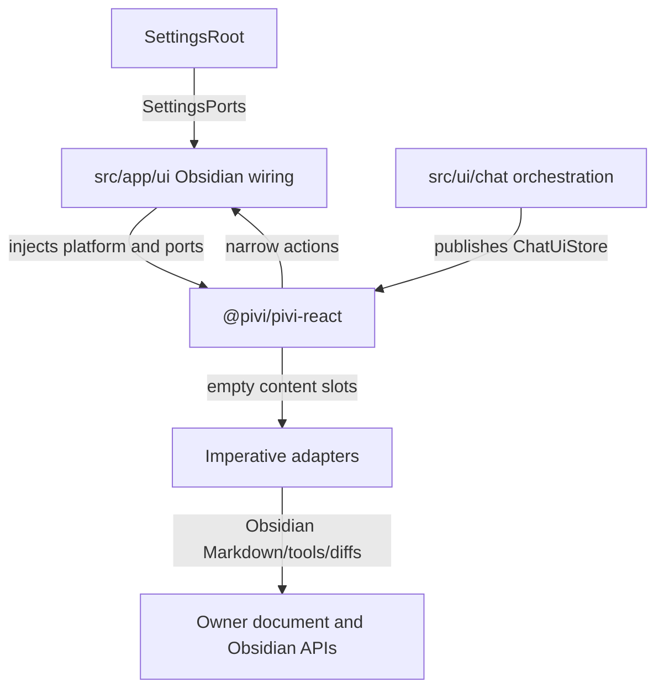
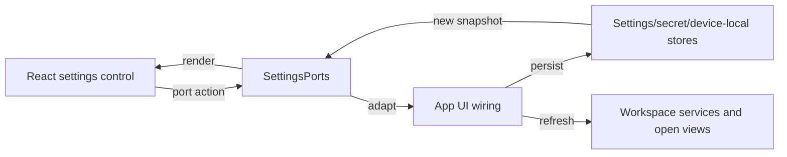

# Presentation and settings

[Back to the developer handbook](README.md)

`@pivi/pivi-react` owns Pivi's product presentation independently of Obsidian. App composition injects platform terminology, icons, tooltips, feature ports, and imperative content adapters.

## Presentation boundary

React snapshots contain data only. Runtime objects, controllers, Obsidian views, DOM elements, and mutable service aggregates remain in registries or adapter closures. `ActiveChatUiBridge` selects the active tab's store and portal elements without putting DOM into a snapshot.

Product React DOM and CSS use `pivi-*` classes. Host appearance enters through `--pivi-host-*` tokens. Do not copy Obsidian-private setting, modal, checkbox, theme, or icon class names into the package.

## Imperative adapter slots

React renders message ordering, roles, headers, collapsible shells, status, and empty containers. App/chat adapters fill only the surfaces that require host ownership:

- Obsidian Markdown rendering;
- rich tool, ask-user, diff, write/edit, and stored subagent content;
- uncontrolled rich input and context chips;

Adapters must mount, update, and dispose idempotently. Asynchronous rendering uses a generation check so an old completion cannot replace a newer slot. Resolve `window` and `document` from the owning element so pop-out windows work. App-owned imperative DOM uses the owning realm's Obsidian `createEl` helpers; product code must not construct nodes through global or raw `document.createElement*` calls.

### Virtual transcript and projection boundary

`ChatUiStore` carries chrome, composer, usage, and stream status only. `ChatProjectionStore` owns the immutable message read model, stable order, per-message subscriptions, derived active top-level background runs, recent-first publication, and animation-frame coalescing. Runtime state is updated immediately; only React publication is delayed, and terminal/session lifecycle boundaries flush synchronously.

Every non-empty transcript uses `@tanstack/react-virtual`. Rows use stable message IDs, dynamic measurement, end anchoring, six-row overscan, and an 80px end threshold. The thinking indicator is the measured final item. A non-serializable `MessageViewportHandle` exposes semantic start/end/message/user navigation to app wiring; no app controller queries message DOM nodes. The scroll viewport is passed explicitly through portal targets, including pop-out owner realms. Subagent cards and the usage ring remain presentation-owned surfaces over this projection boundary.

Narrative Markdown keeps Obsidian's rendered semantics, host typography, colors, markers, list-item geometry, and inline indentation while Pivi controls transitions between top-level content blocks. Ordinary paragraph/list/code/table/callout transitions use content flow, and headings receive section separation before them while staying attached to the content that follows. Text-to-tool and tool-to-text transitions use the same semantic content-flow token, while consecutive tool rows retain their denser execution rhythm.

## Settings data flow

`SettingsRoot` consumes package-owned `SettingsPorts` implemented by `src/app/ui/createUiPorts.ts` and focused settings-port modules. React does not import app settings types or engine facades.

`PiviSettingTabHost` supports both Obsidian settings generations. Obsidian 1.13 renders the existing React surface through one custom `getSettingDefinitions()` item whose localized aliases come synchronously from `@pivi/pivi-react`; locale changes call `update()` so the settings search index is rebuilt. Obsidian 1.12 continues through `display()`. Both paths share one generation-guarded mount and cleanup implementation.

Settings use the correct store for each data class:

- synchronized vault settings for portable non-secret configuration;
- Obsidian `secretStorage` for provider credentials, custom provider header secrets, web provider API keys, environment secret values (`pivi-env-*`), MCP header/env secret values (`pivi-mcp-v-*`), and MCP OAuth `AuthEntry` payloads;
- vault-scoped device-local storage for absolute external roots/overlays, the provider registry (`pivi.providers.v1`), and the structured environment registry (`pivi.environment.v1`);
- vault files such as `.pivi/mcp.json` and `.pivi/commands/` for explicit workspace configuration.

Environment settings use source-aware controls instead of free-form synced text. Each entry has a `plain`, `secret`, or `systemEnvironment` source; the UI shows the effective storage location and never echoes stored secret values after reload. Bulk import parses `KEY=value` lines into structured entries; `KEY=$NAME` becomes a system-environment reference. The General-page editor drafts freely, but durable changes—including removals—commit only through an explicit **Apply** action with review warnings for ownership-sensitive keys. Apply blocks secret-like plaintext unless the user chooses an allowed secret or system source. Recognized provider/web keys migrate into their canonical credential stores during startup migration. Settings and MCP JSON loaders preserve corrupt source bytes as `.corrupt-*` artifacts, return diagnostics, and publish through serialized atomic writes.

React-owned `ModalLayer` / `useModalLayer` provide the shared confirmation lifecycle: accessible dialog name, conservative initial focus (Cancel for destructive flows, first field for import/input), Tab containment, Escape/backdrop dismissal where safe, and trigger-focus restoration on close. Provider removal, workspace-command delete, MCP JSON import, MCP server delete, skill-folder removal, and deleted-session-file purge all use this layer.

Add-provider and similar picker rows are native `<button>` elements so keyboard and disabled semantics stay built-in. Opening the inline MCP server editor scrolls its first field into view and focuses it rather than switching to a modal editor.

Provider/model/web-search settings mutations commit device-local state first, then save the stripped synced projection. Custom provider header values must never be written through `patchCustomProvider` or synced JSON; future header editing must use a dedicated SecretStorage-first settings-port path. A synced save failure after a successful local commit retains local authority and surfaces a localized Notice through app storage wiring.

Save actions return structured feedback. App wiring converts transient results to Obsidian Notices while React retains only actionable errors beside their controls.

Hot refresh is capability-specific. Tool changes refresh registries/prompts; MCP changes invalidate catalogs and reload bridges; provider/model changes update catalog/readiness and open tabs; tab-bar placement republishes presentation state; external-root changes broadcast device-local state.

Model provider identity is also the credential identity. The Add provider picker orders Local, OAuth, API, then Custom API. OAuth always shows OpenAI Codex, Grok Build, and Claude; entries already configured remain visible with an Added state. `xai/*` and `anthropic/*` are API-key providers, while Grok Build and Claude use the independent `grok-build/*` and `claude/*` model namespaces with OAuth-only credentials. Grok Build mirrors pi-ai's upstream xAI model list under the `grok-build/*` namespace without adding local Composer or fallback entries, then routes those models through the subscription Responses proxy with the selected-model override. Claude reuses Anthropic's model catalog and transport while keeping Claude Pro/Max OAuth credentials separate from Anthropic API keys. Disable, remove, test, readiness, and fallback behavior stay within each namespace; changing whether an interactive OAuth provider is enabled reruns credential preflight before its badge settles. Settings-load migration moves legacy backing-slot OAuth and unambiguous selected model keys into the matching product namespace without overwriting an existing credential; when both identities already exist, backing selections stay unchanged and matching subscription aliases are added instead. Legacy xAI selections retain their model id under the new provider namespace. Local Ollama, LM Studio, and llama.cpp endpoint cards place their optional API key directly below Base URL and omit a separate authentication section.

Pi-ai 0.81.1 still does not provide a first-class `grok-build` provider: its `xaiProvider()` transport targets the API-key `api.x.ai` surface. Pivi therefore retains the separate provider/transport adapter while deliberately treating `xaiProvider()` as the single model-list source until upstream owns Grok Build directly. Prefer a future pi-ai implementation only when it preserves the separate `grok-build/*` identity and OAuth credential slot, subscription proxy headers and payload normalization, and Pivi's provider-isolation and request-contract tests.

Compaction has no user-facing settings. Its automatic trigger, reserves, prefire point, and 95/5 split are fixed runtime policy; `/compact [instructions]` remains the explicit manual control. The send-shortcut toggle is read from the composer owner's window at keydown time so the shortcut still runs when the host keymap stops propagation above the input. It applies only while that composer's contenteditable owns focus: when enabled, plain Enter inserts a newline and either Command+Enter or Ctrl+Enter sends; when disabled, plain Enter sends. Shift/Alt combinations and IME composition remain editing input rather than send actions.

Subagent settings control execution and concurrency only. Composer chrome does not display active subagents; each delegated task remains visible on its own transcript card.

The Toolbar settings tab (last in the settings tablist) owns `editorSelectionToolbar.enabled` plus the synced shortcut registry of Obsidian command IDs and Pivi Commands (workspace slash commands from Settings → Commands). Pivi automatically yields whenever Note Toolbar's configured selected-text toolbar is active; settings show that detected status rather than exposing a provider selector. Host command and icon catalogs cross the React boundary through `SettingsEditorToolbarPort.listHostCommands()`, `listPiviCommands()`, and `listIconNames()`. Every shortcut displays its persisted icon; Obsidian shortcuts can choose another icon through the same searchable picker used by Commands settings, while Pivi Command shortcuts inherit their workspace-command catalog icon. Toolbar shortcuts and Commands-tab workspace commands both support pointer/keyboard drag reordering through the shared sortable-list interaction: toolbar order rewrites the persisted `editorSelectionToolbar.shortcuts` array directly, while command order persists as the `workspaceCommandOrder` id list in synced settings and ranks catalog entries ahead of undiscovered-order remainders. Style Settings remains a General-tab-only open action.

## Localization

All product copy, accessibility labels, settings descriptions, Notices, placeholders, commands, and tool display labels use the shared translator. `packages/pivi-react/src/i18n/locales/en.json` is canonical. Every locale must mirror its keys and interpolation placeholders in the same commit.

React uses `useT()` under `I18nProvider`; imperative app/UI code uses the app translator. Host-neutral React text uses injected terms such as host, workspace, and secure storage rather than hard-coding Obsidian-specific vocabulary.

## Styling and icons

CSS is organized by responsibility under `packages/pivi-react/styles/` and concatenated in manifest order. `npm run build:css` validates the graph and rejects `!important`. Add a stylesheet to the owning layer and manifest rather than importing CSS ad hoc from components.

Icons cross the presentation platform as product descriptors or SVG data. React does not call Obsidian icon APIs directly. Tooltips are attached through the injected platform and must be cleaned up with their owner surface.

Respect reduced motion, keyboard focus, semantic roles, and owner-window timers. Animation timing must not become a runtime state transition; actions happen through the narrow callbacks after any presentation-only exit phase.

Semantic themed colors derive from `--pivi-host-*` tokens or `color-mix()` from them; legacy product color literals are guarded by `tests/unit/scripts/themeTokens.test.ts`. In-scope compact icon actions (message actions, tab switcher actions, send control) keep their hit box snug to the glyph (compact 16–20px sizing) and do not enlarge it to 32×32/44×44; hover and focus emphasis stays icon-sized rather than a large background or outline block. Settings controls expose programmatic names and descriptions; multi-control rows do not require wrapping `<label>` elements when that would create nested-label ambiguity.

## Change checklist

- Keep React inputs serializable and host-neutral.
- Keep imperative DOM ownership explicit and isolated; create nodes with owner-realm Obsidian helpers.
- Implement presentation ports only in `src/app/ui`.
- Update every locale for user-visible text.
- Validate manifest ordering and zero `!important` for CSS.
- Test keyboard, accessibility, reduced motion, and pop-out owner realm for interactive changes.
- Keep the 1.13 setting definition and the 1.12 `display()` fallback on the shared mount/dispose path.
