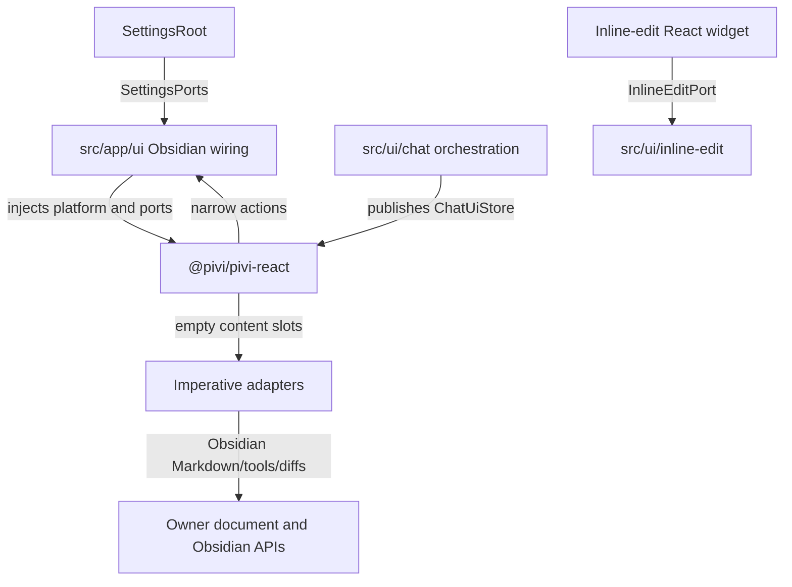
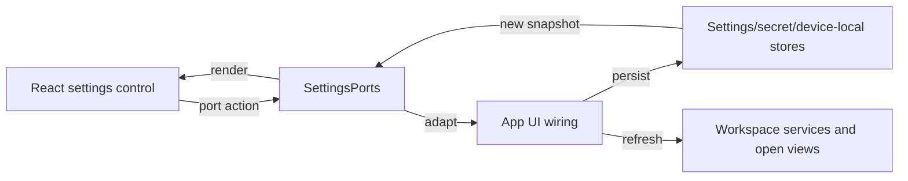
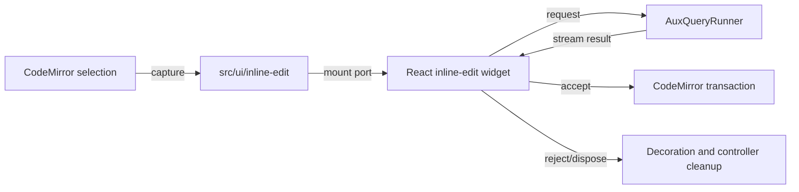

# Presentation, settings, and inline edit

[Back to the developer handbook](README.md)

`@pivi/pivi-react` owns Pivi's product presentation independently of Obsidian. App composition injects platform terminology, icons, tooltips, feature ports, and imperative content adapters.

## Presentation boundary

React snapshots contain data only. Runtime objects, controllers, Obsidian views, DOM elements, and mutable service aggregates remain in registries or adapter closures. `ActiveChatUiBridge` selects the active tab's store and portal elements without putting DOM into a snapshot.

Product React DOM and CSS use `pivi-*` classes. Host appearance enters through `--pivi-host-*` tokens. Do not copy Obsidian-private setting, modal, checkbox, theme, or icon class names into the package.

## Imperative adapter slots

React renders message ordering, roles, headers, collapsible shells, status, and empty containers. App/chat adapters fill only the surfaces that require host ownership:

- Obsidian Markdown rendering;
- rich tool, ask-user, diff, write/edit, and stored subagent content;
- uncontrolled rich input and context chips;
- CodeMirror inline-edit widget hosting.

Adapters must mount, update, and dispose idempotently. Asynchronous rendering uses a generation check so an old completion cannot replace a newer slot. Resolve `window` and `document` from the owning element so pop-out windows work.

### Virtual transcript and projection boundary

`ChatUiStore` carries chrome, composer, usage, and stream status only. `ChatProjectionStore` owns the immutable message read model, stable order, per-message subscriptions, derived active top-level background runs, recent-first publication, and animation-frame coalescing. Runtime state is updated immediately; only React publication is delayed, and terminal/session lifecycle boundaries flush synchronously.

Every non-empty transcript uses `@tanstack/react-virtual`. Rows use stable message IDs, dynamic measurement, end anchoring, six-row overscan, and an 80px end threshold. The thinking indicator is the measured final item. A non-serializable `MessageViewportHandle` exposes semantic start/end/message/user navigation to app wiring; no app controller queries message DOM nodes. The scroll viewport is passed explicitly through portal targets, including pop-out owner realms. The current visual styling, Subagent cards, and usage ring are unchanged.

## Settings data flow

`SettingsRoot` consumes package-owned `SettingsPorts` implemented by `src/app/ui/createUiPorts.ts` and focused settings-port modules. React does not import app settings types or engine facades.

Settings use the correct store for each data class:

- synchronized vault settings for portable non-secret configuration;
- Obsidian `secretStorage` for provider credentials;
- vault-scoped device-local storage for absolute external roots and overlays;
- vault files such as `.pivi/mcp.json` and `.pivi/commands/` for explicit workspace configuration.

Save actions return structured feedback. App wiring converts transient results to Obsidian Notices while React retains only actionable errors beside their controls.

Hot refresh is capability-specific. Tool changes refresh registries/prompts; MCP changes invalidate catalogs and reload bridges; provider/model changes update catalog/readiness and open tabs; tab-bar placement republishes presentation state; external-root changes broadcast device-local state.

Model provider identity is also the credential identity. The Add provider picker orders Local, OAuth, API, then Custom API. OAuth always shows OpenAI Codex, Grok Build, and Claude; entries already configured remain visible with an Added state. `xai/*` and `anthropic/*` are API-key providers, while Grok Build and Claude use the independent `grok-build/*` and `claude/*` model namespaces with OAuth-only credentials. Grok Build owns its coding-agent catalog, including `grok-composer-2.5-fast`, and sends Responses requests to the subscription inference proxy with the selected model override; it does not mirror or dispatch through the xAI API-key catalog. Claude reuses Anthropic's model catalog and transport while keeping Claude Pro/Max OAuth credentials separate from Anthropic API keys. Disable, remove, test, readiness, and fallback behavior stay within each namespace. Settings-load migration moves legacy backing-slot OAuth and unambiguous selected model keys into the matching product namespace without overwriting an existing credential; when both identities already exist, backing selections stay unchanged and matching subscription aliases are added instead. Legacy xAI selections move to Composer 2.5 because xAI API model ids are not valid Grok Build catalog entries. Local Ollama, LM Studio, and llama.cpp endpoint cards place their optional API key directly below Base URL and omit a separate authentication section.

General settings expose the current compaction threshold as a percentage beside its range control. The send-shortcut toggle is read from the composer owner's window at keydown time so the shortcut still runs when the host keymap stops propagation above the input. It applies only while that composer's contenteditable owns focus: when enabled, plain Enter inserts a newline and either Command+Enter or Ctrl+Enter sends; when disabled, plain Enter sends. Shift/Alt combinations and IME composition remain editing input rather than send actions.

Subagent settings control execution and concurrency only. Composer chrome does not display active subagents; each delegated task remains visible on its own transcript card.

## Localization

All product copy, accessibility labels, settings descriptions, Notices, placeholders, commands, and tool display labels use the shared translator. `packages/pivi-react/src/i18n/locales/en.json` is canonical. Every locale must mirror its keys and interpolation placeholders in the same commit.

React uses `useT()` under `I18nProvider`; imperative app/UI code uses the app translator. Host-neutral React text uses injected terms such as host, workspace, and secure storage rather than hard-coding Obsidian-specific vocabulary.

## Styling and icons

CSS is organized by responsibility under `packages/pivi-react/styles/` and concatenated in manifest order. `npm run build:css` validates the graph and rejects `!important`. Add a stylesheet to the owning layer and manifest rather than importing CSS ad hoc from components.

Icons cross the presentation platform as product descriptors or SVG data. React does not call Obsidian icon APIs directly. Tooltips are attached through the injected platform and must be cleaned up with their owner surface.

Respect reduced motion, keyboard focus, semantic roles, and owner-window timers. Animation timing must not become a runtime state transition; actions happen through the narrow callbacks after any presentation-only exit phase.

## Inline edit

Inline edit is an auxiliary query, not a chat session. The Obsidian editor command captures the selected CodeMirror range, mounts the React-owned widget through the app-side editor bridge, and calls an injected `AuxQueryRunner`.

The flow has one active controller. Starting another edit rejects or cleans the previous controller. Accept applies the chosen replacement through the editor; reject restores/cleans decorations without adding a durable session or conversation history. IME and editor ownership rules must be preserved.

## Change checklist

- Keep React inputs serializable and host-neutral.
- Keep imperative DOM ownership explicit and isolated.
- Implement presentation ports only in `src/app/ui`.
- Update every locale for user-visible text.
- Validate manifest ordering and zero `!important` for CSS.
- Test keyboard, accessibility, reduced motion, and pop-out owner realm for interactive changes.
- Keep inline edit on `AuxQueryRunner`; do not create a chat session for it.
