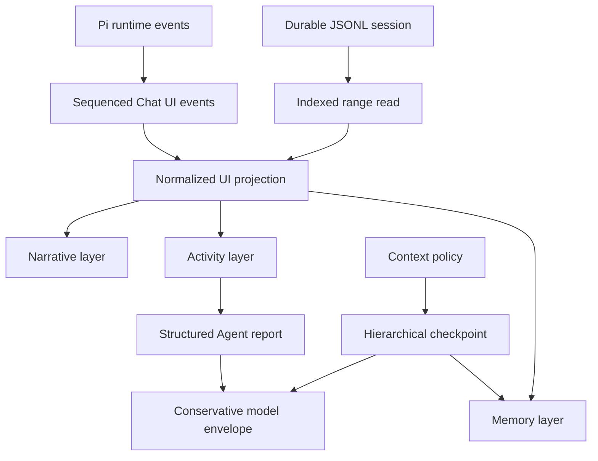

# Chat UI evolution

[Back to the developer handbook](README.md)

This document records the accepted direction after the first virtualized Chat UI performance pass. It is an architectural and product-design guide, not a release commitment. Concrete implementation work should still be split into measured, independently reviewable changes.

The current visual design remains the baseline until the Activity and Memory layers are implemented deliberately. Performance work must not gradually introduce one-off cards, status colors, nested scroll containers, or competing context indicators.

## Goals

- Keep transcript cost bounded as durable sessions grow.
- Let one text block, tool, or Agent run update without invalidating an entire message row.
- Preserve a complete UI execution trace while giving the parent model compact, structured results.
- Make delegated work and context compaction understandable without turning the transcript into a debugger console.
- Establish one visual language for narrative, active work, and memory boundaries.
- Measure performance in real Obsidian windows before claiming numerical improvements.

## Explicit non-goals

- Do not add transcript search as compensation for virtualization.
- Do not integrate provider-specific tokenizers. Context accounting may remain estimated and conservative.
- Do not enable TanStack Virtual `directDomUpdates` without a separate measured investigation.
- Do not migrate to React Virtuoso, Streamdown, assistant-ui, AI SDK, AG-UI, LangGraph, `remend`, or another Chat UI/Markdown framework.
- Do not replace Pi runtime, Obsidian Markdown fidelity, or the Pi-compatible JSONL session format.

## Evolution map



## Data and performance direction

### Indexed JSONL range reads

The current session path reads and maps the complete JSONL file before React publishes its recent 100-message projection. The next storage step is true recent-first hydration.

The session layer should maintain enough index information to:

- read the latest bounded entry range without parsing the complete file;
- prepend older ranges by stable entry/message ID;
- invalidate or rebuild the index after external modification;
- update the index after append, truncate, fork, and compaction;
- preserve complete save, redo, fork, and model-context behavior even when only part of the UI transcript is hydrated;
- fail explicitly when indexed offsets no longer match the session file.

The index is an optimization over JSONL, not a second durable source of truth. A safe rebuild from the session file must always remain possible.

### Block, tool, and Agent subscriptions

`ChatProjectionStore` already exposes message, block, tool, and Agent-run entities. React should progressively adopt the narrower subscriptions where profiling justifies them:

```text
MessageRow        message shell and ordering metadata
TextBlock         one block ID
ToolView          one tool ID
AgentActivity     one Agent run ID
```

A block update may remeasure its virtual row, but it should not rerender sibling blocks, tools, other messages, or unrelated Agent runs. The durable `ChatMessage` remains the persistence format; normalized entities are a UI read model.

### Sequenced UI event protocol

The local `ChatUiEvent` union should grow into one explicit event plane before remote runtimes or cross-process execution are considered. Events should carry stable ownership and ordering metadata:

```text
sessionFile
openSessionId
runId
parentRunId
messageId
blockId / toolId / agentId
sequence
timestamp
```

Text remains append-delta based. Tool and Agent state use typed upserts or patches. Terminal, save, switch, truncate, and dispose boundaries synchronously flush the projection. The protocol should define duplicate, late, missing-owner, and out-of-order behavior before it becomes persistent or transport-facing.

Do not create a second durable event log while JSONL remains sufficient. Persistence or AG-UI mapping requires a separate decision.

### Visibility-aware projection cadence

Visible windows continue to publish at most once per animation frame. A hidden document or inactive surface may use a slower cadence to reduce background CPU, provided that:

- durable state still updates immediately;
- terminal and error events flush immediately;
- save, switch, close, and unload flush synchronously;
- returning to visibility publishes one complete current projection;
- background Subagent completion and attention state are not lost.

This policy should be enabled only with owner-window visibility tests covering main windows and pop-outs.

### Markdown segment cache

Virtual-row unmount currently disposes every Obsidian `Component` scope, so returning to an old row rerenders its Markdown. A future cache may retain immutable segment metadata or safe render inputs, but must not retain live DOM or loaded Obsidian components.

Any cache design must account for:

- source-path and wikilink resolution;
- theme and host plugin changes;
- Markdown postprocessor lifecycle;
- Mermaid, math, task lists, and code enhancement;
- bounded memory and explicit eviction;
- stale async render completion.

Prefer a bounded LRU of sealed segment descriptors or verified inert output over cached live nodes. Implement it only after traces show repeat rendering during navigation is material.

### Performance observability

Deterministic tests continue to enforce commit and mount invariants. Real Obsidian profiling should additionally record:

- runtime event to projection commit and paint;
- commits per frame and per second;
- mounted virtual rows and DOM nodes;
- Markdown render count and duration;
- long tasks;
- heap growth after repeated stream, prepend, and navigation cycles;
- scroll-anchor drift;
- cold session-open and older-page load latency;
- main-window and pop-out behavior.

Use fixed scenarios for 1K/5K messages, 100KB Markdown, 20 Agent runs, scrolling away from the end, late background events, repeated prepend, and session switching. Record environment, Obsidian/Pivi version, window type, and scenario shape with every numerical result. Performance claims require before/after measurements.

## Agent execution model

### First-class Agent runs

Subagent execution should evolve into an independent `AgentRun` projection rather than remaining meaningful only as fields nested inside one tool call. An Agent run needs stable ownership, parent/child relationships, status, current activity, tool references, timing, usage, and terminal result references.

The durable session must continue to retain the complete visible trace:

- delegated objective and prompt;
- tool activity;
- partial output needed for recovery;
- terminal output;
- timing and usage;
- cancellation, failure, and orphan state.

### Structured parent report

The parent model should consume a compact report instead of the complete UI trace when the runtime can produce one reliably. The target shape includes:

```text
objective
outcome
summary
findings
decisions
artifacts
open questions
```

The schema must tolerate partial and failed runs. Until structured output is validated across supported models, terminal text remains the compatibility path. UI trace persistence and parent-model context are separate concerns.

## Context and memory direction

### Conservative context envelope

Provider usage remains authoritative when present. Otherwise, Pivi may estimate system instructions, recent turns, selected context, tools, Agent reports, checkpoints, and reserved output using the existing content-aware estimator.

The estimate does not need tokenizer-level precision. It must instead reserve enough headroom that compaction happens before the provider limit:

```text
usable input
= context window
- reserved output
- compaction reserve
- safety margin
```

The compaction reserve should be conservative and model-independent by default. The UI must label estimated values as estimates and avoid presenting false precision.

### Hierarchical checkpoints

A future checkpoint should preserve more than one narrative summary. The durable model should distinguish:

- a concise continuation summary;
- the current goal and constraints;
- durable decisions;
- artifact references;
- open work and unresolved questions;
- concrete next steps;
- source entry bounds and token estimates;
- checkpoint schema version.

The active model envelope then combines recent raw turns, the latest applicable checkpoint chain, and the durable ledger. Checkpoint creation and merge rules must preserve compatibility with existing Pi compaction entries and old session files.

## Visual language

Chat UI uses three semantic layers. They share typography, spacing, icons, and host theme tokens, but they must remain visually distinguishable by structure and density rather than by adding more card borders.

### Narrative layer

Narrative is the primary reading surface:

- user messages;
- main Agent responses;
- terminal Subagent conclusions promoted into the answer;
- content the user is expected to read linearly.

Narrative remains quiet and document-like. It uses the host UI/body fonts, current message rhythm, and Obsidian Markdown fidelity. Tools and execution logs must not compete with the answer for visual weight.

### Activity layer

Activity represents work in progress or inspectable execution:

- tools;
- Agent runs;
- nested delegated work;
- queue, waiting, cancellation, failure, and orphan state.

The collapsed primitive is an Activity row/capsule, not a full nested card:

```text
◉ Researcher   Searching sources                         0:18
```

Multiple related Agent runs form an Agent Group:

```text
3 agents   2 complete   1 running
```

Expansion reveals a linear timeline using indentation and connectors:

```text
Researcher
  Search web
  Read source
  Extract findings
  Produce report
```

The transcript remains the only primary scroll container. Expanded Activity content should grow within its measured virtual row or open in an inspector; it should not create an independently scrolling card inside the transcript.

An optional Active Work Shelf may appear near the composer when background work needs persistent visibility. It mirrors running state only; the canonical trace remains attached to its transcript owner. Selecting shelf activity navigates to the owner or opens the same inspector.

### Memory layer

Memory represents model-context boundaries, not messages:

- context checkpoints;
- compaction;
- session recovery;
- older-history paging boundaries;
- estimated context composition.

Memory uses a low-contrast divider/chip treatment rather than user or assistant message chrome:

```text
Earlier context compacted   ~86K → ~9K   View checkpoint
```

Estimated values use an approximation marker. The boundary remains visible but subordinate to narrative. Expanding it may show the checkpoint summary, ledger, source range, and context estimate without inserting a fake assistant message.

### Context Inspector

The existing usage ring remains the compact entry point. Its expanded inspector may show estimated categories:

```text
System                         ~8K
Recent conversation           ~31K
Selected context              ~19K
Tool and Agent results         ~8K
Checkpoints                    ~6K
Reserved output                16K
Compaction reserve             12K
Safety margin                   8K
```

Exact categories may follow the context assembler, but the display should stay small and understandable. Values are estimates unless provider usage supplies an authoritative total. The purpose is to explain pressure and reserved space, not to emulate a tokenizer debugger.

### Status semantics

Status must be communicated by icon, text, and color together:

| State | Base visual behavior |
|---|---|
| Queued | Hollow dot; no continuous animation |
| Running | Animated arc or progress mark |
| Waiting | Pause/wait symbol and explicit label |
| Completed | Check mark |
| Failed | Error mark and readable failure label |
| Cancelled | Stop mark |
| Orphaned | Disconnected mark and recovery explanation |

Only running work uses continuous motion. Respect `prefers-reduced-motion`. `aria-live` announces meaningful phase changes and terminal state, never token updates. Monospace is reserved for tool identifiers, IDs, paths, commands, and structured parameters; Agent names, summaries, and narrative results use the host UI font.

## Recommended sequence

1. Add real-app performance traces and budgets before the next optimization wave.
2. Design indexed JSONL range reads and partial durable hydration.
3. Move the hottest message interiors to block/tool/Agent subscriptions.
4. Stabilize sequenced UI event ownership and visibility-aware cadence.
5. Define hierarchical checkpoint and structured Agent-report schemas with compatibility tests.
6. Prototype Narrative / Activity / Memory components without changing persistence.
7. Add Checkpoint presentation and the estimate-based Context Inspector.
8. Introduce Agent Group, timeline/inspector, and optional Active Work Shelf after interaction testing.
9. Evaluate a bounded Markdown segment cache only if traces justify it.

Each stage must preserve queued/running abort, late events, orphaning, hydrate retry, session switching, pop-out owner realms, virtual scroll anchoring, Obsidian Markdown cleanup, and the existing JSONL compatibility tests.
