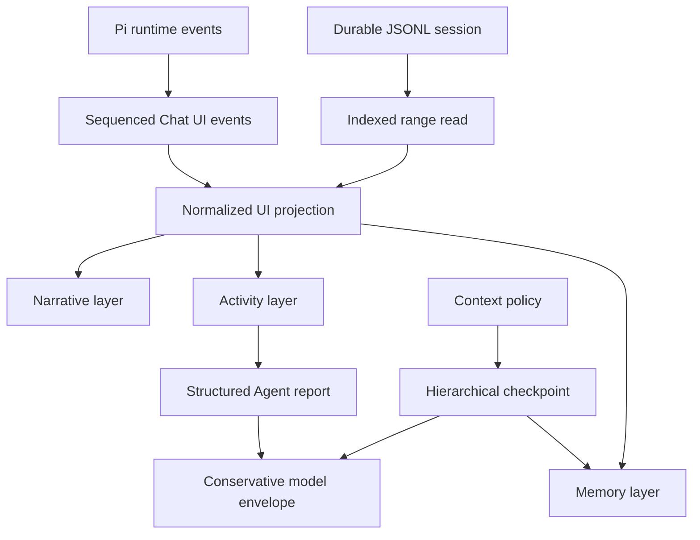

# Chat UI evolution

[Back to the developer handbook](README.md)

This document records the accepted direction after the first virtualized Chat UI performance pass. It is an architectural and product-design guide, not a release commitment. Concrete implementation work should still be split into measured, independently reviewable changes.

The current visual design remains the baseline until the Activity and Memory layers are implemented deliberately. Performance work must not gradually introduce one-off cards, status colors, nested scroll containers, or competing context indicators.

## Goals

- Keep transcript cost bounded as durable sessions grow.
- Let one text block, tool, or Agent run update without invalidating an entire message row.
- Preserve a complete UI execution trace while giving the parent model compact, structured results.
- Make delegated work and context compaction understandable without turning the transcript into a debugger console.
- Establish one visual language for narrative, active work, and memory boundaries.
- Measure performance in real Obsidian windows before claiming numerical improvements.

## Explicit non-goals

- Do not add transcript search as compensation for virtualization.
- Do not integrate provider-specific tokenizers. Context accounting may remain estimated and conservative.
- Do not enable TanStack Virtual `directDomUpdates` without a separate measured investigation.
- Do not migrate to React Virtuoso, Streamdown, assistant-ui, AI SDK, AG-UI, LangGraph, `remend`, or another Chat UI/Markdown framework.
- Do not replace Pi runtime, Obsidian Markdown fidelity, or the Pi-compatible JSONL session format.

## Evolution map



## Data and performance direction

### Indexed JSONL range reads

The session UI path now performs true recent-first hydration. Cold open reads indexed identity, summary, usage, UI context, and the latest 100 projected messages; reaching the top requests an older page by stable message ID. The Pi runtime continues to assemble complete model context from authoritative JSONL, so UI paging never truncates provider context.

Session writes now use Pi 0.80.6's typed append methods after a single eager header bootstrap. Prior JSONL bytes therefore remain stable during normal message, Pivi metadata, UI context, and compaction appends. Full rewrites are reserved for non-append mutations such as redo truncation and upstream format migration; those operations are index-invalidation boundaries.

Each indexed session uses a rebuildable `<session>.jsonl.pivi-index` JSONL sidecar. It stores UTF-8 byte offsets, projection-relevant metadata such as `message_ui.targetEntryId`, and per-line SHA-256 values, plus append checkpoints containing file identity, nanosecond timestamps, size, bounded head/tail hashes, one-time migration state, and a checksum chain over every index line. Normal session appends extend both files; rewrite boundaries delete the sidecar so the next indexed read rebuilds it atomically from the authoritative session JSONL. Read-only consumers discard a stale/corrupt optimization and rebuild before returning data. Every cached live mutation instead validates its held source fingerprint before touching Pi state, and append postflight requires the exact expected entry IDs; held-write mismatches remain typed failures and are never hidden by a post-write automatic rebuild.

The external-context privacy migration uses the sidecar's one-time marker. A completed marker skips session-body reads on startup and lazy open. A stale/corrupt pre-existing sidecar is discarded as an optimization before the authoritative JSONL is inspected. A legacy marker validates the held source after reading, writes device-local paths before rewriting JSONL, invalidates offsets before the rewrite, and rebuilds the marker from the sanitized authoritative file. Concurrent opens share one migration attempt; source changes during migration plus cache-write, JSONL-write, and rebuild failures remain explicit.

The session layer maintains enough index information to:

- read the latest bounded entry range without parsing the complete file;
- prepend older ranges by stable entry/message ID;
- invalidate or rebuild the index after external modification;
- update the index after append, truncate, fork, and compaction;
- preserve complete save, redo, fork, and model-context behavior even when only part of the UI transcript is hydrated;
- fail explicitly when indexed offsets no longer match the session file.

The index is an optimization over JSONL, not a second durable source of truth. A safe rebuild from the session file must always remain possible.

### Block, tool, and Agent subscriptions

`ChatProjectionStore` exposes reconciled message-structure, block, tool, and Agent-run entities. The virtualized transcript uses the narrow subscriptions for its hottest interiors:

```text
MessageRow        message shell and ordering metadata
TextBlock         one block ID
ToolView          one tool ID
AgentActivity     one Agent run ID
```

A block update may remeasure its virtual row, but it should not rerender sibling blocks, tools, other messages, or unrelated Agent runs. The durable `ChatMessage` remains the persistence format; normalized entities are a UI read model.

One sequenced in-memory event plane now wraps whole-message publication. The store reconciles keyed entities, preserves unchanged snapshot identities, publishes only changed entities, and notifies removals. Projected rows subscribe to stable structure metadata; copy actions resolve the current full message only when invoked. Markdown, tool, and stored-subagent adapters mount once for a stable entity generation and receive subsequent snapshots through `update`.

### Sequenced UI event protocol

`ChatState` is the producer for one explicit projection event plane. Every event carries stable ownership and ordering metadata:

```text
projectionScopeId
sessionFile (nullable before lazy binding)
openSessionId (nullable before lazy binding)
runId
parentRunId
messageId
blockId / toolId / agentId
sequence
timestamp
```

Text carries its append delta; tool and Agent changes carry typed upserts. Each accepted change snapshots the authoritative post-effect message immediately so later rejected mutations cannot leak through a shared durable reference. Background Agent chunks serialize per tab before sequencing and retain the parent run captured when that Agent is registered, even if completion arrives during a later turn. Page reveal/prepend operations use the same event boundary. The store drops duplicate, out-of-order, missing-owner, and late-after-terminal events with content-free protocol diagnostics. Main and child runs seal only after their final mutation. Error, cancel, tab/session switch, save, truncate, close, and dispose boundaries synchronously flush without prematurely sealing a run; disposal invalidates queued/in-flight background publication.

Do not create a second durable event log while JSONL remains sufficient. Persistence or AG-UI mapping requires a separate decision.

### Visibility-aware projection cadence

Active visible surfaces publish at most once per owner-window animation frame. Hidden documents and inactive surfaces publish on a 250 ms timer from the last mounted owner-window realm. `ActiveChatUiBridge` changes surface activity; the projection store listens to that realm's visibility state, cancels old-realm work during main/pop-out migration, and publishes one complete pending projection immediately when visibility/activity returns.

- durable state still updates immediately;
- terminal and error events flush immediately;
- save, switch, close, and unload flush synchronously;
- returning to visibility publishes one complete current projection;
- background Subagent completion and attention state are not lost.

Owner-realm tests cover active, inactive, hidden, visibility return, terminal flush, and main-to-pop-out migration. Real-Obsidian traces use only disposable unbound tabs and a disposable floating leaf.

### Markdown segment cache

Virtual-row unmount currently disposes every Obsidian `Component` scope, so returning to an old row rerenders its Markdown. A future cache may retain immutable segment metadata or safe render inputs, but must not retain live DOM or loaded Obsidian components.

Any cache design must account for:

- source-path and wikilink resolution;
- theme and host plugin changes;
- Markdown postprocessor lifecycle;
- Mermaid, math, task lists, and code enhancement;
- bounded memory and explicit eviction;
- stale async render completion.

Prefer a bounded LRU of sealed segment descriptors or verified inert output over cached live nodes. Implement it only after traces show repeat rendering during navigation is material.

### Performance observability

Deterministic tests continue to enforce commit and mount invariants. Real Obsidian profiling should additionally record:

- runtime event to projection commit and paint;
- commits per frame and per second;
- mounted virtual rows and DOM nodes;
- Markdown render count and duration;
- long tasks;
- heap growth after repeated stream, prepend, and navigation cycles;
- scroll-anchor drift;
- cold session-open and older-page load latency;
- main-window and pop-out behavior.

Use fixed scenarios for 1K/5K messages, 100KB Markdown, 20 Agent runs, scrolling away from the end, late background events, repeated prepend, and session switching. Record environment, Obsidian/Pivi version, window type, and scenario shape with every numerical result. Performance claims require before/after measurements.

#### Real-Obsidian measurement protocol

The development build exposes explicit trace lifecycle commands. Traces use schema `pivi-chat-perf-v1` and are written under `.pivi/perf-traces/`; production builds contain none of these commands or recorder wiring.

1. Generate or refresh the four fixed session files with `node scripts/generate-perf-sessions.mjs <vault>`.
2. Start the development build, run `obsidian dev:debug on`, clear captured console output, reload Pivi, and confirm `obsidian dev:errors` is clean.
3. Put one stable scenario name in `.pivi/perf-scenario.txt`. Run `Pivi: Debug: start chat performance trace`, perform exactly one scenario, optionally run the manual heap-sample command after the workload, then run `Pivi: Debug: stop and export chat performance trace`.
4. Record Obsidian and Pivi versions, the Pivi commit/worktree, window type, fixture shape, workload repetitions, trace filename, and any manual timing boundary. Do not compare full trace duration when it includes CLI or operator dwell; use event-to-commit/paint, render, row, DOM, long-task, heap, and anchor events for numerical comparisons.
5. After development-only runs, restore and deploy the production bundle with `npm run build`, reload Pivi, verify the debug command IDs/markers are absent from `main.js`, and confirm `obsidian dev:errors` is clean.

The fixed scenario shapes are:

| Scenario | Fixed action |
|---|---|
| 1K / 5K cold open | Open the corresponding generated JSONL fixture into a cold tab and wait for its first projection paint. Run 5K once in the main window and once in a pop-out. |
| Older-page load | From the 5K fixture's latest 100-message projection, scroll backward once to prepend exactly one 100-message page. |
| Repeated prepend | Repeat that prepend three times in the same 5K tab. |
| 100KB Markdown stream | Run the development command that creates a disposable unbound tab, streams exactly 102,400 bytes in 64 animation-frame chunks, performs the terminal fidelity render, then restores the original tab and removes the synthetic tab without persisting either transition. |
| 20 Agent runs | Cold-open the generated fixture containing 20 completed nested Agent records. |
| Scroll-away / late background | Scroll the 1K transcript away from the end, then run the deterministic stream while auto-follow remains disabled. |
| Session switching | Run the isolated development command: ten in-memory tabs, 100 messages each, two passes / 20 switches. The command suspends tab persistence, restores the original active tab, and removes every synthetic tab. |
| Indexed 5K cold open + older page | Run the isolated indexed-session paging command. It copies the fixed 5K fixture to a unique temporary session id, records cold open, scrolls the real virtual viewport backward to fetch one 100-message page, restores the original tab, and deletes the temporary JSONL/index while tab persistence is suspended. |

Append cost uses a filesystem-only companion benchmark so no real session is mutated: `node --import tsx scripts/benchmark-session-append.mjs <vault>`. It runs five trials of twenty user appends per mode on fresh temporary copies of the 5K fixture, comparing the former append-then-full-rewrite behavior with the indexed true-append path.

#### 2026-07-15 baseline

Environment: Obsidian 1.13.2, Pivi 0.9.0, Darwin 25.5 arm64 on Apple M2 Pro, Node 26.5.0. This is the pre-spec-002/003/004 comparison baseline. The isolated session-switch trace was captured after the ResizeObserver animation-frame correction and retained the pre-run tab-state SHA-256 exactly.

| Scenario | Window | Comparable baseline result | Trace file |
|---|---|---|---|
| 1K cold open | Main | 1 projection commit; 1,035 ms event-to-paint; max 25 rows / 541 DOM nodes; 48 Markdown renders; 4 long tasks | `2026-07-15T09-57-59-856Z-cold-open-1k-main.json` |
| 5K cold open | Main | 1 projection commit; 98 ms event-to-paint; max 25 rows / 541 DOM nodes; 48 Markdown renders; 2 long tasks | `2026-07-15T09-58-03-787Z-cold-open-5k-main.json` |
| 5K cold open | Pop-out | 1 projection commit; 91 ms event-to-paint; max 20 rows / 441 DOM nodes; 29 Markdown renders; 2 long tasks | `2026-07-15T14-20-23-474Z-cold-open-5k-popout.json` |
| 20 Agent runs | Main | 1 projection commit; max 2 virtual message rows / 758 DOM nodes; 4 Markdown renders; 1 long task | `2026-07-15T14-20-45-235Z-cold-open-20-agent-runs-main.json` |
| One older page | Main | Max 31 rows / 700 DOM nodes; 46 Markdown renders; 0 px anchor drift; no long task | `2026-07-15T14-20-49-378Z-older-page-load-5k-main.json` |
| Three prepends | Main | Max 31 rows / 704 DOM nodes; 153 Markdown renders; 0 px anchor drift; no long task | `2026-07-15T14-20-55-878Z-repeated-prepend-5k-main.json` |
| Scroll-away / late update | Main | 68 projection commits; max 19 rows / 1,435 DOM nodes; 56 Markdown renders; 1 long task | `2026-07-15T14-21-23-015Z-scroll-away-late-background-main.json` |
| 100KB Markdown stream | Main | 67 projection commits; max 2 rows / 3,463 DOM nodes; 65 Markdown renders / 402 ms total; 1 long task | `2026-07-15T14-21-26-265Z-100kb-markdown-stream-main.json` |
| Isolated session switching | Main | 10 projection commits; max 25 rows / 758 DOM nodes; 522 Markdown renders / 6,130 ms total; 12 long tasks; tab persistence unchanged | `2026-07-15T14-52-18-364Z-session-switching-main-isolated.json` |

Heap deltas remain diagnostic rather than pass/fail evidence because garbage collection can make a short trace's end sample lower than its start sample. Full heap snapshots remain a manual DevTools protocol when a later change needs retained-object evidence.

#### 2026-07-16 indexed-session result

Environment: Obsidian 1.13.2, Pivi 0.9.0 at `0356645c`, Darwin 25.5 arm64 on Apple M2 Pro, Node 26.5.0. Each UI scenario ran three times in the main window against the regenerated 5K fixture (5,002 JSONL lines / 1,800,428 bytes); the table reports medians. The isolated command left `.pivi/tab-manager-state.json` byte-identical on every run, kept the source fixture hash unchanged, and removed every temporary session/index after completion.

| Scenario | Pre-spec-002 baseline | Indexed result | Evidence |
|---|---|---|---|
| 5K cold open | 98 ms event-to-paint; 25 rows / 541 DOM; 48 Markdown renders; 2 long tasks | 82.1 ms event-to-paint; 25 rows / 542 DOM; 34 Markdown renders / 96.4 ms; 2 long tasks, longest 489 ms. The new controlled trace-start-to-paint boundary was 741.4 ms; the old operator-driven traces did not provide a comparable start boundary. | `2026-07-15T19-27-18-395Z`, `19-27-20-945Z`, `19-27-23-493Z` indexed cold-open traces |
| One older page | 31 rows / 700 DOM; 46 Markdown renders; 0 px drift; no long task | 25 rows / 518 DOM; 15 Markdown renders / 35.2 ms; 0 px drift; 1 long task, longest 55 ms | Matching `19-27-19-231Z`, `19-27-21-809Z`, `19-27-24-368Z` indexed older-page traces |
| One append on 5K | Former path rewrote the complete JSONL after Pi's append | 12.933 ms rewrite median versus 0.242 ms indexed-append median (53.457×) across five 20-append trials | `pivi-session-append-benchmark-v1`, commit `0356645c`; benchmark uses fresh temporary copies and emulates the exact removed `_rewriteFile()` step |

The cold-open comparable event-to-paint value improved by 16.2%. The controlled start-to-paint number is retained as the reproducible boundary for future storage comparisons rather than being compared to the older operator-dwell trace duration.

#### 2026-07-16 granular-subscription result

Environment: Obsidian 1.13.2, Pivi 0.9.0, Darwin 25.5 arm64. The deterministic React tests are the authoritative isolation evidence because the trace schema records projection commits and host Markdown renders, not sibling component renders. Spec 003 intentionally retains whole-message ingestion, and its 100KB fixture contains one changing Markdown block, so neither the 67 projection commits nor the 65 affected-block renders should fall in this step.

| Window | Result | Evidence |
|---|---|---|
| Main | 67 projection commits; 65 synthetic-block Markdown renders / 450.8 ms; max 2 workload rows / 3,463 DOM nodes; 1 workload long task, 256 ms; max 18.7 ms event-to-paint | `2026-07-15T20-11-05-930Z-spec-003-granular-main.json` |
| Pop-out | 67 projection commits; 65 synthetic-block Markdown renders / 431.3 ms; max 2 workload rows / 3,463 DOM nodes; 1 workload long task, 261 ms; max 69.8 ms event-to-paint | `2026-07-15T20-12-38-380Z-spec-003-granular-popout.json` |

Both traces stayed inside the 100KB workload ceilings and identified only their expected owner window. Workload row/long-task bounds select the interval from the first synthetic-message commit through the final synthetic-block render. Restoring the prior active 5K transcript afterward raised the whole-trace row maxima to 25 in main and 20 in the pop-out, added one cleanup long task per trace, and produced 41/30 unrelated Markdown renders. Isolated-workload render counts therefore select the canonical `pivi-development-markdown-stream-assistant` block ID. These bounds distinguish workload events from cleanup and are not evidence of fewer renders inside the changing block.

Deterministic tests separately prove that a text/thinking delta does not invoke a sibling Markdown adapter, a tool status patch does not rerender or remount sibling tool bodies, an Agent-run patch updates only its stored-subagent island, same-shape assistant content does not rerun row action predicates, and ResizeObserver growth remeasures only the owning virtual row.

#### 2026-07-16 hidden-cadence result

Environment: Obsidian 1.13.2, Pivi 0.9.0, Darwin 25.5 arm64. The same disposable 102,400-byte / 64-chunk workload used for the visible baseline ran with the target owner document reporting hidden. These are background-work proxies from the spec 001 recorder, not direct CPU-time measurements.

| Window | Hidden result | Visible comparison | Evidence |
|---|---|---|---|
| Main | 5 synthetic projection commits (2 hidden-timer, 2 immediate, 1 explicit flush); 4 Markdown renders; 0 long tasks | 67 commits; 65 renders; 1 workload long task | `2026-07-15T21-04-31-847Z-spec-004-hidden-main.json` |
| Pop-out | 5 synthetic projection commits (2 hidden-timer, 2 immediate, 1 explicit flush); 4 Markdown renders; 0 long tasks | 67 commits; 65 renders; 1 workload long task | `2026-07-15T21-07-08-263Z-spec-004-hidden-popout.json` |

Both traces identify only the expected owner window and finish with a complete terminal projection. The development harness restored the prior active tab, removed the synthetic tab and disposable pop-out, and left no synthetic DOM markers. A failed CLI-routing attempt was discarded because its trace identified `main` instead of `pop-out`; the accepted pop-out run addresses the floating leaf directly.

#### Regression budgets

Use the same fixed scenario, window type, hardware, and development build for before/after comparisons. Run each real-Obsidian scenario three times and compare the median of each recorded maximum/count against these ceilings; scroll-anchor drift and persistence integrity must pass on every run. Deterministic Jest gates fail immediately.

| Scenario | Real-Obsidian ceiling |
|---|---|
| 1K / 5K cold open, including pop-out | Event-to-paint ≤ 1,200 ms; ≤ 30 mounted rows; ≤ 1,000 DOM nodes; ≤ 5 long tasks; longest task ≤ 750 ms. |
| 20 Agent runs | ≤ 5 mounted rows; ≤ 1,000 DOM nodes; ≤ 6 Markdown renders; ≤ 3 long tasks. |
| One page / three prepends | ≤ 35 mounted rows; ≤ 800 DOM nodes; absolute anchor drift ≤ 1 px on every prepend; ≤ 1 long task. |
| Scroll-away / late update | ≤ 70 projection commits; ≤ 25 mounted rows; ≤ 1,600 DOM nodes; ≤ 3 long tasks; auto-follow must remain disabled. |
| 100KB Markdown stream | ≤ 70 projection commits and ≤ 70 commits/second; ≤ 5 mounted rows; ≤ 4,000 DOM nodes; ≤ 70 Markdown renders; ≤ 3 long tasks; longest task ≤ 300 ms. |
| Isolated session switching | ≤ 30 mounted rows; ≤ 1,000 DOM nodes; ≤ 600 Markdown renders; ≤ 15 long tasks; longest task ≤ 750 ms; zero synthetic tabs afterward; tab-state bytes unchanged. |

The deterministic subset is enforced in Jest:

- hundreds of same-entity updates schedule one projection commit for one animation frame;
- a 5K session initially projects exactly the latest 100 messages and prepends 100-message pages;
- the 5K jsdom viewport mounts at most 20 message rows;
- the deterministic 102,400-byte / 64-chunk stream completes in at most 67 projection commits, including setup and restoration;
- the isolated switch workload creates exactly 10 in-memory tabs, performs 20 switches, removes them all, and suppresses both debounced and immediate persistence.

These are regression ceilings, not performance claims. A later optimization must retain the raw trace, report the same scenario shape, and show before/after evidence rather than merely staying under budget.

## Agent execution model

### First-class Agent runs

Subagent execution should evolve into an independent `AgentRun` projection rather than remaining meaningful only as fields nested inside one tool call. An Agent run needs stable ownership, parent/child relationships, status, current activity, tool references, timing, usage, and terminal result references.

The durable session must continue to retain the complete visible trace:

- delegated objective and prompt;
- tool activity;
- partial output needed for recovery;
- terminal output;
- timing and usage;
- cancellation, failure, and orphan state.

### Structured parent report

The parent model should consume a compact report instead of the complete UI trace when the runtime can produce one reliably. The target shape includes:

```text
objective
outcome
summary
findings
decisions
artifacts
open questions
```

The schema must tolerate partial and failed runs. Until structured output is validated across supported models, terminal text remains the compatibility path. UI trace persistence and parent-model context are separate concerns.

## Context and memory direction

### Conservative context envelope

Provider usage remains authoritative when present. Otherwise, Pivi may estimate system instructions, recent turns, selected context, tools, Agent reports, checkpoints, and reserved output using the existing content-aware estimator.

The estimate does not need tokenizer-level precision. It must instead reserve enough headroom that compaction happens before the provider limit:

```text
usable input
= context window
- reserved output
- compaction reserve
- safety margin
```

The compaction reserve should be conservative and model-independent by default. The UI must label estimated values as estimates and avoid presenting false precision.

### Hierarchical checkpoints

A future checkpoint should preserve more than one narrative summary. The durable model should distinguish:

- a concise continuation summary;
- the current goal and constraints;
- durable decisions;
- artifact references;
- open work and unresolved questions;
- concrete next steps;
- source entry bounds and token estimates;
- checkpoint schema version.

The active model envelope then combines recent raw turns, the latest applicable checkpoint chain, and the durable ledger. Checkpoint creation and merge rules must preserve compatibility with existing Pi compaction entries and old session files.

## Visual language

Chat UI uses three semantic layers. They share typography, spacing, icons, and host theme tokens, but they must remain visually distinguishable by structure and density rather than by adding more card borders.

### Narrative layer

Narrative is the primary reading surface:

- user messages;
- main Agent responses;
- terminal Subagent conclusions promoted into the answer;
- content the user is expected to read linearly.

Narrative remains quiet and document-like. It uses the host UI/body fonts, current message rhythm, and Obsidian Markdown fidelity. Tools and execution logs must not compete with the answer for visual weight.

### Activity layer

Activity represents work in progress or inspectable execution:

- tools;
- Agent runs;
- nested delegated work;
- queue, waiting, cancellation, failure, and orphan state.

The collapsed primitive is an Activity row/capsule, not a full nested card:

```text
◉ Researcher   Searching sources                         0:18
```

Multiple related Agent runs form an Agent Group:

```text
3 agents   2 complete   1 running
```

Expansion reveals a linear timeline using indentation and connectors:

```text
Researcher
  Search web
  Read source
  Extract findings
  Produce report
```

The transcript remains the only primary scroll container. Expanded Activity content should grow within its measured virtual row or open in an inspector; it should not create an independently scrolling card inside the transcript.

An optional Active Work Shelf may appear near the composer when background work needs persistent visibility. It mirrors running state only; the canonical trace remains attached to its transcript owner. Selecting shelf activity navigates to the owner or opens the same inspector.

### Memory layer

Memory represents model-context boundaries, not messages:

- context checkpoints;
- compaction;
- session recovery;
- older-history paging boundaries;
- estimated context composition.

Memory uses a low-contrast divider/chip treatment rather than user or assistant message chrome:

```text
Earlier context compacted   ~86K → ~9K   View checkpoint
```

Estimated values use an approximation marker. The boundary remains visible but subordinate to narrative. Expanding it may show the checkpoint summary, ledger, source range, and context estimate without inserting a fake assistant message.

### Context Inspector

The existing usage ring remains the compact entry point. Its expanded inspector may show estimated categories:

```text
System                         ~8K
Recent conversation           ~31K
Selected context              ~19K
Tool and Agent results         ~8K
Checkpoints                    ~6K
Reserved output                16K
Compaction reserve             12K
Safety margin                   8K
```

Exact categories may follow the context assembler, but the display should stay small and understandable. Values are estimates unless provider usage supplies an authoritative total. The purpose is to explain pressure and reserved space, not to emulate a tokenizer debugger.

### Status semantics

Status must be communicated by icon, text, and color together:

| State | Base visual behavior |
|---|---|
| Queued | Hollow dot; no continuous animation |
| Running | Animated arc or progress mark |
| Waiting | Pause/wait symbol and explicit label |
| Completed | Check mark |
| Failed | Error mark and readable failure label |
| Cancelled | Stop mark |
| Orphaned | Disconnected mark and recovery explanation |

Only running work uses continuous motion. Respect `prefers-reduced-motion`. `aria-live` announces meaningful phase changes and terminal state, never token updates. Monospace is reserved for tool identifiers, IDs, paths, commands, and structured parameters; Agent names, summaries, and narrative results use the host UI font.

## Recommended sequence

1. **Completed:** add real-app performance traces and budgets before the next optimization wave.
2. **Completed:** design indexed JSONL range reads and partial durable hydration.
3. **Completed:** move the hottest message interiors to block/tool/Agent subscriptions.
4. Stabilize sequenced UI event ownership and visibility-aware cadence.
5. Define hierarchical checkpoint and structured Agent-report schemas with compatibility tests.
6. Prototype Narrative / Activity / Memory components without changing persistence.
7. Add Checkpoint presentation and the estimate-based Context Inspector.
8. Introduce Agent Group, timeline/inspector, and optional Active Work Shelf after interaction testing.
9. Evaluate a bounded Markdown segment cache only if traces justify it.

Each stage must preserve queued/running abort, late events, orphaning, hydrate retry, session switching, pop-out owner realms, virtual scroll anchoring, Obsidian Markdown cleanup, and the existing JSONL compatibility tests.
