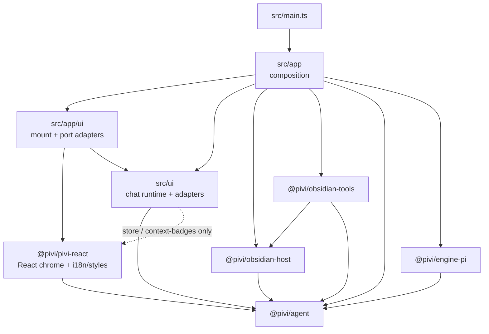
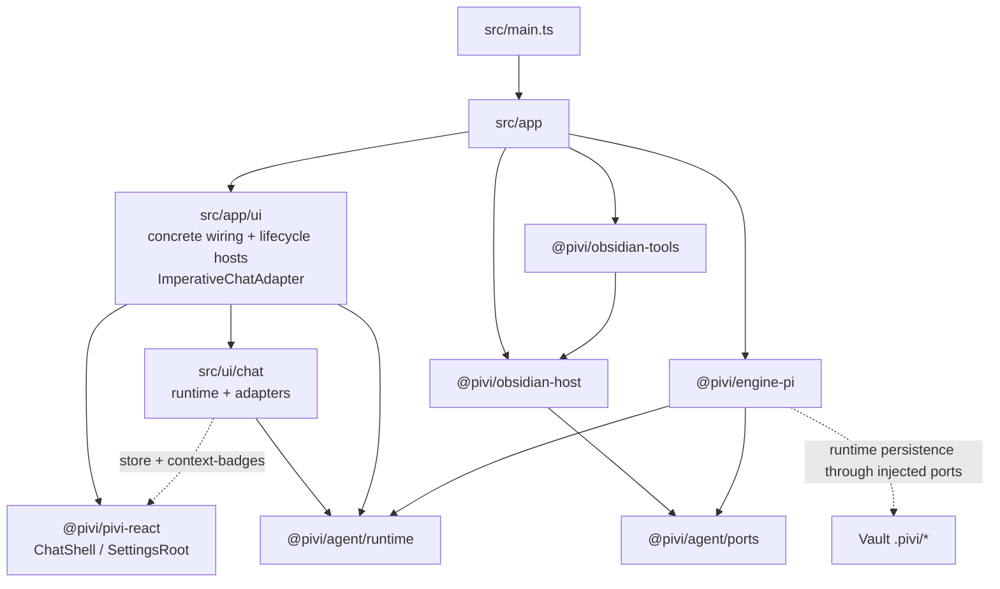
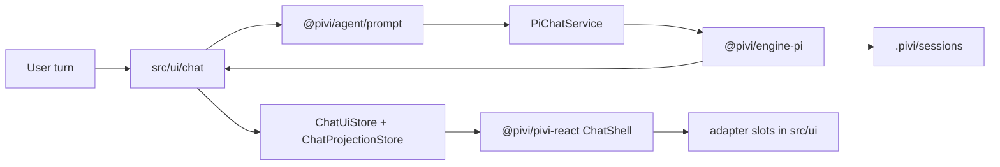
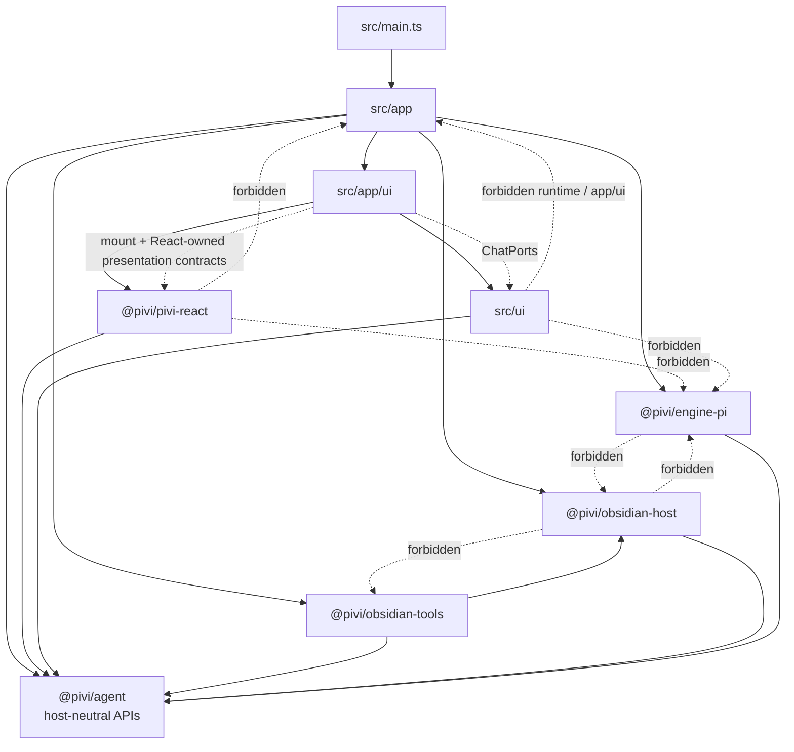

# 12 — Architecture status reference

This page records the current architecture in detail: one paragraph per subsystem, followed by the module maps. It is reference material moved out of the root `AGENTS.md`, which now keeps only operational rules. For the reasoning behind these choices, read [02 — Architecture and technology](02-architecture-and-technology.md); for local invariants, read the nearest `AGENTS.md`.

Update the matching paragraph in the same change whenever code alters a behavior, boundary, storage location, or security property described here.

## Subsystem status

- **Design premise**: Pivi targets the Pi runtime and Obsidian only. Running on another agent runtime or embedding in another host is not a goal. The package split exists for two reasons: unit tests run package logic against injected fakes instead of Obsidian or the Pi SDK, and Pi SDK churn stays inside `@pivi/engine-pi` and `packages/agent/src/mcp`. Do not add an abstraction whose only justification is portability.
- **Lifecycle shell**: `src/main.ts` contains only the Obsidian `Plugin` subclass and delegates load/unload to `src/app/PiviApplication.ts`, which owns product state and composition. The shell exposes no application service methods.
- **React presentation boundary**: `@pivi/pivi-react` owns chat and settings presentation for Pivi as an Obsidian plugin. It calls the public `obsidian` API directly for icons and tooltips, and its locale catalogs name Obsidian, the vault, and the Obsidian keychain directly. `src/app` owns Obsidian lifecycle shells, host tool/integration/featured-skill descriptors, and concrete feature-port adapters (`createChatUiPorts` / `createSettingsUiPorts`). React ports use host-neutral `workspace` / `secureStorage` names, and React-owned DOM/CSS use only `pivi-*` classes plus `--pivi-host-*` theme tokens. Application-facing `ChatPorts` are owned by `@pivi/agent/runtime/chatPorts` and are captured by the app-owned imperative adapter closure; `mountChatView` never imports, receives, or forwards them, while `ChatShell` consumes snapshots/actions. Live chrome flows through immutable `ChatUiStore` snapshots, while virtualized messages use `ChatProjectionStore` structure subscriptions for row shells and reconciled block/tool subscriptions for hot interiors; each subagent remains the nested snapshot on its stable tool entity. Unchanged entity identities are preserved across whole-message upserts. `ChatState` emits one sequenced in-memory projection event plane, while the store rejects ownership/order anomalies and publishes active visible work by owner-window animation frame or hidden/inactive work by a 250 ms owner-realm timer. `ActiveChatUiBridge` selects both stores plus explicit portal/viewport targets and marks projection surface activity. Product UI may reach React only through the exact `store` and `context-badges` presentation subpaths; mention parsing, slash matching, streaming-math transforms, and usage projection live in `@pivi/agent` domain subpaths. React snapshots stay free of DOM/runtime objects; Obsidian Markdown, uncontrolled contenteditable, rich tool bodies, and stored nested subagents remain explicit imperative adapters mounted into isolated empty containers and updated in place for a stable entity generation.
- **Settings search compatibility**: `PiviSettingTabHost.getSettingDefinitions()` maps `SETTINGS_ROOT_LAYOUT` to Obsidian 1.13 native pages and groups in this order: one root-level `render` item for Language; group General (Appearance, Chat behavior, Personalization & context, Input & shortcuts, Session files, Environment); group Agent (Models, Built-in tools, Web tools, MCP servers, Skills, Prompt); group Editor (Commands, Toolbar); then one root-level `render` item for About. Each page is a declarative `SettingDefinitionPage` whose single `items` entry is a `render` item with localized `name`, `desc`, and per-page aliases from `getSettingsPageSearchAliases`; that item mounts `mountSettingsPage` into `setting.settingEl`. General and About root content use the same render-item contract. There is no `SettingPage` subclass and no `display()` fallback. Locale changes call `update()` so the index is rebuilt. Plugin unload disposes any surface still mounted. Each render callback tags Obsidian's implicit single-item `.setting-items` wrapper (and its `.setting-group-search` sibling) with `pivi-settings-host-surface-reset` so React sections are not double-wrapped.
- **Registration-first lifecycle**: plugin load reads required settings and registers views/commands/settings before workspace I/O. A single-flight, retryable workspace readiness promise starts from a visible surface or `onLayoutReady`; fully initialized services are injected into mounts. Unload invalidates in-flight initialization and disposes instance-owned MCP OAuth, provider, bridge, and connection-pool resources, including connections that complete during shutdown.
- **Pi-only Architecture**: `src/main.ts` is a lifecycle-only Obsidian shell; `PiviApplication` structurally satisfies the two app host contracts, `PiviChatCompositionHost` and `PiviSettingsHost`, and `ApplicationSessions` implements `ChatSessionPort` directly, so there is no delegating facade layer. Registrations receive the real `Plugin` plus the application typed as the host contract they need, and `createChatUiPorts(host, sessions, workspace)` passes the session port through unchanged. `src/app/` owns lifecycle and runtime composition; `src/ui/chat/` owns chat orchestration and imperative adapters. App code controls mounted views through semantic handles; only `ImperativeChatAdapter` translates those operations onto internal runtime/UI graphs.
- **Pivi Agent Package**: `@pivi/agent` holds agent logic that imports neither Obsidian nor the Pi SDK, so it is testable against injected ports. It has no root entrypoint: consumers import responsibility-scoped subpaths (`tools`, `session`, `mcp`, `skills/*`, `context`, `prompt`, `runtime`, `settings`, `network`, `auth/*`, and `ports`). It has no Pi SDK dependencies; its MCP implementation directly owns the declared standalone `@earendil-works/pi-mcp` client (which depends on no other Pi package), while concrete host/tool wiring stays in app and adapter packages.
- **Composable prompt and context accounting**: `@pivi/agent/prompt` owns the typed prompt-module registry and segment-aware tokenizer-independent estimator. `@pivi/agent/runtime` owns provider-anchored pressure and memory-only per-model calibration: only assistant usage whose provider and model match the current resolved model may anchor or calibrate it; trailing messages and not-yet-counted selected context are estimated; selected context already covered by the current turn's provider usage is never added again. Reads use a fixed configurable character ceiling rather than pressure-derived pages. React receives precomputed usage numbers through `SettingsPorts.prompt`.
- **Pi Engine Package**: `@pivi/engine-pi` (`packages/engine-pi/`) is the sole Pi SDK adapter. It owns the three exact Pi SDK pins (`pi-agent-core`, `pi-ai`, `pi-coding-agent`), in-process `Agent` construction, pi-ai model/provider setup, Pi chat runtime, settings/auth facades over canonical ports, tool adapters, JSONL compatibility, and auxiliary query runners. Production composition in `src/app/**` and `src/main.ts` imports it only through the stable responsibility-scoped `@pivi/engine-pi/application/{auth,models,oauth,oauth-flows,runtime,session}` surfaces; focused engine compatibility tests may use declared implementation leaves. Pivi deliberately does not construct pi-coding-agent `AgentSession`: it duplicates Pivi's runtime/session/compaction ownership and, with `@earendil-works/pi-coding-agent@0.81.1` (the pin at measurement time; see the root and `@pivi/engine-pi` package manifests for the current exact pin), a production bundle experiment increased `main.js` from about 3.0 MiB to 7.9 MiB by pulling CLI/TUI/resource/export dependencies. Keep transient provider retry in the narrow Pivi turn lifecycle unless upstream exposes an Obsidian-safe core entrypoint whose shipped bundle is measured and accepted.
- **Vault-local MCP**: `.pivi/mcp.json` only—no global host MCP configs. OAuth entries live in `SecretStorage` (`pivi-mcp-<server>-oauth-v1`); plaintext entries left in the retired `.pivi/mcp-oauth/` directory by releases older than 0.15.0 are not migrated. Remote Streamable HTTP `headers` use structured `ConfigValueRef` maps; secret values live in `SecretStorage` (`pivi-mcp-v-*`), not synced JSON. Settings enable/disable owns availability; the system prompt auto-lists enabled servers/tools. Optional `/server` slash tokens remain composer emphasis (`/server` → `/server MCP` in the API prompt). Startup/settings prefetch warms enabled HTTP servers. Stdio MCP is not supported; existing stdio entries are rejected on load. Legacy HTTP+SSE entries are rewritten on load to disabled Streamable HTTP entries (URL and headers kept) with a one-time localized notice to update the endpoint.
- **Device-local environment registry**: structured environment entries (`plain`, `secret`, `systemEnvironment`) live in vault-scoped local storage (`pivi.environment.v1`); secret values reference `SecretStorage` (`pivi-env-*`). Synced `.pivi/settings.json` must not persist `sharedEnvironmentVariables`, top-level `environmentVariables`, or `agentSettings.environmentVariables`; runtime still projects resolved maps in memory for consumers. Secret-like keys default to `SecretStorage`; recognized provider/web keys migrate to canonical credential stores; `KEY=$NAME` bulk import becomes `systemEnvironment` without copying host values.
- **External filesystem access**: `read` and `ls` route vault-indexed paths through the Vault API, and unindexed vault files/folders (for example `.pivi/`) plus authorized absolute paths through `@pivi/obsidian-host/externalFileApi`. Paths inside the current vault are always allowed without a Settings grant or sidebar confirmation. Outside the vault they require `allowExternalRead`; when a path is outside configured roots, Pivi shows a sidebar inline confirmation (Deny / Allow once / Always) instead of a modal. Always allow appends the directory root to device-local persistent permissions and refreshes runtime tools. Host-side realpath containment prevents reads outside allowed roots. Absolute paths never enter synced `.pivi/settings.json` or session JSONL; Obsidian's public vault-scoped local-storage API supplies the per-device cache and historical UI overlay.
- **Durable generated titles**: Title generation remains a background auxiliary query. A successful model result must append `pivi/session-meta` with `titleSource: "model"` before mutating the open-session title or publishing UI; persistence failure keeps the fallback title, logs the error, and shows a localized Notice.
- **Session cloud recovery**: Vault-scoped device-local write-ahead journal (`pivi.session-journal.v1`) seals locally completed JSONL continuations; startup reconciliation recovers cloud replacement/rollback into an explicit recovered session with visible provenance and never overwrites the externally changed source. Recovery source rewrites are atomic (temp + rename with temp cleanup), the recovered-identity map is bounded, and a corrupt device-local journal blob resets to empty with a warning instead of silent history loss. Rebuildable JSONL indexes live under `~/.pivi/session-indexes/<vault-key>/`, not beside synced `.pivi/sessions/`. The live stale-write guard remains; a stale, corrupt, or missing index during post-append refresh is rebuilt from the authoritative JSONL instead of aborting an already-validated turn, with the rebuilt tail verified against the exact appended entry IDs.
- **Pi exact pins and compatibility lifecycle**: The four `@earendil-works/pi-*` packages share one exact synchronized version (`check:pi-pins`): `@pivi/engine-pi` owns `pi-agent-core`, `pi-ai`, and `pi-coding-agent`; `@pivi/agent` owns `pi-mcp`. `packages/engine-pi/compatibility-manifest.json` records every upstream-shape-dependent adaptation and is enforced by `check:pi-compatibility`; a weekly informational canary tests the next synchronized stable version and updates issue `#113` without changing the repository. Private SessionManager members for eager rewrite/truncate live only in `@pivi/engine-pi/session/piSessionManagerPrivateAdapter` with actionable capability failures. Run `npm run test:pi-compat` before bumping the pin.
- **Optional Bash tool**: `bash` is disabled by default and controlled by the Bash tool toggle (`allowBash`) plus structured device-local persistent permissions (`pivi.capability-permissions.v1`). On a permission miss, Pivi shows a sidebar inline confirmation (Deny / Allow once / Always); Always persists an executable or executable + one semantic family verb (`git status`, `uv python`, `pixi global`), never filenames, package names, or script bodies. Commands run as single-line strings through the user's login shell (`$SHELL -lc` on POSIX, fish `-c`, or `cmd.exe /d /s /c` on Windows), so terminal PATH and shell init (pixi, Homebrew, nvm, etc.) apply. Default lookup commands and Always grants share a shell-specific safe argv parser for POSIX shells and Windows `cmd.exe`; redirects, substitutions, `||`, and unsupported control syntax can run only with Allow once. Safe `&&` and pipelines split into independent scopes. Cwd is constrained to the vault before invoking `@pivi/obsidian-host/systemProcessRunner`.
- **Vault skills**: Install/update uses the exact pinned `skills` dependency as `node <cli.mjs>` with `shell: forbidden`; staged trees reject symlinks/escapes and enforce size/`SKILL.md` limits before atomic publish. Failed install/update leaves the previous version and active state unchanged. Runtime and settings inventory reads skip a transiently missing or locked skill entry while an external copy is completing. A locked skills directory keeps the last successful inventory so the next refresh can pick up the completed tree without blanking the surface. View skill refresh is isolated per open chat view so one disposed view cannot fail the publication commit. Skill supporting files are not vault notes; after `skill` loads, read them with `read` using the absolute paths returned by the skill tool, and list the skill directory with `ls`. Relative names from SKILL.md are expanded only when those files exist in the installed skill; missing references are marked so they are not joined onto the skill directory. Vault-contained paths do not need a persistent grant.
- **UI-package i18n/styles**: Locale runtime and JSON live in `packages/pivi-react/src/i18n/`; app-owned imperative adapters share the translator through `@/app/i18n`, while React roots receive the same instance through `I18nProvider`. CSS source and its ordered manifest live in `packages/pivi-react/styles/` and still build to the root `styles.css` release artifact via `npm run build:css`.
- **Scoped HTTP egress**: All Pivi network traffic uses purpose-scoped clients from `@pivi/obsidian-host/createPiviNetworkClients` with host-neutral policy in `@pivi/agent/network`. App composition injects clients into Pi providers, MCP/OAuth, WebSearch/WebFetch, image generation, skills, and connectivity. Pivi does not patch `window.fetch`; the production bundle injects scoped `fetch` for upstream SDK identifiers only. WebFetch rejects local/private network targets before any extractor or direct attempt; configured MCP and custom-provider private origins receive session-scoped grants (re-issued on settings save, cleared on unload) so local LLM providers work without a global private bypass. See `SECURITY.md`.
- **Bounded local process execution**: `ProcessRunRequest` requires explicit stdout/stderr byte limits, timeout, shell policy (forbidden by default), cwd policy (vault or approved root), and optional `AbortSignal`. The host runner streams bounded output, terminates the owned process tree on timeout/abort with SIGTERM→SIGKILL escalation, and reports exit/signal/timeout/abort/spawn-error/forced-kill terminations without double-resolve.
- **Vault mutation containment and recovery**: Mutating vault APIs use `requireVaultRelativeMutationPath` (separate from display/read `normalizePathForVault`) so every write/edit/delete/move/mkdir path is a non-empty canonical vault-relative path that cannot escape via absolute/UNC/traversal/symlink parents. Agent-facing mutations additionally use `requireAgentVaultMutationPath`, which rejects Pivi-managed MCP/Skills/Commands namespaces (exact, descendant, and recursive-ancestor targets) and directs the Agent to `pivi_mcp` / `pivi_skills` / `pivi_commands`. Bash remains a separate authority. Before mutating existing `.md` / `.canvas` content or paths, the host must successfully capture Obsidian File Recovery through private `forceAdd`; unavailable/failed capture blocks the mutation. Folder move/delete preflights all supported descendants, and history restore snapshots an existing destination first.
- **CLI, Web Search, Model, and Subagent Settings**: Pivi settings support default-off official CLI integration settings (`cliEnabled`, `cliPath`, `cliTimeoutMs` for tools like tasks and history), a device-local ordered Web provider queue (`webSearchTools.providerOrder` / `disabledProviders` in `pivi.providers.v1`) shared by WebSearch and WebFetch across Brave, Tavily, Exa, and AnySearch, a device-local sortable model-provider registry whose `addedProviders` order also controls composer model groups, and Subagents limits/toggles (`subagents.enabled`, `subagents.maxConcurrentSubagents`, `subagents.allowBackground`). Provider failures fall through in user order; Exa public MCP and direct HTTP remain fixed terminal fallbacks for search and fetch respectively. The background subagent limit is plugin-wide across tabs: admission reserves a slot atomically before async agent construction, overflow waits FIFO, and completed-job retention is independent of concurrency. Composer chrome never mirrors active subagent state. Pivi also exposes CLI handlers to the official Obsidian CLI through `Plugin.registerCliHandler` in `src/app/cliRegistration.ts`: `pivi:run command=<name>` executes a Pivi workspace command headlessly against an optional `file=`/`path=` note with optional `selection=` and `model=provider/model_id` overrides, falling back to the shared default model (Models page, the same active model new conversations start with) when no parameter is passed.

## Module maps

### L0 — packages and `src/` (boundary overview)

Allowed edges at this layer: composition (`src/main.ts` and `src/app`) may depend on every package and on `src/ui`. Presentation (`@pivi/pivi-react`) may depend on non-engine `@pivi/agent` contracts/models. Product adapters (`src/ui`) may depend on non-engine `@pivi/agent` APIs, the two approved React presentation subpaths, public Obsidian APIs, `@pivi/obsidian-host` helpers, narrowly scoped Node `fs`/`os`/`path` modules used by imperative adapters, `@/app/i18n`, `@/app/slashBadgeNavigation`, and type-only host contracts. Host and tools never import UI or `@pivi/engine-pi`. `@pivi/engine-pi` never imports `@pivi/obsidian-host` and its `PiRuntimeHost` has no workspace peek. Only `src/app/ui` may call chat/settings package mount APIs or implement their feature ports. `src/ui` must not import `src/app/ui` or call `getPiWorkspace()`, `getUiFacades()`, `saveSettings()`, or `getAllViews()` (enforced by architecture checks). Chat ports take an explicit workspace argument from composition; `PiviChatHost` remains an `app`-only runtime host, while `PiviChatCompositionHost` carries composition-only capabilities.

### L1 — module map (composition detail)

### L1 — chat turn data flow

Chat chrome and settings live in `@pivi/pivi-react`. The app-owned imperative adapter closure captures `@pivi/agent`-owned `ChatPorts` for `TabManager`; the React mount contract never sees them. `ChatShell` consumes snapshots/actions, while `SettingsRoot` consumes React-owned `SettingsPorts` implemented in `src/app/ui`. Chrome/usage state reaches React through `ChatUiStore`; virtual message order/entities reach it through `ChatProjectionStore`; `ActiveChatUiBridge` selects both. `src/ui/chat` owns runtime orchestration and imperative content adapters only.

### L1 — package dependency direction

`src/app` composes everything. `@pivi/obsidian-host` implements host capabilities against `@pivi/agent/ports` and may consume host-relevant `@pivi/agent` `foundation`, `session`, and `auth` contracts, but must not import `@pivi/engine-pi`, skills, or tools. Product UI must not construct `PiChatRuntime` or import `src/app/runtime/**`; the app-owned chat adapter receives `@pivi/agent`-owned `ChatPorts`, the settings root receives React-owned `SettingsPorts`, and `src/ui` uses `PiChatService` / `ChatPorts` (no `getPiWorkspace()`).
