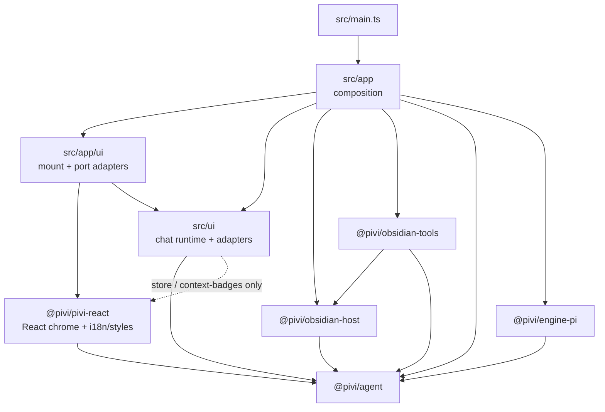
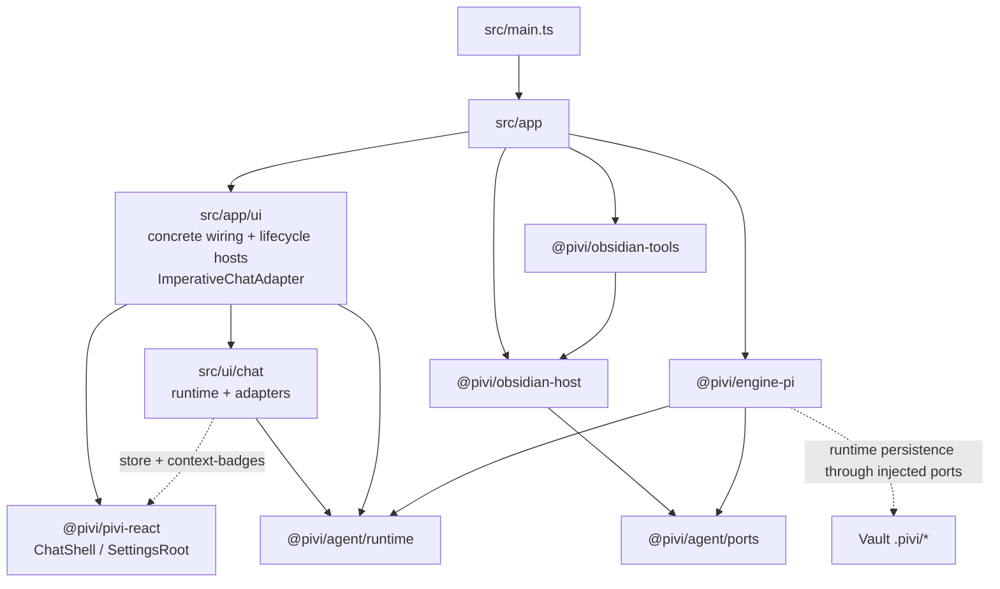
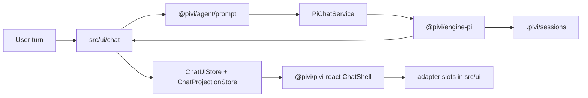
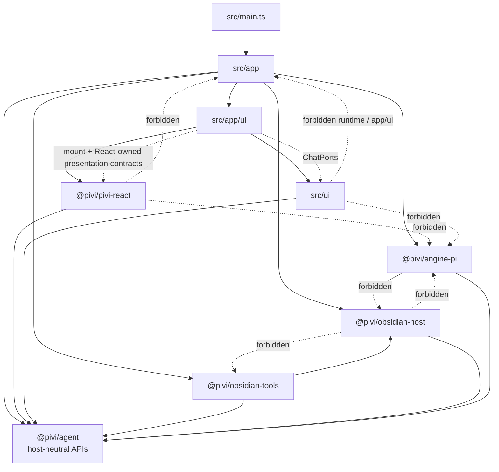

# 12 — Architecture status reference

This page records the current architecture in detail: one paragraph per subsystem, followed by the module maps. It is reference material moved out of the root `AGENTS.md`, which now keeps only operational rules. For the reasoning behind these choices, read [02 — Architecture and technology](02-architecture-and-technology.md); for local invariants, read the nearest `AGENTS.md`.

Update the matching paragraph in the same change whenever code alters a behavior, boundary, storage location, or security property described here.

## Subsystem status

- **Design premise**: Pivi targets the Pi runtime and Obsidian only. Running on another agent runtime or embedding in another host is not a goal. The package split exists for two reasons: unit tests run package logic against injected fakes instead of Obsidian or the Pi SDK, and Pi SDK churn stays inside `@pivi/engine-pi` and `packages/agent/src/mcp`. Do not add an abstraction whose only justification is portability.
- **Lifecycle shell**: `src/main.ts` contains only the Obsidian `Plugin` subclass and delegates load/unload to `src/app/PiviApplication.ts`, which owns product state and composition. The shell exposes no application service methods.
- **React presentation boundary**: `@pivi/pivi-react` owns chat and settings presentation for Pivi as an Obsidian plugin. It calls the public `obsidian` API directly for icons and tooltips, and its locale catalogs name Obsidian, the vault, and the Obsidian keychain directly. `src/app` owns Obsidian lifecycle shells, host tool/integration/featured-skill descriptors, and concrete feature-port adapters (`createChatUiPorts` / `createSettingsUiPorts`). React ports use host-neutral `workspace` / `secureStorage` names, and React-owned DOM/CSS use only `pivi-*` classes plus `--pivi-host-*` theme tokens. Application-facing `ChatPorts` are owned by `@pivi/agent/runtime/chatPorts` and are captured by the app-owned imperative adapter closure; `mountChatView` never imports, receives, or forwards them, while `ChatShell` consumes snapshots/actions. Live chrome flows through immutable `ChatUiStore` snapshots, while virtualized messages use `ChatProjectionStore` structure subscriptions for row shells and reconciled block/tool subscriptions for hot interiors; each subagent remains the nested snapshot on its stable tool entity. Unchanged entity identities are preserved across whole-message upserts. `ChatState` emits one sequenced in-memory projection event plane, while the store rejects ownership/order anomalies and publishes active visible work by owner-window animation frame or hidden/inactive work by a 250 ms owner-realm timer. `ActiveChatUiBridge` selects both stores plus explicit portal/viewport targets and marks projection surface activity. Product UI may reach React only through the exact `store` and `context-badges` presentation subpaths; mention parsing, slash matching, streaming-math transforms, and usage projection live in `@pivi/agent` domain subpaths. React snapshots stay free of DOM/runtime objects; Obsidian Markdown, uncontrolled contenteditable, rich tool bodies, and stored nested subagents remain explicit imperative adapters mounted into isolated empty containers and updated in place for a stable entity generation.
- **Settings search compatibility**: `PiviSettingTabHost.getSettingDefinitions()` maps `SETTINGS_ROOT_LAYOUT` to Obsidian 1.13 native pages and groups in this order: one root-level `render` item for Language; group General (Appearance, Chat behavior, Personalization & context, Input & shortcuts, Session files, Environment); group Agent (Models, Built-in tools, Web tools, MCP servers, Skills, Prompt); group Editor (Commands, Toolbar); then one root-level `render` item for About. Each page is a declarative `SettingDefinitionPage` whose single `items` entry is a `render` item with localized `name`, `desc`, and per-page aliases from `getSettingsPageSearchAliases`; that item mounts `mountSettingsPage` into `setting.settingEl`. General and About root content use the same render-item contract. There is no `SettingPage` subclass and no `display()` fallback. Locale changes call `update()` so the index is rebuilt. Plugin unload disposes any surface still mounted. Each render callback tags Obsidian's implicit single-item `.setting-items` wrapper (and its `.setting-group-search` sibling) with `pivi-settings-host-surface-reset` so React sections are not double-wrapped.
- **Registration-first lifecycle**: plugin load reads required settings and registers views/commands/settings before workspace I/O. A single-flight, retryable workspace readiness promise starts from a visible surface or `onLayoutReady`; fully initialized services are injected into mounts. Unload invalidates in-flight initialization and disposes instance-owned MCP OAuth, provider, bridge, and connection-pool resources, including connections that complete during shutdown.
- **Pi-only Architecture**: `src/main.ts` is a lifecycle-only Obsidian shell; `PiviApplication` structurally satisfies the two app host contracts, `PiviChatCompositionHost` and `PiviSettingsHost`, and `ApplicationSessions` implements `ChatSessionPort` directly, so there is no delegating facade layer. Registrations receive the real `Plugin` plus the application typed as the host contract they need, and `createChatUiPorts(host, sessions, workspace)` passes the session port through unchanged. `src/app/` owns lifecycle and runtime composition; `src/ui/chat/` owns chat orchestration and imperative adapters. App code controls mounted views through semantic handles; only `ImperativeChatAdapter` translates those operations onto internal runtime/UI graphs.
- **Pivi Agent Package**: `@pivi/agent` holds agent logic that imports neither Obsidian nor the Pi SDK, so it is testable against injected ports. It has no root entrypoint: consumers import responsibility-scoped subpaths (`tools`, `session`, `mcp`, `skills/*`, `context`, `prompt`, `runtime`, `settings`, `network`, `auth/*`, and `ports`). It has no Pi SDK dependencies; its MCP implementation directly owns the declared standalone `@earendil-works/pi-mcp` client (which depends on no other Pi package), while concrete host/tool wiring stays in app and adapter packages.
- **Composable prompt and context accounting**: `@pivi/agent/prompt` owns the typed prompt-module registry and segment-aware tokenizer-independent estimator. `@pivi/agent/runtime` owns provider-anchored pressure and memory-only per-model calibration: only assistant usage whose provider and model match the current resolved model may anchor or calibrate it; trailing messages and not-yet-counted selected context are estimated; selected context already covered by the current turn's provider usage is never added again. Reads use a fixed configurable character ceiling rather than pressure-derived pages. React receives precomputed usage numbers through `SettingsPorts.prompt`.
- **Pi Engine Package**: `@pivi/engine-pi` (`packages/engine-pi/`) is the sole Pi SDK adapter. It owns the three exact Pi SDK pins (`pi-agent-core`, `pi-ai`, `pi-coding-agent`), in-process `Agent` construction, pi-ai model/provider setup, Pi chat runtime, settings/auth facades over canonical ports, tool adapters, JSONL compatibility, and auxiliary query runners. Production composition in `src/app/**` and `src/main.ts` imports it only through the stable responsibility-scoped `@pivi/engine-pi/application/{auth,models,oauth,oauth-flows,runtime,session}` surfaces, plus a development-only dynamic import of `application/development`; focused engine compatibility tests may use implementation leaves. Pivi deliberately does not construct pi-coding-agent `AgentSession`: it duplicates Pivi's runtime/session/compaction ownership and, with `@earendil-works/pi-coding-agent@0.81.1` (the pin at measurement time; see the root and `@pivi/engine-pi` package manifests for the current exact pin), a production bundle experiment increased `main.js` from about 3.0 MiB to 7.9 MiB by pulling CLI/TUI/resource/export dependencies. Keep transient provider retry in the narrow Pivi turn lifecycle unless upstream exposes an Obsidian-safe core entrypoint whose shipped bundle is measured and accepted.
- **Vault-local MCP**: `.pivi/mcp.json` only—no global host MCP configs. OAuth entries live in `SecretStorage` (`pivi-mcp-<server>-oauth-v1`); plaintext entries left in the retired `.pivi/mcp-oauth/` directory by releases older than 0.15.0 are not migrated. Remote Streamable HTTP `headers` use structured `ConfigValueRef` maps; secret values live in `SecretStorage` (`pivi-mcp-v-*`), not synced JSON. Settings enable/disable owns availability; the system prompt auto-lists enabled servers/tools. Optional `/server` slash tokens remain composer emphasis (`/server` → `/server MCP` in the API prompt). Startup/settings prefetch warms enabled HTTP servers. Stdio MCP is not supported; existing stdio entries are skipped on load. Legacy HTTP+SSE entries are rewritten on load to disabled Streamable HTTP entries (URL and headers kept) with a one-time localized notice to update the endpoint.
- **Device-local environment registry**: structured environment entries (`plain`, `secret`, `systemEnvironment`) live in vault-scoped local storage (`pivi.environment.v1`); secret values reference `SecretStorage` (`pivi-env-*`). Synced `.pivi/settings.json` must not persist `sharedEnvironmentVariables`, top-level `environmentVariables`, or `agentSettings.environmentVariables`; runtime still projects resolved maps in memory for consumers. Secret-like keys default to `SecretStorage`; recognized provider/web keys migrate to canonical credential stores; `KEY=$NAME` bulk import becomes `systemEnvironment` without copying host values.
- **External filesystem access**: `read` and `ls` route vault-indexed paths through the Vault API, and unindexed vault files/folders (for example `.pivi/`) plus authorized absolute paths through `@pivi/obsidian-host/externalFileApi`. Paths inside the current vault are always allowed without a Settings grant or sidebar confirmation. Outside the vault they require `allowExternalRead`; when a path is outside configured roots, Pivi shows a sidebar inline confirmation (Deny / Allow once / Always) instead of a modal. Always allow appends the directory root to device-local persistent permissions and refreshes runtime tools. Host-side realpath containment prevents reads outside allowed roots. Absolute paths never enter synced `.pivi/settings.json` or session JSONL; Obsidian's public vault-scoped local-storage API supplies the per-device cache and historical UI overlay.
- **Durable generated titles**: Title generation remains a background auxiliary query. A successful model result must append `pivi/session-meta` with `titleSource: "model"` before mutating the open-session title or publishing UI; persistence failure keeps the fallback title, logs the error, and shows a localized Notice.
- **Session cloud recovery**: Vault-scoped device-local write-ahead journal (`pivi.session-journal.v1`) seals locally completed JSONL continuations; startup reconciliation recovers cloud replacement/rollback into an explicit recovered session with visible provenance and never overwrites the externally changed source. Recovery source rewrites are atomic (temp + rename with temp cleanup), the recovered-identity map is bounded, and a corrupt device-local journal blob resets to empty with a warning instead of silent history loss. Rebuildable JSONL indexes live under `~/.pivi/session-indexes/<vault-key>/`, not beside synced `.pivi/sessions/`. The live stale-write guard remains; a stale, corrupt, or missing index during post-append refresh is rebuilt from the authoritative JSONL instead of aborting an already-validated turn, with the rebuilt tail verified against the exact appended entry IDs.
- **Pi exact pins and compatibility lifecycle**: The four `@earendil-works/pi-*` packages share one exact synchronized version (`check:pi-pins`): `@pivi/engine-pi` owns `pi-agent-core`, `pi-ai`, and `pi-coding-agent`; `@pivi/agent` owns `pi-mcp`. `packages/engine-pi/compatibility-manifest.json` records every upstream-shape-dependent adaptation and is enforced by `check:pi-compatibility`; a weekly informational canary tests the next synchronized stable version and updates issue `#113` without changing the repository. Private SessionManager members for eager rewrite/truncate live only in `@pivi/engine-pi/session/piSessionManagerPrivateAdapter` with actionable capability failures. Run `npm run test:pi-compat` before bumping the pin.
- **Optional Bash tool**: `bash` is disabled by default and controlled by the Bash tool toggle (`allowBash`) plus structured device-local persistent permissions (`pivi.capability-permissions.v1`). On a permission miss, Pivi shows a sidebar inline confirmation (Deny / Allow once / Always); Always persists an executable or executable + one semantic family verb (`git status`, `uv python`, `pixi global`), never filenames, package names, or script bodies. Commands run as single-line strings through the user's login shell (`$SHELL -lc` on POSIX, fish `-c`, or `cmd.exe /d /s /c` on Windows), so terminal PATH and shell init (pixi, Homebrew, nvm, etc.) apply. Default lookup commands and Always grants share a shell-specific safe argv parser for POSIX shells and Windows `cmd.exe`; redirects, substitutions, `||`, and unsupported control syntax can run only with Allow once. Safe `&&` and pipelines split into independent scopes. Cwd is constrained to the vault before invoking `@pivi/obsidian-host/systemProcessRunner`.
- **Vault skills**: Install/update uses the exact pinned `skills` dependency as `node <cli.mjs>` with `shell: forbidden`; staged trees reject symlinks/escapes and enforce size/`SKILL.md` limits before atomic publish. Failed install/update leaves the previous version and active state unchanged. Runtime and settings inventory reads skip a transiently missing or locked skill entry while an external copy is completing. A locked skills directory keeps the last successful inventory so the next refresh can pick up the completed tree without blanking the surface. View skill refresh is isolated per open chat view so one disposed view cannot fail the publication commit. Skill supporting files are not vault notes; after `skill` loads, read them with `read` using the absolute paths returned by the skill tool, and list the skill directory with `ls`. Relative names from SKILL.md are expanded only when those files exist in the installed skill; missing references are marked so they are not joined onto the skill directory. Vault-contained paths do not need a persistent grant.
- **UI-package i18n/styles**: Locale runtime and JSON live in `packages/pivi-react/src/i18n/`; app-owned imperative adapters share the translator through `@/app/i18n`, while React roots receive the same instance through `I18nProvider`. CSS source and its ordered manifest live in `packages/pivi-react/styles/` and still build to the root `styles.css` release artifact via `npm run build:css`.
- **Scoped HTTP egress**: All Pivi network traffic uses purpose-scoped clients from `@pivi/obsidian-host/createPiviNetworkClients` with host-neutral policy in `@pivi/agent/network`. App composition injects clients into Pi providers, MCP/OAuth, WebSearch/WebFetch, image generation, skills, and connectivity. Pivi does not patch `window.fetch`; the production bundle injects scoped `fetch` for upstream SDK identifiers only. WebFetch rejects local/private network targets before any extractor or direct attempt; configured MCP and custom-provider private origins receive session-scoped grants (re-issued on settings save, cleared on unload) so local LLM providers work without a global private bypass. See `SECURITY.md`.
- **Bounded local process execution**: `ProcessRunRequest` requires explicit stdout/stderr byte limits, timeout, shell policy (forbidden by default), cwd policy (vault or approved root), and optional `AbortSignal`. The host runner streams bounded output, terminates the owned process tree on timeout/abort with SIGTERM→SIGKILL escalation, and reports exit/signal/timeout/abort/spawn-error/forced-kill terminations without double-resolve.
- **Vault mutation containment and recovery**: Mutating vault APIs use `requireVaultRelativeMutationPath` (separate from display/read `normalizePathForVault`) so every write/edit/delete/move/mkdir path is a non-empty canonical vault-relative path that cannot escape via absolute/UNC/traversal/symlink parents. Agent-facing mutations additionally use `requireAgentVaultMutationPath`, which rejects Pivi-managed MCP/Skills/Commands namespaces (exact, descendant, and recursive-ancestor targets) and directs the Agent to `pivi_mcp` / `pivi_skills` / `pivi_commands`. Bash remains a separate authority. Before mutating existing `.md` / `.canvas` content or paths, the host must successfully capture Obsidian File Recovery through private `forceAdd`; unavailable/failed capture blocks the mutation. Folder move/delete preflights all supported descendants, and history restore snapshots an existing destination first.
- **CLI, Web Search, Model, and Subagent Settings**: Pivi settings support default-off official CLI integration settings (`cliEnabled`, `cliPath`, `cliTimeoutMs` for tools like tasks and history), a device-local ordered Web provider queue (`webSearchTools.providerOrder` / `disabledProviders` in `pivi.providers.v1`) shared by WebSearch and WebFetch across Brave, Tavily, Exa, and AnySearch, a device-local sortable model-provider registry whose `addedProviders` order also controls composer model groups, and Subagents limits/toggles (`subagents.enabled`, `subagents.maxConcurrentSubagents`, `subagents.allowBackground`). Provider failures fall through in user order; Exa public MCP and direct HTTP remain fixed terminal fallbacks for search and fetch respectively. The background subagent limit is plugin-wide across tabs: admission reserves a slot atomically before async agent construction, overflow waits FIFO, and completed-job retention is independent of concurrency. Composer chrome never mirrors active subagent state. Pivi also exposes CLI handlers to the official Obsidian CLI through `Plugin.registerCliHandler` in `src/app/cliRegistration.ts`: `pivi:run command=<name>` executes a Pivi workspace command headlessly against an optional `file=`/`path=` note with optional `selection=` and `model=provider/model_id` overrides, falling back to the shared default model (Models page, the same active model new conversations start with) when no parameter is passed.

## Agent package subsystem notes

Behavior detail for each `packages/agent/src/` directory. The enforceable rules for the package are in `packages/agent/AGENTS.md`.

- `src/network/` owns host-neutral egress policy: IP classification, URL normalization/redaction, DNS pinning helpers (`selectAllowedResolvedAddresses` prefers public IPs and may keep named-host RFC1918/CGNAT/ULA for provider-like purposes), redirect policy, `OriginGrantRegistry` with `grantPrivateOrigins` and `revokeByPurpose` helpers for private-origin exceptions, and `PRIVATE_ORIGIN_GRANT_TTL_MS` for session-scoped configured-origin grants. Concrete HTTP transports implement this policy in host packages; callers receive purpose-scoped injected clients from app composition.
- `src/auth/` owns host-neutral provider credential helpers: stable Pi credential secret IDs, provider environment variable names, supported Pi provider/model-key validation, auth failure hint text, disabled-provider checks, structural API-key/OAuth credential extraction, credential JSON parsing/serialization, and provider readiness derivation. Disabled-provider auth gating is applied in `@pivi/engine-pi` (`resolvePiProviderAuth`). Concrete Obsidian keychain adapters stay in host/app composition; pi-ai model/auth host implementations and provider OAuth flows live in `@pivi/engine-pi`.
- `src/settings/` owns settings contracts/defaults plus pure settings/display helpers: active-model reconciliation, title-generation model reconciliation, Obsidian tool gates (`allowExternalRead`, `allowBash`, command execution toggle and allowlist), Pi agent settings materialization/update/normalization (including `customProviders[]` for local/custom API endpoints; `apiKeyRequired` is inferred from local kinds and loopback/private/link-local URLs; fetched or user-entered model rows may persist `reasoning` plus `reasoningMeta.supportedEfforts` from `/v1/models`, and `max_tokens` / `max_output_tokens` as `maxTokens` (65536 when omitted). Users may pin a built-in `catalogModelId` and a `maxTokensOverride` on a custom model (both preserved across fetches); the override is the per-response output cap including thinking and still clamps to the context window. `catalogModelId` lets `@pivi/engine-pi` inherit that catalog row's reasoning behavior when the server card omits reasoning metadata; even without it, thinking levels may be inherited from a matching built-in model id. Settings reads reconcile `visibleModels` against each custom provider's current model ids; users can enter model IDs when a list endpoint is unavailable; a successful `/v1/models` fetch still replaces the stored list while preserving per-row user overrides, and prunes stale active/title/last model selections), environment text parsing/formatting, shared/agent environment ownership classification, structured `ConfigValueRef` sources (`plain`, `secret`, `systemEnvironment`) and secret-key classification in `config/valueSource.ts`, device-local environment registry contracts/projection in `deviceLocalEnvironmentState.ts`, failure-safe config publication helpers in `config/publication.ts` (corrupt preservation, atomic replace, per-path serialized saves), Pi model-key shape validation and settings view types, provider/model display metadata (including custom-provider logo slugs and composer model-family logo detection), and editor-selection-toolbar normalization. Toolbar normalization reserves canonical Pivi action and curated editor-command IDs globally, repairs required actions, deduplicates canonical commands, and deterministically remaps colliding legacy row IDs while remaining idempotent; Pivi Command targets are `inline-edit` or `sidebar`, with legacy/invalid values defaulting to `sidebar`. This package also owns chat UI active-state projection over injected `ChatUIConfig`, settings snapshot/reconciliation, conservative context-envelope calculation and usage projection (read-tool char budgets use a 1:1 token-to-char cap aligned with compaction CJK worst-case estimates; the composer meter arc follows `contextTokens / contextWindow` while its warning state follows `pressureInputTokens / compactionTriggerTokens`), and transient streaming-math escaping. Only a provider aggregate may be marked authoritative; locally decomposed context categories remain estimates, and temporary streaming usage projects the complete active envelope rather than restarting from the current turn. `PersistedPiviSettings`, runtime `PiviSettings`, `DeviceLocalProviderStateV1`, and `DeviceLocalEnvironmentStateV1` are distinct contracts: synced storage omits provider membership, model preferences, `webSearchTools`, custom-provider context limits, and all environment fields; local registries never store secret values inline; runtime projection overlays local state into the existing `PiAgentSettingsView` shape for settings and engine consumers.
- `src/tools/` owns generic tool protocol, diff, todo, task, shell-specific safe argv tokenizers/authorization, the Bash command classifier and structured persistent-permission records, the canonical tool-presentation registry, host-neutral `piviManagement` contracts/ToolSpec factories (`pivi_mcp` / `pivi_skills` / `pivi_commands` / `pivi_prompt` over `PiviManagementPort`), and the directory-backed `tools/webSearch` entrypoint. Capability-permission schema v2 is the canonical write format; decoding v1 preserves its Bash/external records and exposes the source version so the host can consume legacy synced command grants only during that single version transition. `capToolResultText` is the shared 50,000-character model-visible truncation helper. MCP `call` results use it; `spawn_agent` parent-visible text is capped in `@pivi/engine-pi`. Registered-tools Search copy requires a non-root `path` and rejects vault-wide omit-path. Detailed registered-tool prompt usage belongs on `ToolSpec.promptUsage` beside its owning factory/schema; prompt composition consumes the actual registered specs rather than duplicating argument contracts in identity switches. `edit` guidance teaches Agents to insert line endings with the shortest unique local substring rather than copying a whole physical line. Because replacement leaves text outside `oldText` adjacent to `newText`, static and registered guidance requires Agents to inspect physical-line boundaries and include line endings when introducing Markdown block syntax. Management tools are sequential; the Pi registry accepts them only through an optional distinct `PiMainOnlyToolProvider` (not via `PiBaseToolProvider` or a name blacklist), and app composition wires that provider later. The port carries no persistence. Web providers share one ordered configuration; capability filtering builds separate search/fetch chains, AnySearch supports anonymous search/extract, and Exa public MCP/direct HTTP remain fixed terminal fallbacks. WebFetch rejects local/private network targets before any provider attempt so the URL is never handed to a third-party extractor. `toolPresentation.ts` is the single source for tool kind, icon, translation keys, visibility/grouping policy, and summary resolver; it returns untranslated title tokens and pure summaries only. React and imperative adapters translate and compose those tokens locally.
- `src/context/` owns host-neutral prompt context formatting, vault context layer loading, XML context stripping, inline context tokens, browser/canvas/editor context value models, date/duration helpers, and the `context/mentions` leaf API for mention types, token parsing (including the built-in image-tool token), wikilink/external-root resolution, and normalization. Obsidian vault lookup/metadata adapters and host SDK helpers such as `getEditorView()` stay outside this package.
- `src/prompt/` owns host-neutral system prompt composition, Pi system-prompt settings/key wrappers, turn prompt and API-only built-in tool-token expansion, title-generation prompt, registered-tool summary text (including MCP inventory and CLI-aware Obsidian tool guidance over injected capability flags). The shipped prompt-module registry (`core` locked, `workflow` composable, plus user `custom` modules appended after workflow) is the composition source: `buildSystemPrompt` joins enabled non-empty module bodies, then the registered-tools section and runtime appendices. Core safety cannot be disabled or edited; workflow modules honor `promptModules` enablement/`customBody`; empty bodies contribute nothing. Shipped workflow bodies cover transcript cleanup, wikilink authoring, frontmatter, and daily/periodic notes (default on) plus long-line pre-edit normalization (default off). Every prompt rule has one owner: ToolSpec `promptUsage` holds argument contracts and concrete examples (`search` owns search-not-read; `edit` owns the heading/delimiter examples); the registered-tools section holds capability-gated operational guidance (Vault-read stats-first paging, clamp continuation, mutually exclusive coordinate systems, and routing unindexed vault files such as `.pivi/` through the same `read` / `ls` tools); static core holds host-neutral safety (`tool-recovery` for identical-retry, no silent stall, and continuous completion within one turn, `exact-match-editing` for verbatim latest-read `oldText`, `mutation-safety` for rewrite integrity and no draft copies) with cross-references rather than restated examples. `estimateTextTokens` lives here so compaction and the Prompt-tab usage panel share one character-based estimator; `estimatePromptUsageSections` reports per-section estimates. `computeSystemPromptKey` incorporates shipped-module enablement/custom bodies and the ordered custom-module list. Registered Vault-read guidance teaches stats and complete-line ranges first, then 1-indexed `offset`/`limit` line pages, with line-relative `startChar` pagination for oversized physical lines using exact `nextStartLine` + `nextStartChar` continuation and no `maxChars` increase; standalone `startChar` remains file-global. Tool-token expansion applies only to the user-authored turn text; it must preserve durable UI text and appended note/selection/context payloads.
- `src/runtime/` owns host-neutral runtime contracts and helpers, including provider-anchored context envelopes and the memory-only per-model calibration registry. Pressure is a same-provider/model anchor plus calibrated trailing and not-yet-counted selected estimates; selected context already represented by current-turn provider usage is not added again. Absent a matching anchor it is a full estimate. Read ceilings are fixed rather than pressure-derived. It also owns application-facing `ChatPorts`, turn preparation/types, `PiChatService`, queues, open-session projection, readiness, connectivity, auxiliary-query contracts, Pi/MCP text extraction, and `CapabilityPersistentGrantCache` (exported from `runtime/capabilitySessionGrants`) as in-memory acceleration of committed persistent Bash, exact Obsidian-command, and external-directory grants rather than session-duration authority. Concrete Pi session anchoring remains in `@pivi/engine-pi`.
- `src/session/` owns host-neutral session contracts, linear open-session management, pure path helpers, typed stale/corrupt index failures, user-query metadata, message UI overlay patches, versioned checkpoint/Agent-report schemas, tolerant subagent JSONL parsing, and the device-local session write-ahead journal schema (`sessionJournal.ts`) with bounded entries and a bounded recovered-identity map. Structured artifact references accept vault-relative paths only. `SessionStore` does not expose leaf listing or selection. Pi JSONL compatibility and rebuildable index implementations live under `@pivi/engine-pi` (`session/`); source equality uses file identity, size, mtime, and bounded byte hashes. Filesystem change time is not recorded because metadata-only sync/provenance updates are not session-content mutations. Session path helpers compute pi-compatible live and trash paths only, and filesystem directory creation stays with `SessionManager` or concrete store adapters. Because Pi directory names encode device-local absolute vault paths, history discovery scans every device directory below the shared `.pivi/sessions/` root while creation still targets the current device's Pi-compatible directory. Rebuildable indexes and the session journal stay outside synced `.pivi` (device-local storage).
- `src/skills/` owns skill markdown/frontmatter parsing, loaded skill body content (vault-relative `filePath`/`baseDir` for restore matching plus absolute `absoluteFilePath`/`absoluteBaseDir` for on-disk supporting-file reads), `vault/expandSkillSupportingPaths.ts` (rewrites existing skill-relative supporting-file paths in the `skill` tool result to absolute paths and marks referenced files that are not in the installed tree), slash catalog contracts for command/skill/tool presentation entries, built-in slash IDs, slash-dropdown fuzzy scoring, vault skill inventory/runtime loading (inventory includes disabled skills; runtime context excludes them; a transiently missing or locked `SKILL.md` is skipped, and a locked skills directory keeps the last successful inventory so a concurrent copy cannot blank chat/settings), default bundle orchestration, skill service helpers, change notifications, and default-bundle remote/process helpers that consume injected ports, command environments, and platform context instead of global network or process APIs. `vault/skillPublicationTransaction.ts` owns staged-tree validation, atomic publication, backup rollback, and crash recovery; recovery retries durable metadata when the filesystem commit marker precedes settings persistence. Skills CLI resolution uses the exact pinned `skills` package (`node <cli.mjs>`, `shell: forbidden`); staged publish rejects symlinks/escapes and enforces size/`SKILL.md` limits before atomic replace. First-run default-bundle orchestration requests confirmation through an injected host prompt callback and never constructs host DOM. Catalog `tool` entries are presentation tokens and must not be converted into runtime `SlashCommand` prompt templates. Filesystem ownership remains only in vault-local skill loading/sync paths until a later storage-port slice.
- `src/mcp/` owns MCP config parsing/storage, server management, OAuth/auth stores, callback server, proxy tool specs, connection pool, tester, diagnostics contract, and transport helpers. This directory is the sole `@earendil-works/pi-mcp` import boundary (enforced by `check:architecture`; no other Pi package is allowed here), and `package.json` pins that runtime dependency exactly with the other Pi packages. `mcpHttpClient.ts` connects pi-mcp over Streamable HTTP with abort support and a 60 s request timeout; `oauth/mcpClientCredentials.ts` owns the client-credentials grant pi-mcp lacks. Legacy SSE configs are upgraded on load to disabled HTTP entries and reported once through `McpServerManager.takeLegacySseServers()`. Remote `headers` persist as structured `ConfigValueRef` maps in `.pivi/mcp.json`; secret values reference `SecretStorage` (`pivi-mcp-v-*`) through `mcpValueSources.ts`. Publication stages new secrets before config write and clears obsolete secrets only after successful publish. Settings reads tool inventories from the shared provider cache without connecting; explicit refresh diagnostics list tools without invoking them and import successful results back into that cache. Automatic bridge prefetch covers enabled HTTP servers. Settings-enabled servers are active for the proxy `mcp` tool; system-prompt inventory lists enabled servers and cached tool names (no composer toolbar selection). pi-mcp transports receive an injected fetch-compatible `McpTransportFetch`; bearer environment lookup receives injected `McpProcessEnv`; OAuth callback port configuration is injected by the product host; the callback server resolves `{ code, iss? }` and `McpAuthFlow` forwards `iss` to `authorizeMcp`, which pi-mcp 1.0 requires once a server advertises `authorization_response_iss_parameter_supported`; the transport auth provider cannot open a browser, so on an `insufficient_scope` challenge it stores the merged scope as `AuthEntry.stepUpScope`, and the next settings sign-in requests that scope with `skipRefresh` and clears it once authorized; concrete Node/Electron fetch implementations stay in host packages. `mcpValidation.ts` enforces reserved server names, remote URL policy, and null-prototype server maps at import/storage/UI boundaries. Stdio MCP is not supported.

## App composition notes

Behavior detail for `src/app/`. The enforceable rules are in `src/app/AGENTS.md`.

- **Construct concrete Pi runtime here.** `runtime/createChatRuntimeServices.ts` builds `PiChatRuntime` and Pi aux runners through the stable `@pivi/engine-pi/application/runtime` composition surface. Other app wiring uses the scoped `auth`, `models`, `oauth`, `oauth-flows`, and `session` surfaces; production app code must not deep-import engine implementation modules. `PiWorkspaceServices` owns the single plugin-wide subagent concurrency limiter and injects the same instance into every runtime/runner so limits span tabs. Keep these factories on runtime services and the app-only `PiviChatCompositionHost` wiring surface; product UI receives them only through `@pivi/agent`-owned `ChatPorts` / `PiChatService` / `AuxQueryRunner` contracts.
- **Keep the Plugin shell lifecycle-only.** `src/main.ts` owns only Obsidian inheritance and `onload`/`onunload` delegation. `PiviApplication.ts` owns product state, assembly, and lifecycle ordering. Production `src/app/**` must never import `@/main`; pass the real `Plugin` separately where Obsidian requires it.
- **Install network clients at composition.** `PiviApplication.network` (`createPiviNetworkClients` in `PiviApplication.ts`) passes purpose-scoped HTTP clients through `WorkspaceInitContext.network` into MCP/OAuth, WebSearch/WebFetch, image generation, custom providers, and connectivity. Do not patch `window.fetch`. Configured private MCP and custom-provider origins are granted at workspace init and re-granted on settings save (provider sync in `piUiFacades.syncCustomProviders` and MCP save in `createMcpSettingsPort`) via `revokeByPurpose` + `grantPrivateOrigins`, so local providers work without a reload; grants are cleared on workspace disposal. WebFetch has no grant path and rejects local/private targets up front.
- **Register before workspace I/O.** `pluginLifecycle` registers views, commands, and settings after required settings load, then starts the single-flight `ensureWorkspaceServices()` from a visible surface or `workspace.onLayoutReady`. View/settings hosts await the same promise before building ports, and generation guards prevent late mounts after close/hide. `PiviSettingTabHost` maps `SETTINGS_ROOT_LAYOUT` to Obsidian 1.13 declarative pages/groups (`minAppVersion` 1.13.0) in this order: root General content (Language); group General (Appearance, Chat behavior, Personalization & context, Input & shortcuts, Session files, Environment); group Agent (Models, Built-in tools, Web tools, MCP servers, Skills, Prompt); group Editor (Commands, Toolbar); root About content. Each page is `{ type: 'page', name, desc, items: [renderItem] }` and the render item mounts `mountSettingsPage`; General and About use the same render-item contract directly at the root. The host tags Obsidian's implicit single-item group surface with `pivi-settings-host-surface-reset`. There is no `SettingPage` subclass and no `display()` fallback. Locale changes refresh the declarative index via `update()`. Plugin unload disposes every live settings surface because render cleanup is not guaranteed when the settings window is destroyed. Workspace disposal owns MCP OAuth and provider/connection-pool shutdown.
- **Keep chat performance tracing development-only and instance-owned.** `PiviPlugin.onload()` dynamically imports `chatPerformanceRecorder.ts` only in development, while production retains only the disabled controller contract. The plugin injects that recorder through `PiviViewHost` / `ImperativeChatAdapter` into each tab's `ChatState`; debug commands start, heap-sample, run the deterministic 64-chunk / 100KB Markdown stream through a disposable unbound tab's real projection and Markdown adapter, run a fixed 10-tab / 20-switch in-memory workload, run isolated 20-subagent and 5K indexed cold-open/older-page traces, run the fixed small-text/tool-heavy/nested-subagent projection suite, and stop/export traces under `.pivi/perf-traces/`. The projection suite uses five unrecorded warmup events followed by fifty measured visible one-event-per-frame samples per fixture, with pinned fixture hashes. Every workload suspends tab persistence and restores the original active tab. The Markdown, switching, and projection workloads never bind session files; fixture workloads copy their fixed source to a unique temporary session id and delete its JSONL/index after measurement. Stop fixture traces through their pre-cleanup hook so restoring the original tab cannot contaminate scenario metrics. An optional `.pivi/perf-scenario.txt` supplies the scenario label for CLI-driven runs. Unload disposes observers; tracing never enters settings or real user session JSONL.
- **Keep real-host smoke development-only and composition-owned.** The optional semantic view development command delegates to `realHostSmoke.ts`; `PiviApplication` dynamically imports it only in development. Workspace composition dynamically imports `@pivi/engine-pi/application/development`, preserving ordinary session storage, tool registry, policy, and Obsidian adapters while replacing only model/auth/stream with a deterministic provider. Requests are versioned and restricted to UUID smoke paths. Restore hydrates through `OpenSessionManager`; cleanup verifies an exclusive run-owned ledger, deletes through the session store/vault adapter, continues sibling cleanup, and retains the ledger after incomplete cleanup. Production builds must omit the harness and provider markers.
- **Hide `@pivi/engine-pi` and facades from product UI.** `runtime/piUiFacades.ts` wraps chat UI config, settings projection, model catalog listing, and custom-provider sync. `src/app/ui/createUiPorts.ts` is the chat wiring boundary that adapts facade behavior into narrow `@pivi/agent`-owned `ChatPorts`; `src/app/ui/createSettingsUiPorts.ts` is the settings wiring boundary that implements React-owned `SettingsPorts`. `src/ui/**` never calls `getUiFacades()` or imports `@pivi/engine-pi`.
- **Host contracts without concrete implementations.** `hostContracts.ts` defines the semantic view contracts and two app host contracts: `PiviChatCompositionHost` (views, commands, editor integrations) and `PiviSettingsHost` (settings). `PiviApplication` satisfies both structurally; registrations receive it typed as the contract they need plus the real Obsidian `Plugin`. `ApplicationSessions` implements `ChatSessionPort` directly. Do not add per-registration facade types or delegating objects.
- **UI imports host helpers directly.** `src/ui/**` takes path/vault/CLI helpers from `@pivi/obsidian-host`; its only value imports from `src/app` are `i18n` and `slashBadgeNavigation` (enforced by `check:architecture`).
- **`runtime/**` must not import `@/ui/**`.** React settings consume package-owned ports implemented in `src/app/ui/createSettingsUiPorts.ts`; runtime services expose capabilities only through injected contracts.
- **`ui/**` is the package-port adapter and Obsidian lifecycle-host layer.** It is the only product directory that imports `@pivi/pivi-react/ports` and `@pivi/pivi-react/mount`; application-facing `ChatPorts` come from `@pivi/agent/runtime/chatPorts`. `PiviViewHost` stays a thin Obsidian view lifecycle shell: create ports, resolve presentation-only scalars such as the chat icon, prepare the React shell, mount, dispose. Its app-local imperative adapter wrapper captures `ChatPorts`; the React mount contract never imports, receives, or forwards them. `createImperativeChatAdapter` orchestrates mount/lifecycle and delegates semantic view-handle construction and message-presentation adapters to sibling `imperativeChat*.ts` modules. Shared tab/runtime external-context synchronization lives in `src/ui/chat/tabs/tabExternalContext.ts`. The adapter family is the only app-side boundary allowed to inspect the internal `TabManager` / `TabData` / controller / UI / DOM aggregate; every other app caller uses `PiviChatViewHandle.commands` or `.maintenance`. `createChatUiPorts` builds `ChatPorts` (`runtime` / `sessions` / `catalog` / `models` / `settings`) and adapts facade-backed application behavior without exposing the facade; `createSettingsUiPorts` implements React-owned `SettingsPorts` and injects the featured skills bundle descriptor. Do not inject a settings renderer into the service graph—settings mount only via `PiviSettingTabHost` + `SettingsPorts`. Chat chrome reaches React through `ActiveChatUiBridge`, `ChatUiStore`, `ChatProjectionStore`, and `ChatTabsStore`; ports supply catalogs/factories/configuration, not live UI state or facade objects. MCP settings inventory reads are cache-only; explicit tool refresh imports authenticated diagnostics results into `McpToolProvider`. MCP `save`/`reload` invalidate slash caches, prefetch enabled remote tool lists, and reload chat-runtime MCP bridges. Stdio MCP is not supported. Settings Authentication first probes remote servers whose auth mode and OAuth metadata are both unset; an anonymous success returns `not_applicable` and skips OAuth, while explicitly OAuth-configured servers always enter the OAuth flow.
- Settings tool enablement invalidates slash caches as well as refreshing runtime prompts. Tab-bar position changes call the semantic `refreshTabBarPosition` maintenance operation on every mounted view immediately, which republishes the React snapshot and relocates the input portal without a reload. Cache-hit and tokens/s Chat behavior toggles call `refreshChatDisplaySettings` on every mounted view immediately. The built-in `/generate-image` catalog entry is a `tool`, appears only while `obsidian_generate_image` is both authenticated and enabled, and never enters Commands settings or command-template expansion.
- `createSettingsUiPorts` implements the shared settings feedback port with Obsidian Notice. App-owned integration actions return structured success/error feedback so React can notify transient outcomes and retain only actionable errors beside their originating controls.
- Workspace commands are persisted under `.pivi/commands/`, receive stable integration keys, and are dynamically registered as icon-bearing Obsidian commands by `workspaceCommandRegistry.ts`. Renaming preserves the integration key; Note Toolbar and editor-toolbar items therefore keep their target. Selection-toolbar item dispatch resolves the configured discriminated item before requiring a controller selection snapshot: Ask AI may recover the live host snapshot, Add to chat keeps its active-editor path, host/editor commands dispatch exact command IDs, and only inline Pivi Commands require the controller snapshot. The registered `inline-edit-selection` editor command captures the current CM selection independently of floating-toolbar visibility and is listed with the configurable General shortcuts. The registered workspace command resolves shared Prompt context before opening a fresh Pivi tab/session through the semantic chat-view handle. An editor-toolbar Pivi Command whose per-shortcut target is Inline edit instead resolves by that stable key in `SelectionToolbarSurfaceController`, consumes `{{selected_text}}` from the instruction, and immediately submits through the existing inline-edit archived-session/diff-review path with the selected range carried once in its canonical block; target failures never fall back to Sidebar.
- **Keep runtime and composition hosts distinct.** `PiviChatHost` exposes only `app` to `src/ui/chat`; all runtime/session/model/catalog/settings behavior arrives through `ChatPorts`. `createChatUiPorts(host, sessions, workspace)` receives the composition host and the session port separately and passes the session port through unchanged. Settings ports use `PiviSettingsHost`; `PiviSettingTabHost` receives the real `Plugin` separately only for Obsidian registration/lifecycle APIs. View and settings hosts receive a lazy workspace callback.
- **Use semantic view operations from app code.** Commands and maintenance flows obtain `PiviChatViewHandle` from the structural view, then call behavior-named operations. Never expose or down-drill through `TabManager`, `TabData`, `.controllers`, `.ui`, `inlineContextManager`, `externalContextSelector`, or other DOM/runtime surfaces outside the `imperativeChat*.ts` adapter family.
- Keep session load/delete/purge helpers in `pluginSessionApi.ts` and settings load in `pluginSettingsLoad.ts` so `main.ts` stays a thin composition root. `PiviApplication` keeps lifecycle ordering, settings/environment, workspace initialization, and view actions; session operations live in `ApplicationSessions` (`application.sessionOperations`), and Note Toolbar setup in `ApplicationNoteToolbar` (`application.noteToolbar`). Add new feature behavior to a collaborator rather than growing the class; it carries no `max-lines` exemption. Host-neutral default-Skills orchestration requests a prompt through an injected callback; `src/app/ui/defaultVaultSkillsPrompt.ts` alone owns the localized Obsidian Notice DOM.
- **Upgrade-from floor is 0.15.0.** Startup runs no credential, provider-registry, or MCP OAuth migrations for older formats. On a device with no local provider state, `loadDeviceLocalProviderState` seeds defaults; provider fields found in synced settings are stripped, not migrated.
- Unload synchronously rejects new app operations, captures every mounted chat-view shutdown, then waits for tab binding persistence, active-turn cancellation/session saves, journal ownership release, and workspace disposal in that order. Collect all view promises synchronously and settle them together so a slow or failing view cannot prevent the others from saving or releasing runtimes; disposal must reject queued subagent admissions before provider/MCP/session resources are released. `PiviApplication.shutdown()` is single-flight and awaitable by tests while Obsidian's shell `onunload()` remains void. Session-journal release is owner-token guarded so an older application cannot unbind a newer reload. Session durability does not rely on a final unload flush: the device-local session journal remains for startup reconciliation.
- **Absolute external paths are device-local.** `deviceLocalExternalContextStore.ts` uses Obsidian's public vault-scoped `App.loadLocalStorage` / `saveLocalStorage` API. Settings load moves legacy synced roots into this cache before `.pivi/settings.json` is rewritten; the settings codec overlays them into the in-memory tool settings and strips them from every vault settings save. Session-store startup similarly migrates legacy JSONL paths before summaries are loaded. Non-parse migration failures abort initialization; a malformed session is warned and skipped so it cannot prevent the rest of the workspace from starting, then fails explicitly if opened.
- **Session journal and indexes are device-local.** `deviceLocalSessionJournalStore.ts` persists `pivi.session-journal.v1` through the same public local-storage API. Startup reconciliation (`reconcileSessionCloudRecovery` in `serviceGraph.ts`) runs before session-store construction. A corrupt device-local journal blob resets to an empty journal with a warning rather than blocking startup. Rebuildable JSONL indexes use `configureSessionJsonlIndexRoot` under `~/.pivi/session-indexes/<vault-key>/`.
- **Provider registry and model preferences are device-local.** `deviceLocalProviderStore.ts` persists `pivi.providers.v1` through the same public local-storage API. Startup load (`deviceLocalProviderLoad.ts`) runs in `pluginSettingsLoad.ts` before workspace construction: it overlays local state, or seeds defaults on a device with none, and strips provider fields an older device synced back; steady-state saves go through `createPiviSettingsCodec`, which extracts and commits local provider state first, then strips provider/model/webSearchTools fields from `.pivi/settings.json`. A synced save failure after a successful local commit retains local authority and surfaces a localized Notice (`host.failedSaveSyncedSettings`). Production `createSharedStorage` always injects the provider store; bare `createPiviSettingsCodec()` without a provider store remains valid for focused external-context tests only. Custom provider header values must use SecretStorage-first settings-port writes; never persist header maps through `patchCustomProvider` or synced settings JSON.
- **Environment registry is device-local.** `deviceLocalEnvironmentStore.ts` persists `pivi.environment.v1` through the same public local-storage API. Startup load (`deviceLocalEnvironmentLoad.ts`) runs in `pluginSettingsLoad.ts` before workspace construction: it projects the local registry onto settings, or creates an empty registry on a device with none, and strips environment text an older device synced back. Entries have `plain`, `secret`, and `systemEnvironment` sources; secret values reference `SecretStorage` (`pivi-env-*`). Bulk import hands recognized provider/web keys to canonical credential stores, and `KEY=$NAME` becomes `systemEnvironment` without copying host values. Steady-state saves commit local environment state first, strip environment fields from synced JSON, and project resolved maps back into in-memory settings for runtime consumers. Save blocks secret-like plaintext unless the user chooses secret or system source.
- **Capability permissions are device-local.** `deviceLocalCapabilityPermissionStore.ts` persists schema-v2 records under the stable `pivi.capability-permissions.v1` local-storage key through the public API. The settings codec migrates legacy `bashAllowlist`, command-ID grants, and synced `externalReadDirectories`, overlays structured Bash, exact Obsidian-command, and external-directory records into in-memory tool settings, and strips those fields from `.pivi/settings.json`. Synced command IDs may enter local authority only during the one-time v1 → v2 record migration (including v1 records that already contain Bash/external grants); a v2 record always wins, so a sync conflict or reappearing field is stripped without granting it. Production `createSharedStorage` injects this store for saving, and `loadPluginSettings` applies the overlay at startup through `overlayDeviceLocalCapabilityPermissions`; saving writes the in-memory grants back to the device store, so any load path that skips the overlay erases them on the next save. Tool toggles do not erase grants.
- **Empty sessions never become history.** `emptySessionCleanup.ts` runs in `pluginSettingsLoad.ts` after session-journal recovery and before summaries/tab reconciliation. It permanently discards successfully parsed JSONL with no persisted user message when mtime is at least one hour old, the file is not journal-owned, and it is not bound by a live non-archived tab. Owned create/fork compensation uses `abandonEmptyOwnedSession` immediately and never scans siblings. Settings session maintenance (`getSessionMaintenanceSnapshot` / `deleteAllArchivedChats`) counts unique Archived files plus JSONL under `.pivi/trash/sessions/`, and moves archived chats into that trash folder without purging.

## Module maps

### L0 — packages and `src/` (boundary overview)

Allowed edges at this layer: composition (`src/main.ts` and `src/app`) may depend on every package and on `src/ui`. Presentation (`@pivi/pivi-react`) may depend on non-engine `@pivi/agent` contracts/models. Product adapters (`src/ui`) may depend on non-engine `@pivi/agent` APIs, the two approved React presentation subpaths, public Obsidian APIs, `@pivi/obsidian-host` helpers, narrowly scoped Node `fs`/`os`/`path` modules used by imperative adapters, `@/app/i18n`, `@/app/slashBadgeNavigation`, and type-only host contracts. Host and tools never import UI or `@pivi/engine-pi`. `@pivi/engine-pi` never imports `@pivi/obsidian-host` and its `PiRuntimeHost` has no workspace peek. Only `src/app/ui` may call chat/settings package mount APIs or implement their feature ports. `src/ui` must not import `src/app/ui` or call `getPiWorkspace()`, `getUiFacades()`, `saveSettings()`, or `getAllViews()` (enforced by architecture checks). Chat ports take an explicit workspace argument from composition; `PiviChatHost` remains an `app`-only runtime host, while `PiviChatCompositionHost` carries composition-only capabilities.

### L1 — module map (composition detail)

### L1 — chat turn data flow

Chat chrome and settings live in `@pivi/pivi-react`. The app-owned imperative adapter closure captures `@pivi/agent`-owned `ChatPorts` for `TabManager`; the React mount contract never sees them. `ChatShell` consumes snapshots/actions, while `SettingsRoot` consumes React-owned `SettingsPorts` implemented in `src/app/ui`. Chrome/usage state reaches React through `ChatUiStore`; virtual message order/entities reach it through `ChatProjectionStore`; `ActiveChatUiBridge` selects both. `src/ui/chat` owns runtime orchestration and imperative content adapters only.

### L1 — package dependency direction

`src/app` composes everything. `@pivi/obsidian-host` implements host capabilities against `@pivi/agent/ports` and may consume host-relevant `@pivi/agent` `foundation`, `session`, and `auth` contracts, but must not import `@pivi/engine-pi`, skills, or tools. Product UI must not construct `PiChatRuntime` or import `src/app/runtime/**`; the app-owned chat adapter receives `@pivi/agent`-owned `ChatPorts`, the settings root receives React-owned `SettingsPorts`, and `src/ui` uses `PiChatService` / `ChatPorts` (no `getPiWorkspace()`).
