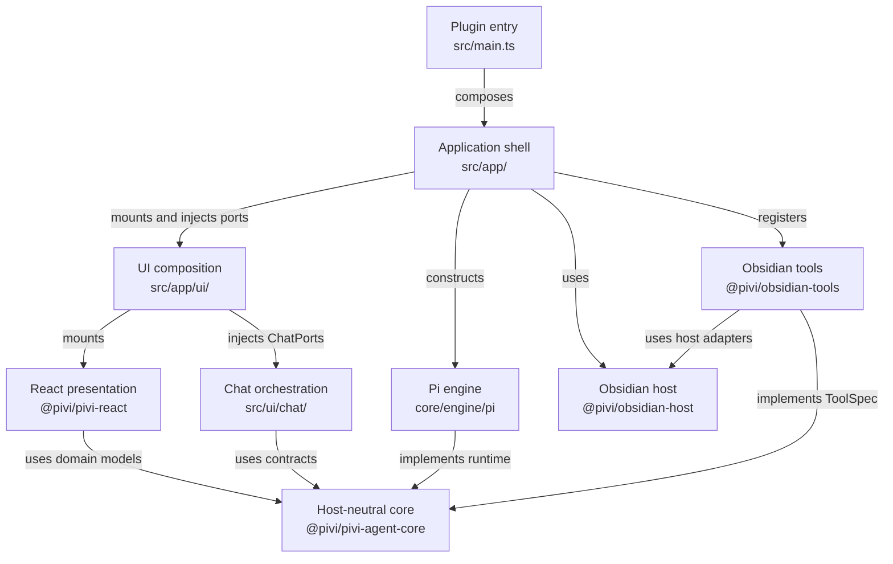
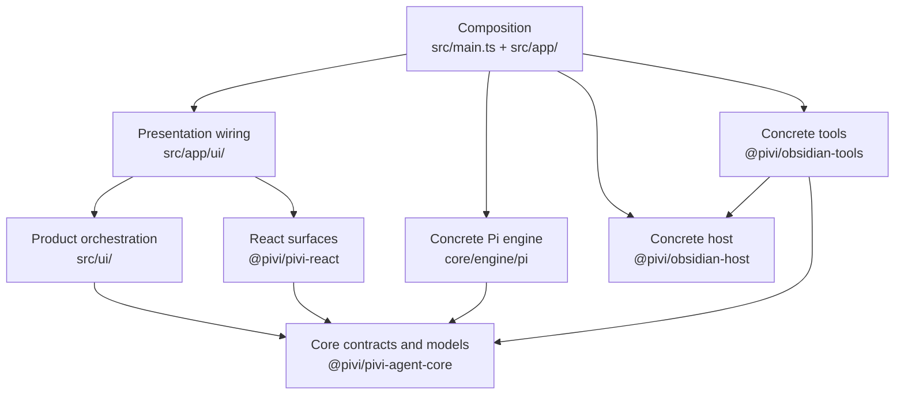
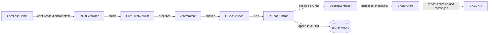

# Pivi developer handbook

This handbook is the narrative entry point for developers who are new to Pivi. It explains why the repository is shaped as it is, how a chat turn moves through the system, and how to change the plugin without crossing its ownership boundaries.

For a first contribution, follow the getting-started and architecture documents in the table below, then read the feature document closest to the change. Read the nearest `AGENTS.md` before editing code: those files contain operational rules and local invariants that are intentionally more prescriptive than this handbook.

## Documentation map

| Document | Use it when |
|---|---|
| [01 — Getting started](01-getting-started.md) | Preparing a checkout and making a first change |
| [02 — Architecture and technology](02-architecture-and-technology.md) | Understanding packages, dependency direction, and technical choices |
| [03 — Plugin lifecycle and composition](03-plugin-lifecycle-and-composition.md) | Changing startup, views, settings mounts, services, or shutdown |
| [04 — Input panel and context](04-input-panel-and-context.md) | Changing the composer, context indicators, selectors, mentions, or turn preparation |
| [05 — Tabs, sessions, and history](05-tabs-sessions-and-history.md) | Changing tab behavior, persistence, history, fork, or restore |
| [06 — Subagents, streaming, and rendering](06-subagents-streaming-and-rendering.md) | Changing delegated work, concurrency, streamed events, or subagent cards |
| [07 — Tools, skills, MCP, and integrations](07-tools-skills-mcp-and-integrations.md) | Adding or changing agent capabilities and host integrations |
| [08 — Presentation, settings, and inline edit](08-presentation-settings-and-inline-edit.md) | Changing React surfaces, styling, localization, or inline edit |
| [09 — Development, debugging, and validation](09-development-debugging-and-validation.md) | Testing, debugging, building, and validating a contribution |
| [10 — Roadmap, release, and maintenance](10-roadmap-release-and-maintenance.md) | Reviewing current technical priorities, publishing, or maintaining docs |
| [11 — Chat UI evolution](11-chat-ui-evolution.md) | Planning long-session architecture, Agent activity, context memory, and the future visual language |

## Overall architecture

Pivi is an Obsidian desktop plugin with one agent runtime: Pi. `src/main.ts` is the composition root. Application code constructs host services and the concrete engine, product UI orchestrates chat behavior through injected contracts, React owns product presentation, and reusable packages enforce host and runtime boundaries.

Imports and capabilities flow through explicit seams. Presentation does not construct engines, product UI does not reach into app workspace services, and host-neutral packages do not import Obsidian implementations.

## Representative chat turn

The visible input, persisted session content, and provider prompt are related but not identical. UI-only badges remain readable in history, while provider-only transforms and dynamic capability details stay out of durable data.

## Sources of truth

- Root `README.md` is the user-facing product overview.
- `docs/` is the canonical developer narrative for architecture, technology choices, end-to-end flows, development routes, and the technical roadmap.
- Root `AGENTS.md` is the repo-wide operational contract: commands, cross-cutting rules, release invariants, and commit discipline.
- Nested `AGENTS.md` files define package or feature ownership, allowed dependencies, cleanup rules, and local verification targets.
- Code, tests, package manifests, and persisted schemas remain authoritative when a document is wrong. Fix the document in the same change.

Every numbered page links back here. The roadmap, release, and maintenance document contains the documentation freshness checklist.
