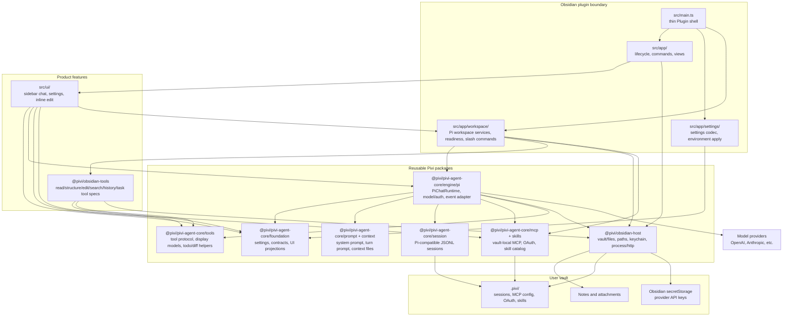

# Pivi Developer Documentation

Welcome to the developer documentation for Pivi (Pi as the Vault Intelligence). 

Pivi embeds the **Pi agent** directly inside Obsidian to provide in-process AI assistance (chat sidebar, inline-edits, and Obsidian-native tool access) with nanometer-precise context controls.

---

## 📚 Layered Documentation System

Pivi uses a layered, code-adjacent documentation system. Operational guides, terminology, and system maps live in `AGENTS.md` files close to the code they describe:

| Layer | Location | Content / Purpose |
| :--- | :--- | :--- |
| **Repo operations** | [AGENTS.md](../AGENTS.md) | Root developer guide (build, test, release, coding standards, glossary) |
| **Package contracts** | `packages/*/AGENTS.md` | Entrypoints, dependency boundaries, and package-specific rules |
| **Feature maps** | Nested `src/**/AGENTS.md` | Local UI/runtime flows and seam rules |
| **User-facing Releases** | [CHANGELOG.md](../CHANGELOG.md) | Generated version and release history |

---

## 🏗️ Architecture Overview

The Pivi codebase is structured to separate reusable, host-neutral agent foundations from Obsidian-specific UI and platform integrations:

### Core Design Decisions

1. **Pi-only Runtime**: All chat, subagent, and inline-edit features use a single, in-process Pi `Agent` runtime.
2. **Obsidian-Native Tools**: Files, properties, backlinks, and tags are accessed via official in-process Obsidian APIs where possible, ensuring safety and reliability.
3. **No-Ceremony Recovery**: Instead of interruptive plan-approval prompts, Pivi ensures changes are recoverable via Obsidian-native trash and file history (backed by the `obsidian_history` tool).
4. **Vault-Local Configuration**: MCP settings (`.pivi/mcp.json`), remote OAuth tokens (`.pivi/mcp-oauth/`), sessions, and vault skills are stored locally within the active vault.

---

## 🛠️ Quick Reference

- **Key Developer Guides**:
  - Root operations and conventions: [AGENTS.md](../AGENTS.md)
  - Core agent runtime & Pi engine: [packages/pivi-agent-core/AGENTS.md](../packages/pivi-agent-core/AGENTS.md)
  - Obsidian-native tools: [packages/obsidian-tools/AGENTS.md](../packages/obsidian-tools/AGENTS.md)
  - Obsidian/Electron host platform: [packages/obsidian-host/AGENTS.md](../packages/obsidian-host/AGENTS.md)
  - UI Localization: [src/i18n/AGENTS.md](../src/i18n/AGENTS.md)
  - Test suites and mocks: [tests/AGENTS.md](../tests/AGENTS.md)
- **Local Development**:
  - Run `npm run dev` to start esbuild in watch mode.
  - Run `npm run typecheck && npm run lint` to verify type and style guidelines.
  - Run `npm run test` or `npm run test:coverage` to execute the Jest test suite.
