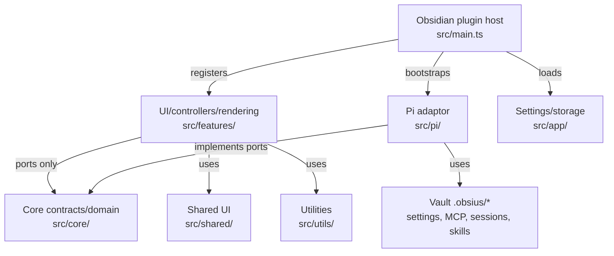

# System architecture

## Purpose

Describe how Obsius splits Obsidian UI, domain core, and Pi adaptor so multiple concerns (chat, MCP, settings) stay testable and swappable.

## Responsibilities

- Define layer boundaries and allowed dependency direction.
- Point to module-level docs for depth.

## Non-responsibilities

- Per-feature specs (see `docs/specs/`).
- Pi Coding Agent product documentation.

## Layers

### Source directories

| Directory | Description |
|-----------|-------------|
| src/shared/ | Reusable UI components: dropdowns, modals, mention system, badges |
| src/utils/ | Cross-cutting helpers: context resolution, inline editing, markdown, MCP, platform compatibility, etc. |
| src/i18n/ | Internationalization: bundled locale JSON and typed translation keys managed via ObsiusSettings |
| src/style/ | CSS modules organized by base, component, feature, settings, toolbar, and modal concerns |

## Key registries

| Registry | Role |
|----------|------|
| `PiAgentServices` | Pi agent facade (bootstrapped via `bootstrapPiAgent()`). |
| `AgentWorkspace` | Workspace services: MCP storage, OAuth, settings renderer. |
| `ChatRuntime` | Port implemented by `PiChatRuntime`. |

## Vault artifacts

| Path | Owner |
|------|--------|
| `.obsius/mcp.json` | MCP server registry + `_obsius2` metadata |
| `.obsius/mcp-oauth/` | OAuth tokens per server (hashed dirs) |
| `.obsius/settings.json` | Application settings file |

## Dependencies

- Obsidian plugin API
- Pi agent stack (adaptor only)
- MCP SDK (adaptor only)

## Design

Bootstrap (`main.ts`) calls `bootstrapPiAgent()` and initializes workspace services before views open. Each chat tab obtains a `ChatRuntime` from `PiAgentServices.createChatRuntime()` (`tabRuntime.ts`); features never construct Pi `Agent` directly.

## Alternatives considered

| Option | Why not |
|--------|---------|
| Features call Pi SDK directly | Locks UI to Pi; blocks testing and future runtimes |
| Monolith plugin file | Unmaintainable at current size |

## Failure modes

| Failure | Mitigation |
|---------|------------|
| Adaptor not installed | Settings show “Pi provider not initialized” |
| Workspace services missing | MCP UI hidden; chat may lack MCP tools |

## Open questions

- Whether to expose a formal `RuntimePort` interface document for third-party adaptors.

## Related

- [agent-runtime.md](./agent-runtime.md)
- [context-management.md](./context-management.md)
- [tool-system.md](./tool-system.md)
