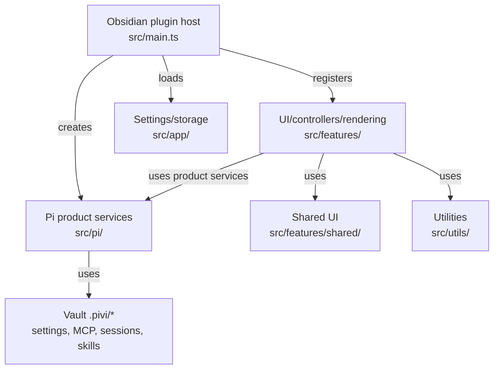

# System architecture

## Purpose

Describe Pivi's Pi-only product architecture: Obsidian UI, Pi runtime/workspace services, and the utilities that stay in `src/utils/`.

## Responsibilities

- Define layer boundaries and allowed dependency direction.
- Point to module-level docs for depth.

## Non-responsibilities

- Per-feature specs (see `docs/specs/`).
- Pi Coding Agent product documentation.

## Layers

### Source directories

| Directory | Description |
|-----------|-------------|
| src/utils/ | Cross-cutting helpers: context resolution, inline editing, markdown, MCP, platform compatibility, etc. |
| src/i18n/ | Internationalization: bundled locale JSON and typed translation keys managed via PiviSettings |
| src/style/ | CSS modules organized by base, component, feature, settings, toolbar, and modal concerns |

## Key services

| Service | Role |
|---------|------|
| `PiWorkspaceServices` | Concrete composition object for MCP storage, OAuth, skills, slash catalog, provider readiness, credentials, session store access, and settings rendering. |
| `PiChatRuntime` | Pi `Agent` lifecycle, turn preparation, streaming, MCP bridge, session sync. |
| `PiAuxQueryRunner` / Pi auxiliary services | One-off Pi runs for title generation and inline edit. |

## Vault artifacts

| Path | Owner |
|------|--------|
| `.pivi/mcp.json` | MCP server registry + `_pivi` metadata |
| `.pivi/mcp-oauth/` | OAuth tokens per server (hashed dirs) |
| `.pivi/settings.json` | Application settings file |
| `.pivi/sessions/` | JSONL session trees, fork metadata, and message history |

## Not implemented as dedicated subsystems

Some product seams are intentionally documented as part of the system boundary instead of separate architecture modules:

| Seam | Current state |
|------|---------------|
| Long-horizon memory / RAG | Not implemented. Current durable recall is session JSONL plus explicit turn context. If vector memory is added later, specify ownership, vault artifacts, and privacy rules before implementation. |
| Workflow orchestration | Limited to Pi’s internal tool loop, chat queued turns, and `SubagentManager`-managed subagent runs. Pivi does not run an explicit graph/workflow engine. |

## Dependencies

- Obsidian plugin API
- Pi agent stack (`src/pi/**`, with low-level SDK types kept out of UI props/state)
- MCP SDK (`src/pi/mcp/**`)

## Design

`main.ts` is the composition root. It creates the concrete `PiWorkspaceServices` object and plugin-owned storage/settings services before registering views, commands, inline edit, and settings UI. Chat tabs construct `PiChatRuntime` directly with the plugin plus the Pi workspace MCP/OAuth services they need; title generation and inline edit construct Pi auxiliary services directly.

Feature code may depend on Pivi-owned Pi product modules when that is the simplest path. It should still avoid direct imports of low-level external SDK packages (`@earendil-works/pi-*`, MCP SDK) unless the file is part of the Pi runtime/tooling layer.

## Alternatives considered

| Option | Why not |
|--------|---------|
| Maintain multi-runtime hexagonal architecture | Pi is the only supported runtime; registration/facade layers add complexity without product value. |
| Features call low-level Pi SDK packages directly | Leaks SDK churn into UI and tests; use Pivi-owned Pi product modules instead. |
| Monolith plugin file | Unmaintainable at current size |

## Failure modes

| Failure | Mitigation |
|---------|------------|
| Pi services not initialized before view construction | Fail fast in plugin-owned service getters; initialize services before registering/opening views. |
| Workspace services missing | MCP UI hidden; chat may lack MCP tools. |

## Related

- [agent-runtime.md](./agent-runtime.md)
- [context-management.md](./context-management.md)
- [tool-system.md](./tool-system.md)
