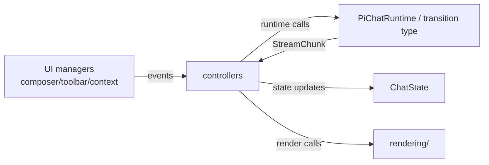

# UI integration

## Purpose

Bind Obsidian views, modals, and settings to Pi-owned product services and reusable prompt/domain helpers.

## Responsibilities

- `PiviView` / `TabManager` — chat tabs, service lifecycle.
- `InputController` — send, queue, built-ins (`/mcp-auth`), approvals.
- `MessageRenderer` / tool renderers — stream display.
- `PiviSettings` — providers, MCP list, env snippets.
- `InlineEditModal` — selection-based edit via auxiliary service.
- `InlineContext` composer tokens — explicit editor selections attached from the chat toolbar and serialized into the next turn.

## Non-responsibilities

- Agent loop implementation.
- MCP wire protocol.

## Interfaces

Features use:

- `PiWorkspaceServices` for MCP, OAuth, skills, slash commands, model readiness, and settings rendering.
- `PiChatRuntime` / the current `ChatRuntime` transition type from tab service.
- Pi UI/model config for model, reasoning, permission, and mode controls.

## Design

Feature UI may import Pivi-owned Pi product modules when it keeps the dependency path shorter. It should not import low-level external Pi SDK packages directly. Workspace and runtime dependencies should come from the plugin/view/tab through explicit constructors or callback props.

MCP toolbar and mention dropdown are Pi features and read from `PiWorkspaceServices`. Plan mode, fork, rewind, image attachments, and MCP controls are product behavior, not runtime capability flags. Rewind is conversation-only: it switches the active JSONL session leaf to the selected user message's parent checkpoint, reloads visible history from JSONL, restores that human prompt to the composer, rebuilds the Pi agent from the same branch, and keeps file-system changes intact. Rewind never derives the restored state by trimming the flattened UI message list; JSONL entries remain the source of truth so tool calls/tool results survive reload and rewind.

Inline context belongs in the chat UI layer as prompt-only input state. The current implementation snapshots the selected range from the toolbar action, inserts a composer-text token (`@[pivi-inline-context:...]`), extracts that token into `ChatTurnRequest.inlineContexts`, and leaves prompt serialization to pure prompt helpers. The earlier lavender-chip/editor-context-menu UX is deferred; see [inline-context-input-panel-spec.md](../specs/inline-context-input-panel-spec.md).

## Failure modes

| Failure | Mitigation |
|---------|------------|
| Runtime not ready | `ensureServiceInitialized` + notices |

## Related

- [system-architecture.md](./system-architecture.md)

## Related specs

- [inline-context-input-panel-spec.md](../specs/inline-context-input-panel-spec.md)

## Stable UI seams

### Chat tabs

`PiviView` owns the Obsidian `ItemView`; `TabManager` owns tab creation, switching, closing, restore, fork, and persisted tab layout. A tab is a data object composed by `createTab()`: state, controllers, renderers, input managers, toolbar controls, and a runtime reference are all wired explicitly.

Durable tab binding is session-oriented: plugin data stores `sessionFile`, `leafId`, and draft UI state such as selected model. In-memory `openSessionId` / `OpenSessionState` projections are rebuildable and should not become the durable identity.

### Controllers, state, and rendering

Controllers translate UI events and runtime stream chunks into state/rendering calls. `ChatState` is the feature-local projection for visible messages, pending tools, streaming flags, todos, usage, and render handles. Renderers own DOM output and accessibility details; controllers should not reach into Pi-specific event types.

The key separation is:

### Prompt/display boundary

Feature UI gathers user-visible input, attachments, MCP enabled servers, and inline-context tokens. `inputTurnSubmission` converts that into `ChatTurnRequest`; core runtime helpers build `PreparedChatTurn` and preserve separate display/API prompt data. Do not store MCP-transformed prompt text or inline-context XML as the visible user message.

### Settings UI

`PiviSettings` composes plugin settings. Pi-specific settings sections come from Pi workspace/services directly.

### Shared UI and mention system

`src/shared/` contains reusable widgets, modals, and mention infrastructure. Shared components should prefer props/callback injection over reading plugin globals or Pi services directly.

## Operational rules

- Use Obsidian DOM helpers and scoped `.pivi-*` CSS classes.
- Icon buttons and collapsible regions need accessible labels, keyboard support, and visible focus states.
- Managers that register DOM events, timers, editor highlights, or runtime callbacks must expose cleanup through the owning tab/modal lifecycle.
- Use active document/window patterns where popout compatibility matters.
- Keep feature-level implementation maps in local `AGENTS.md` files rather than expanding this architecture document.

## Local context files

- [`../../src/features/AGENTS.md`](../../src/features/AGENTS.md)
- [`../../src/features/chat/AGENTS.md`](../../src/features/chat/AGENTS.md)
- [`../../src/features/chat/tabs/AGENTS.md`](../../src/features/chat/tabs/AGENTS.md)
- [`../../src/features/chat/controllers/AGENTS.md`](../../src/features/chat/controllers/AGENTS.md)
- [`../../src/features/chat/rendering/AGENTS.md`](../../src/features/chat/rendering/AGENTS.md)
- [`../../src/features/chat/ui/AGENTS.md`](../../src/features/chat/ui/AGENTS.md)
- [`../../src/features/settings/AGENTS.md`](../../src/features/settings/AGENTS.md)
- [`../../src/shared/AGENTS.md`](../../src/shared/AGENTS.md)
