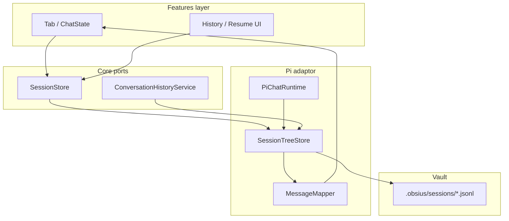

# Session tree (JSONL-only persistence)

## Problem

Chat history should persist and branch as a tree, with JSONL as the single source of truth. Earlier pre-release prototypes split metadata and turns; current storage is consolidated under `.obsius/`.

## Goals

- **JSONL-only SSOT** — all session data in tree-structured `.jsonl` files.
- **Restart recovery** — tabs and history reload messages and agent context from disk.
- **Tree semantics** — fork → new file; rewind → switch leaf in same file.
- **History UX** — pick session file, then pick leaf/checkpoint when branches exist.
- **Unified vault layout** — everything under `.obsius/`.
- **Hexagonal seam** — `core/` defines ports; `pi/` implements tree I/O and agent hydration.

## Non-goals

- pi-coding-agent TUI, `/resume` keybindings, or `pi install`.
- Guaranteed round-trip with `pi --fork` (best-effort read of pi-shaped entries only).
- Cross-vault session merge.
- Renaming CSS `obsius2-*` classes (orthogonal).

## Related

- Architecture: [context-management.md](../architecture/context-management.md) (update on implementation)
- Supersedes in part: [context-layers-spec.md](./context-layers-spec.md) § Session format

---

## Vault layout (target)

```text
.obsius/
  settings.json
  mcp.json
  mcp-oauth/
  skills/
  SYSTEM.md
  sessions/
    --<encoded-vault-path>--/
      <timestamp>_<uuid>.jsonl
```

**Encoding:** reuse `encodeSessionCwd(vaultPath)` → `--path-with-dashes--` (see `src/pi/session/obsiusSessionPaths.ts`).

**Plugin data** (`loadData` / `saveData`, not vault files): tab layout only.

```typescript
interface PersistedTabState {
  tabId: string;
  sessionFile: string | null;   // vault-relative path to .jsonl
  leafId: string | null;        // active tree position; null = default leaf
  draftModel?: string | null;
}
```

No `conversationId` in persisted tab state after migration.

---

## Session identity

| Concept | Identity |
|---------|------------|
| Session | One `.jsonl` file path (vault-relative) |
| Tree node | Entry `id` (8-char hex) |
| Active position | `leafId` (entry id of current branch tip) |
| Tab binding | `(sessionFile, leafId)` |

Remove the parallel **`Conversation.id`** ↔ **`.meta.json`** model. In-memory **`Conversation`** (or renamed **`SessionView`**) becomes a **projection** loaded from JSONL for UI convenience during an open tab.

---

## JSONL format

### Base (pi-inspired v3)

Follow pi-coding-agent tree rules unless noted:

- First line: `SessionHeader` (`type: "session"`, `version: 3`, `id`, `timestamp`, `cwd`).
- Subsequent lines: entries with `id`, `parentId`, `timestamp`.
- **`message`** entries: `AgentMessage` (`user`, `assistant`, `toolResult`, …).
- Context for agent: walk **leaf → root**, apply compaction/branch_summary rules (same as pi `buildSessionContext`).

Reference: pi [session-format.md](https://github.com/earendil-works/pi-mono/blob/main/packages/coding-agent/docs/session-format.md).

### Obsius extensions

Use **`custom`** entries (do not enter LLM context) for UI-only state. Latest entry of a given `customType` on the **leaf → root** path wins.

| `customType` | Purpose |
|--------------|---------|
| `obsius/session-meta` | `{ title, titleGenerationStatus, createdAt, lastResponseAt, usage? }` |
| `obsius/ui-context` | `{ currentNote?, externalContextPaths?, enabledMcpServers? }` |
| `obsius/message-ui` | `{ targetEntryId, displayContent?, contentBlocks?, durationSeconds?, … }` per message |

Use pi **`session_info`** for display title when set (optional; `obsius/session-meta.title` is authoritative for Obsius UI).

Use **`label`** entries for user-visible checkpoints (rewind/fork picker).

### Fork header

New file created on fork:

```json
{"type":"session","version":3,"id":"<new-uuid>","timestamp":"…","cwd":"<vault-path>","parentSession":".obsius/sessions/--…--/<source>.jsonl","forkedFromEntryId":"<entry-id>"}
```

Replay prefix entries (copy or reference — see Algorithm § Fork) then attach new branch at checkpoint.

### Divergence from pi-coding-agent

| Topic | pi TUI | Obsius |
|-------|--------|--------|
| Fork default | Often in-place branch in same file | **Always new `.jsonl` file** |
| Session list | `~/.pi/agent/sessions/` | `<vault>/.obsius/sessions/` |
| UI metadata | `session_info`, extensions | `obsius/*` custom entries |
| Strict compatibility | — | **Not required** |

---

## Data flow



### Turn lifecycle

1. **Send:** append `message` (user) to JSONL at current leaf; extend leaf pointer.
2. **Stream:** UI renders from `ChatState` (unchanged).
3. **Turn end:** append assistant + toolResult messages; append/update `obsius/message-ui` customs; append `obsius/ui-context` if changed; update `obsius/session-meta.lastResponseAt`.
4. **Agent sync:** rebuild agent messages from leaf via tree walk (same path as pi `buildSessionContext`).

### Load / restart

1. Tab restore reads `(sessionFile, leafId)` from plugin data.
2. `SessionStore.open(sessionFile, leafId)` parses JSONL, resolves leaf.
3. `MessageMapper.toChatMessages(entries)` → UI message list.
4. `PiChatRuntime.syncSession(sessionFile, leafId)` → agent `initialState.messages`.

---

## User experience

### History / resume

1. **Session list:** scan `.obsius/sessions/--<vault>--/*.jsonl`; sort by `lastResponseAt` or file mtime; show title from `obsius/session-meta` or `session_info` or first user message.
2. **Branch picker:** if file has multiple leaves (or labeled checkpoints), show secondary UI to pick leaf; default = latest leaf by timestamp.
3. **Open:** bind tab to `(sessionFile, leafId)`; render messages; lazy-init runtime on send.

### Fork

- User selects checkpoint (user message with prior assistant response).
- System creates **new JSONL** with `parentSession` + prefix up to checkpoint.
- Open in new tab (or current tab per existing fork modal).
- Source file unchanged; branches preserved.

### Rewind

- User selects earlier checkpoint in **current** session file.
- Set `leafId` to corresponding entry (ancestor of previous leaf).
- Re-render UI from truncated path; agent context rebuilt at new leaf.
- No entry deletion.

### New chat

- Create new JSONL via `SessionStore.create(vaultPath)`.
- Blank tab binds to new file with single root leaf.

---

## API / interfaces (core ports)

### `SessionStore` (replaces `SessionStorage`)

Location: `src/core/session/` (new).

```typescript
interface SessionRef {
  sessionFile: string;  // vault-relative
  leafId: string;
  sessionId: string;  // header uuid
}

interface SessionSummary {
  sessionFile: string;
  sessionId: string;
  title: string;
  updatedAt: number;
  leafCount: number;
  messagePreview: string;
}

interface SessionStore {
  listSessions(vaultPath: string): Promise<SessionSummary[]>;
  create(vaultPath: string): Promise<SessionRef>;
  open(sessionFile: string, leafId?: string): Promise<SessionRef>;
  listLeaves(sessionFile: string): Promise<LeafSummary[]>;
  getMessages(ref: SessionRef): Promise<ChatMessage[]>;
  appendUserTurn(ref: SessionRef, prompt: string, ui?: UserTurnUi): Promise<SessionRef>;
  appendAgentTurn(ref: SessionRef, messages: AgentMessage[], ui?: MessageUi[]): Promise<SessionRef>;
  setLeaf(ref: SessionRef, leafId: string): Promise<SessionRef>;
  fork(ref: SessionRef, atEntryId: string): Promise<SessionRef>;
  deleteSession(sessionFile: string): Promise<void>;
  readUiContext(ref: SessionRef): Promise<SessionUiContext>;
  writeUiContext(ref: SessionRef, patch: Partial<SessionUiContext>): Promise<void>;
  writeSessionMeta(meta: SessionMeta): void;
}
```

### `ConversationHistoryService` (narrowed)

Becomes a facade over `SessionStore` for bootstrap:

- `hydrateConversationHistory` → load JSONL into `Conversation.messages`
- `deleteConversationSession` → delete JSONL file
- Remove `buildPersistedAgentState` / `agentState.piSessionFile` — **`sessionFile` lives on tab/session ref**, not opaque agent blob.

### `ChatRuntime` changes

- `syncConversationState(conversation)` → `syncSession(sessionFile, leafId)`
- `buildSessionUpdates` → update JSONL customs + return `{ sessionFile, leafId, sessionId }`
- Remove in-memory-only session bridge that never persists assistant turns.

---

## Implementation plan (one release)

| Step | Work |
|------|------|
| 1 | **`StoragePaths`:** `.obsius/` constants; settings path `settings.json`. |
| 2 | **`SessionTreeStore`** in `src/pi/session/` — parse/append/fork/leaf; optionally wrap `@earendil-works/pi-coding-agent` `SessionManager` or vend minimal tree writer. |
| 3 | **`MessageMapper`** — JSONL entries ↔ `ChatMessage[]` (+ `obsius/message-ui` customs). |
| 4 | **Wire `PiChatRuntime`** — full turn persistence; hydrate on `ensureReady`. |
| 5 | **Replace `main.ts` conversation list** — scan JSONL; drop `.meta.json` read/write. |
| 6 | **TabManager / plugin data** — `sessionFile` + `leafId`; migrate old `conversationId`. |
| 7 | **History UI** — file list + branch picker component. |
| 8 | **Fork / rewind** — use `SessionStore.fork` / `setLeaf`; remove deep-clone fork path. |
| 9 | **Tests** — golden JSONL fixtures; restart hydration; fork file creation; leaf switch. |
| 10 | **Docs** — update architecture, roadmap, and related spec cross-links. |

## Current storage state

Vault layout is `.obsius/` only; tabs persist `sessionFile` + `leafId` (no `conversationId` in `data.json`).

---

## Evaluation

### Automated

- Parse/write golden JSONL (tree, fork header, custom entries).
- `MessageMapper` round-trip UI fields.
- Leaf walk matches agent message list for fixture sessions.

### Manual

1. Chat several turns → restart Obsidian → messages and MCP context restore.
2. Fork at message → new file appears under `.obsius/sessions/` → both branches intact.
3. Rewind → earlier leaf active; send continues branch from that point.
4. History lists files; branch picker appears for forked session.

---


## Resolved (from product review 2026-05-24)

| Question | Decision |
|----------|----------|
| SSOT | JSONL only |
| Meta sidecar | Remove |
| Fork | New JSONL file |
| Rewind | Switch leaf, same file |
| History | File list → leaf picker |
| Vault dir | `.obsius/` only |
| pi CLI 1:1 | Not required |
| Delivery | Single release (this spec) |
