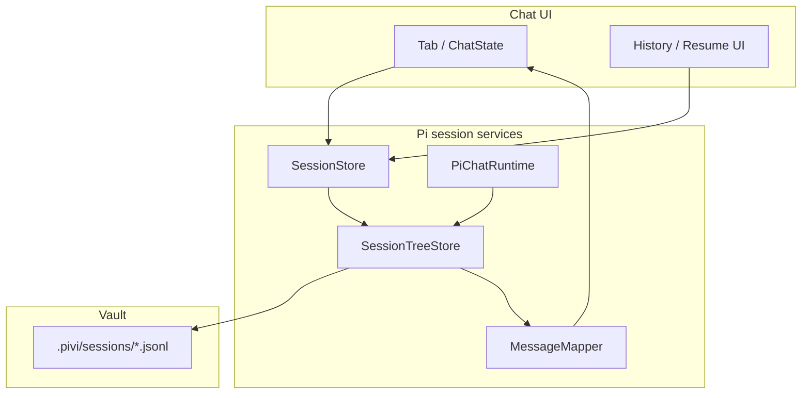

# Session tree (JSONL-only persistence)

## Problem

Chat history should persist and branch as a tree, with JSONL as the single source of truth. Earlier pre-release prototypes split metadata and turns; current storage is consolidated under `.pivi/`.

## Goals

- **JSONL-only SSOT** — all session data in tree-structured `.jsonl` files.
- **Restart recovery** — tabs and history reload messages and agent context from disk.
- **Tree semantics** — fork → new file; branch selection → open a specific leaf.
- **History UX** — pick session file, then pick leaf/checkpoint when branches exist.
- **Unified vault layout** — everything under `.pivi/`.
- **Pi-owned persistence** — Pi session modules own JSONL tree I/O and agent hydration; UI uses Pivi/Pi DTOs, not raw pi-coding-agent internals.

## Non-goals

- pi-coding-agent TUI, `/resume` keybindings, or `pi install`.
- Guaranteed round-trip with `pi --fork` (best-effort read of pi-shaped entries only).
- Cross-vault session merge.
- Renaming CSS `pivi-*` classes (orthogonal).
- Built-in public sharing service for session files.

## Future work

- **Session branch export/share:** optional export of a selected branch as pi-compatible JSONL. Define privacy redaction, attachment handling, and whether exported branches are importable before implementation.

## Related

- Architecture: [context-management.md](../architecture/context-management.md)
- Supersedes in part: [context-layers-spec.md](./context-layers-spec.md) § Session format

---

## Vault layout

```text
.pivi/
  settings.json
  mcp.json
  mcp-oauth/
  skills/
  SYSTEM.md
  sessions/
    --<encoded-vault-path>--/
      <timestamp>_<uuid>.jsonl
```

**Encoding:** reuse `encodeSessionCwd(vaultPath)` → `--path-with-dashes--` (see `src/pi/session/piviSessionPaths.ts`).

**Plugin data** (`loadData` / `saveData`, not vault files): tab layout only. Runtime-facing tab state uses `sessionFile` and `leafId`; rendering may keep a rebuildable in-memory projection, but durable identity remains the Pi session file plus active leaf.

```typescript
interface PersistedTabState {
  tabId: string;
  sessionFile: string | null;   // vault-relative path to .jsonl
  leafId: string | null;        // active tree position; null = default leaf
  draftModel?: string | null;
}
```

No feature-layer in-memory id in persisted plugin tab state after migration.

---

## Session identity

| Concept | Identity |
|---------|------------|
| Session | One `.jsonl` file path (vault-relative) |
| Tree node | Entry `id` (8-char hex) |
| Active position | `leafId` (entry id of current branch tip) |
| Tab binding | `(sessionFile, leafId)` |

Remove the parallel **UI id** ↔ **`.meta.json`** model from persisted storage. In-memory UI projections are loaded from JSONL for open tabs only; persisted restore state is always `sessionFile` + `leafId`.

---

## JSONL format

### Base (pi-inspired v3)

Follow pi-coding-agent tree rules unless noted:

- First line: `SessionHeader` (`type: "session"`, `version: 3`, `id`, `timestamp`, `cwd`).
- Subsequent lines: entries with `id`, `parentId`, `timestamp`.
- **`message`** entries: `AgentMessage` (`user`, `assistant`, `toolResult`, …).
- Context for agent: walk **leaf → root**, apply compaction/branch_summary rules (same as pi `buildSessionContext`).

Reference: pi [session-format.md](https://github.com/earendil-works/pi-mono/blob/main/packages/coding-agent/docs/session-format.md).

### Pivi extensions

Use **`custom`** entries (do not enter LLM context) for UI-only state. Latest entry of a given `customType` on the **leaf → root** path wins.

| `customType` | Purpose |
|--------------|---------|
| `pivi/session-meta` | `{ title, titleGenerationStatus, createdAt, lastResponseAt, usage? }` |
| `pivi/ui-context` | `{ currentNote?, externalContextPaths?, enabledMcpServers? }` |
| `pivi/message-ui` | `{ targetEntryId, displayContent?, contentBlocks?, durationSeconds?, … }` per message |

Use pi **`session_info`** for display title when set (optional; `pivi/session-meta.title` is authoritative for Pivi UI).

Use **`label`** entries for user-visible checkpoints in branch/fork pickers.

### Fork header

New file created on fork:

```json
{"type":"session","version":3,"id":"<new-uuid>","timestamp":"…","cwd":"<vault-path>","parentSession":".pivi/sessions/--…--/<source>.jsonl","forkedFromEntryId":"<entry-id>"}
```

Replay prefix entries (copy or reference — see Algorithm § Fork) then attach new branch at checkpoint.

### Divergence from pi-coding-agent

| Topic | pi TUI | Pivi |
|-------|--------|--------|
| Fork default | Often in-place branch in same file | **Always new `.jsonl` file** |
| Session list | `~/.pi/agent/sessions/` | `<vault>/.pivi/sessions/` |
| UI metadata | `session_info`, extensions | `pivi/*` custom entries |
| Strict compatibility | — | **Not required** |

---

### Dependency boundary

Pivi may reuse `@earendil-works/pi-coding-agent` JSONL/session and skill types inside Pi session modules (`src/pi/session/**`) and tests. UI controllers and persisted plugin state should depend on Pivi/Pi session DTOs such as `sessionFile`, `leafId`, and `OpenSessionState`, not raw pi-coding-agent symbols. If pi-coding-agent changes its internal session-manager paths or types, the compatibility fix belongs in `src/pi/session/*` mappers/bridges.

---

## Data flow



### Turn lifecycle

1. **Send:** append `message` (user) to JSONL at current leaf; extend leaf pointer.
2. **Stream:** UI renders from `ChatState` (unchanged).
3. **Turn end:** append assistant + toolResult messages; append/update `pivi/message-ui` customs; append `pivi/ui-context` if changed; update `pivi/session-meta.lastResponseAt`.
4. **Agent sync:** rebuild agent messages from leaf via tree walk (same path as pi `buildSessionContext`).

A visible chat exchange is grouped by **human user input**, not by Pi internal model/tool loop turns. One user message may serialize as:

```text
user → assistant(toolCall) → toolResult → assistant(toolCall) → toolResult → assistant(final text)
```

The UI may render that as one user bubble plus one assistant bubble, but JSONL keeps every `assistant` and `toolResult` entry so reload, branch selection, and rewind can reconstruct tool calls, tool results, diffs, ask-user answers, and reasoning blocks.

### Load / restart

1. Tab restore reads `(sessionFile, leafId)` from plugin data.
2. `SessionStore.open(sessionFile, leafId)` parses JSONL, resolves leaf.
3. `MessageMapper.toChatMessages(entries)` → UI message list.
4. `PiChatRuntime.syncSession(sessionFile, leafId)` → agent `initialState.messages`.

---

## User experience

### History / resume

1. **Session list:** scan `.pivi/sessions/--<vault>--/*.jsonl`; sort by `lastResponseAt` or file mtime; show title from `pivi/session-meta` or `session_info` or first user message.
2. **Branch picker:** if file has multiple leaves (or labeled checkpoints), show secondary UI to pick leaf; default = latest leaf by timestamp.
3. **Open:** bind tab to `(sessionFile, leafId)`; render messages; lazy-init runtime on send.

### Fork

- User selects checkpoint (user message with prior assistant response).
- System creates **new JSONL** with `parentSession` + prefix up to checkpoint.
- Open in new tab (or current tab per existing fork modal).
- Source file unchanged; branches preserved.

### Rewind

- User selects earlier checkpoint in **current** session file.
- Set `leafId` to the selected user message's parent entry (`null` for the first turn). This moves the active branch before that human interaction.
- Rehydrate UI from the JSONL branch at the new leaf; do **not** truncate the flattened in-memory `ChatState` as the source of truth.
- Restore the selected user prompt (and images, if any) into the composer so the user can resubmit or edit it.
- Agent context is rebuilt from the same JSONL branch, preserving all preceding assistant/tool/toolResult details.
- No entry deletion.
- File-system changes made by tools are not rolled back.

### New chat

- Create new JSONL via `SessionStore.create(vaultPath)`.
- Blank tab binds to new file with single root leaf.

---

## API / interfaces

### `SessionStore`

Location: `src/pi/session/` with transition types still shared through `src/pi/session/` where the current implementation needs them.

```typescript
interface SessionRef {
  sessionFile: string;  // vault-relative
  leafId: string;
  sessionId: string;  // header uuid
}

interface SessionSummary {
  sessionFile: string;
  sessionId: string;
  title: string;
  updatedAt: number;
  leafCount: number;
  messagePreview: string;
}

interface SessionStore {
  listSessions(vaultPath: string): Promise<SessionSummary[]>;
  create(vaultPath: string): Promise<SessionRef>;
  open(sessionFile: string, leafId?: string): Promise<SessionRef>;
  listLeaves(sessionFile: string): Promise<LeafSummary[]>;
  getMessages(ref: SessionRef): Promise<ChatMessage[]>;
  appendUserTurn(ref: SessionRef, prompt: string, ui?: UserTurnUi): Promise<SessionRef>;
  appendAgentTurn(ref: SessionRef, messages: AgentMessage[], ui?: MessageUi[]): Promise<SessionRef>;
  setLeaf(ref: SessionRef, leafId: string): Promise<SessionRef>;
  fork(ref: SessionRef, atEntryId: string): Promise<SessionRef>;
  deleteSession(sessionFile: string): Promise<void>;
  readUiContext(ref: SessionRef): Promise<SessionUiContext>;
  writeUiContext(ref: SessionRef, patch: Partial<SessionUiContext>): Promise<void>;
  writeSessionMeta(meta: SessionMeta): void;
}
```

### App/session orchestration

`OpenSessionManager` delegates durable session file operations to the Pi session store used by `main.ts`:

- Hydration loads JSONL into `OpenSessionState.messages`.
- Deletion removes the JSONL session file.
- `agentState.piSessionFile` is read only as a legacy migration fallback and stripped from future runtime session updates — **`sessionFile` lives on tab/session ref**, not opaque agent blob.

### `ChatRuntime` implementation status

- Current core contract still exposes a UI-projection sync call (`syncOpenSessionState(...)`) and `buildSessionUpdates(...)`.
- Pi session modules map those calls onto JSONL session files/leaf state through `src/pi/session/`.
- A future rename to explicit `syncSession(sessionFile, leafId)` remains possible, but the current API is an implemented compatibility layer over Pi sessions.

---

## Implementation status

| Area | Status | Notes |
|------|--------|-------|
| `.pivi/` storage paths | Done | Settings, MCP, OAuth, skills, and sessions are vault-local. |
| `SessionTreeStore` / JSONL tree I/O | Done | Implemented in `src/pi/session/`; parses, appends, forks, and applies leaves. |
| `MessageMapper` | Done | Maps Pi agent messages and Pivi UI metadata to/from chat messages. |
| `PiChatRuntime` persistence | Done | Appends turn messages and hydrates runtime state from JSONL session data. |
| Session list / history | Done | Scans JSONL-backed sessions and exposes leaves for branch selection. |
| Tab binding | Done | Plugin data persists `sessionFile`, `leafId`, and draft model; `openSessionId` remains rebuildable in-memory state. |
| Fork / branch selection | Done | Fork creates a new JSONL file; history can open a selected leaf without deleting entries. |
| Opaque `agentState` compatibility | Done | Legacy `agentState.piSessionFile` is read during restore/sync and stripped from subsequent persisted updates. New durable identity is top-level `sessionFile` + `leafId`. |
| Core runtime API naming | Done | `syncOpenSessionState(...)` and `buildSessionUpdates(...)` remain compatibility-layer method names, but the core type now explicitly carries `(sessionFile, leafId)`. |
| Tests | Done | Session tree fixtures cover custom metadata exclusion, message sync idempotence, live-store reopen behavior, and legacy `agentState.piSessionFile` migration. |

## Current storage state

Vault layout is `.pivi/` only; tabs persist `sessionFile` + `leafId` (no in-memory UI id in `data.json`).

---

## Evaluation

### Automated

- Parse/write golden JSONL (tree, fork header, custom entries).
- `MessageMapper` round-trip UI fields.
- Leaf walk matches agent message list for fixture sessions.

### Manual

1. Chat several turns → restart Obsidian → messages and MCP context restore.
2. Fork at message → new file appears under `.pivi/sessions/` → both branches intact.
3. Rewind → earlier leaf active; send continues branch from that point.
4. History lists files; branch picker appears for forked session.

---


## Resolved (from product review 2026-05-24)

| Question | Decision |
|----------|----------|
| SSOT | JSONL only |
| Meta sidecar | Remove |
| Fork | New JSONL file |
| Rewind | Switch leaf, same file |
| History | File list → leaf picker |
| Vault dir | `.pivi/` only |
| pi CLI 1:1 | Not required |
| Delivery | Single release (this spec) |
