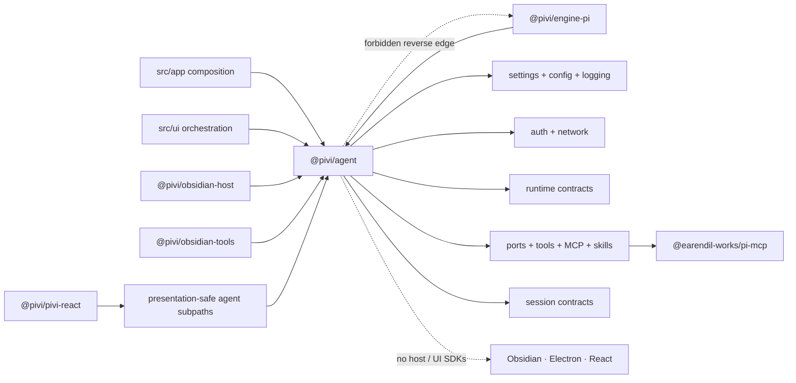

# @pivi/agent package guide

*This file extends the root [AGENTS.md](../../AGENTS.md). Follow root guidance first, then these package-specific rules.*

## Purpose

`@pivi/agent` holds Pivi agent logic that imports neither Obsidian nor the Pi SDK: contracts, tools, sessions, MCP, skills, prompt composition, and runtime seams. Pivi targets Obsidian only; the package stays free of host imports so its logic is unit-testable against injected ports, not so it can run elsewhere.

This file lists the rules for the package. Per-directory behavior detail is in [docs/12-architecture-status.md](../../docs/12-architecture-status.md#agent-package-subsystem-notes).

## Architecture

Arrows are compile-time dependencies. The engine and host adapters point inward to this package; `@pivi/agent` never points back to them.

## Directory map

| Directory | Owns |
|---|---|
| `auth/` | Provider credential secret IDs, provider environment variable names, provider/model-key validation, credential parsing, readiness derivation, custom-provider header secrets |
| `config/` | Structured `ConfigValueRef` sources (`plain`, `secret`, `systemEnvironment`) and failure-safe config publication |
| `context/` | Prompt context formatting, vault context-layer loading, inline context tokens, and the `context/mentions` API |
| `logging/` | `PluginLogger` |
| `mcp/` | MCP config storage, server management, OAuth, callback server, connection pool, tester, and the proxy `mcp` tool spec |
| `network/` | Egress policy: IP classification, URL normalization and redaction, DNS pinning helpers, redirect policy, private-origin grants |
| `ports/` | Host capability contracts: `FileStore`, `SyncSecretStore`, OAuth flow host, HTTP, bounded process execution, external opener, capability approval |
| `prompt/` | System-prompt module registry and composition, turn prompt, title prompt, registered-tool guidance, the character-based token estimator |
| `runtime/` | `ChatPorts`, `PiChatService`, `AuxQueryRunner`, turn types, context-envelope accounting, usage projection, persistent-grant cache |
| `session/` | Session contracts, open-session manager, path helpers, checkpoint and Agent-report schemas, the session journal schema |
| `settings/` | Settings contracts and defaults, device-local provider and environment state contracts, custom providers, model display metadata, toolbar normalization |
| `skills/` | Skill parsing and loading, vault skill inventory and publication, slash catalog contracts, workspace-command defaults |
| `tools/` | `ToolSpec`, tool presentation registry, Bash classifier and permission records, `pivi_*` management tool contracts, `pivi_sessions`, web search and fetch |

Concrete Pi SDK adapters, model and provider setup, OAuth flows, the chat runtime, compaction, and JSONL compatibility live in `@pivi/engine-pi`.

## Import rules

Enforced by `npm run check:architecture`.

- Never import `obsidian`, `electron`, React, `@pivi/obsidian-host`, `@pivi/obsidian-tools`, `@pivi/engine-pi`, `@pivi/pivi-react`, or product code under `@/*` or `src/*`.
- `mcp/` is the only directory that may import `@earendil-works/pi-mcp`. No other `@earendil-works/*` package is allowed anywhere in this package.
- Inside the package, use relative imports; `@pivi/agent/...` subpaths are for other packages.
- Import sibling modules by leaf file (`../runtime/chatTypes`), not through a sibling `index.ts`. Barrel imports inside the package create import cycles.
- `prompt/` must not import `runtime/`. Runtime builds on prompt; shared types such as `ImageAttachment` live in `context/`.
- `ports/` imports nothing from `@pivi/*`, Node, or host SDKs.
- `session/` performs no direct filesystem writes; directory creation stays with the concrete store.

## Exports

- There is no root `src/index.ts`. `package.json` lists directory barrels explicitly and exposes every other source file through the `./*` wildcard (`@pivi/agent/tools/toolSpec` → `src/tools/toolSpec.ts`). A new directory barrel needs its own export entry.
- `auth/`, `config/`, `logging/`, and `skills/` have no barrel; import their leaf files.
- `npm run check:dead-code` reports any export that nothing imports, including in files reached through the wildcard.

## Invariants

- **Host capabilities arrive through `ports/`.** The package exposes capabilities and contracts; it does not decide how the host stores files, secrets, or context. `@pivi/engine-pi` receives HTTP, process, secrets, fetch, and openers only through arguments typed by `ports/` or its own `PiRuntimeHost`.
- **Product UI depends on contracts, not runtimes.** `src/ui` uses `runtime/chatPorts`, `runtime/piChatService`, and `runtime/auxQueryRunner`; it never imports `@pivi/engine-pi` or constructs a runtime.
- **Secrets never sit inline.** Local provider and environment registries, MCP headers, and custom-provider headers store references; values live in `SecretStorage`. MCP publication stages new secrets before the config write and clears obsolete ones only after it succeeds.
- **Synced and device-local settings are distinct contracts.** `PersistedPiviSettings` omits provider membership, model preferences, `webSearchTools`, custom-provider context limits, and all environment fields; `DeviceLocalProviderStateV1` and `DeviceLocalEnvironmentStateV1` hold them; runtime `PiviSettings` is the overlay.
- **Every prompt rule has one owner.** `ToolSpec.promptUsage` holds argument contracts and examples; the registered-tools section holds capability-gated operational guidance; static core modules hold safety rules. Do not restate one in another. Core safety modules cannot be disabled or edited.
- **`toolPresentation.ts` is the single source** for tool kind, icon, translation keys, and summary. It returns untranslated tokens; React and imperative adapters translate.
- **Management tools are main-agent only.** `pivi_mcp`, `pivi_skills`, `pivi_commands`, and `pivi_prompt` reach the Pi registry only through `PiMainOnlyToolProvider`, never through the base provider. Their confirmation uses the one-shot `PiviManagementApprovalPort` and never shares persistent capability grants.
- **Capability approval has no session-duration decision.** Decisions are `deny`, `allow-once`, `allow-always`, and `cancel`. `CapabilityPersistentGrantCache` only accelerates already-committed persistent grants.
- **Only a provider aggregate is authoritative usage.** Locally decomposed context categories are estimates. Read-tool ceilings are fixed, not pressure-derived.
- **WebFetch rejects local and private targets before any provider attempt,** so the URL never reaches a third-party extractor.
- **Model-visible tool results are capped** with `capToolResultText` (50,000 characters).
- **Skills CLI runs pinned and shell-free.** Install and update use the exact pinned `skills` package as `node <cli.mjs>` with `shell: forbidden`; staged trees reject symlinks and escapes before the atomic publish. Skill orchestration requests confirmation through an injected callback and builds no host DOM.
- **Slash catalog `tool` entries are presentation tokens.** Never convert them into `SlashCommand` prompt templates.
- **MCP is remote Streamable HTTP only.** Stdio entries are skipped on load. Legacy SSE entries are rewritten to disabled HTTP entries and reported once through `McpServerManager.takeLegacySseServers()`. `mcpValidation.ts` enforces reserved server names and the remote URL policy at every import, storage, and UI boundary.
- **Session artifacts reference vault-relative paths only.** Rebuildable indexes and the session journal stay outside synced `.pivi/`.
- **Custom-provider installation is not here.** `settings/customProviders.ts` owns config types and normalization; installation lives in `@pivi/engine-pi/models/installPiCustomProviders`.

## Split modules

These oversized modules were split along stateless seams and keep their original export surface through re-exports:

- `settings/editorSelectionToolbarSettings.ts`, re-exported from `settings/types.ts`
- `settings/customProviderVisibleModels.ts`, re-exported from `settings/customProviders.ts`
- `mcp/mcpStorageRecords.ts`, re-exported from `mcp/mcpStorage.ts`

## Verification

There is no package-local build or typecheck. Verify with the root `npm run typecheck`, `npm run lint`, `npm run check:boundaries`, and the focused tests for the changed directory under `tests/unit/agent/`.
