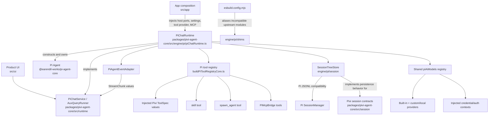

*This file extends the package [AGENTS.md](../../AGENTS.md) and root [AGENTS.md](../../../../AGENTS.md). Follow root guidance first, then package rules, then these local rules.*

## Purpose

`packages/pivi-agent-core/src/engine/pi/` is Pivi's adapter boundary around `@earendil-works/pi-agent-core`, `@earendil-works/pi-ai`, and the Pi coding-agent session implementation. It constructs in-process Pi agents, adapts Pivi tools and sessions to Pi SDK types, configures providers/authentication, and exposes host-neutral implementations of `PiChatService` and `AuxQueryRunner`.

This is the **only application source directory where raw `@earendil-works/*` imports are allowed**. Code outside this directory must consume Pivi-owned contracts and exports.

## Architecture

## Key modules

### Chat runtime and streaming

- `packages/pivi-agent-core/src/engine/pi/piChatRuntime.ts` is the concrete `PiChatService`.
  - It receives a narrow `PiRuntimeHost`, injected network ports, optional MCP services, and a `PiBaseToolProvider`; it must not discover Obsidian services itself.
  - `ensureReady()` resolves the selected model and provider auth, opens or creates the session tree, builds the tool registry and system prompt, loads persisted Pi messages, and constructs an `Agent`.
  - A non-forced readiness call hot-syncs tools and the prompt. Model/environment changes require forced reconstruction.
  - `query()` prepares dynamic external-context/tool state, subscribes to Pi events, calls `Agent.prompt()`, and drains normalized chunks through `StreamChunkQueue`.
  - User content is persisted before prompting. Assistant/tool messages are synchronized on `agent_end` and again after `prompt()` as a defensive final-state sync.
  - Cancellation aborts both the main agent and all background subagents. Changing the session file invalidates the current agent so the next readiness pass hydrates from the new session.
  - Manual `/compact` and threshold-based compaction summarize older JSONL entries through an auxiliary Pi agent and append a Pi compaction entry.
- `packages/pivi-agent-core/src/engine/pi/piAgentEventAdapter.ts` is the sole Pi-event-to-`StreamChunk` translator. It maps text, thinking, tool lifecycle, completion, and errors; do not leak raw `AgentEvent` values to UI/runtime consumers.
- `packages/pivi-agent-core/src/engine/pi/piRuntimeHost.ts` defines the narrow host surface available to the runtime.
- `packages/pivi-agent-core/src/engine/pi/piImageContent.ts` maps Pivi image attachments into pi-ai image content.
- `packages/pivi-agent-core/src/engine/pi/codexImageGenerator.ts` is a separately injected fetch/token client for the ChatGPT Codex image endpoint; it is not part of the normal chat-agent stream.

### Tool registry

- `packages/pivi-agent-core/src/engine/pi/buildPiToolRegistryCore.ts` owns registry composition.
  - The app injects host-specific tools as Pivi `ToolSpec` values through `PiBaseToolProvider`.
  - `toPiAgentTool()` in `piToolAdapter.ts` performs the narrow `ToolSpec` → Pi `AgentTool` conversion.
  - The registry adds the vault `skill` tool, conditionally adds `spawn_agent`, and appends MCP bridge tools.
  - It loads vault context layers and returns prompt appendices, registered-tool summary text, and external-context availability alongside the executable tools.
  - A missing base tool provider is an error; the Pi engine does not construct Obsidian tools.
- `packages/pivi-agent-core/src/engine/pi/createSkillTool.ts` exposes loaded vault skill bodies without moving skill parsing into the Pi layer.
- `packages/pivi-agent-core/src/engine/pi/createSubagentTool.ts` implements blocking and background delegation.
- `packages/pivi-agent-core/src/engine/pi/piAuxQueryRunner.ts` constructs lightweight, low-thinking Pi agents for title generation, inline/refine queries, compaction, and subagents.
- `packages/pivi-agent-core/src/engine/pi/piBackgroundSubagentJobs.ts` tracks concurrency, streamed nested tool activity, completion, cancellation, and reusable completed jobs. Subagents must not receive `spawn_agent` recursively.

### Models, providers, and auth

- `packages/pivi-agent-core/src/engine/pi/piAiModels.ts` owns the shared mutable pi-ai model registry. It installs explicitly supported built-in providers, Codex OAuth integration, credentials/auth context, and configured custom providers.
- `packages/pivi-agent-core/src/engine/pi/customProviders.ts` builds OpenAI-completions, OpenAI-responses, or Anthropic-compatible providers. Local providers may use a stable placeholder API key because upstream clients reject an empty key even when the server ignores authorization.
- Ollama, LM Studio, and llama.cpp model metadata may be incomplete until the server loads a model. `PiChatRuntime` refreshes their model/context metadata after the first successful prompt.
- `packages/pivi-agent-core/src/engine/pi/piModelRegistry.ts` caches models by `provider/modelId`, builds UI options, and tracks whether context-window metadata is authoritative.
- `packages/pivi-agent-core/src/engine/pi/piModelEnv.ts` resolves settings fallback models and delegates credential resolution through Pivi auth ports and `piAiModels`.
- `packages/pivi-agent-core/src/engine/pi/piProviderCredentialStore.ts` adapts injected synchronous secret storage to pi-ai's credential store and migrates legacy environment/keychain formats. SecretStorage is authoritative after migration.
- `packages/pivi-agent-core/src/engine/pi/piProviderOAuthService.ts` owns OpenAI Codex login, refresh-aware token lookup, logout, and legacy auth migration through injected OAuth and storage ports.
- `packages/pivi-agent-core/src/engine/pi/piThinkingLevels.ts`, `piChatUiConfig.ts`, and `piSettingsCoordinator.ts` project Pi model/reasoning behavior into Pivi-owned UI/settings contracts.

## Session relationship

- `packages/pivi-agent-core/src/session/` owns host-neutral contracts, identity, path helpers, UI metadata types, and session-management interfaces. It must not import Pi SDK types.
- `packages/pivi-agent-core/src/engine/pi/session/` implements those contracts using Pi JSONL and `SessionManager`:
  - `sessionTreeStore.ts` isolates Pi `SessionManager`, append/sync/fork/truncate behavior, compaction entries, and Pivi custom JSONL entries.
  - `piSessionStore.ts` implements the package-level `SessionStore` and maps durable JSONL sessions to Pivi `SessionRef`, `ChatMessage`, usage, metadata, and UI context.
  - `agentMessageHistory.ts` compares and sanitizes Pi message history before persistence or LLM submission.
  - `messageMapper.ts` reconstructs visible Pivi messages, tool calls, images, and UI overlays from Pi entries.
  - `piContextCompaction.ts` owns token estimation, compaction thresholds, cut-point selection, and summary prompts.
  - `visibleSessionEntries.ts` identifies the latest visible user/assistant entry.
- Pivi restores an existing session as a **linear append-order conversation**, not as a selected Pi tree leaf. Tree support remains a compatibility detail used for old files and creating a fork in a new session file.
- Runtime agent state is rebuildable; the JSONL session file is the durable source of truth.
- `SessionTreeStore` deliberately uses isolated Pi internals (`fileEntries`, `_buildIndex()`, `_rewriteFile()`, `flushed`) for early persistence and rewind because upstream lacks equivalent public APIs. Keep such access contained there.

## Boundaries

- Raw imports matching `@earendil-works/*` belong only under `packages/pivi-agent-core/src/engine/pi/`. Do not spread Pi SDK types into `foundation/`, `runtime/`, `tools/`, `session/`, MCP, host packages, app code, or UI.
- Export Pivi-owned contracts at the boundary: `PiChatService`, `AuxQueryRunner`, `ToolSpec`, `StreamChunk`, `SessionStore`, and related foundation/session types.
- Do not import `obsidian`, `electron`, `@pivi/obsidian-host`, `@pivi/obsidian-tools`, product UI, or app implementation modules here.
- Host filesystem, secrets, HTTP, process environment, OAuth browser opening, and fetch behavior must arrive through `ports/`, `PiRuntimeHost`, or explicit function arguments.
- Keep concrete Obsidian tool construction in app composition. The registry accepts a `PiBaseToolProvider`; it does not know how host tools work.
- UI must depend on `PiChatService`, `AuxQueryRunner`, and app-provided facades, not construct `PiChatRuntime` or import this implementation directly.
- Keep Pi compatibility casts and upstream-internal access narrow and documented. Do not normalize the rest of the package around Pi's types.

## Shims

- `packages/pivi-agent-core/src/engine/pi/shims/piCodingAgentConfig.ts` replaces upstream coding-agent config because its top-level `import.meta.url` is incompatible with Pivi's bundled CommonJS `main.js`. Its version/constants must stay aligned with the installed Pi package.
- `packages/pivi-agent-core/src/engine/pi/shims/piAiCompat.ts` provides the compatibility API expected by upstream code while routing model lookup and streaming through Pivi's shared `piAiModels` registry. It also supports dynamically registered API providers and Pivi's environment-key shim.
- `packages/pivi-agent-core/src/engine/pi/shims/piAiEnvApiKeys.ts` replaces upstream dynamic `import("node:" + "fs")` behavior, which Electron's renderer can treat as a URL fetch. It uses synchronous Node modules behind a configurable environment host.
- `packages/pivi-agent-core/src/engine/pi/shims/signalExit.cjs` supplies the callable CommonJS shape expected by `proper-lockfile`. Exit cleanup is intentionally a no-op inside Obsidian.
- These files are activated by aliases/plugins in `esbuild.config.mjs` and the bundle-analysis configuration. A shim file alone has no effect; build aliases and analyzed-build aliases must remain consistent.

## Gotchas

- Obsidian loads a CommonJS renderer bundle. Upstream `import.meta.url`, ESM/CJS interop assumptions, and dynamic `node:` imports can fail only at plugin load time even when TypeScript succeeds.
- `esbuild.config.mjs` rewrites remaining dynamic `node:` imports/requires and fails the build if any survive. Provider upgrades can change minified patterns and require deliberate shim/rewrite updates.
- The shared `piAiModels` registry is mutable and module-global. Configure credentials, auth context, and custom providers before constructing runtimes; refresh the model cache after provider changes.
- Do not assume `process.env` contains plugin settings. Provider credentials normally resolve through injected auth context and SecretStorage; Obsidian does not inherit a pi-coding-agent shell environment.
- Context-window values for custom/local models may be synthetic. Auto-compaction preflight only trusts authoritative metadata; local model metadata can become authoritative after first-load refresh.
- Tool registry changes also affect the system-prompt key. Keep executable tools, registered-tool summaries, context appendices, and external-context availability synchronized.
- The persisted user text may differ from the API prompt because the latter contains context/MCP transformations. Session synchronization uses explicit user-message equivalences to avoid duplicate turns.
- Pi may defer creating a session file until an assistant message. `SessionTreeStore.flushToDisk()` intentionally forces the header/user turn to disk and updates Pi's private `flushed` flag.
- `agent_end` and post-`prompt()` synchronization are intentionally redundant safeguards; preserve idempotent missing-message detection when changing persistence.
- Background subagent chunks are routed to the active `spawn_agent` tool call when owned by the current turn; otherwise they go to runtime listeners. Preserve tool-call IDs when changing this flow.
