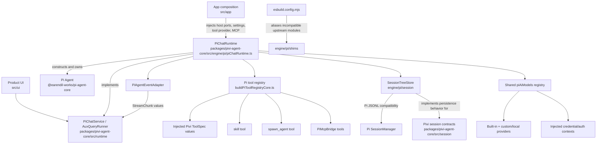

*This file extends the package [AGENTS.md](../../../AGENTS.md) and root [AGENTS.md](../../../../../AGENTS.md). Follow root guidance first, then package rules, then these local rules.*

## Purpose

`packages/pivi-agent-core/src/engine/pi/` is Pivi's adapter boundary around `@earendil-works/pi-agent-core`, `@earendil-works/pi-ai`, and the Pi coding-agent session implementation. It constructs in-process Pi agents, adapts Pivi tools and sessions to Pi SDK types, configures providers/authentication, and exposes host-neutral implementations of `PiChatService` and `AuxQueryRunner`.

This is the **only application source directory where raw `@earendil-works/*` imports are allowed**. Code outside this directory must consume Pivi-owned contracts and exports.

## Architecture

## Key modules

### Chat runtime and streaming

- `packages/pivi-agent-core/src/engine/pi/piChatRuntime.ts` is the concrete `PiChatService`.
  - It receives a narrow `PiRuntimeHost`, injected network ports, optional MCP services, and a `PiBaseToolProvider`; it must not discover Obsidian services itself.
  - `ensureReady()` resolves the selected model and provider auth, opens or creates the session tree, builds the tool registry and system prompt, loads persisted Pi messages, and constructs an `Agent`.
  - A non-forced readiness call hot-syncs tools and the prompt. Model/environment changes require forced reconstruction.
  - `query()` prepares dynamic external-context/tool state and owns the active-turn boundary used by cancellation and subagent routing.
  - User content is persisted before prompting. Assistant/tool messages are synchronized at each completed assistant/tool loop before any next provider request, then again after `prompt()` as a defensive final-state sync. After an in-turn compaction, final synchronization appends only the new suffix so compacted history cannot become active again.
  - Transient assistant failures use the Pivi-owned retry state machine rather than pi-coding-agent `AgentSession`. Context overflow remains owned by the existing compaction preflight; other upstream-classified network, rate-limit, timeout, and 5xx failures discard the failed attempt from durable/model history and retry through `Agent.continue()` after abortable 2/4/8-second delays. Three retries are allowed. Retry orchestration replaces any live partial attempt before recovery continues, while the error becomes visible only when the policy settles on a terminal failure. Restored legacy error attempts remain visible history but are excluded from LLM replay.
  - Cancellation aborts both the main agent and all background subagents. Changing the session file invalidates the current agent so the next readiness pass hydrates from the new session.
  - Automatic compaction uses a fixed bounded 85% trigger and starts an invisible Pass 1 ten context-window percentage points earlier. The runtime reevaluates that policy after every completed assistant/tool batch and may compact inside one user turn before Pi sends its next provider continuation. Pi's `buildContextEntries`, `findCutPoint`, and message conversion select the active context and preserve a safe weighted 95/5 turn/tool split as structured model input. Pass 1 summarizes the prefix into an in-memory `NOTE₁`; Pass 2 combines it with the raw tail and produces the validated full-replacement `NOTE₂`. `/compact [instructions]` keeps the same flow and applies instructions only to Pass 2. A manual instruction waiting behind a successful threshold compaction performs a bounded single-pass rewrite of the resulting NOTE; lifecycle/session/model invalidation cancels the waiting request. Both paths use the current chat model, no tools, low thinking, cancellation, and a 120-second timeout; failed sampling uses the bounded full-context fallback and never writes invalid output.
  - A successful run appends an invisible ordinary custom boundary followed by a standard Pi compaction whose `firstKeptEntryId` targets that boundary. Before appending, the runtime revalidates the session, active model, lifecycle generation, and exact active-context fingerprint so a concurrent turn cannot be compacted away. Pi therefore rebuilds the active LLM context as exactly `NOTE₂`, then `NOTE₂ + new messages`, while the append-only pre-compaction JSONL trace remains available to UI history, reopen, and fork. Trailing compactions remain visible Memory boundaries in both full and paged transcript restoration even though their internal custom boundary stays hidden. Valid drafts produce `details.piviCheckpoint`; chained writes merge durable decisions/artifacts and render the merged ledger into the plain-summary compatibility field. Live chunks and restored-session mapping normalize valid checkpoints into the foundation-owned `CheckpointPresentation`; React never reads engine/session schema types. Provider usage remains authoritative when explicitly marked, while local estimates distinguish ASCII, CJK/non-ASCII, code/JSON, tool structure, and images.
- `packages/pivi-agent-core/src/engine/pi/piChatRuntimeTurn.ts` owns one prompt's event subscription, pre-prompt user persistence, `Agent.prompt()` call, usage/compaction updates, and `StreamChunkQueue` drain/cleanup. It reports durable ids through narrow callbacks while `PiChatRuntime` retains cross-turn state ownership.
- `packages/pivi-agent-core/src/engine/pi/piChatRetry.ts` owns transient-error classification, retry budget/backoff, failed-attempt context removal, and abortable waiting. Keep it aligned with pi-ai's `isRetryableAssistantError` / `isContextOverflow` classification without importing pi-coding-agent `AgentSession`.
- `packages/pivi-agent-core/src/engine/pi/piAgentEventAdapter.ts` is the sole Pi-event-to-`StreamChunk` translator. It maps text, thinking, tool lifecycle, completion, and errors; do not leak raw `AgentEvent` values to UI/runtime consumers.
- `packages/pivi-agent-core/src/engine/pi/piRuntimeHost.ts` defines the narrow host surface available to the runtime.
- `packages/pivi-agent-core/src/engine/pi/piImageContent.ts` maps Pivi image attachments into pi-ai image content.
- `packages/pivi-agent-core/src/engine/pi/codexImageGenerator.ts` is a separately injected fetch/token client for the ChatGPT Codex image endpoint; it is not part of the normal chat-agent stream. Its default Codex routing model is `gpt-5.6-sol`, while the image-generation tool reports `gpt-image-2` as the backend image model.

### Tool registry

- `packages/pivi-agent-core/src/engine/pi/buildPiToolRegistryCore.ts` owns registry composition.
  - The app injects host-specific tools as Pivi `ToolSpec` values through `PiBaseToolProvider`.
  - `toPiAgentTool()` in `piToolAdapter.ts` performs the narrow `ToolSpec` → Pi `AgentTool` conversion.
  - The registry adds the vault `skill` tool, conditionally adds `spawn_agent`, and appends MCP bridge tools.
  - It loads vault context layers and returns prompt appendices, registered-tool summary text, and external-context availability alongside the executable tools.
  - A missing base tool provider is an error; the Pi engine does not construct Obsidian tools.
- `packages/pivi-agent-core/src/engine/pi/createSkillTool.ts` exposes loaded vault skill bodies without moving skill parsing into the Pi layer.
- `packages/pivi-agent-core/src/engine/pi/createSubagentTool.ts` implements blocking and background delegation. Its canonical validated tool input requires `label` (short stable card name), `message` (complete delegated instructions), and `run_in_background`; user permission to use subagents counts as an instruction for safely parallel work, and large context lists should fill the configured maximum with balanced background batches in one assistant response. `false` is reserved for deliberately blocking work. Direct execution defensively treats a missing mode as background, but the schema must not make it optional or reintroduce ambiguous `description`/`prompt` aliases. Valid fenced Agent reports become compact parent text while raw terminal output remains in tool details; malformed output preserves the legacy text path. The parent tool abort signal remains connected through blocking query completion or background result delivery.
- `packages/pivi-agent-core/src/engine/pi/piAuxQueryRunner.ts` constructs lightweight, low-thinking Pi agents for title generation, inline/refine queries, and subagents.
- `packages/pivi-agent-core/src/engine/pi/piReadBudget.ts` reserves one per-agent, per-query read allowance synchronously. Parent and child Agents never share read pressure, and sibling read calls cannot each claim the full remaining headroom.
- `packages/pivi-agent-core/src/engine/pi/piCompactionSampler.ts` is the tool-less, low-thinking sampler dedicated to compaction. It streams through the shared pi-ai registry with the active chat model and injected provider auth; it does not create an Agent, reuse the title model, or persist session state.
- `packages/pivi-agent-core/src/engine/pi/piBackgroundSubagentJobs.ts` tracks streamed nested tool activity, completion, cancellation, and independently bounded completed-job retention. `subagentConcurrencyLimiter.ts` owns atomic FIFO admission; app composition creates one limiter per plugin workspace and injects it into every chat/aux runner so the configured background concurrency limit is shared across tabs. A lease and abort forwarding span agent creation through prompt completion/error/cancellation. Workspace disposal rejects queued/future admissions before other runtime resources are released. Subagents must not receive `spawn_agent` recursively.

### Models, providers, and auth

- `packages/pivi-agent-core/src/engine/pi/piAiModels.ts` owns the shared mutable pi-ai model registry. It installs explicitly supported built-in providers, wires credentials/auth context, and configured custom providers. xAI and Anthropic API providers expose API-key auth only. `splitProviderAuth.ts` installs the OAuth-only `claude` provider over Anthropic's API implementation. `grokBuildProvider.ts` owns the OAuth-only `grok-build` Responses transport: it mirrors pi-ai's upstream xAI model list under the isolated subscription namespace without local model additions, then applies the subscription proxy, Grok client/model-override headers, and payload normalization. Interactive OAuth providers delegate login/logout to pi-ai through `piAuthInteraction.ts`. `registerBundledPiOAuthFlows()` statically registers the bundled OAuth loaders with injected fetch before model configuration, avoiding renderer-time dynamic module loading.
- `packages/pivi-agent-core/src/engine/pi/installPiCustomProviders.ts` builds OpenAI-completions, OpenAI-responses, or Anthropic-compatible providers. Anthropic-compatible settings retain `/v1` for model discovery (`/v1/models`) but runtime models receive the API root because pi-ai appends `/v1/messages`. Local providers may use a stable placeholder API key because upstream clients reject an empty key even when the server ignores authorization.
- Ollama, LM Studio, and llama.cpp model metadata may be incomplete until the server loads a model. `PiChatRuntime` refreshes their model/context metadata after the first successful prompt.
- `packages/pivi-agent-core/src/engine/pi/piModelRegistry.ts` caches models by `provider/modelId`, builds UI options, and tracks whether context-window metadata is authoritative.
- `packages/pivi-agent-core/src/engine/pi/piModelEnv.ts` resolves settings fallback models and delegates credential resolution through Pivi auth ports and `piAiModels`.
- `packages/pivi-agent-core/src/engine/pi/piProviderCredentialStore.ts` adapts injected synchronous secret storage to pi-ai's credential store and migrates legacy environment/keychain formats only for providers recorded in durable settings. Each read, write, refresh, and delete targets one provider's canonical key; no fallback crosses API-key and plan namespaces. `migrateSplitSubscriptionOAuthCredentials()` preserves any existing plan credential, clears legacy OAuth from `xai`/`anthropic`, and records only successfully OAuth-backed model namespaces for settings-load migration.
- `packages/pivi-agent-core/src/engine/pi/piProviderOAuthService.ts` owns interactive provider OAuth for OpenAI Codex, Grok Build (`grok-build`), and Claude (`claude`): pi-ai login/logout uses the exact provider id and therefore touches only that provider's credential. OAuth descriptions explain the required xAI account or Claude Pro/Max subscription without folding the authentication method into the provider name. Legacy Codex auth migration still uses injected storage ports. `piAuthInteraction.ts` maps browser URLs, device-code pages, and manual-code prompts onto the OAuth host; manual-code waits observe both pi-ai's prompt signal and the Pivi login cancellation signal. `piviXaiOAuthDeviceFlow.ts` uses injected fetch and prefers `verification_uri_complete` over `verification_uri` before opening the browser.
- `packages/pivi-agent-core/src/engine/pi/piThinkingLevels.ts`, `piChatUiConfig.ts`, and `piSettingsCoordinator.ts` project Pi model/reasoning behavior into Pivi-owned UI/settings contracts.

## Session relationship

- `packages/pivi-agent-core/src/session/` owns host-neutral contracts, identity, path helpers, UI metadata types, and session-management interfaces. It must not import Pi SDK types.
- `packages/pivi-agent-core/src/engine/pi/session/` implements those contracts using Pi JSONL and `SessionManager`:
  - `sessionTreeStore.ts` isolates Pi `SessionManager`, append/sync/fork/truncate behavior, compaction entries, and Pivi custom JSONL entries. Its full-replacement compaction operation appends the invisible custom boundary before the standard compaction without rewriting prior JSONL. Import Pi session types from the package root; private `dist/core/*` paths are not a supported source boundary.
  - `sessionJsonlIndex.ts` owns the rebuildable `.pivi-index` sidecar: UTF-8 byte offsets, projection metadata, per-line hashes, append-only checkpoints, migration markers, bounded source fingerprints, incremental append refresh, rewrite invalidation, and verified indexed-line reads. JSONL remains authoritative; low-level stale/corrupt validation raises the typed errors owned by `session/types.ts`, while read-only consumers discard that optimization and rebuild before returning data. Held mutation fingerprints never auto-recover.
  - `piSessionStore.ts` implements the package-level `SessionStore` and maps durable JSONL sessions to Pivi `SessionRef`, `ChatMessage`, usage, metadata, and UI context. Identity, history summaries, usage, UI context, and bounded message pages read verified indexed lines; full `getMessages()` remains the explicit runtime/compatibility path. Absolute external-context paths are removed at every JSONL write and overlaid from an injected device-local store on read. Startup/lazy-open migration consults the sidecar marker, single-flights each file, and rewrites only legacy JSONL while preserving line order/final-newline shape; marker-complete files never reread the body. Startup warns and skips a malformed session so one corrupt JSONL cannot block the plugin; explicitly opening that session still fails with its file/line.
  - `agentMessageHistory.ts` compares and sanitizes Pi message history before persistence or LLM submission.
  - `messageMapper.ts` reconstructs visible Pivi messages, tool calls, images, and UI overlays from Pi entries. A complete `message_ui.contentBlocks` overlay remains authoritative, while a final-segment-only overlay reconciles matching tool/subagent presentation by ID without dropping the earlier Pi-native block order. `subagentMessageRecovery.ts` repairs a missing or incomplete `message_ui` subagent projection from Pi-native `spawn_agent` input/result fields, while a complete persisted `SubagentInfo` remains authoritative.
  - `piContextCompaction.ts` owns the fixed 85%/10%/95:5 policy, vault-native prompt/schema validation, CJK-aware conservative estimates, Pi-native cut-point/structured message conversion, prefix fingerprints, and checkpoint merge/rendering.
  - `visibleSessionEntries.ts` identifies the latest visible user/assistant entry.
- Pivi restores an existing session as a **linear append-order conversation**, not as a selected Pi tree leaf. Tree support remains a compatibility detail used for old files and creating a fork in a new session file.
- Runtime agent state is rebuildable; the JSONL session file is the durable source of truth.
- Device-local external-context overlays are deliberately not part of durable session identity. Fork copies the source overlay to the new session file; redo reuses the same session overlay and recaptures current capabilities when the turn is submitted again.
- `SessionTreeStore` deliberately uses isolated Pi internals (`fileEntries`, `_buildIndex()`, `_rewriteFile()`, `flushed`) for the one-time eager header bootstrap and rewind because upstream lacks equivalent public APIs. Normal message, custom-entry, and compaction writes use Pi's public typed append methods and must not rewrite prior JSONL bytes. Keep private access contained there.
- Source imports Pi's public session, compaction, and message exports from the package root. The production build narrows that root import to a generated facade over upstream `core/session-manager.js`, `core/compaction/index.js`, and `core/messages.js` because the root ESM entrypoint statically re-exports the CLI/TUI; keep this build adaptation aligned with the consumed public exports and covered by production-build verification.
- Do not widen that facade to `AgentSession` without an explicit architecture and bundle review. In the installed 0.80.10 graph, a forced production import increased the measured plugin bundle from about 3.0 MiB to 7.9 MiB and required substantially broader config/pi-ai compatibility shims.

## Boundaries

- Raw imports matching `@earendil-works/*` belong only under `packages/pivi-agent-core/src/engine/pi/`. Do not spread Pi SDK types into `foundation/`, `runtime/`, `tools/`, `session/`, MCP, host packages, app code, or UI.
- Export Pivi-owned contracts at the boundary: `PiChatService`, `AuxQueryRunner`, `ToolSpec`, `StreamChunk`, `SessionStore`, and related foundation/session types.
- Do not import `obsidian`, `electron`, `@pivi/obsidian-host`, `@pivi/obsidian-tools`, product UI, or app implementation modules here.
- Host filesystem, secrets, HTTP, process environment, OAuth browser opening, and fetch behavior must arrive through `ports/`, `PiRuntimeHost`, or explicit function arguments.
- Keep concrete Obsidian tool construction in app composition. The registry accepts a `PiBaseToolProvider`; it does not know how host tools work.
- UI must depend on `PiChatService`, `AuxQueryRunner`, and app-provided facades, not construct `PiChatRuntime` or import this implementation directly.
- Keep Pi compatibility casts and upstream-internal access narrow and documented. Do not normalize the rest of the package around Pi's types.

## Shims

- `packages/pivi-agent-core/src/engine/pi/shims/piCodingAgentConfig.ts` replaces upstream coding-agent config because its top-level `import.meta.url` is incompatible with Pivi's bundled CommonJS `main.js`. Its version/constants must stay aligned with the installed Pi package.
- `packages/pivi-agent-core/src/engine/pi/shims/piAiCompat.ts` provides the compatibility API expected by upstream code while routing model lookup and streaming through Pivi's shared `piAiModels` registry. It also supports dynamically registered API providers and Pivi's environment-key shim.
- `packages/pivi-agent-core/src/engine/pi/shims/piAiEnvApiKeys.ts` replaces upstream dynamic `import("node:" + "fs")` behavior, which Electron's renderer can treat as a URL fetch. It uses synchronous Node modules behind a configurable environment host.
- `packages/pivi-agent-core/src/engine/pi/shims/signalExit.cjs` supplies the callable CommonJS shape expected by `proper-lockfile`. Exit cleanup is intentionally a no-op inside Obsidian.
- These files are activated by shared aliases/plugins under `build/create-build-options.mjs` and `build/plugins/`, used by both production and bundle analysis. A shim file alone has no effect.

## Gotchas

- Obsidian loads a CommonJS renderer bundle. Upstream `import.meta.url`, ESM/CJS interop assumptions, and dynamic `node:` imports can fail only at plugin load time even when TypeScript succeeds.
- `build/postprocess/rewrite-node-imports.mjs` rewrites remaining dynamic `node:` imports/requires and fails the build if any survive. Provider upgrades can change minified patterns and require deliberate shim/rewrite updates with matching fixtures.
- The shared `piAiModels` registry is mutable and module-global. Configure credentials, auth context, and custom providers before constructing runtimes; refresh the model cache after provider changes.
- Do not assume `process.env` contains plugin settings. Provider credentials normally resolve through injected auth context and SecretStorage; Obsidian does not inherit a pi-coding-agent shell environment.
- Context-window values for custom/local models may be synthetic. Auto-compaction preflight only trusts authoritative metadata; local model metadata can become authoritative after first-load refresh.
- Tool registry changes also affect the system-prompt key. Keep executable tools, registered-tool summaries, context appendices, and external-context availability synchronized.
- The persisted user text may differ from the API prompt because the latter contains command/context/MCP transformations. Persist `PreparedChatTurn.displayContent` in the message UI overlay so command badges survive history restoration, while session synchronization uses explicit user-message equivalences to avoid duplicate turns.
- Pi may defer creating a session file until an assistant message. `SessionTreeStore.create()` intentionally performs one bootstrap rewrite for the header and updates Pi's private `flushed` flag; subsequent typed writes are true appends. Truncate and migration remain explicit rewrite boundaries.
- Session index offsets are byte offsets, never JavaScript string offsets. Keep sidecar writes append-only during normal session appends, invalidate on every full JSONL rewrite, and verify the source fingerprint plus line checksum before returning indexed content.
- A live `SessionTreeStore` must validate its held source fingerprint before append, truncate, or fork. On mismatch, evict it and throw the typed stale error before Pi mutates memory or disk. Post-append refresh must match the exact returned Pi entry IDs and must not silently rebuild a stale index after the durable write.
- `agent_end` and post-`prompt()` synchronization are intentionally redundant safeguards; preserve idempotent missing-message detection when changing persistence.
- Background subagent chunks are routed to the active `spawn_agent` tool call when owned by the current turn; otherwise they go to runtime listeners. Preserve tool-call IDs when changing this flow.
- The registered tools prompt and `spawn_agent` schema both state the live plugin-wide concurrency limit. Saving subagent settings must refresh every open runtime prompt; increasing the limit also drains the existing FIFO queue immediately.
