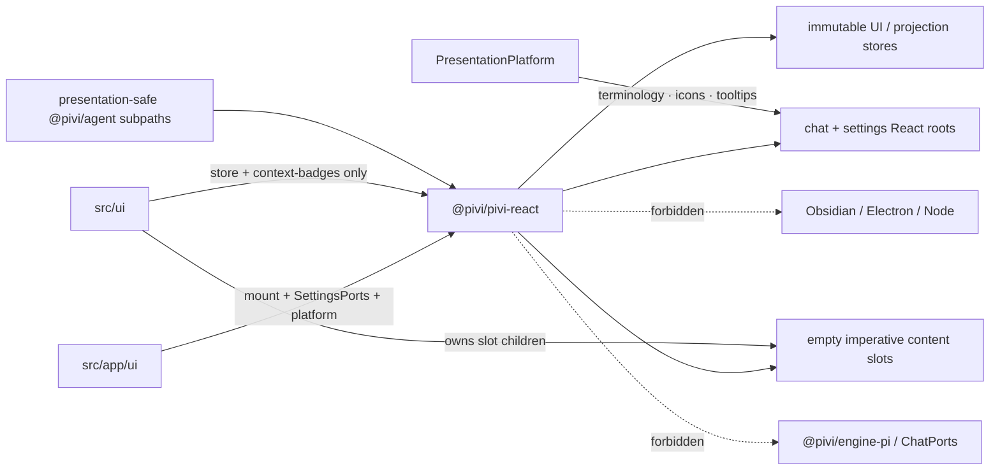

# `@pivi/pivi-react` package guide

*This file extends the root [AGENTS.md](../../AGENTS.md). Follow root guidance first, then these package rules.*

## Purpose

This package is Pivi's React presentation boundary for chat and settings. It owns serializable UI models, Settings presentation ports, stores, components, hooks, and deterministic mount/dispose APIs. `@pivi/agent` owns runtime/application ports; Obsidian lifecycle shells and concrete service composition remain in `src/app`, while remaining product orchestration and imperative adapters remain in `src/ui`.

It also owns UI internationalization under `src/i18n/` and ordered CSS sources under `styles/`. App composition creates the shared translator; package React consumers access it only through `I18nProvider` / `useT()`.

Source layout: `mount/` (mount APIs, `ChatShell`, `ActiveChatUiBridge`), `chat/` (message list/tool/subagent views), `settings/` (React-owned settings pages), `store/` (immutable UI/projection stores), `context-badges/` (badge view models), `ports/` (Settings presentation ports), `selectionToolbar/` (selection-toolbar surface), `i18n/` (translator + locale catalogs), `icons/` (bundled static icon/provider-logo data), `platform/` (`PresentationPlatform` contract), `reorder/` (shared sortable-list interaction), `runtime/` (mount runtime helpers), `usage/` (usage-meter presentation), and `shared/` (modal layer and shared controls).

## Architecture

React owns each mounted root and shell order; imperative adapters own only the children of explicit empty slots. Runtime/application ports do not cross into this package.

## Dependency direction

- Depend only on React, ReactDOM, browser APIs, bundled static icon data, injected presentation-platform capabilities, and non-engine host-neutral `@pivi/agent` APIs/contracts/models.
- Never import `obsidian` or another note-host SDK. Host apps implement `PresentationPlatform` and pass it to package mount APIs.
- Host-visible terminology is injected through `PresentationPlatform.getTerminology(locale)`. Product contracts and locale keys use `workspace` / `secureStorage`; never expose `vault`, `keychain`, `SecretStorage`, or a host brand as a React-port identifier.
- Never import `@/**`, `src/**`, app implementations, `@pivi/engine-pi`, raw Pi SDKs, `@pivi/obsidian-host`, or `@pivi/obsidian-tools`.
- Define narrow Settings presentation ports. Runtime/application `ChatPorts` remain in `@pivi/agent`; never accept a raw plugin object or recreate the broad `PiviPluginHost` contract.
- App adapters under `src/app/ui` are the only concrete port implementations and the only product layer that may call `mountChatView` / `mountSettingsPage` / `mountSelectionToolbarSurface`.

## Package exports

| Subpath | Consumers | Contents |
|---------|-----------|----------|
| `.` | app composition | i18n, platform, settings, store re-exports, chat message views |
| `./mount` | `src/app/ui` only | `mountChatView`, `mountSettingsPage`, `mountSelectionToolbarSurface`, `ActiveChatUiBridge`, `getSettingsPageSearchAliases` |
| `./ports` | `src/app/ui` only | `SettingsPorts` and focused settings-port contracts |
| `./settings` | package-internal / tests | `SettingsRoot`, `SettingsUiStore`, snapshot types |
| `./selectionToolbar` | app selection-toolbar wiring | selection toolbar surface |
| `./store` | `src/ui` + app | `ChatUiStore`, `ChatProjectionStore`, activity presentation, perf recorder |
| `./context-badges` | `src/ui` | context-badge view model, labels, icon helpers |

Public presentation seams used by `src/ui` remain exactly `store` and `context-badges` (see Ownership rules).

## Ownership rules

- React is the sole DOM owner inside each mounted package root. `ImperativeChatAdapter` receives one empty portal container and exclusively owns only that container's children (tab runtime scaffolds + uncontrolled composer adapters). Product chrome inside portal slots is React-owned via `createPortal`.
- Every mount API returns a deterministic `dispose()` path. Resolve portals, ranges, timers, and event constructors from the supplied owner document/window.
- Settings debounces and outside-click listeners derive their timer/document from the owning rendered element, retain the latest edited value, and clean pending timers on unmount.
- `ChatUiStore`, `ChatProjectionStore`, and `SettingsUiStore` snapshots must be immutable and structurally inspectable. `ChatUiStore` owns chrome/usage/stream state; `ChatProjectionStore` owns recent-first message order plus reconciled message-structure, block, and tool entities. A subagent remains nested on its stable spawn-tool entity; do not derive a second execution graph. The store retains event order, ownership/anomaly validation, identity reconciliation, publication, and subscriptions. `dispatch()` is the sole production projection mutation boundary, including page reveal/prepend; coalescing/page helpers stay private. Events validate scope/binding ownership and producer sequence, then snapshot the authoritative post-effect message at acceptance time before reconciliation; malformed events are dropped through the injected diagnostic listener and must not mutate a pending snapshot through aliasing. Whole-message upserts must preserve unchanged entity snapshot identities, notify only changed or removed entity keys, and keep hook subscribe/snapshot callbacks stable. Keep DOM nodes, viewport handles, Obsidian `Component`s, controllers, renderers, runtime services, subscriptions, and timers in app/runtime registries.
- Active visible projections schedule through the owner window's animation frame. Hidden or inactive projections use the owner window's 250 ms timer; visibility/activity return flushes one complete pending projection. Cache only the last owner `Window` as a scheduling realm, cancel old-realm frame/timer/listener work before migration, and never fall back to global `window` for this cadence.
- Chat performance instrumentation crosses the presentation boundary only through the injected `ChatPerfRecorder` contract exported from `store`. Its package default is the disabled no-op recorder: disabled call sites must not start timers or observers. Enabled recorders separately measure validation, inclusive dispatch, snapshot construction, entity reconciliation/notification, projection commit/paint, virtual rows and DOM nodes, scroll-anchor drift, and actual host Markdown renders; snapshot calls plus recursively visited/cloned values are allocation proxies, never byte measurements. Concrete recorders and trace persistence remain app-owned and development-only.
- Keep contenteditable composer DOM uncontrolled and preserve IME/cursor/token behavior through imperative refs/adapters.
- Obsidian Markdown remains an imperative adapter around isolated React-owned containers.
- Chat shell presentation owns tabs, welcome/queue/todo/navigation status, messages, and composer toolbar chrome (model, mode, reasoning, external context, input usage meter, send/queue/cancel). During streaming, an empty composer shows cancel, while non-empty composer content replaces it with the queue-message action and glyph; that action follows normal send so runtime orchestration captures a queued turn. One queued turn is a compact bar; multiple independent turns render as separate rows in a tab-switcher-style expanded surface. Every stable-ID row exposes steer/edit/delete actions and supports pointer or keyboard reordering through the shared sortable-list interaction; action buttons never initiate a drag. In input-position mode, the queue and tab switcher share one bottom grid row: the queue owns the constrained left column and the switcher owns the right column. Composer chrome must not display active subagents. MCP servers are managed in Settings (no composer toolbar picker). Application-facing `ChatPorts` are owned by `@pivi/agent/runtime/chatPorts` and captured by an app-owned adapter closure; `mountChatView` and its `ImperativeChatAdapter` contract never import, receive, or forward them. `ChatShell` consumes snapshots/actions and has no runtime-port context. Live chrome/message/composer state reaches React through `ActiveChatUiBridge` + immutable `ChatUiStore` snapshots. The `src/ui/chat` `TabManager` receives `ChatPorts` from app wiring and uses `ports.catalog` / `ports.models` / `ports.settings` / `ports.runtime` / `ports.sessions`; app wiring adapts facades into those narrow methods and never passes the facade object to runtime. Bridge portal elements remain runtime-only and outside snapshots. The uncontrolled rich input, composer context chips, and cursor-relative mention/slash adapters remain imperative islands.
- The tab switcher viewport is capped at ten 28px tab rows. When more open tabs exist, opening the menu scrolls once to the nearest ten-row window centered on the active tab where possible; all remaining tabs stay reachable by scrolling and keyboard navigation. While open, tabs-store updates must preserve the menu node, archive reveal state, and user-owned scroll position instead of replaying centering. Archived rows stay hidden until downward wheel progress, an explicit **Show archived tabs** keyboard control (Enter/Space), or reordering reveals them; revealed archived rows participate in keyboard traversal. Open-row archive/delete and archived-row deletion use stable keys, naturally compact or regroup surviving rows, and transfer focus to the nearest visible row (or trigger); native scroll-range clamping is allowed. Restoring an archived row—through row activation or its restore action—keeps that menu open/revealed at the current scroll offset while the row moves into the open group; only activation of an already-open row closes the menu. Its rows use the shared pointer/keyboard sorter with one stable keyed sequence containing an inert archived boundary. Crossing that boundary changes archive membership; action buttons and title editing never initiate drag, the three row actions are absent while its title editor is active, and the post-drag click must be consumed instead of switching tabs. Tab tooltips use a 500 ms delay.
- Mention parsing and token normalization live in `@pivi/agent/context/mentions`; this package owns only the context-badge presentation model, labels, icons, localized tooltip/ARIA composition, and rendering contracts under the `context-badges` subpath. View-model creation requires the app-owned translator so technical identifiers remain literal while surrounding UI text follows the active locale.
- Context badges distinguish skills, MCP references, and built-in tools. The image tool badge derives a human-readable label from `obsidian_generate_image`, uses `image-plus`, and preserves `/generate-image` as its canonical token.
- General settings update their mounted presentation immediately after persistence. In particular, changing tab-bar position republishes each open view's tab snapshot and moves the input portal without requiring a plugin reload. Changing cache-hit rate or tokens/s Chat behavior toggles republishes those flags on every open chat view.
- Web tools render a sortable `SettingsCollection` of `DisclosureCard`s (leading drag handle, provider logo, Search/Fetch chips, quiet configured status, toggle). The card body is the API-key editor. Fixed Exa public MCP / direct HTTP fallbacks stay as page intro copy and are not reorderable. Web and model lists share `useSortableReorder`: the leading handle is the only pointer/keyboard drag surface, card identity and chevron only toggle disclosure, and a completed drag must not toggle disclosure. Model cards retain provider logos, and their persisted `addedProviders` order drives composer model-group ordering.
- Composer context meters (`CacheHitMeter` left of `UsageMeter` in `ChatShell`) reuse one 16px ring. The usage ring shows `contextTokens / contextWindow` with the same percentage in its host-owned `data-tooltip` and ARIA label. The optional cache ring uses latest-turn `cacheRead / contextTokens` (`@pivi/agent` `calculateCacheHitPercentage`) and stays hidden when the setting is off or `contextTokens` is 0; providers that report no cache activity still show 0%. The usage warning state still follows compaction pressure via `@pivi/agent` `calculateContextUsagePercentage` (`pressureInputTokens / compactionTriggerTokens`) above 80%. `contextTokens` includes provider-reported uncached input, cache reads, and cache writes. There is no output ring and no click-open inspector. An unknown model context length remains visible as a warning ring with `!` and an explicit localized tooltip; never display an invented limit. Completed assistant footers may append persisted `tokensPerSecond` beside the duration line when `showTokensPerSecond` is on.
- Public presentation seams used by `src/ui` are the exact `store` and `context-badges` subpaths. Do not re-export pure parsers, runtime/application ports, usage projection, or domain matching from the React root.
- Composer toolbar keeps stable model/thinking trigger widths via longest-label sizers; external-context uses the compact btn+count trigger. Toolbar menus raise `.pivi-input-container` above the floating tab switcher. Model and thinking menus are `listbox` surfaces with `option` rows, share closed/hover-preview/click-pinned states in both the sidebar and inline edit surface, and support Escape dismissal, outside-pointer close, Arrow/Home/End roving highlight, and Enter selection. Hover previews close after the pointer leaves the trigger/menu corridor; pinned menus remain until selection, outside click, or a second trigger click; selecting even the active option closes the menu.
- React-owned `ModalLayer` / `useModalLayer` (`src/shared/`) owns modal lifecycle for input dialogs and the message image lightbox. Settings deletion stays inline: the first press arms the action, and the second press confirms it on the same red button.
- Chat messages are snapshot-driven React components. Obsidian Markdown, rich tool/diff bodies, ask-user interaction, and stored nested subagents mount only through generation-guarded owner-realm adapter slots implemented by one generic `ImperativeContentSlot` in `ToolCallView` (`pivi-tool-content-adapter` vs `pivi-subagent-content-adapter`). Every subagent uses the same dedicated imperative card slot, regardless of sibling count, and is never wrapped in the generic `spawn_agent` tool-call shell. Preserve prompt, nested-tool order, terminal state, and expansion state while keeping expanded disclosure bodies inside the bounded internal scrollport contract.
- Agent reports remain a runtime/session protocol. Visible card results strip fenced `pivi-agent-report` blocks, including malformed or incomplete blocks, while preserving the complete durable terminal trace for parent recovery. Never render or stringify report JSON as user-facing fallback text.
- Every non-empty transcript is virtualized with stable message IDs and dynamic row measurement. ResizeObserver measurements are deferred to the next animation frame because tab/session swaps replace many dynamically measured rows in one layout cycle; this avoids Chromium's undelivered-notification loop while accepting one-frame measurement latency. The virtualizer exclusively owns end anchoring, append follow, streaming row-growth follow, prepend stability, and temporary disclosure-header anchoring; app wiring may navigate only through `MessageViewportHandle` and must receive the scroll viewport as an explicit portal target. Starting a turn or resuming auto-scroll follows the end immediately, row remeasurements coalesce end-follow in the owner window, and backward user scrolling disables that follow until the existing auto-scroll state is re-enabled. `MessageList` measures that owner-realm viewport, publishes `--pivi-expanded-content-max-height` at one third and `--pivi-subagent-expanded-max-height` at two thirds, and supplies the optional `beginDisclosureResize` adapter callback so React and imperative titles stay at their activation position through row growth. Expanded top-level tool and steps-group wrappers use the one-third maximum; expanded subagent cards use the two-thirds maximum. Each wrapper keeps `overflow: hidden` while its direct body child owns the sole internal scrollbar; the direct header is layout-fixed at the card top and never sticks to the transcript. Nested titles inside the body scrollport use sticky positioning with measured offsets (`--pivi-tool-step-group-sticky-top`). Inside a subagent, the steps title sticks at `top: 0` in the content scrollport and tool titles stick below it at the measured steps height. Reaching an internal scroll end preserves disclosure state and card height; continued outer transcript scrolling chains so the fixed-height card moves with the transcript.
- Compaction and older-history paging render through the shared low-contrast Memory divider/chip family. Compaction transitions display approximation-marked before/after values only when both estimates exist; legacy blocks must not invent missing values, token text is never an `aria-live` region, and paging boundaries remain virtual transcript rows rather than assistant messages. A compaction chip becomes a disclosure only when a persisted summary or normalized checkpoint is present. Its measured row may expand to show continuation, ledger, source bounds, and estimate without nested scrolling; the interactive chip is a sibling of the semantic separator, never its descendant.
- Projected rows subscribe to message-structure metadata only; same-shape assistant deltas must not rerender the row shell, while block/tool membership and visibility changes must. Text/thinking wrappers subscribe by canonical block ID, and tool shells plus stored-subagent slots subscribe by tool ID. Fetch the full current message only at action time when an operation such as copy requires it.
- Streaming snapshots preserve unchanged entity identities so memoized historical content does not remount. Markdown, user-content, tool, ask-user, and Subagent adapter slots mount once per stable entity generation; `MessageContentAdapter.update` is mandatory, and every accepted replacement snapshot must reconcile through it without remounting. Adapter slots reject value/envelope identity mismatches, and app-owned asynchronous replacement adapters must stage output so a late completion cannot overwrite a newer revision. Do not make adapter lifecycle depend on the whole mutable-looking snapshot object.
- While a turn is streaming, `MessageList` keeps historical message action toolbars visible but suppresses actions from the latest visible user message onward. Completing or stopping the stream restores those actions.
- The live random thinking/status line uses the same `.pivi-response-meta` typography and muted color as the completed response-duration footer, the same 14px inline indentation as assistant messages, and no running-only accent or pulse animation. Foreground provider recovery temporarily replaces its text with the localized retry number and backoff countdown, then an active-retry label; this remains transient `ChatUiStore` chrome rather than a transcript row.
- Tool shells consume `@pivi/agent/tools/toolPresentation` for canonical kind, icon, title token, summary, visibility, and grouping. `chat/messages/toolPresentation.ts` may translate tokens and group React rows, but must not define tool-ID maps or duplicate summary rules.
- Tool and Agent execution chrome follows the shared `pivi-activity-*` row contract and seven-state core lifecycle mapping. `store/activityPresentation.ts` is the single presentation model for lifecycle labels, icon semantics, orphaned accessibility copy, elapsed formatting, and grouped status counts; imperative adapters consume it only through the public `store` subpath and remain responsible for owner-realm DOM/icon mounting. Human names, summaries, and status labels use the interface font; only identifiers, paths, commands, structured parameters, and numeric Memory transitions use monospace. React elapsed timers resolve and clean up through the rendered row's owner window, stop outside running, and freeze from terminal timestamps.
- Write/edit uses the same single React-owned generic tool shell as other tools. React places diff stats in that header; the imperative adapter owns only the expanded diff body and must never add a second Edit shell.
- Collapsed tool step groups summarize the count plus unique translated tool names in first-use order. Their trailing status lists each present lifecycle outcome as a count in stable order, such as `3 Completed / 1 Failed`; never collapse a mixed group into one aggregate status. Input/result details belong only to the expanded per-step rows.
- Collapsed tool and subagent headers remain compact summaries, but expanding them must render every byte and structured item already present in their immutable snapshot. Defer Markdown, diff, parsing, and nested tool DOM until first expansion; a collapsed update marks the body dirty and reopening rebuilds from the latest snapshot. Upstream/provider truncation remains explicit and expansion never re-runs a tool or reads a new source.
- Settings are fully React-owned. `SettingsRoot` consumes only `SettingsPorts`; no Obsidian `Setting`, modal manager, raw workspace, storage, process, or plugin object may cross that boundary. Note-host tool rows and integration actions arrive as host-provided descriptors (`listToolRows` / `hostIntegrations`), so product React does not enumerate Obsidian tools or construct Note Toolbar / Style Settings behavior. `settings/searchMetadata.ts` owns per-page search aliases on `SETTINGS_PAGES[id].aliasKeys`; `getSettingsPageSearchAliases` is exported through `mount` so the host can index each native page without moving rendering into the host SDK.
- Settings transient feedback crosses the host-neutral `SettingsPorts.feedback` boundary. High-value action results and operational failures go through the host notification adapter; validation, disabled-action reasons, structured diagnostics, and partial-success failures remain compact green/red text beside the control that produced them. Do not add page-bottom status banners for control actions.
- Commands (`commands`) is a `SettingsPage`. Internal commands are read-only flat `SettingRow`s (`/token` + description). Workspace commands are a sortable `SettingsCollection` of `DisclosureCard`s: header icon, `/name`, summary, remove + drag handle; body is name, description, argument hint, a full-width Prompt mention editor (`SettingsPorts.mentionEditor`, stacked row), and an Iconize-style icon grid (`styles/settings/features/commands.css`). The draft card never joins the sort order; `+ Add command` is the collection's trailing `.pivi-settings-text-btn`; Save (and Cancel on a draft) lives in the shared `.pivi-settings-card__footer` and collapses the card. Order persists through `commands.saveWorkspaceOrder` into `workspaceCommandOrder` (listed ids first, unlisted commands in discovery order). The Prompt editor is an imperative mention-capable contenteditable (`@` selected text first, then vault files/folders/external-roots/agents; `/` skills/MCP/tools/commands); its selected-text badge round-trips as canonical `{{selected_text}}`. Runtime SDK commands and skills do not belong in the internal section.
- Prompt (`prompt`) is a `SettingsPage`: startup-context usage (stacked bar + per-section estimates; bar structure in `styles/settings/features/prompt.css`) in one section; workflow modules as `DisclosureCard`s (toggle + modified chip in the header, editor + restore in the body); custom modules as a sortable `SettingsCollection` with trailing `+ Add module`. Locked core modules stay in the usage total and are not listed. React receives precomputed usage through `SettingsPorts.prompt` and does not estimate tokens. Module bodies stay English prompt content; UI chrome is i18n. Agent mutations use main-Agent `pivi_prompt`, not this React surface.
- Provider removal uses the shared inline two-press delete action. Credentials remain in injected secure storage by default; after arming removal, deleting the selected provider's credential requires an explicit, initially unchecked inline choice passed through `SettingsModelsPort.removeProvider`.
- Model provider cards must use one identity for catalog values, visible-model persistence, readiness, testing, disable/remove, and authentication. An enabled provider that resolves to `unavailable` is disabled and persisted immediately; it cannot remain visually enabled while unusable. Grok Build and Claude never list or persist `xai/*` or `anthropic/*` model keys; subscription/account requirements belong in OAuth descriptions, not provider names. The Add provider picker orders Local, OAuth, API, then Custom API; OAuth always shows OpenAI Codex, Grok Build, and Claude, marking existing entries as added instead of hiding them. Ollama, LM Studio, and llama.cpp render `API key (optional)` inside the endpoint section immediately after Base URL, without an Authentication heading. Custom and local endpoint cards include a model-IDs badge list so providers can be enabled without a working `/models` route; Fetch models remains optional. Candidate models use a responsive two-column grid where space permits and collapse to one column on narrow settings panes.
- Settings rows, toggles, modal layers, buttons, and icon wrappers use package-owned `.pivi-*` classes and styles. Do not emit or target a note-host's structural classes such as `setting-item`, `checkbox-container`, `modal-*`, `mod-*`, or `svg-icon`.
- Settings deletion confirmations use the shared inline two-press action and never open a modal. Input modals use `shared/ModalLayer` + `useModalLayer` with an accessible dialog name, first-field focus, Tab containment, Escape/backdrop dismissal where safe, and trigger-focus restoration.
- Settings picker/add rows that behave like commands use native `<button>` elements. `+ Add MCP` opens the inline HTTP editor and focuses its first field.
- In-scope compact icon actions (message actions, tab switcher actions, send control) keep their hit box snug to the glyph (the compact 0.15 sizing, e.g. 16–20px) and do not enlarge it to 32×32/44×44; hover and focus emphasis stays icon-sized (a snug background or small outline) rather than a large background or outline block. Disabled Send exposes its tooltip from a non-disabled wrapper.
- Card and list item headers use the shared `Toggle` for enablement plus `SettingsRemoveButton` (`trash-2` icon, then an inline red confirmation label) for collection removal, grouped in `SettingsInlineActions` with event isolation from disclosure/sort interactions. Every collapsible `DisclosureCard` ends with a left-aligned Save action that closes it; any final secondary actions share that footer before Save. Forms whose own Save already collapses the card and non-collapsible draft editors opt out. Flat `SettingRow`s keep toggle-only enablement. Badge chips dismiss with `x`.
- Settings text, search, password, number, textarea, and select controls use the shared `.pivi-settings-control` contract; checkbox, toggle, and range inputs retain dedicated presentation. Range settings with meaningful numeric values show the current value beside the control; the compact-threshold range displays its percentage and updates it optimistically with the settings snapshot. List-valued settings use the React-owned badge-list editor with Enter/blur commit, multiline paste, and per-item remove actions rather than newline-delimited textareas. Environment settings use source-aware bulk import: each parsed entry shows its storage location (`deviceLocal`, `secureStorage`, or `systemEnvironment`), secret values are never echoed after reload, and save blocks secret-like plaintext unless the user chooses an allowed secret or system source.
- Settings navigation is Obsidian-native. `SETTINGS_ROOT_LAYOUT` starts with General content as a root-level render item so Language is immediately available; General groups Appearance, Chat behavior, Personalization & context, Input & shortcuts, Session files, and Environment; Agent groups Models, built-in tools, web tools, MCP servers, skills, and prompt; Editor groups commands and toolbar; standalone About content ends the root. Sixteen `SettingsPageId`s mount through `mountSettingsPage`: fourteen navigable pages plus the two root content surfaces. Search aliases live on `SETTINGS_PAGES[id].aliasKeys` and are exposed by `getSettingsPageSearchAliases`; the host attaches them to the single `render` item inside each declarative page and to both root content items, which is what Obsidian indexes. About contains version, release date, GitHub, and Issues. Cloud API-key rows and web-search cards include Get API key links; local Ollama / LM Studio / llama.cpp endpoint cards include Download links. Toolbar (`toolbar`) is a `SettingsPage`: the `editorSelectionToolbar.enabled` toggle is the first `SettingRow`, then one sortable `SettingsCollection`. Every toolbar item ends with type chip → optional remove → toggle, with the toggle at the far right; a Pivi Command disclosure chevron sits immediately before this trailing group. Required Pivi actions, curated editor commands, and arbitrary host commands are flat `SettingRow`s (leading drag handle and icon or icon picker; curated and host commands are removable; host commands put the icon picker in the row and never open a card). Pivi Commands are `DisclosureCard`s whose body edits the Sidebar/Inline edit target; never expose the integration key. Add pickers stay as separate `.pivi-settings-text-btn` triggers after the collection; picker grouping structure lives in `styles/settings/features/toolbar.css`. The curated picker groups the fixed catalog by category with bundled icons and host-localized names, keeping unavailable or already-added entries visible but disabled; the arbitrary picker excludes curated IDs. Pivi yields when Note Toolbar's selected-text toolbar is active. A committed reorder rewrites the persisted array so list order equals toolbar button order. Style Settings lives only on Appearance as a single open action. Page content groups through `SettingsSection`: native-metric interface-font headings with a hairline below, then one surfaced rounded body (`--pivi-host-setting-items-background`) holding flat rows and disclosure rows separated by hairlines. An open `DisclosureCard` body uses `--pivi-settings-inset-surface-background` so expanded configuration is a distinct nested surface from the list, matching the toolbar picker. The page uses the host primary background; page intro copy sits outside any surface at the row gutter. Host `h2`/`h3` margins are reset under `.pivi-settings` so Obsidian cannot indent headings past row labels. Do not add feature-specific title insets.
- Built-in tools, Web tools, and MCP servers are separate native pages. Each page owns its ports, loading, save, and error state. Built-in tools (`builtInTools`) is a `SettingsPage` of per-group `SettingsSection`s of toggle `SettingRow`s; colocated configuration (default read size) follows its owning toggle as nested rows. Persistent Bash and external-directory grants live in a separate Persistent permissions section as stacked `SettingRow`s with `BadgeListInput` (values as badges in the field, plus an add input; Browse is a trailing sibling for directories). A final Subagents section holds the three spawn_agent rows. Invocation-only ToolSpec parameters are not rendered as global settings.
- Models and Commands place their add control after the collection at the left edge, using the shared provider-style text trigger (`+ Add provider` or `+ Add command`). Prompt and MCP servers follow the same placement for `+ Add module` and `+ Add MCP`. Dropdowns open left-aligned from that trigger.
- Skills (`skills`) is a `SettingsPage`: official `kepano/obsidian-skills` bundle as a `SettingRow` (install when absent, update when present); a stacked remote-source row; remote and installed skills as flat `SettingRow`s in `SettingsCollection`s with `SettingsInlineActions` (toggle/update/remove) and source/folder metadata in the description; per-row `SettingsFeedback` in the row actions slot. Official updates honor `defaultVaultSkillsRemovedFolders`; removing an official skill records that choice, while an explicit fresh install clears it.
- MCP servers (`mcpServers`) are `DisclosureCard`s. Toggle and trash-icon remove live in the header and do not toggle disclosure. Opening a card shows a compact row-based configuration editor, Connect / refresh tools with `SettingsFeedback`, and a read-only inventory (`styles/settings/features/mcp.css` for table structure). Opening never connects. The single Connect / refresh action validates and saves, authenticates when needed, then imports inventory into the shared cache. There is no JSON import. `+ Add MCP` opens an always-open draft `DisclosureCard` with the same inset body as other settings cards; the HTTP editor lives inside that body. Existing servers have no standalone Save, OAuth, edit action, or edit modal; clearing OAuth credentials remains a separate action. Composer slash badges use the product default and are not configurable. List/auth/tools/editor chrome state lives in `settings/mcp/useMcpSectionState`; `McpToolsSection.tsx` stays presentational.
- React-owned DOM and CSS use `pivi-*` classes exclusively. Do not depend on host-global classes such as `setting-item*`, `modal*`, `checkbox-container`, `mod-cta`, `mod-warning`, `theme-*`, or `svg-icon`; host theme integration is limited to the `--pivi-host-*` token contract.

## Settings primitives

Pages compose settings chrome only through `settings/primitives/`. Do not emit raw structural class names from page files.

| Primitive | Root class |
|-----------|------------|
| `SettingsPage` | `pivi-settings-page` |
| `SettingsSection` | `pivi-settings-section` (omitted `title` renders the surface only; a depth context emits `pivi-settings-section--nested` inside another section body or `DisclosureCard` body so consumers never pass a nested prop) |
| `SettingRow` | `pivi-settings-row` |
| `SettingsCollection` | `pivi-settings-collection` |
| `DisclosureCard` | `pivi-settings-card` |
| `SettingsInlineActions` | `pivi-settings-actions` |
| `SettingsFeedback` | `pivi-settings-feedback` |

Controls (`Toggle`, `Select`, `BadgeListInput`, `SettingsRemoveButton`) live under `settings/primitives/controls/`. Feature CSS under `styles/settings/features/` may not set spacing, radius, or borders; every `color` / `background*` value must be exactly one `var(--pivi-settings-*)` or `var(--pivi-host-*)` token. `--pivi-settings-*` custom properties are declared only in `styles/settings/system/tokens.css`. `mountSettingsPage` puts `pivi-settings` on the React root so `system/controls.css` can beat Obsidian `button:not(.clickable-icon)` for compact transparent icon and text buttons.

## Verification

Run `npm run check:boundaries`, `npm run typecheck`, `npm run lint`, focused or full `npm run test`, and `npm run build`. React behavior tests belong to the `jsdom` Jest project under the source-owner directory `tests/jsdom/pivi-react/`.
- Inline-edit tests must exercise user-visible state transitions and CM widget mount/dispose with a non-default owner realm.
