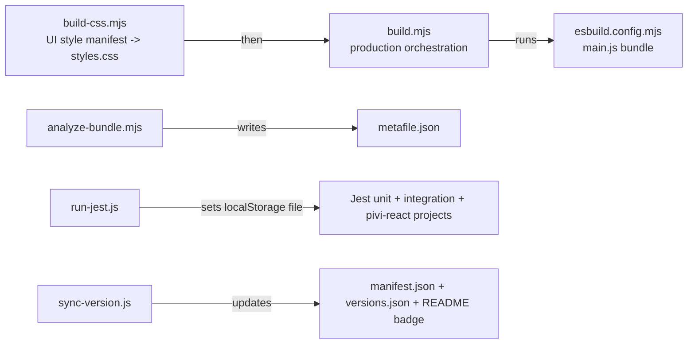

# `scripts/` — Build, test, version, and analysis helpers

*This file extends the root [AGENTS.md](../AGENTS.md). Follow root guidance first, then these local rules.*

Small Node scripts backing `package.json` commands. Keep them single-purpose and runnable with `node scripts/<name>`.

## Build/test flow

## Files

- `build-css.mjs` — Prepends the Obsidian host theme-token mapping, concatenates the ordered `packages/pivi-react/styles/manifest.mjs` modules into root `styles.css`, validates missing/unlisted CSS modules, and rejects `!important` in every host/React CSS input. Production mode minifies while preserving the Style Settings metadata block.
- `build.mjs` — Production build orchestrator: CSS first, then esbuild bundle.
- `analyze-bundle.mjs` — Uses the shared `build/create-build-options.mjs` configuration and generates the pre-postprocess esbuild `metafile.json` without writing a separate bundle.
- `run-jest.js` — Required Jest wrapper; supplies the Node `--localstorage-file` backing file expected by tests.
- `sync-version.js` — Syncs `package.json` version into `manifest.json`, `versions.json`, and the root README version badge.
- `postinstall.mjs` — Creates `.env.local` from example outside CI when missing.
- `check-i18n-dead-keys.mjs` — Scans product source (not tests) against `packages/pivi-react/src/i18n/locales/en.json` using literal translation-key references plus known dynamic-prefix families (`settings.tabs.*`, tool-presentation keys, model-readiness labels, settings hotkeys). Fails when unused keys remain; pass `--write` to delete them from every locale catalog. Wired into `npm run check:boundaries`.
- `check-architecture-boundaries.mjs` — Fails on forbidden imports and capability calls across package seams. Notable rules: `@pivi/pivi-agent-core` must not import `@pivi/obsidian-host`; `@pivi/pivi-react` must not import product `src/**`, concrete host/tools, the Pi engine, raw Pi SDKs, the aggregate core root, the core runtime barrel, or core-owned `runtime/chatPorts` (narrow presentation-safe leaves such as `runtime/auxQueryRunner` remain allowed). The React package also owns its DOM/CSS vocabulary: JSX, DOM class operations, and CSS selectors cannot use Obsidian classes such as `setting-item*`, `modal*`, `checkbox-container`, `theme-*`, or `svg-icon`; public presentation-port identifiers and locale keys stay host-neutral; credential/workspace copy uses injected terminology placeholders in every locale. `src/ui/**` must not import raw `@earendil-works/*`, any `@pivi/pivi-agent-core/engine/pi/**`, `@pivi/obsidian-host/**`, `src/app/workspace/**`, `src/app/ui/**` (alias or relative), or React-owned presentation ports, and its AST must contain no `getUiFacades()` / `getPiWorkspace()` / `saveSettings()` / `getAllViews()` capability bypass or named re-export of those symbols. Only `src/app/ui` may mount `@pivi/pivi-react` surfaces or import its Settings/InlineEdit presentation ports. Only `imperativeChatAdapter.ts` may import or inspect the chat `TabManager` / `TabData` aggregate; other app callers use semantic view handles. The retired React package identity is rejected in both `src` and `packages`. Chat runtime/application ports are owned by `@pivi/pivi-agent-core/runtime/chatPorts`; `src/app/hostContracts.ts` must not import engine/pi or app workspace implementation modules; `src/app/workspace/**` must not import `@/ui/**`; `packages/**` must not import `src/**`; `src/main.ts` is the only Obsidian `Plugin` composition root. Run via `npm run check:architecture` or the combined `npm run check:boundaries`.
- `check-package-readmes.mjs` — Fails when any `packages/*/README.md` is missing Purpose / Allowed dependencies / Forbidden dependencies / Public API sections.
- `check-helpers.mjs` — Utility functions used by boundary/readme check scripts (e.g. walk directories, parse TS imports).
- `architecture-import-allowlist.json` — Allowlist configuration containing structured import bypass rules for packages/tests.

## Gotchas

- Do not bypass `run-jest.js` for normal test runs; direct Jest may use different localStorage behavior.
- `build-css.mjs` intentionally fails if a CSS file under `packages/pivi-react/styles/` is not listed in its manifest.
- Release workflows upload only `main.js`, `manifest.json`, and `styles.css`.
- Production and analysis share the build plugins under `build/`. Pi source imports public session exports from the package root, while the build narrows that entrypoint away from the upstream CLI/TUI graph; nested shrinkwrap packages resolve from the project root only when a root copy exists, and package-import aliases (`#...`) stay with their owning package. Keep `buildCompatibility.test.ts` and a production build green when changing this boundary.
- Keep architecture/readme checks single-purpose and dependency-light; they are run both directly and from Jest smoke tests.
