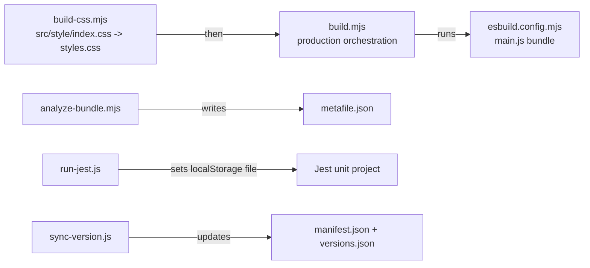

# `scripts/` — Build, test, version, and analysis helpers

Small Node scripts backing `package.json` commands. Keep them single-purpose and runnable with `node scripts/<name>`.

## Build/test flow

## Files

- `build-css.mjs` — Concatenates CSS imports from `src/style/index.css` into root `styles.css`; validates missing and unlisted CSS modules.
- `build.mjs` — Production build orchestrator: CSS first, then esbuild bundle.
- `analyze-bundle.mjs` — Generates `metafile.json` for esbuild bundle analysis.
- `run-jest.js` — Required Jest wrapper; supplies Node `--localstorage-file` isolation.
- `sync-version.js` — Syncs `package.json` version into `manifest.json` and `versions.json`.
- `postinstall.mjs` — Creates `.env.local` from example outside CI when missing.

## Gotchas

- Do not bypass `run-jest.js` for normal test runs; direct Jest may use different localStorage behavior.
- `build-css.mjs` intentionally fails if a CSS file under `src/style/` is not imported by `src/style/index.css`.
- Release workflows upload only `main.js`, `manifest.json`, and `styles.css`.
