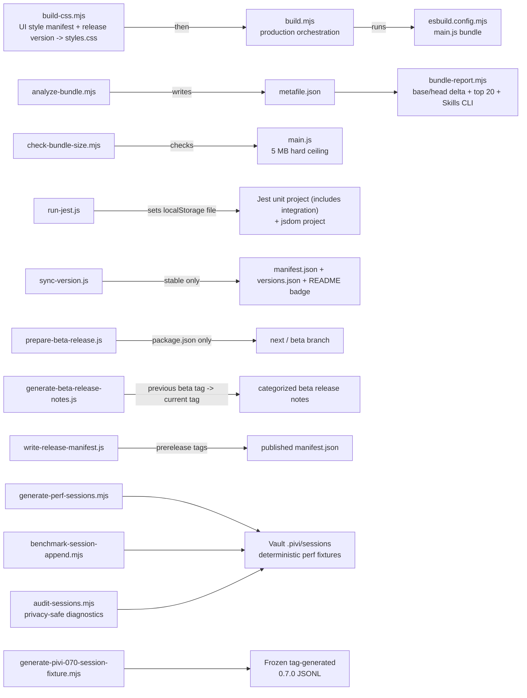

# `scripts/` — Build, test, version, and analysis helpers

*This file extends the root [AGENTS.md](../AGENTS.md). Follow root guidance first, then these local rules.*

Small Node scripts backing `package.json` commands. Keep them single-purpose and runnable with `node scripts/<name>`. Each script's header comment is the source of truth for its behavior; this file says what each one is for and which rules are easy to break.

## Build/test flow

```mermaid
flowchart LR
  CSS["build-css.mjs<br/>UI style manifest + release version -> styles.css"] -- "then" --> Build["build.mjs<br/>production orchestration"]
  Build -- "runs" --> Esbuild["esbuild.config.mjs<br/>main.js bundle"]
  Analyze["analyze-bundle.mjs"] -- "writes" --> Meta["metafile.json"]
  Meta --> Report["bundle-report.mjs<br/>base/head delta + top 20 + Skills CLI"]
  BundleSize["check-bundle-size.mjs"] -- "checks" --> Bundle["main.js<br/>5 MB hard ceiling"]
  Jest["run-jest.js"] -- "sets localStorage file" --> Tests["Jest unit project (includes integration)<br/>+ jsdom project"]
  Version["sync-version.js"] -- "stable only" --> Manifest["manifest.json + versions.json + README badge"]
  BetaVersion["prepare-beta-release.js"] -- "package.json only" --> NextBranch["next / beta branch"]
  BetaNotes["generate-beta-release-notes.js"] -- "previous beta tag -> current tag" --> GitHubPrerelease["categorized beta release notes"]
  ReleaseManifest["write-release-manifest.js"] -- "prerelease tags" --> ReleaseAsset["published manifest.json"]
  Fixtures["generate-perf-sessions.mjs"] --> Sessions["Vault .pivi/sessions<br/>deterministic perf fixtures"]
  Provenance["generate-pivi-070-session-fixture.mjs"] --> Frozen["Frozen tag-generated<br/>0.7.0 JSONL"]
  AppendBench["benchmark-session-append.mjs"] --> Sessions
  Audit["audit-sessions.mjs<br/>privacy-safe diagnostics"] --> Sessions
```

## Files

### Build and bundle

- `build.mjs` — Production build: CSS first, then the esbuild bundle.
- `build-css.mjs` — Concatenates the modules listed in `packages/pivi-react/styles/manifest.mjs` into root `styles.css` behind the release-version banner and the Obsidian theme-token mapping. Fails on a missing or unlisted CSS module and on any `!important`.
- `analyze-bundle.mjs` — Writes esbuild metadata from the shared `build/create-build-options.mjs` without emitting a bundle. `--project` and `--output` let PR CI compare base and head.
- `bundle-report.mjs` — Turns base/head metafiles into the PR summary: total delta, the 20 largest inputs, and the embedded Skills CLI size. Growth above 100 KiB or 2% is a warning, not a failure.
- `check-bundle-size.mjs` — Fails when the built `main.js` exceeds 5 MB (`npm run check:bundle-size`).
- `postinstall.mjs` — Creates `.env.local` from the example outside CI when it is missing.

### Tests

- `run-jest.js` — Required Jest wrapper; supplies the Node `--localstorage-file` that tests expect.

### Checks (all part of `npm run check:boundaries` unless noted)

- `check-architecture-boundaries.mjs` — The single enforcement point for import boundaries; ESLint carries no package import bans. It resolves static imports, re-exports, dynamic `import()`, `require`, and relative paths. The `boundaryRules` table in the script lists the import bans by directory. Beyond imports it also checks:
  - capability bypasses in `src/ui` (`getUiFacades()`, `getPiWorkspace()`, `saveSettings()`, `getAllViews()`), including named re-exports;
  - that only the `imperativeChat*.ts` adapter family inspects the chat `TabManager` / `TabData` aggregate;
  - that every package-source import is declared in its workspace manifest, with runtime imports outside `devDependencies` and host runtimes as peers;
  - that every `@pivi/*` import matches the target package's `exports` and resolves through the local workspace link;
  - that `@pivi/pivi-react` JSX, DOM class operations, and CSS selectors use `pivi-*` classes rather than Obsidian classes;
  - circular value imports, and that `src/main.ts` is the only `Plugin` composition root.
- `check-docs-contracts.mjs` — Requires the canonical statements from `docs/capabilities.json` in README, SECURITY, and the MCP handbook, rejects current-feature claims for removed capabilities, and validates relative links and fragments in active Markdown. `CHANGELOG.md` and archived specs are excluded.
- `check-package-readmes.mjs` — Requires Purpose, Allowed dependencies, Forbidden dependencies, and Public API sections in every `packages/*/README.md`.
- `check-i18n-dead-keys.mjs` — Fails when `en.json` holds keys no product source references; `--write` deletes them from every locale.
- `check-specs.mjs` — Validates spec filenames, continuous IDs, frontmatter, required sections, lifecycle placement, and the README index.
- `check-pi-pins.mjs` — Fails when the four `@earendil-works/pi-*` versions are ranged or out of sync across the root manifest, `packages/engine-pi` (`pi-agent-core`, `pi-ai`, `pi-coding-agent`), `packages/agent` (`pi-mcp`), the lockfile, and the `VERSION` constant in `packages/engine-pi/src/shims/piCodingAgentConfig.ts`.
- `check-pi-compatibility.mjs` — Validates `packages/engine-pi/compatibility-manifest.json`: lifecycle fields, exact-pin alignment, existing implementation and test paths, and that every Pi SDK deep import is listed and still resolves.
- `check-dependency-audit.mjs` — Backs `npm run check:dependencies` (not part of `check:boundaries`). Fails on every npm advisory not matched by ID, package, and exact install path in `dependency-audit-allowlist.json`; entries need a reason and an expiry date, and expired or unused entries fail.
- `check-helpers.mjs` — Shared helpers for the check scripts (directory walk, TypeScript import collection).
- `architecture-import-allowlist.json` — Structured exceptions for the architecture check. It is empty; keep it that way.

### Version and release

- `sync-version.js` — Copies a **stable** `package.json` version into `manifest.json`, `versions.json`, and the README badge. Skips prerelease versions.
- `versionMetadata.js` — Stable/prerelease helpers shared by the version scripts.
- `prepare-beta-release.js` — `npm run version:beta`: bumps `package.json` on `next` or `beta` and prints the commit and tag commands. Never touches root `manifest.json`.
- `generate-beta-release-notes.js` — Builds beta release notes from conventional commits between the previous tag and the current prerelease tag.
- `write-release-manifest.js` — Writes the release-asset `manifest.json` for prerelease tags; used by `release.yaml`.
- `prepare-pi-canary.mjs` — For the scheduled canary workflow only: resolves the newest stable version shared by the four Pi packages and applies it to the manifests, the config shim, and the compatibility manifest in an ephemeral checkout.

### Fixtures, benchmarks, and diagnostics

- `generate-perf-sessions.mjs` — Writes four deterministic perf sessions under a vault's `.pivi/sessions/`; only overwrites its own `perf-00*-*.jsonl` files.
- `generate-pivi-070-session-fixture.mjs` — Reproduces the frozen Pivi 0.7.0 session fixture from tag commit `f27ca3be149ecf4497f8d2e6ab8a236d14308c59` in a disposable worktree and verifies its SHA-256. It needs the tag's Pi dependency versions installed, so it fails by design on a normal current install.
- `benchmark-session-append.mjs` — Compares rewrite-per-append with indexed append on copies of the 5K fixture. Run with `node --import tsx`.
- `summarize-projection-traces.mjs` — Validates development `pivi-chat-perf-v2` traces and reports median, p95, and range per metric.
- `audit-sessions.mjs` — `npm run audit:sessions -- <vault-or-sessions-dir>`: aggregate diagnostics over session JSONL. Never prints user text, tool arguments, or file content, and never rewrites sessions.
- `smoke-obsidian.mjs` — `npm run smoke:obsidian`: development-only real-host run against the vault named by `OBSIDIAN_VAULT`. It runs one deterministic Pi turn that writes a UUID note, reloads, reopens the session, and compares the result. Its unit tests do not replace live evidence from a designated vault.

## Gotchas

- Do not bypass `run-jest.js`; direct Jest uses different localStorage behavior.
- `build-css.mjs` fails if a CSS file under `packages/pivi-react/styles/` is not listed in the manifest.
- Release workflows upload only `main.js`, `manifest.json`, and `styles.css`. A prerelease tag may keep a stable root `manifest.json` in git while the uploaded manifest matches the tag.
- Production and analysis builds share the plugins under `build/`. The build narrows the `pi-coding-agent` root entrypoint away from its CLI/TUI graph; keep `tests/unit/scripts/buildCompatibility.test.ts` and a production build green when changing that.
- `build/release-artifact-version.mjs` puts the package version in both `main.js` and `styles.css` so each release asset has a version-specific digest.
- Keep the check scripts dependency-light; Jest runs them directly against fixture directories.
- Check diagnostics use forward-slash relative paths on every host, and `check-specs.mjs` normalizes CRLF before parsing.
- The 0.7.0 fixture generator's tag commit, Pi versions, frozen SHA, and the fixture README record must stay in sync. Do not replace its tag writer with a hand-authored serializer.
