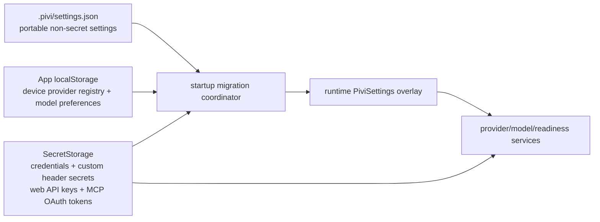

# 021 — Device-local provider state

## Context

Pivi currently materializes provider registration and model selection in the runtime `PiviSettings` bag and serializes the same shape to `.pivi/settings.json`. The synced file therefore contains device-specific provider membership, custom endpoints, discovered model lists, and model selections even though credentials already belong in Obsidian `SecretStorage`.

The affected fields are:

- `agentSettings.addedProviders`
- `agentSettings.disabledProviders`
- `agentSettings.customProviders`
- `agentSettings.visibleModels`
- `agentSettings.lastModel`
- top-level `model`
- top-level `titleGenerationModel`
- entries in `customContextLimits` whose model belongs to a custom provider
- `agentSettings.webSearchTools.providerOrder` / `disabledProviders` (which providers this device has configured)

The repository already uses the desired overlay pattern for absolute external-read paths. `src/app/deviceLocalExternalContextStore.ts` stores them through the public vault-scoped `App.loadLocalStorage()` / `saveLocalStorage()` API. `src/app/settings/piviSettingsCodec.ts` overlays them into runtime settings and removes them from every synced save.

Provider migration is more complex than that existing synchronous overlay:

1. `PiviSettingsStorage.load()` normalizes and immediately rewrites changed settings.
2. Existing provider credential and OAuth namespace migrations run later in `loadPluginSettings()`.
3. `StoredPiviSettings` is currently an alias of the full runtime `PiviSettings`, and the current normalizer restores missing provider/model fields from defaults.

The implementation therefore needs an explicit startup migration phase and separate persisted/runtime contracts. The codec remains the steady-state projection boundary; it must not decide first-run provider eligibility.

### Simplification premise

This spec assumes **single-user, per-device provider configuration** as the product default. Multi-device vault sharing is supported (portable settings still sync), but provider registries are intentionally device-local: each machine configures its own providers, and no automatic cross-device provider recovery is attempted. This removes the need for pending-provider recovery UI, connectivity probing, and mixed-version compatibility matrices.

### Secret-storage audit (web tools and MCP)

The same "device-local vs synced" boundary question applies to web search and MCP credentials, which also live in `SecretStorage`:

| Surface | Current storage | Synced? | Action |
|---|---|---|---|
| Web provider API keys (Brave/Tavily/Exa/AnySearch) | `SecretStorage` via `WebSearchCredentialStore` | No | **Move `webSearchTools` settings into local overlay** so provider order/disabled state matches key availability |
| Web provider keys via `environmentVariables` | Synced `.pivi/settings.json` text | Yes | **Document as known gap** — env-var fallback is an intentional escape hatch for advanced users; do not block it |
| MCP server definitions | `.pivi/mcp.json` | Yes | **Keep synced** — server URLs are typically portable across devices |
| MCP bearer tokens / OAuth clientSecret | `SecretStorage` via `McpStorage` | No | Already correct; no change |
| MCP OAuth access/refresh tokens | `.pivi/mcp-oauth/sha256-*/tokens.json` | **Yes (plaintext)** | **Migrate to SecretStorage** or move outside synced directory; document the security fix |



## Goal and success criteria

Make the vault-scoped device-local provider registry the sole authority for provider membership and provider-dependent model preferences while keeping credentials and custom header secrets solely in `SecretStorage`. After a device completes the cutover, `.pivi/settings.json` must contain only portable settings. No new provider registration, provider config, or provider-dependent model preference may ever be written to synced storage.

- [x] Runtime provider behavior remains available through the existing `PiviSettings` / `PiAgentSettingsView` projections, so React settings and most runtime consumers do not need a new storage-aware contract.
- [x] An initialized device-local provider state survives reload and is overlaid into runtime settings before workspace/model services are constructed.
- [x] Every steady-state `.pivi/settings.json` save omits all localized fields listed in Context and omits custom-provider context-limit entries.
- [x] Every steady-state `.pivi/settings.json` save omits `webSearchTools` provider order/disabled state.
- [x] Provider registration never derives from `credentialStore.list()`, orphan credentials, or credential presence alone.
- [x] Readiness remains derived at runtime from local registration, disabled state, credential/OAuth state, keyless policy, and model availability.
- [x] Legacy credential-bearing registrations migrate only when raw legacy membership provides provenance and credential canonicalization succeeds.
- [x] Legacy keyless providers migrate directly as active registrations on the device that first opens the vault after upgrade; no probing or confirmation is required.
- [x] Invalid active, visible, title-generation, last-model, and custom-context-limit references are repaired without resolving through an unregistered or disabled provider.
- [x] Custom provider header values are absent from `.pivi/settings.json` and localStorage and are available to runtime requests only through a versioned SecretStorage payload.
- [x] MCP OAuth AuthEntry payloads are absent from `.pivi/mcp-oauth/` plaintext files and are available to runtime requests only through SecretStorage.
- [x] Removing a provider removes local membership and model references before optional secret deletion; retained or failed-to-delete secrets cannot resurrect it.
- [x] New multi-instance custom providers use collision-resistant random IDs; existing provider IDs remain stable through migration.
- [x] Two simulated devices sharing one `.pivi/settings.json` retain independent provider registries, endpoints, model preferences, web provider configuration, and credentials while portable settings continue to synchronize.
- [x] Loading and saving an already-migrated device is idempotent and does not repeatedly rewrite either storage layer.
- [x] A device that was offline during cutover starts with default local registrations from `DEFAULT_PI_PROVIDER_IDS` (`deepseek` only) and must re-add other providers locally; this is documented as accepted behavior.

## Scope and non-goals

In scope:

- Separate synced persisted settings, effective runtime settings, and device-local provider state contracts.
- A vault-scoped local provider store using public Obsidian local-storage APIs.
- Pure normalization, projection, extraction, and stripping functions with explicit invariants.
- An eager, idempotent startup migration coordinator that runs before workspace construction.
- A single-phase, per-device cutover for existing vaults.
- Membership-aware credential/OAuth migration and orphan-secret behavior.
- SecretStorage-backed custom provider headers.
- Migration of MCP OAuth tokens from plaintext vault files to SecretStorage.
- Moving `webSearchTools` provider order/disabled state into the device-local overlay.
- Provider/model save ordering, failure semantics, and recovery behavior.
- Collision-resistant IDs for newly created multi-instance custom providers.
- Focused unit/integration coverage, durable architecture/settings documentation, and manual validation.

Not in scope:

- Synchronizing provider registries through another service.
- Pending-provider recovery UI, connectivity probing, or user confirmation flows for legacy providers.
- Mixed-version compatibility matrices or graceful degradation when an old plugin reintroduces provider fields.
- Rewriting existing provider IDs in historical session JSONL.
- Rewriting IDs of migrated custom providers solely to eliminate pre-existing deterministic-ID collisions.
- Moving portable built-in-model `customContextLimits` entries out of `.pivi`.
- Moving non-secret `agentSettings.environmentVariables`, `selectedMode`, MCP server definitions, or other unrelated settings to local storage. Recognized credential values are removed from environment text during credential migration, but remaining non-secret environment configuration keeps its current ownership.
- Replacing existing provider readiness logic or making the React UI own persistence layering.
- Using undocumented Obsidian APIs.
- Blocking the `environmentVariables` → web provider API key fallback; this is a documented advanced-user escape hatch.

## Decisions

| Date | Decision | Rationale | Affected workstreams |
|---|---|---|---|
| 2026-07-20 | Use `App.loadLocalStorage()` / `saveLocalStorage()` under `pivi.providers.v1` as the provider registry authority for the current device and vault. | It matches the established external-context overlay and the required device/vault scope. | WS-02, WS-05 |
| 2026-07-20 | Store every provider registration and configuration only in device-local storage. Never write provider state into `.pivi` as a migration mirror or compatibility fallback. | Provider identity, endpoint availability, and model selection are device facts; preserving a synced migration mirror would violate the ownership boundary. | WS-01, WS-03, WS-05 |
| 2026-07-20 | Keep the codec synchronous and limited to steady-state overlay/extract/strip; put first-run migration in an explicit asynchronous startup coordinator. | Credential canonicalization currently runs after storage initialization, and keyless probing/confirmation cannot run inside the codec contract. | WS-03, WS-05 |
| 2026-07-20 | Introduce distinct `PersistedPiviSettings`, runtime `PiviSettings`, and `DeviceLocalProviderStateV1` contracts in this change. | The persisted representation intentionally omits required runtime fields; a marker alone would let normalizers reinsert them. | WS-01, WS-05 |
| 2026-07-20 | Ship one cutover release with a single-phase migration: read legacy → write local state and secrets → strip synced fields in the same startup pass. | Simpler than two-phase prepare-then-clean; crash safety is preserved because legacy fields remain in `.pivi` until the local write succeeds. | WS-03, WS-08 |
| 2026-07-20 | Do not persist a synced `settingsSchemaVersion`; local `initialized: true` is the sole authority for whether this device has completed provider migration. | The synced version only matters for multi-version coordination, which is out of scope under the single-user simplification. | WS-01, WS-03, WS-05 |
| 2026-07-20 | Raw legacy membership is required provenance for automatic migration. Credential presence alone never creates a registration. | Preserves the existing removal invariant and supports keyless providers, which have no credential membership signal. | WS-03, WS-04 |
| 2026-07-20 | Canonicalize recognized legacy/environment credentials into SecretStorage before evaluating migration eligibility. Orphan credentials may be retained but remain unregistered. | Eligibility must not reject a provider merely because its credential has not yet reached the canonical secret key. | WS-04 |
| 2026-07-20 | All legacy providers migrate directly as active local registrations. Credential-required providers without a canonical credential are registered but show as not-ready; keyless providers are registered immediately. | The first device to open the vault after upgrade is the authoritative owner; per-device configuration means no cross-device endpoint import risk. | WS-01, WS-03 |
| 2026-07-20 | Fresh installs, post-migration empty states, and offline cutover devices all seed `DEFAULT_PI_PROVIDER_IDS` in local state (not a truly empty registry). | Offline devices cannot recover legacy providers from a stripped synced file; defaults give a usable starting point without cross-device recovery UI. | WS-01, WS-05, WS-06 |
| 2026-07-20 | Narrow `DEFAULT_PI_PROVIDER_IDS` to `["deepseek"]` only, and set `DEFAULT_MODEL_KEY` to a deepseek-owned model key (`deepseek/deepseek-chat`). | Product choice for the cutover: one keyless-friendly default provider avoids shipping unused OpenCode/Codex membership on every device. | WS-01, WS-06 |
| 2026-07-20 | `activeModel` is authoritative and is normalized to `visibleModels[0]`. Visible, active, title, and last model references must belong to an enabled local registration; unavailable title and last models are cleared. Cleared `titleGenerationModel` is the empty string `""` (matches existing runtime default and `chatUiProjection` clear path). | Gives one deterministic authority rule and prevents stale provider resolution. | WS-01, WS-06 |
| 2026-07-20 | Keep built-in model context-limit entries synced; move custom-provider entries into local `modelPreferences.customContextLimits`. | Built-in metadata preferences are portable, while custom provider IDs/endpoints are device-specific and may collide across machines. | WS-01, WS-05 |
| 2026-07-20 | Store all user-supplied custom provider headers in a separate versioned per-provider SecretStorage payload, not in local provider config. | Header-name heuristics cannot reliably classify arbitrary token headers; the current credential union cannot safely absorb arbitrary maps. | WS-04, WS-06 |
| 2026-07-20 | Move `webSearchTools.providerOrder` and `disabledProviders` into the device-local provider state. | Web provider API keys are already device-local in SecretStorage; the order/disabled state must match which providers have keys on this device. | WS-01, WS-05 |
| 2026-07-20 | Migrate the entire MCP `AuthEntry` (access/refresh tokens, client info, code verifier, OAuth state) from `.pivi/mcp-oauth/sha256-*/tokens.json` into SecretStorage; keep MCP server definitions in synced `.pivi/mcp.json`; clean the vault OAuth directory after successful writes. | The vault file is a full auth entry, not tokens alone; leaving residual fields in synced plaintext would keep the security hole. | WS-04 |
| 2026-07-20 | Preserve fixed IDs for Ollama, LM Studio, and llama.cpp; use `crypto.randomUUID()`-based suffixes for newly created multi-instance custom providers; preserve all migrated IDs. | Prevents new cross-device collisions without forcing credential/session/model-key rewrites for existing installations. | WS-06 |
| 2026-07-20 | Treat a successful provider-local write as the provider change commit. A later unrelated synced-file write failure is reported separately and does not roll back the local authority. | Compensating localStorage after a vault write failure can itself fail, and current UI rollback would otherwise disagree with reload state. | WS-05, WS-06 |
| 2026-07-20 | Synced-field stripping occurs only after required local state and header/credential secrets are durably written in the same startup pass. | Preserves a retry source and prevents partial migration from destroying provider configuration or secrets. | WS-03, WS-04, WS-05 |

## Target contracts and invariants

The exact module ownership may be adjusted during WS-01, but the persisted semantics are fixed:

```ts
export interface DeviceLocalProviderStateV1 {
  version: 1;
  initialized: true;
  providers: DeviceLocalProviderRegistration[];
  modelPreferences: {
    visibleModels: string[];
    activeModel: string;
    titleGenerationModel: string;
    lastModel?: string;
    customContextLimits: Record<string, number>;
  };
  webSearchTools: {
    providerOrder: WebProviderId[];
    disabledProviders: WebProviderId[];
  };
}

export type DeviceLocalProviderRegistration =
  | {
      id: string;
      type: 'builtin';
      disabled: boolean;
    }
  | {
      id: string;
      type: 'custom';
      disabled: boolean;
      config: DeviceLocalCustomProviderConfig;
    };

export type DeviceLocalCustomProviderConfig = Omit<
  CustomProviderConfig,
  'headers'
>;
```

The local normalizer must enforce all of these invariants before writing or projecting state:

1. Provider IDs are non-empty and unique; custom registration `id` equals `config.id`.
2. Disabled state exists only on a registered provider; no parallel disabled-provider authority is persisted.
3. `visibleModels` contains unique valid model keys whose provider is registered and enabled.
4. A non-empty `activeModel` belongs to an enabled registration and is first in `visibleModels`.
5. `titleGenerationModel` and `lastModel`, when present, belong to enabled registrations; otherwise they are cleared.
6. Local `customContextLimits` contains only valid entries belonging to local custom registrations.
7. `webSearchTools.providerOrder` contains unique valid `WebProviderId` values; `disabledProviders` is a subset of `providerOrder`.
8. No credential value, OAuth payload, custom header value, or web provider API key appears in local state.
9. Unknown/future local schema versions fail closed to a recoverable error; they are not overwritten with defaults.
10. Returned runtime arrays/configs are copies so UI mutation cannot bypass extraction and normalization.

The runtime projection may continue exposing the current parallel shape:

```ts
function projectProviderState(
  state: DeviceLocalProviderStateV1,
): Pick<
  PiAgentSettingsView,
  | 'addedProviders'
  | 'disabledProviders'
  | 'customProviders'
  | 'visibleModels'
>;
```

Credential/readiness state remains derived and is never persisted in this registry. Web provider API keys remain in `WebSearchCredentialStore` (SecretStorage) and are looked up at request time; the local registry only tracks which providers this device has configured.

## Startup and steady-state flows

### Single-phase cutover

1. Read the legacy provider fields from `.pivi/settings.json` only as migration input; do not expose normalized defaults as historical membership.
2. If local state is already initialized, overlay it and ignore any provider fields reintroduced by an older plugin.
3. If local state is absent, snapshot raw legacy membership, custom provider configs, models, and model preferences before any normalizer can replace missing fields with defaults.
4. Run existing credential canonicalization and membership-aware subscription namespace migration using raw legacy membership as provenance.
5. Move custom header maps into header SecretStorage payloads; do not remove the source until writes succeed.
6. Migrate MCP OAuth tokens from `.pivi/mcp-oauth/` plaintext files into SecretStorage; do not remove the source until writes succeed.
7. Register all legacy providers directly as active local registrations (credential-required providers without a credential will show as not-ready through existing readiness logic).
8. Extract `webSearchTools` provider order/disabled state into local state.
9. Normalize active/visible/title/last/context-limit references against activated registrations.
10. Durably save initialized local state, then overlay it into runtime settings.
11. Strip all localized provider/model/webSearchTools fields and custom-provider context-limit entries from the synced settings and save `PersistedPiviSettings`.

If any required secret or local-state write fails, abort provider initialization and leave the pre-existing legacy file untouched for retry. The new version must not append or update provider fields in `.pivi`; retaining an unchanged old file on failed evacuation is a data-loss safeguard, not a supported storage mode. A device that was offline during cutover and sees an already-stripped synced file starts with default local state and must re-add providers locally.

### Steady-state save

```text
runtime settings mutation
  -> extract + normalize device-local provider state
  -> save pivi.providers.v1 (provider commit)
  -> project PersistedPiviSettings
  -> strip localized fields (providers, models, webSearchTools)
  -> save .pivi/settings.json
  -> report synced-save failure without reverting committed local state
```

`setLastModel`, chat model selection, provider settings changes, custom provider model fetch/patch, provider deletion, web provider order/disabled changes, and unrelated general-settings saves must all pass through this same extraction boundary.

### Provider operation ordering

Add credential-required provider:

1. Write credential/header secrets.
2. Add and save local registration plus valid model preferences.
3. Project runtime provider state and refresh model/UI services.
4. Save the stripped synced projection if portable settings also changed.

Remove provider:

1. Remove local registration and all active/visible/title/last/context-limit references.
2. Save local state and project runtime state.
3. Delete credential and header secrets only when the user requests deletion.
4. Refresh provider/model/UI services.

An orphan secret left by a failed registration write or retained deletion is safe because secrets are never a membership source.

## Workstreams

Use `Pending`, `Claimed`, `In progress`, `Blocked`, or `Done` for workstream status.

| ID | Deliverable | Agent | Status | Dependencies | Verification |
|---|---|---|---|---|---|
| WS-01 | Define persisted/runtime/local schemas plus pure normalize/project/extract/strip functions; include `webSearchTools` in local state; define no-provider/model invariants; narrow default providers to deepseek | composer-2.5-wave1 | Done | None | Foundation and codec pure-function tests; typecheck |
| WS-02 | Add `DeviceLocalProviderStore` and Obsidian `pivi.providers.v1` adapter with defensive normalization and copy semantics | composer-2.5-wave1 | Done | WS-01 | Store tests using mocked `App.loadLocalStorage` / `saveLocalStorage` |
| WS-03 | Add startup migration coordinator: single-phase legacy → local + secrets → strip, with initialization ordering before workspace construction | composer-2.5-wave2 | Done | WS-01, WS-02, WS-04 | Startup migration tests; lifecycle ordering test |
| WS-04 | Make credential/OAuth migration membership-aware; canonicalize recognized legacy credentials; add custom-header secret schema and migration; migrate entire MCP AuthEntry to SecretStorage | composer-2.5-wave2 | Done | WS-01 | Credential, OAuth split, header migration, MCP AuthEntry migration, failure/retry tests |
| WS-05 | Convert settings storage/codec to steady-state overlay and persisted projection; cover every save path (including webSearchTools) and failure semantic | composer-2.5-wave3 | Done | WS-01, WS-02, WS-03 | Settings storage tests; idempotence and write-failure tests |
| WS-06 | Reconcile provider/model consumers, merge runtime header secrets, preserve deletion ordering, randomize new custom IDs, and wire webSearchTools through the local overlay | composer-2.5-wave3 | Done | WS-01, WS-04, WS-05 | Model resolution, readiness, settings-model-port, custom-provider, web provider tests |
| WS-07 | Run migration, security, and save-path acceptance matrix plus full repository gates | composer-2.5-wave4 | Done | WS-02–WS-06 | Commands and scenarios in Verification |
| WS-08 | Update durable docs/guidance and document the single-phase cutover, offline-device limitation, and MCP OAuth token security fix | composer-2.5-wave4 | Done | WS-03, WS-05, WS-07 | Documentation diff audit; cutover checks |

## Verification

### Automated acceptance matrix

Use one shared memory `.pivi` adapter with independent local and secret stores for Machine A and Machine B.

| Case | Setup/action | Required result |
|---|---|---|
| Fresh install | No synced provider fields and no local state | Default local registrations are created; runtime projection is valid; final synced save has no localized fields. |
| Steady-state idempotence | Initialized local state plus stripped synced settings | Repeated load/save preserves local order and does not repeatedly rewrite either store. |
| Two-device isolation | A has OpenAI/Ollama/Brave; B has DeepSeek/Tavily; both share `.pivi` | Portable changes such as locale synchronize; provider membership, endpoints, models, web provider order, and credentials remain independent. |
| Credential provenance | A legacy member has environment/legacy/canonical credential and an unrelated orphan secret exists | Member credential becomes canonical and registration migrates; orphan does not register; provider/model namespace rewrites use raw membership. |
| Missing credential | Credential-required legacy provider lacks a credential | Provider is registered locally but shows as not-ready; user can add credential in settings. |
| Keyless migration | Legacy local provider exists | Provider is registered immediately as active; no probing or confirmation required. |
| Model repair | Active/visible/title/last/context-limit values reference missing or disabled providers | Invalid values are filtered/cleared; valid active model leads visible order; resolver never selects an unregistered provider. |
| Header migration | Legacy custom config has `Authorization`, `X-API-Key`, and arbitrary token headers | Values enter SecretStorage before source removal; they appear in neither synced nor local JSON; effective runtime requests still receive them. |
| MCP OAuth migration | Legacy `.pivi/mcp-oauth/` contains plaintext tokens | Tokens enter SecretStorage before source removal; `.pivi/mcp-oauth/` is cleaned; runtime OAuth flow uses SecretStorage. |
| WebSearchTools migration | Legacy `webSearchTools` in synced settings | Provider order/disabled state moves to local storage; synced save omits them; web keys remain in SecretStorage. |
| Secret/local failure | Secret or local write fails during migration | Legacy source required for retry remains; no partially activated registration appears. |
| Synced save failure | Local provider save succeeds and subsequent `.pivi` write fails | Local change remains committed and reload-consistent; failure is surfaced separately. |
| Save-path coverage | Change model through chat, provider settings, custom fetch/patch, `setLastModel`, web provider order, and unrelated settings save | One local authority is updated and every `.pivi` output omits localized fields. |
| Provider removal | Remove provider while retaining credential, reload, then delete credential | Provider/references stay removed; orphan does not resurrect it; explicit deletion removes only the selected provider's secrets. |
| Custom IDs | Create the same multi-instance kind independently on A and B; migrate an old deterministic ID | New IDs differ; migrated ID remains unchanged; model/secret keys follow the correct ID. |
| Context limits | Built-in and custom model overrides exist | Built-in override stays synced; custom override stays local and is absent on the other device. |
| Offline device | A cuts over and strips the shared file while B is offline | B starts with default local state seeded from `DEFAULT_PI_PROVIDER_IDS` (`deepseek` only); user re-adds other providers on B; no automatic recovery is attempted. |

### Focused commands

Exact file paths may be refined as workstreams add suites, but verification must include:

```bash
npm run test -- --runInBand tests/unit/app/deviceLocalProviderStore.test.ts
npm run test -- --runInBand tests/unit/app/settings/piviSettingsStorage.test.ts
npm run test -- --runInBand tests/unit/app/pluginSettingsLoad.test.ts
npm run test -- --runInBand tests/unit/app/ui/createSettingsModelsPort.test.ts
npm run test -- --runInBand tests/unit/pi/settings/agentSettings.test.ts
npm run test -- --runInBand tests/unit/pi/settings/customProviders.test.ts
npm run test -- --runInBand tests/unit/mcp/mcpVaultAuthStore.test.ts
```

Before the cutover implementation closes:

```bash
npm run typecheck
npm run lint
npm run check:boundaries
npm run test
npm run build
npm run check:specs
obsidian plugin:reload id=pivi
obsidian dev:errors
```

Manual validation must inspect the active vault's `.pivi/settings.json`, Obsidian localStorage through the public API, and settings/model behavior. Evidence must redact secret payloads; tests and logs must assert absence rather than print values.

## Cutover and failure policy

### Single-phase cutover gate

- Local migration is idempotent.
- Runtime authority switches to initialized local state before workspace/provider services start.
- No migration mirror, registration, endpoint, provider-dependent model preference, or webSearchTools state is written to `.pivi`.
- The synced cleanup runs only after local state and required secrets are durable in the same startup pass.
- The residual limitation is explicit: a device that was offline during cutover starts with default local registrations (`DEFAULT_PI_PROVIDER_IDS`) and must re-add other providers locally.
- Telemetry is not added; migration status is diagnosable locally without credential/header values.

### Failure rules

- Unknown local schema: preserve raw local data, stop provider initialization with an actionable error, and do not overwrite it.
- Missing/malformed SecretStorage capability or any secret write failure is a fatal migration error: abort the cutover before synced cleanup and do not activate a registration whose required secret migration failed.
- localStorage write failure: abort before synced cleanup and do not publish the new provider state in runtime.
- `.pivi` write failure after a local commit: retain and project local state; report the portable-settings save failure without pretending the provider mutation rolled back.
- Credential/header deletion failure after provider removal: retain an orphan secret and report the cleanup failure; never restore membership.

## Documentation sync

- Numbered developer docs: update `docs/02-architecture-and-technology.md`, `docs/03-plugin-lifecycle-and-composition.md`, and `docs/08-presentation-and-settings.md`; record cutover/recovery limitations in `docs/10-roadmap-release-and-maintenance.md`.
- Nearest local guidance: update `src/app/AGENTS.md` for provider-local store, startup migration ownership, codec projection, and settings-model write ordering.
- Parent/package guidance: update `packages/pivi-agent-core/AGENTS.md` for persisted/runtime settings contracts and provider-state invariants; update `packages/obsidian-host/AGENTS.md` if the settings storage codec contract changes.
- Test guidance: update `tests/AGENTS.md` only if the test topology or reusable fixture becomes a durable convention.
- Root guidance and roadmap: update root `AGENTS.md` architecture status from synced provider queue to device-local registry and document the cutover state.
- MCP security note: document the OAuth token plaintext-sync fix in the relevant security/changelog notes.

## Progress and handoff

### 2026-07-20 — /root — planning

- Changed: Verified the current external-context overlay, synchronous codec rewrite, credential migration ordering, runtime settings materialization, provider settings writes, custom header persistence, and deterministic custom ID generation. Defined the target ownership model, per-device prepare/clean cutover transaction, local pending-provider recovery, workstreams, and acceptance matrix.
- Evidence: Repository reads of `piviSettingsCodec.ts`, `piviSettingsStorage.ts`, `pluginSettingsLoad.ts`, `agentSettings.ts`, `customProviders.ts`, `createSettingsModelsPort.ts`, and their focused tests; independent plan review identified migration-order and offline-device data-loss risks.
- Remaining: Implement WS-01 through WS-09 after approving the pending-provider recovery UX and accepted offline-device limitation.
- Blockers: No code blocker. The accepted tradeoff is that strict local-only ownership prevents an offline, never-migrated device from recovering custom/keyless provider configuration through sync.
- Next action: Review and approve the Decisions table, then set the spec to Active and claim WS-01/WS-02 before implementation begins.

### 2026-07-20 — /root — revision

- Changed: Simplified to single-phase migration; removed pending-provider state machine, connectivity probing, confirmation UI, mixed-version matrix, and `settingsSchemaVersion`. Unified fresh-install and post-migration-empty default seeding. Added `webSearchTools` to device-local overlay. Added MCP OAuth token plaintext-sync security fix. Documented `environmentVariables` web-key fallback as accepted gap.
- Evidence: User review requested simpler migration assuming single-user per-device configuration; audit of `webSearch/credentialStore.ts`, `mcp/mcpStorage.ts`, `mcp/oauth/mcpVaultAuthStore.ts` confirmed web keys and MCP bearer/clientSecret already use SecretStorage while MCP OAuth tokens sync in plaintext.
- Remaining: Implement WS-01 through WS-08.
- Blockers: None.
- Next action: Set spec to Active and claim WS-01/WS-02.

### 2026-07-20 — /root — activate + clarifications

- Changed: Set status to Active. Claimed WS-01/WS-02 for wave 1. Recorded decisions: offline/fresh/empty seed defaults (not empty registry); `DEFAULT_PI_PROVIDER_IDS = ["deepseek"]` with matching `DEFAULT_MODEL_KEY = "deepseek/deepseek-chat"`; migrate entire MCP `AuthEntry` to SecretStorage; cleared `titleGenerationModel` is `""`. Execution will proceed in four waves (01+02 → 04+03 → 05+06 → 07+08).
- Evidence: Runtime already clears/defaults `titleGenerationModel` to `""` in `settingsDefaults.ts` and `chatUiProjection.ts`; tests commonly use `deepseek/deepseek-chat`.
- Remaining: Implement WS-01 through WS-08 in waves.
- Blockers: None.
- Next action: Wave 1 implements WS-01 and WS-02.

### 2026-07-20 — composer-2.5-wave1 — wave 1 (WS-01 + WS-02)

- Changed: Added `DeviceLocalProviderStateV1` contracts and pure normalize/project/extract/strip/seed helpers; `PersistedPiviSettings`; Obsidian `pivi.providers.v1` store; narrowed defaults to deepseek / `deepseek/deepseek-chat`.
- Evidence: Focused tests 33 passed; typecheck passed (re-verified by coordinator).
- Remaining: WS-03–WS-08.
- Blockers: None.
- Next action: Wave 2 (WS-04 then WS-03).

### 2026-07-20 — /root — wave 1 review

- Changed: Accepted wave 1. Coordinator answers to open questions: (1) align engine-level `opencode-go/deepseek-v4-flash` fallbacks with deepseek defaults in WS-06; (2) empty `webSearchTools.providerOrder` falling back to `DEFAULT_WEB_SEARCH_TOOLS_SETTINGS.providerOrder` is accepted; (3) `DeviceLocalProviderStore` interface in foundation + Obsidian adapter in `src/app/` is accepted for WS-03 injection.
- Evidence: Reviewed contracts, store adapter, strip/extract helpers; re-ran focused tests (33 passed).
- Remaining: WS-03–WS-08.
- Blockers: None.
- Next action: Claim and implement WS-04 then WS-03.

### 2026-07-20 — composer-2.5-wave2 — wave 2 (WS-04 + WS-03)

- Changed: WS-04 — membership-aware credential migration (`membershipAwareCredentialMigration.ts`); custom provider header SecretStorage schema + migration; MCP `McpSecretAuthStore` + vault→secret migration; runtime `McpOAuthService` now uses SecretStorage. WS-03 — startup coordinator (`deviceLocalProviderMigration.ts`) with raw settings load before codec normalization; legacy snapshot/extract; overlay via `overlayDeviceLocalProviderState`; wired into `pluginSettingsLoad.ts` before session store construction; `PiviSettingsStorage.loadRaw` / `saveRaw` and `SharedStorageService` init split.
- Evidence: `npm run test -- --runInBand tests/unit/app/pluginSettingsLoad.test.ts tests/unit/pi/mcp/mcpVaultAuthStore.test.ts tests/unit/pi/mcp/mcpOAuthService.test.ts tests/unit/app/settings/deviceLocalProviderMigration.test.ts tests/unit/app/settings/providerSecretMigration.test.ts` (26 passed); `npm run typecheck` (passed).
- Remaining: WS-05 codec steady-state save-path wiring; WS-06 consumer reconciliation + runtime header merge; WS-07 acceptance matrix; WS-08 docs.
- Blockers: None.
- Next action: Wave 3 — WS-05 + WS-06.

### 2026-07-20 — /root — wave 2 review

- Changed: Accepted wave 2. Open questions mapped to Wave 3: (1–3) steady-state extract/strip on every save, codec awareness of initialized local state, and runtime header merge are WS-05/WS-06; (4) MCP AuthEntry migration keyed by `mcp.json` server names with post-success vault cleanup is accepted. Flag for WS-05: `commitCutover` currently throws if synced strip fails after a successful local save — align with failure rule “retain/project local state and report synced failure separately.”
- Evidence: Re-ran focused tests (26 passed) and typecheck (passed); reviewed coordinator + SecretStorage MCP store wiring.
- Remaining: WS-05–WS-08.
- Blockers: None.
- Next action: Claim and implement WS-05 + WS-06.

### 2026-07-20 — composer-2.5-wave3 — wave 3 (WS-05 + WS-06)

- Changed: WS-05 — extended `createPiviSettingsCodec` with device-local provider overlay/extract/strip on every save/load path; wired `ObsidianDeviceLocalProviderStore` through `createSharedStorage`; fixed `commitCutover` and steady-state save to commit local authority before synced projection and report synced-save failure without rollback. WS-06 — merged custom provider header secrets at runtime (`mergeCustomProviderHeaderSecrets` in `piUiFacades` / `PiWorkspaceServices`); provider removal deletes header secrets when credentials are deleted; new multi-instance custom IDs use `crypto.randomUUID()` suffixes; aligned engine fallbacks to `DEFAULT_MODEL_KEY` (`deepseek/deepseek-chat`).
- Evidence: `npm run test -- --runInBand tests/unit/app/settings/piviSettingsStorage.test.ts tests/unit/app/settings/deviceLocalProviderMigration.test.ts tests/unit/app/ui/createSettingsModelsPort.test.ts tests/unit/pi/settings/agentSettings.test.ts tests/unit/pi/settings/customProviders.test.ts` (65 passed); `npm run typecheck` (passed).
- Remaining: WS-07 acceptance matrix + full repo gates; WS-08 durable docs.
- Blockers: None.
- Next action: Wave 4 — WS-07 + WS-08.

### 2026-07-20 — /root — wave 3 review

- Changed: Accepted wave 3. Coordinator answers: (1) cutover/steady-state `syncedSaveFailed` must surface a localized Notice (not log-only) — implement in WS-07 wiring; (2) future header editing must use SecretStorage-first settings-port writes, never `patchCustomProvider` body — document in WS-08; (3) bare `createPiviSettingsCodec()` without provider store remains OK for focused external-context tests; production always injects the store.
- Evidence: Re-ran focused tests (65 passed) and typecheck; confirmed UUID custom IDs and codec extract→local-commit→strip order.
- Remaining: WS-07–WS-08.
- Blockers: None.
- Next action: Claim and implement WS-07 + WS-08.

### 2026-07-20 — composer-2.5-wave4 — wave 4 (WS-07 + WS-08)

- Changed: WS-07 — added `deviceLocalProviderAcceptance.test.ts` for two-device isolation, offline cutover, missing credential, keyless migration, credential provenance, context-limit split, and synced-save Notice wiring; fixed lifecycle/model-registry regressions; exported `membershipAwareCredentialMigration` through `@pivi/pivi-agent-core/engine/pi`; wired localized `host.failedSaveSyncedSettings` Notice in `pluginSettingsLoad` and `SharedStorageService.savePiviSettings`. WS-08 — synced docs (`02`, `03`, `08`, `10`), root/package/app `AGENTS.md`, and architecture status.
- Evidence: Full gates green (typecheck, lint, boundaries, test 270/2092, build, bundle-size, check:specs); focused 77 tests; `obsidian plugin:reload` + `dev:errors` clean.
- Remaining: Optional per-caller save-path E2E; live vault inspection after provider edits.
- Blockers: None.
- Next action: Coordinator final review / archive acceptance.

### 2026-07-20 — /root — wave 4 review / closeout

- Changed: Accepted archive. Save-path matrix row is accepted via the single funnel `savePiviSettings` → codec `prepareForSave` (extract → local commit → strip); per-caller E2E remains optional hardening, not a reopen criterion.
- Evidence: `check:specs` passed; README Active empty and 021 listed under Archived; Notice wired for `syncedSaveFailed`.
- Remaining: Manual vault inspection of `.pivi/settings.json` and `pivi.providers.v1` after provider edits (user).
- Blockers: None.
- Next action: None for implementation; commit when requested.

## Completion summary

Provider membership, custom endpoints, model preferences, and `webSearchTools` order/disabled state now live in vault-scoped Obsidian local storage (`pivi.providers.v1`). Synced `.pivi/settings.json` retains only portable settings via `PersistedPiviSettings`. Startup migration (`deviceLocalProviderMigration.ts`) performs single-phase cutover before workspace construction; steady-state saves commit local authority first through `createPiviSettingsCodec`. Credentials, custom header secrets, web API keys, and MCP OAuth `AuthEntry` payloads stay in `SecretStorage`; MCP server definitions remain in `.pivi/mcp.json`. Defaults seed `deepseek` / `deepseek/deepseek-chat`.

**Rollout / recovery:** A device offline during cutover that later opens an already-stripped synced file seeds `deepseek` only and must re-add other providers locally. Synced save failures after a successful local commit retain local authority and show `host.failedSaveSyncedSettings`. Future custom header editing must use SecretStorage-first settings-port writes, never `patchCustomProvider` body.

**Verification:** Automated acceptance in `deviceLocalProviderAcceptance.test.ts` plus migration/storage/MCP/header suites; full repo gates green (typecheck, lint, boundaries, 270 suites / 2092 tests, build, bundle-size, check:specs); Obsidian reload clean. Save-path coverage is accepted via the shared `savePiviSettings` → `prepareForSave` funnel; per-caller E2E remains optional. Manual vault inspection after provider edits is recommended before release.

**Docs:** `docs/02`, `03`, `08`, `10`; `src/app/AGENTS.md`; `packages/pivi-agent-core/AGENTS.md`; `packages/obsidian-host/AGENTS.md`; root `AGENTS.md` architecture status.
