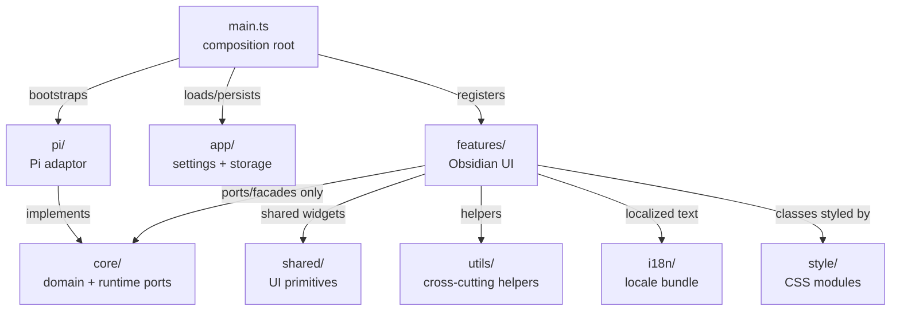
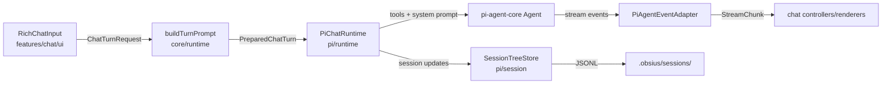

# `src/` — Obsius application layer

Hexagonal TypeScript application for the Obsidian plugin. `main.ts` is the composition root: it patches renderer compatibility, calls `bootstrapPiAgent()`, loads settings/storage, initializes `AgentWorkspace`, and registers views, commands, inline edit, and settings.

## Layering rules

- `core/`: agent-neutral ports, runtime contracts, domain types, prompt/security/MCP semantics. Must not import `src/pi/` or `src/features/`.
- `pi/`: sole Pi adaptor. Implements `ChatRuntime`, system prompt/tools, MCP bridge/proxy, JSONL sessions, skills, provider settings/UI. Must not import `src/features/`.
- `features/`: Obsidian UI for chat, settings, and inline edit. Must not import `src/pi/`; use `core/agent/AgentServices` and `AgentWorkspace`.
- `app/`: plugin settings/storage/view helpers. Keep runtime-specific settings behavior behind `core/agent/AgentServices` registrations; do not import `src/pi/**` here.
- `shared/`: provider-agnostic UI widgets, mention infrastructure, and modals.
- `utils/`: cross-cutting helpers and explicit platform patches. Avoid moving domain decisions here when they belong in `core/`.
- `i18n/`: static JSON locale bundle, `t()`, locale state, and typed translation keys.
- `style/`: CSS modules imported through `style/index.css`; build fails if CSS files are not listed.

## Key entry points

- `main.ts` — Obsidian `Plugin` entry, commands, view registration, lifecycle persistence.
- `pi/bootstrap.ts` — installs Pi registrations into `AgentServices` and `AgentWorkspace`.
- `core/agent/AgentServices.ts` — chat-facing facade for runtimes, UI config, settings persistence, history/title/inline services.
- `core/agent/AgentWorkspace.ts` — workspace services for MCP, OAuth, skills, slash catalog, and settings renderer.
- `core/runtime/ChatRuntime.ts` — provider-neutral runtime contract.
- `features/chat/ObsiusView.ts` — sidebar `ItemView` and multi-tab shell.
- `features/inline-edit/ui/InlineEditModal.ts` — CodeMirror inline-edit UI and service orchestration.
- `features/settings/ObsiusSettings.ts` — settings tab composition.
- `pi/runtime/PiChatRuntime.ts` — Pi `Agent` lifecycle and streaming bridge.
- `pi/tools/buildAgentToolRegistry.ts` — Obsidian tools, MCP proxy, skills, subagent tools.
- `core/mcp/McpServerManager.ts` — MCP context-saving and mention semantics.

## Representative turn flow

## Gotchas

- Static registries are load-order sensitive: `bootstrapPiAgent()` and `AgentWorkspace.initializeAll()` must run before views need services.
- MCP context-saving servers are active only when mentioned (`/server/tool` token transformed for the API prompt) or toolbar-enabled.
- `PreparedChatTurn` keeps display and API prompts separate; do not store MCP-transformed prompt text as user-visible history.
- Obsidian-native tools should prefer in-process Obsidian APIs; CLI is fallback or developer/power-tool surface.
- Adding locale keys requires updating `src/i18n/types.ts` and keeping locale metadata in sync.
