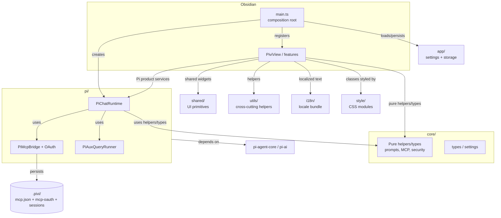
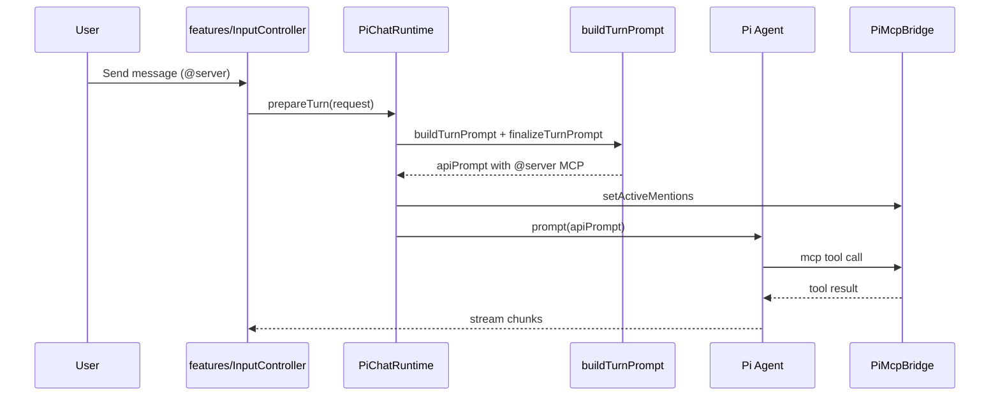

# `src/` — Pivi application layer

Pi-only TypeScript application for the Obsidian plugin. `main.ts` is the composition root: it patches renderer compatibility, loads settings/storage, creates Pi workspace services, and registers views, commands, inline edit, and settings.

## Layering rules

- `core/`: pure helpers, DTOs, prompt/security/MCP/session semantics. Must not import `src/pi/`, `src/features/`, `src/main`, Obsidian SDK, MCP SDK, or Pi SDK packages while those helpers stay shared.
- `pi/`: Pi product modules. Owns `PiChatRuntime`, system prompt/tools, MCP bridge/proxy, JSONL sessions, skills, provider settings/UI, and low-level Pi SDK imports.
- `features/`: Obsidian UI for chat, settings, and inline edit. May import Pivi-owned Pi product modules; prefer explicit dependencies.
- `app/`: plugin settings/storage/session/view helpers. Use Pi settings/session services directly where product behavior is Pi-owned; concrete Obsidian file adapters live here and implement storage ports.
- `shared/`: reusable UI widgets, mention infrastructure, and modals. Prefer props/callbacks over reading plugin globals or Pi services directly.
- `utils/`: cross-cutting helpers and explicit platform patches. Avoid moving domain decisions here when they belong in `core/`.
- `i18n/`: static JSON locale bundle, `t()`, locale state, and typed translation keys.
- `style/`: CSS modules imported through `style/index.css`; build fails if CSS files are not listed.

## Key entry points

- `main.ts` — Obsidian `Plugin` entry, commands, view registration, lifecycle persistence.
- `pi/app/PiWorkspaceServices.ts` — MCP, OAuth, skills, slash catalog, model readiness, and settings renderer.
- `pi/PiSettingsCoordinator.ts` — Pi settings projection and model/reasoning/permission normalization.
- `core/runtime/ChatRuntime.ts` — chat runtime contract used by tabs/controllers; keep it limited to Pi-backed chat needs.
- `features/chat/PiviView.ts` — sidebar `ItemView` and multi-tab shell.
- `features/inline-edit/ui/InlineEditModal.ts` — CodeMirror inline-edit UI and service orchestration.
- `features/settings/PiviSettings.ts` — settings tab composition.
- `pi/runtime/PiChatRuntime.ts` — Pi `Agent` lifecycle and streaming bridge.
- `pi/tools/buildAgentToolRegistry.ts` — Obsidian tools, MCP proxy, skills, subagent tools.
- `core/mcp/McpServerManager.ts` — MCP context-saving and mention semantics.

## Representative turn flow

## Gotchas

- `main.ts` must create Pi workspace services before views/settings need MCP, OAuth, skills, slash catalog, or model readiness.
- MCP context-saving servers are active only when mentioned (`/server/tool` token transformed for the API prompt) or toolbar-enabled.
- `PreparedChatTurn` keeps display and API prompts separate; do not store MCP-transformed prompt text as user-visible history.
- Obsidian-native tools should prefer in-process Obsidian APIs; CLI is fallback or developer/power-tool surface.
- Adding locales requires updating locale JSON, `src/i18n/types.ts`, and the single metadata source `SUPPORTED_LOCALES` in `src/i18n/constants.ts`.
