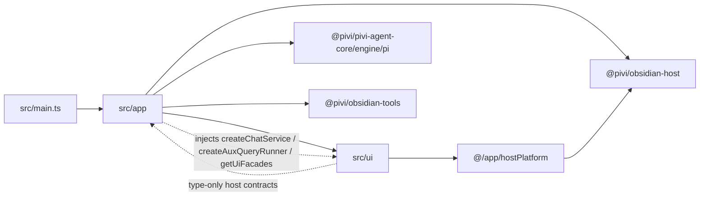

# `src/app/` — product composition shell

*This file extends the root [AGENTS.md](../../AGENTS.md). Follow root guidance first.*

## Purpose

`src/app/` is the Obsidian product composition layer: lifecycle, command/view registration, settings codecs, host contracts, and Pi workspace service construction. It sits between the thin `src/main.ts` Plugin shell and product UI.

## Dependency direction

## Rules

- **Construct concrete Pi runtime here.** `workspace/createChatRuntimeServices.ts` builds `PiChatRuntime` and Pi aux runners. Expose only `PiChatService` / `AuxQueryRunner` factories on `PiviPluginHost` / workspace services.
- **Hide engine/pi from UI.** `workspace/piUiFacades.ts` wraps chat UI config, settings projection, model catalog listing, and keychain migration. UI calls `plugin.getUiFacades()` only—never `@pivi/pivi-agent-core/engine/pi/*`.
- **Host contracts without concrete implementations.** `hostContracts.ts` defines `PiviChatView`, `PiviChatHost`, `PiviSettingsHost`, `PiviPluginWorkspace`, and `PiviPluginHost` using narrow structural contracts. Do not import concrete `PiviViewHost`, `src/app/workspace/**`, or `@pivi/pivi-agent-core/engine/pi/**` into host contracts.
- **UI uses `hostPlatform` for path/vault/CLI helpers.** Never import `@pivi/obsidian-host` from `src/ui/**` (enforced by architecture + ESLint).
- **`workspace/**` must not import `@/ui/**`.** React settings consume package-owned ports implemented in `src/app/ui/createUiPorts.ts`; workspace services expose runtime capabilities only.
- **`ui/**` is the package-port adapter and Obsidian lifecycle-host layer.** It is the only product directory that imports `@pivi/obsidian-ui/ports` and `@pivi/obsidian-ui/mount`. `PiviViewHost` stays a thin Obsidian view lifecycle shell: create ports, prepare the React shell, mount, dispose. Tab runtime and message presentation live in `createImperativeChatAdapter` (`ImperativeChatAdapter` + `TabManager`). `createChatUiPorts` builds `ChatPorts` (`runtime` / `sessions` / `catalog` / `models`); `createSettingsUiPorts` builds `SettingsPorts`. Do not inject a settings renderer into the service graph—settings mount only through `PiviSettingTabHost` + `SettingsPorts`. Chat chrome reaches React through `ActiveChatUiBridge` + `ChatUiStore` snapshots; ports supply catalogs/factories, not live UI state. MCP `save`/`reload` invalidate slash caches, warm `PiMcpToolProvider` tool lists, and reload chat-runtime MCP bridges (which prefetch enabled tools into the bridge cache).
- **Prefer narrow hosts in UI.** Chat/inline-edit UI types as `PiviChatHost` (no `getPiWorkspace` / storage / HTTP / process); settings ports use `PiviSettingsHost`; only `PluginSettingTab` subclasses (and app composition) use full `PiviPluginHost` when Obsidian requires a `Plugin`. `createChatUiPorts(host, workspace)` takes an explicit workspace from composition (`PiviViewHost` receives a `getWorkspace` callback from `viewRegistration`); `createSettingsUiPorts` may still call `getPiWorkspace()` on `PiviSettingsHost`.
- Keep session load/delete/purge helpers in `pluginSessionApi.ts` and settings load in `pluginSettingsLoad.ts` so `main.ts` stays a thin composition root.

## Key files

| File | Role |
|------|------|
| `hostContracts.ts` | `PiviChatView`, UI-facing workspace, Chat/Settings/Plugin host surfaces |
| `hostPlatform.ts` | Path, vault notify, CLI flags, service-contract re-exports for UI |
| `pluginSessionApi.ts` | Session CRUD / purge / cross-view lookup |
| `pluginSettingsLoad.ts` | Settings load, keychain migration, skills seed |
| `noteToolbarIntegration.ts` | Safe Note Toolbar detection, install/enable fallback, and official CLI command-item setup |
| `serviceGraph.ts` | Builds host + Pi workspace graph; asserts bundled React runtime |
| `ui/PiviViewHost.ts` | Thin Obsidian chat view lifecycle; mounts React chat; receives `getWorkspace` from registration for `createChatUiPorts` |
| `ui/imperativeChatAdapter.ts` | `createImperativeChatAdapter`: TabManager mount, message presentation, `scheduleTabsSnapshotPublish`, tabs store bridge |
| `ui/externalDirectory.ts` | Desktop directory pick/validate for settings ports (no `@/ui` import) |
| `ui/PiviSettingTabHost.ts` | Obsidian settings tab lifecycle; mounts React `SettingsRoot` only |
| `ui/createUiPorts.ts` | `createChatUiPorts(host, workspace)` and `createSettingsUiPorts(host)` |
| `workspace/PiWorkspaceServices.ts` | MCP, skills, tools, readiness, chat factories |
| `workspace/createChatRuntimeServices.ts` | `PiChatRuntime` / aux-query construction only |
| `workspace/piUiFacades.ts` | Settings/model/auth facades for product UI |
| `commandRegistration.ts` / `viewRegistration.ts` / `settingsRegistration.ts` | App → UI mount points |
