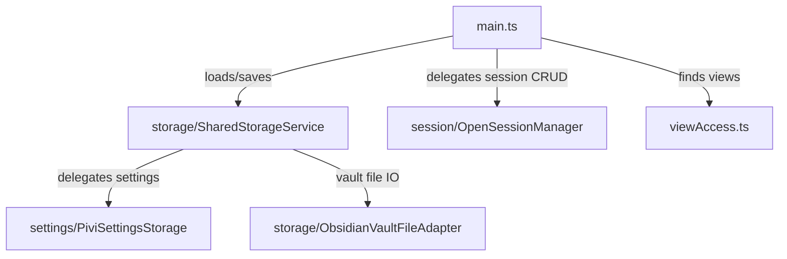

# `src/app/` — Obsidian app persistence, session orchestration, and view access

Application-adapter helpers used by `main.ts`: plugin data storage, vault/home file adapters, open-session orchestration, settings storage, and lookup helpers for open Pivi views.

## Map

## Rules

- Use Pi settings/session services directly where app persistence touches Pi-owned data.
- Persist durable tab identity as session-oriented fields, not transient runtime state.
- User-visible storage failures should surface through Obsidian `Notice` only where callers expect UI feedback.
