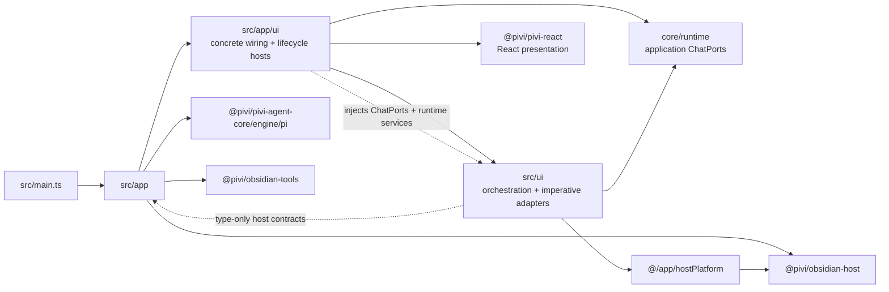

# `src/app/` — product composition shell

*This file extends the root [AGENTS.md](../../AGENTS.md). Follow root guidance first.*

## Purpose

`src/app/` is the Obsidian product composition layer: lifecycle, command/view registration, settings codecs, host contracts, and Pi workspace service construction. It sits between the thin `src/main.ts` Plugin shell and product UI.

## Dependency direction

## Rules

- **Construct concrete Pi runtime here.** `workspace/createChatRuntimeServices.ts` builds `PiChatRuntime` and Pi aux runners. `PiWorkspaceServices` owns the single plugin-wide subagent concurrency limiter and injects the same instance into every runtime/runner so limits span tabs. Keep these factories on workspace services and the app-only `PiviChatCompositionHost` wiring surface; product UI receives them only through core-owned `ChatPorts` / `PiChatService` / `AuxQueryRunner` contracts.
- **Register before workspace I/O.** `pluginLifecycle` registers views, commands, and settings after required settings load, then starts the single-flight `ensureWorkspaceServices()` from a visible surface or `workspace.onLayoutReady`. View/settings hosts await the same promise before building ports, and generation guards prevent late mounts after close/hide. `PiviSettingTabHost` exposes a localized custom setting definition for Obsidian 1.13 search and retains `display()` for 1.12; both routes share the same React mount/dispose generation. Locale changes refresh the declarative index. Workspace disposal owns MCP OAuth and provider/connection-pool shutdown.
- **Keep chat performance tracing development-only and instance-owned.** `PiviPlugin.onload()` dynamically imports `chatPerformanceRecorder.ts` only in development, while production retains only the disabled controller contract. The plugin injects that recorder through `PiviViewHost` / `ImperativeChatAdapter` into each tab's `ChatState`; debug commands start, heap-sample, run the deterministic 64-chunk / 100KB Markdown stream through a disposable unbound tab's real projection and Markdown adapter, run a fixed 10-tab / 20-switch in-memory workload, run isolated 20-subagent and 5K indexed cold-open/older-page traces, and stop/export traces under `.pivi/perf-traces/`. Every workload suspends tab persistence and restores the original active tab. The Markdown and switching workloads never bind session files; fixture workloads copy their fixed source to a unique temporary session id and delete its JSONL/index after measurement. Stop fixture traces through their pre-cleanup hook so restoring the original tab cannot contaminate scenario metrics. An optional `.pivi/perf-scenario.txt` supplies the scenario label for CLI-driven runs. Unload disposes observers; tracing never enters settings or real user session JSONL.
- **Hide engine/pi and facades from product UI.** `workspace/piUiFacades.ts` wraps chat UI config, settings projection, model catalog listing, and keychain migration. `src/app/ui/createUiPorts.ts` is the chat wiring boundary that adapts facade behavior into narrow core-owned `ChatPorts`; `src/ui/**` never calls `getUiFacades()` or imports `engine/pi`.
- **Host contracts without concrete implementations.** `hostContracts.ts` defines the semantic `PiviChatViewHandle`, structural `PiviChatView`, app-only `PiviChatHost`, composition-only `PiviChatCompositionHost`, `PiviSettingsHost`, `PiviPluginWorkspace`, and `PiviPluginHost`. Do not import concrete `PiviViewHost`, `src/app/workspace/**`, or `@pivi/pivi-agent-core/engine/pi/**` into host contracts.
- **UI uses `hostPlatform` for path/vault/CLI helpers.** Never import `@pivi/obsidian-host` from `src/ui/**` (enforced by architecture + ESLint).
- **`workspace/**` must not import `@/ui/**`.** React settings consume package-owned ports implemented in `src/app/ui/createUiPorts.ts`; workspace services expose runtime capabilities only.
- **`ui/**` is the package-port adapter and Obsidian lifecycle-host layer.** It is the only product directory that imports `@pivi/pivi-react/ports` and `@pivi/pivi-react/mount`; application-facing `ChatPorts` come from `@pivi/pivi-agent-core/runtime/chatPorts`. `PiviViewHost` stays a thin Obsidian view lifecycle shell: create ports, resolve presentation-only scalars such as the chat icon, prepare the React shell, mount, dispose. `obsidianPresentationPlatform` owns localized host terminology (`hostName` / `workspaceName` / `secureStorageName`) as well as icon and tooltip adaptation; React contracts use only host-neutral names. Its app-local imperative adapter wrapper captures `ChatPorts`; the React mount contract never imports, receives, or forwards them. `createImperativeChatAdapter` orchestrates mount/lifecycle and delegates semantic view-handle construction and message-presentation adapters to sibling `imperativeChat*.ts` modules. Shared tab/runtime external-context synchronization lives in `src/ui/chat/tabs/tabExternalContext.ts`. The adapter family is the only app-side boundary allowed to inspect the internal `TabManager` / `TabData` / controller / UI / DOM aggregate; every other app caller uses `PiviChatViewHandle.commands` or `.maintenance`. `createChatUiPorts` builds `ChatPorts` (`runtime` / `sessions` / `catalog` / `models` / `settings`) and adapts facade-backed application behavior without exposing the facade; `createSettingsUiPorts` implements React-owned `SettingsPorts` and injects the featured skills bundle descriptor. Do not inject a settings renderer into the service graph—settings mount only via `PiviSettingTabHost` + `SettingsPorts`. Chat chrome reaches React through `ActiveChatUiBridge`, `ChatUiStore`, `ChatProjectionStore`, and `ChatTabsStore`; ports supply catalogs/factories/configuration, not live UI state or facade objects. MCP settings inventory reads are cache-only; explicit tool refresh imports authenticated diagnostics results into `PiMcpToolProvider`. MCP `save`/`reload` invalidate slash caches, prefetch enabled remote tool lists, and reload chat-runtime MCP bridges; stdio servers remain lazy until explicit diagnostics or the agent's first MCP search/list/call. Settings Authentication first probes remote servers whose auth mode and OAuth metadata are both unset; an anonymous success returns `not_applicable` and skips OAuth, while explicitly OAuth-configured servers always enter the OAuth flow.
- Settings tool enablement invalidates slash caches as well as refreshing runtime prompts. Tab-bar position changes call the semantic `refreshTabBarPosition` maintenance operation on every mounted view immediately, which republishes the React snapshot and relocates the input portal without a reload. The built-in `/generate-image` catalog entry is a `tool`, appears only while `obsidian_generate_image` is both authenticated and enabled, and never enters Commands settings or command-template expansion.
- `createSettingsUiPorts` implements the shared settings feedback port with Obsidian Notice. App-owned integration actions return structured success/error feedback so React can notify transient outcomes and retain only actionable errors beside their originating controls.
- Workspace commands are persisted under `.pivi/commands/`, receive stable integration keys, and are dynamically registered as icon-bearing Obsidian commands by `workspaceCommandRegistry.ts`. Renaming preserves the integration key; Note Toolbar and editor-toolbar items therefore keep their target. The registered command resolves shared Prompt context before opening a fresh Pivi tab/session through the semantic chat-view handle. An editor-toolbar Pivi Command whose per-shortcut target is Inline edit instead resolves by that stable key in `SelectionToolbarSurfaceController`, consumes `{{selected_text}}` from the instruction, and immediately submits through the existing inline-edit archived-session/diff-review path with the selected range carried once in its canonical block; target failures never fall back to Sidebar.
- **Keep runtime and composition hosts distinct.** `PiviChatHost` exposes only `app` to `src/ui/chat`; all runtime/session/model/catalog/settings behavior arrives through `ChatPorts`. `PiviChatCompositionHost` owns settings, facades, view enumeration, and tab-state persistence for `src/app/ui` and the plugin shell. Settings ports use `PiviSettingsHost`. Only `PluginSettingTab` subclasses (and app composition) use full `PiviPluginHost` when Obsidian requires a `Plugin`. Both `createChatUiPorts(host, workspace)` and `createSettingsUiPorts(host, workspace)` receive an explicit workspace from composition. `PiviViewHost` and `PiviSettingTabHost` each receive a lazy `getWorkspace` callback from registration so construction does not capture an uninitialized workspace.
- **Use semantic view operations from app code.** Commands and maintenance flows obtain `PiviChatViewHandle` from the structural view, then call behavior-named operations. Never expose or down-drill through `TabManager`, `TabData`, `.controllers`, `.ui`, `inlineContextManager`, `externalContextSelector`, or other DOM/runtime surfaces outside the `imperativeChat*.ts` adapter family.
- Keep session load/delete/purge helpers in `pluginSessionApi.ts` and settings load in `pluginSettingsLoad.ts` so `main.ts` stays a thin composition root. Host-neutral default-Skills orchestration requests a prompt through an injected callback; `src/app/ui/defaultVaultSkillsPrompt.ts` alone owns the localized Obsidian Notice DOM.
- Provider credential migration belongs in `pluginSettingsLoad.ts`, before workspace services or settings surfaces are created. Split-plan migration must be eager and idempotent, preserve an existing destination credential, and rewrite persisted model selections into the same provider namespace as the migrated OAuth credential.
- Unload starts persistence for every mounted chat view before invalidating or disposing workspace services. Collect all persistence promises synchronously and settle them together so a slow or failing view cannot prevent the others from saving; disposal must reject queued subagent admissions before provider/MCP/session resources are released.
- **Absolute external paths are device-local.** `deviceLocalExternalContextStore.ts` uses Obsidian's public vault-scoped `App.loadLocalStorage` / `saveLocalStorage` API. Settings load moves legacy synced roots into this cache before `.pivi/settings.json` is rewritten; the settings codec overlays them into the in-memory tool settings and strips them from every vault settings save. Session-store startup similarly migrates legacy JSONL paths before summaries are loaded. Non-parse migration failures abort initialization; a malformed session is warned and skipped so it cannot prevent the rest of the workspace from starting, then fails explicitly if opened.
- **Provider registry and model preferences are device-local.** `deviceLocalProviderStore.ts` persists `pivi.providers.v1` through the same public local-storage API. Startup migration (`deviceLocalProviderMigration.ts`) owns first-run cutover in `pluginSettingsLoad.ts` before workspace construction; steady-state saves go through `createPiviSettingsCodec`, which extracts and commits local provider state first, then strips provider/model/webSearchTools fields from `.pivi/settings.json`. A synced save failure after a successful local commit retains local authority and surfaces a localized Notice (`host.failedSaveSyncedSettings`). Production `createSharedStorage` always injects the provider store; bare `createPiviSettingsCodec()` without a provider store remains valid for focused external-context tests only. Custom provider header values must use SecretStorage-first settings-port writes; never persist header maps through `patchCustomProvider` or synced settings JSON.

## Key files

| File | Role |
|------|------|
| `hostContracts.ts` | Semantic `PiviChatViewHandle`, structural view, runtime/composition Chat hosts, Settings/Plugin host surfaces |
| `hostPlatform.ts` | Path, vault notify, CLI flags, service-contract re-exports for UI |
| `pluginSessionApi.ts` | Session CRUD / purge; cross-view resets and protected bindings use semantic view maintenance |
| `pluginSettingsLoad.ts` | Settings load, keychain migration, skills seed |
| `noteToolbarIntegration.ts` | Public-adapter Note Toolbar installation gate, enable fallback, per-command icon-only CLI setup, official item-API synchronization, and keyed setup queue |
| `workspaceCommandRegistry.ts` | Dynamic workspace-command registration, context resolution, and new-session dispatch |
| `openStyleSettings.ts` | Style Settings tab open or marketplace fallback |
| `piviViewActivation.ts` | Activate/open Pivi leaves and create tabs without stacking a blank cold-open tab |
| `startupPerformance.ts` | Records settings and workspace initialization performance marks without changing lifecycle ordering |
| `serviceGraph.ts` | Builds the Pi workspace from an explicit narrow app host; injects device-local external-context and provider stores into the settings codec; asserts bundled React runtime |
| `deviceLocalExternalContextStore.ts` | Vault-scoped device-local cache for external-read roots, session selections, and per-turn overlays |
| `deviceLocalProviderStore.ts` | Vault-scoped device-local provider registry (`pivi.providers.v1`) |
| `settings/deviceLocalProviderMigration.ts` | Startup cutover coordinator: legacy synced fields → local state + secrets → strip |
| `settings/piviSettingsCodec.ts` | Steady-state overlay/extract/strip for external roots and provider state |
| `deviceLocalProviderStore.ts` | Vault-scoped device-local cache for provider registry, model preferences, and web provider order |
| `ui/obsidianPresentationPlatform.ts` | Obsidian implementation of localized host terminology plus the product React icon/tooltip seam |
| `ui/obsidianSettingsIntegration.ts` | Obsidian tool-row and settings-integration descriptors injected into generic product React settings |
| `ui/PiviViewHost.ts` | Thin Obsidian chat view lifecycle; mounts React chat; receives `getWorkspace` from registration for `createChatUiPorts` |
| `ui/imperativeChatAdapter.ts` | Thin orchestrator: TabManager mount/lifecycle, React shell bridge, and tab/surface actions |
| `ui/imperativeChatViewHandle.ts` | Semantic `PiviChatViewHandle` construction (`commands` + `maintenance`) |
| `ui/imperativeChatMessagePresentation.ts` | React message-presentation runtime and content-adapter mounting |
| `ui/defaultVaultSkillsPrompt.ts` | Localized owner-realm Obsidian Notice shown only after host-neutral Skills orchestration requests confirmation |
| `ui/externalDirectory.ts` | Desktop directory pick/validate for settings ports (no `@/ui` import) |
| `ui/PiviSettingTabHost.ts` | Obsidian 1.13 declarative settings-search bridge plus 1.12 `display()` fallback; both mount the same React `SettingsRoot` |
| `ui/selectionToolbar/SelectionToolbarSurfaceController.ts` | Mounts React selection-toolbar/inline-edit chrome into `SelectionToolbarHost`; wires Ask AI, Add to chat, Sidebar/Inline edit Pivi Command dispatch, and `submitInlineEditTurn` |
| `editorSelectionToolbarRegistration.ts` | CM6 selection trigger + floating overlay host (`getSelectionToolbarHost`) |
| `ui/createUiPorts.ts` | Explicit-workspace `createChatUiPorts(host, workspace)` and `createSettingsUiPorts(host, workspace)` public entries |
| `ui/createUiPortHelpers.ts` | Shared workspace/env/subagent helpers for UI port adapters |
| `ui/createSettingsModelsPort.ts` | Settings models/credential port wiring; prefetches interactive OAuth credentials via `getAuth` before readiness badges render; settings-authoritative provider removal and optional single-provider credential deletion |
| `ui/createMcpSettingsPorts.ts` | Settings MCP save/reload/auth port wiring |
| `ui/mentionEditor/createMentionEditorPort.ts` | Implements `SettingsPorts.mentionEditor`: mounts an imperative `MentionInput` with `MentionDropdownController` + `SlashCommandDropdown` into a React-owned container for command prompt editing |
| `ui/createSubagentContentAdapter.ts` | Bridges React message-content mount/update calls to stored subagent imperative rendering without remounting on every stream update |
| `workspace/PiWorkspaceServices.ts` | MCP, skills, tools, readiness, chat factories |
| `workspace/createChatRuntimeServices.ts` | `PiChatRuntime` / aux-query construction only |
| `workspace/obsidianHttpRequest.ts` | Adapts Obsidian HTTP into custom-provider composition without leaking host networking into the Pi engine |
| `workspace/piUiFacades.ts` | Settings/model/auth facades for product UI |
| `commandRegistration.ts` / `viewRegistration.ts` / `settingsRegistration.ts` | App → UI mount points |
