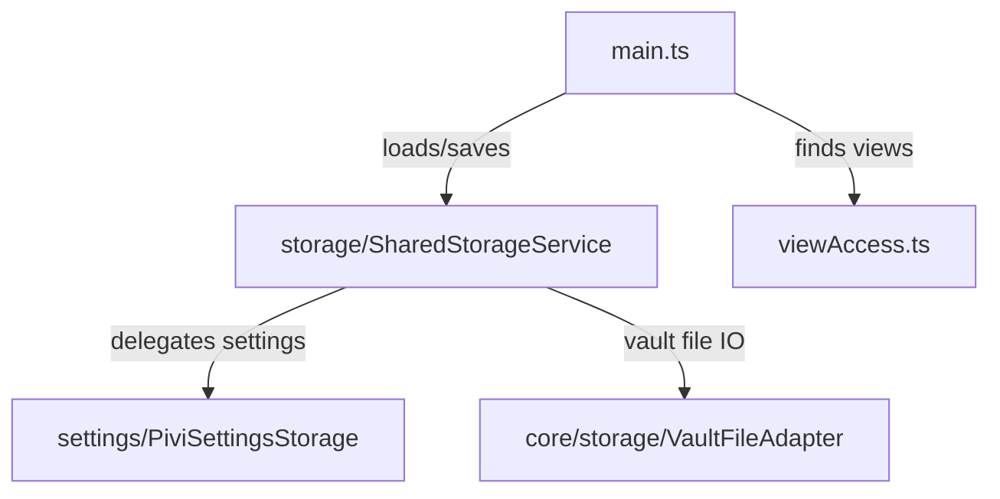

# `src/app/` — Obsidian app persistence and view access

Thin application-adapter helpers used by `main.ts`: plugin data storage, vault-backed settings storage, and lookup helpers for open Pivi views.

## Map

## Rules

- Keep runtime-specific normalization behind `core/agent/AgentServices`; do not import `src/pi/**` here.
- Persist durable tab identity as session-oriented fields, not transient runtime state.
- User-visible storage failures should surface through Obsidian `Notice` only where callers expect UI feedback.
