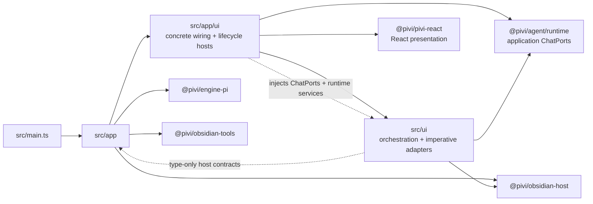

# `src/app/` — product composition shell

*This file extends the root [AGENTS.md](../../AGENTS.md). Follow root guidance first.*

## Purpose

`src/app/` is the Obsidian product composition layer: lifecycle, command/view registration, settings codecs, host contracts, and plugin runtime service construction. It sits between the thin `src/main.ts` Plugin shell and product UI.

## Dependency direction

```mermaid
flowchart LR
  Main["src/main.ts"] --> App["src/app"]
  App --> AppUI["src/app/ui<br/>concrete wiring + lifecycle hosts"]
  AppUI --> UI["src/ui<br/>orchestration + imperative adapters"]
  AppUI --> ReactUI["@pivi/pivi-react<br/>React presentation"]
  AppUI --> Runtime["@pivi/agent/runtime<br/>application ChatPorts"]
  App --> Host["@pivi/obsidian-host"]
  App --> Engine["@pivi/engine-pi"]
  App --> Tools["@pivi/obsidian-tools"]
  UI -. "type-only host contracts" .-> App
  AppUI -. "injects ChatPorts + runtime services" .-> UI
  UI --> Runtime
  UI --> Host
```

## Rules

Behavior detail for each rule is in [docs/12-architecture-status.md](../../docs/12-architecture-status.md#app-composition-notes).

### Composition

- **Construct the Pi runtime only here.** `runtime/createChatRuntimeServices.ts` builds `PiChatRuntime` and aux runners through `@pivi/engine-pi/application/runtime`. Production app code uses only the `application/{auth,models,oauth,oauth-flows,runtime,session}` surfaces; `application/development` is a development-only dynamic import.
- **`src/main.ts` stays lifecycle-only.** `PiviApplication.ts` owns product state, assembly, and lifecycle order. Production `src/app/**` never imports `@/main`; pass the real `Plugin` separately where Obsidian needs it.
- **Two host contracts, no facades.** `hostContracts.ts` defines `PiviChatCompositionHost` and `PiviSettingsHost`; `PiviApplication` satisfies both structurally and `ApplicationSessions` implements `ChatSessionPort`. Do not add per-registration facade types or delegating objects.
- **`runtime/**` never imports `@/ui/**`.** Runtime services expose capabilities only through injected contracts.
- **`ui/**` is the only adapter layer.** Only `src/app/ui` imports `@pivi/pivi-react/mount` and `@pivi/pivi-react/ports`, builds `ChatPorts` (`createChatUiPorts`) and `SettingsPorts` (`createSettingsUiPorts`), and calls `getUiFacades()`. Product UI in `src/ui` receives `ChatPorts` and the `app`-only `PiviChatHost`, nothing else.
- **Only the `imperativeChat*.ts` family touches chat internals.** Every other app caller uses `PiviChatViewHandle.commands` or `.maintenance`; never reach through `TabManager`, `TabData`, controllers, or DOM.
- **Settings mount only through `PiviSettingTabHost` and `SettingsPorts`.** Do not inject a settings renderer into the service graph. There is no `SettingPage` subclass and no `display()` fallback.
- **Add behavior to a collaborator, not to `PiviApplication`.** Session operations live in `ApplicationSessions`, Note Toolbar setup in `ApplicationNoteToolbar`, session helpers in `pluginSessionApi.ts`, settings load in `pluginSettingsLoad.ts`. The class has no `max-lines` exemption.

### Lifecycle

- **Register before workspace I/O.** `pluginLifecycle` registers views, commands, and settings after settings load, then starts the single-flight `ensureWorkspaceServices()` from a visible surface or `onLayoutReady`. Hosts await that promise before building ports; generation guards stop late mounts after close.
- **Unload is ordered and single-flight.** Reject new operations, collect every view's shutdown promise synchronously and settle them together, then persist tab bindings, cancel turns and save sessions, release the session journal (owner-token guarded), and dispose the workspace. Subagent admissions are rejected before provider, MCP, and session resources are released.
- **Dispose every live settings surface on unload.** Obsidian does not guarantee render cleanup when the settings window is destroyed.

### Network and development tooling

- **Scoped network clients come from composition.** `PiviApplication.network` passes purpose-scoped clients into MCP/OAuth, web tools, image generation, custom providers, and connectivity. Never patch `window.fetch`. Private-origin grants for MCP and custom providers are issued at workspace init, re-issued on settings save, and cleared on disposal; WebFetch has no grant path.
- **Perf tracing and real-host smoke are development-only.** Both are dynamically imported in development and must be absent from production bundles. Workloads use disposable tabs or temporary session copies and never touch real user sessions or settings.

### Device-local state

- **Upgrade-from floor is 0.15.0.** Startup runs no credential, provider-registry, environment, or MCP OAuth migration for older formats. On a device with no local state the loaders seed defaults; provider and environment fields found in synced settings are stripped, not migrated.
- **Local state commits before synced settings.** Provider registry (`pivi.providers.v1`), environment registry (`pivi.environment.v1`), capability permissions (`pivi.capability-permissions.v1`), external paths, and the session journal (`pivi.session-journal.v1`) live in vault-scoped local storage. Saves commit local state first, then strip those fields from `.pivi/settings.json`. A synced save failure keeps local authority and shows `host.failedSaveSyncedSettings`.
- **Absolute paths and secret values never enter synced files.** Custom-provider headers and environment secrets are written to `SecretStorage` first; never persist header maps through `patchCustomProvider` or settings JSON.
- **Every load path must apply the capability-permission overlay.** Saving writes in-memory grants back to the device store, so a load that skips `overlayDeviceLocalCapabilityPermissions` erases them on the next save. A v2 record always wins over synced fields.
- **Session recovery runs before the session store is built.** A corrupt journal resets to empty with a warning. Rebuildable indexes live under `~/.pivi/session-indexes/<vault-key>/`.
- **Empty sessions never become history.** Startup discards parsed JSONL with no user message when it is at least one hour old, not journal-owned, and not bound to a live tab.

### Commands and settings behavior

- **Workspace commands keep a stable integration key.** Commands live in `.pivi/commands/` and are registered as Obsidian commands by `workspaceCommandRegistry.ts`; renaming preserves the key so Note Toolbar and editor-toolbar items keep their target. An Inline edit target never falls back to Sidebar on failure.
- **Tool enablement and MCP changes invalidate slash caches.** MCP save and reload also prefetch enabled remote tool lists and reload chat-runtime bridges. The `/generate-image` entry is a `tool`, shown only while `obsidian_generate_image` is authenticated and enabled, and never appears in Commands settings.
- **Display-setting changes apply to every mounted view immediately** through the semantic maintenance operations (`refreshTabBarPosition`, `refreshChatDisplaySettings`), without a reload.
- **Settings feedback goes through the shared feedback port.** Integration actions return structured success or error results.

## Key files

| File | Role |
|------|------|
| `PiviApplication.ts` | Product state, application assembly, and lifecycle implementation delegated to by `main.ts` |
| `developmentSmokeRunner.ts` | Development-only real-host smoke runner; returns `undefined` in production builds. `PiviApplication` itself satisfies `PiviChatCompositionHost` and `PiviSettingsHost` structurally |
| `applicationSessions.ts` | `ApplicationSessions`: session CRUD, transcript recovery, and maintenance over `pluginSessionApi.ts`; every trash/restore/purge runs through one FIFO operation tail |
| `applicationNoteToolbar.ts` | `ApplicationNoteToolbar`: selection-command and per-workspace-command Note Toolbar setup sharing one keyed setup queue and CLI/dependency assembly |
| `hostContracts.ts` | Semantic `PiviChatViewHandle`, structural view, runtime/composition Chat hosts, Settings/Plugin host surfaces |
| `slashBadgeNavigation.ts` | Per-`App` registry that lets shared badge adapters request slash-destination navigation owned by settings composition |
| `i18n.ts` | App-owned shared translator (`appI18n`, `t`) consumed by imperative adapters and injected into React roots |
| `viewAccess.ts` | Type-guarded enumeration of open Pivi chat views; skill refresh isolates per-view failures so one disposed view cannot fail a durable publication commit |
| `pluginSessionApi.ts` | Session CRUD / purge; archived/deleted inventory; empty-session compensation; cross-view resets use semantic view maintenance |
| `pluginSettingsLoad.ts` | Settings load, device-local state load, session cloud recovery, skills seed, empty-session startup cleanup |
| `emptySessionCleanup.ts` | Startup discard of stale empty JSONL and archived bindings |
| `deviceLocalCapabilityPermissionStore.ts` | Vault-scoped `pivi.capability-permissions.v1` Bash, exact Obsidian-command, and external-directory grants |
| `noteToolbarIntegration.ts` | In-memory plugin-registry Note Toolbar detection (no manifest file probes, keeping self-file literals out of the bundle), enable fallback, per-command icon-only CLI setup, official item-API synchronization, and keyed setup queue |
| `workspaceCommandRegistry.ts` | Dynamic workspace-command registration, context resolution, and new-session dispatch |
| `openStyleSettings.ts` | Style Settings tab open or marketplace fallback |
| `piviViewActivation.ts` | Activate/open Pivi leaves and create tabs without stacking a blank cold-open tab |
| `startupPerformance.ts` | Records settings and workspace initialization performance marks without changing lifecycle ordering |
| `serviceGraph.ts` | Builds the Pi workspace from an explicit narrow app host; injects device-local external-context, provider, and environment stores into the settings codec; passes `PiviNetworkClients` into workspace services; asserts bundled React runtime |
| `deviceLocalExternalContextStore.ts` | Vault-scoped device-local cache for external-read roots, session selections, and per-turn overlays |
| `deviceLocalSessionJournalStore.ts` | Vault-scoped device-local session write-ahead journal (`pivi.session-journal.v1`) |
| `deviceLocalProviderStore.ts` | Vault-scoped device-local provider registry (`pivi.providers.v1`) |
| `deviceLocalEnvironmentStore.ts` | Vault-scoped device-local structured environment registry (`pivi.environment.v1`) |
| `settings/deviceLocalProviderLoad.ts` | Startup load of device-local provider state: overlay or seed defaults, then strip synced provider fields |
| `settings/deviceLocalEnvironmentLoad.ts` | Startup load of the device-local environment registry plus the steady-state publish and credential hand-off helpers used by bulk import |
| `settings/syncedProviderFields.ts` | `hasSyncedProviderFields`: detects provider fields an older device synced back so startup can strip them |
| `settings/environmentVariables.ts` | Steady-state environment port helpers: structured entry apply/import and secret staging |
| `settings/piviSettingsCodec.ts` | Steady-state overlay/extract/strip for external roots, provider state, and environment fields |
| `ui/obsidianSettingsIntegration.ts` | Obsidian tool-row and settings-integration descriptors injected into generic product React settings |
| `ui/PiviViewHost.ts` | Thin Obsidian chat view lifecycle; mounts React chat; receives `getWorkspace` from registration for `createChatUiPorts` |
| `ui/imperativeChatAdapter.ts` | Thin orchestrator: TabManager mount/lifecycle, React shell bridge, and tab/surface actions |
| `ui/imperativeChatViewHandle.ts` | Semantic `PiviChatViewHandle` construction (`commands` + `maintenance`) |
| `ui/imperativeChatMessagePresentation.ts` | React message-presentation runtime and content-adapter mounting |
| `ui/imperativeChatDevelopment.ts` | Development-only debug/perf trace commands behind the semantic view handle; drives the disposable-tab stream/switch/subagent/cold-open workloads |
| `ui/imperativeChatInlineEdit.ts` | `submitInlineEditTurn`: routes inline-edit instructions through the archived-session turn path and diff review |
| `ui/imperativeChatTabAction.ts` | Shared `imperativeChatLogger` and the Notice-wrapped tab-action runner used by the adapter family |
| `ui/createStreamingMarkdownContentAdapter.ts` | App-owned streaming Markdown `MessageContentAdapter` bridging `MessageRenderer` into React slots with perf recording. Streaming-phase segments pass `deferMath` from `ChatSettingsSnapshot.deferMathRenderingDuringStreaming`; the terminal render always typesets math |
| `ui/inlineEditHelpers.ts` / `ui/inlineEditProtocol.ts` | Inline-edit selected-text escaping/context assembly and the `<replacement>`/`<insertion>`/reply turn-protocol parser |
| `ui/inlineEditSurface/` | Editor-embedded inline-edit surface: `InlineEditSurfaceSession.ts` owns the session lifecycle, plus the diff-review field, keyboard controller, and DOM helpers mounted by `SelectionToolbarSurfaceController` |
| `ui/defaultVaultSkillsPrompt.ts` | Localized owner-realm Obsidian Notice shown only after host-neutral Skills orchestration requests confirmation |
| `ui/PiviSettingTabHost.ts` | Obsidian 1.13 native settings root: `SETTINGS_ROOT_LAYOUT` → declarative pages/groups; each page has one indexed `render` item that mounts `mountSettingsPage`; live-surface unload disposal |
| `ui/selectionToolbar/SelectionToolbarSurfaceController.ts` | Mounts React selection-toolbar/inline-edit chrome into `SelectionToolbarHost`; wires Ask AI, Add to chat, Sidebar/Inline edit Pivi Command dispatch, and `submitInlineEditTurn` |
| `editorSelectionToolbarRegistration.ts` | CM6 selection trigger + floating overlay host (`getSelectionToolbarHost`) |
| `pluginIdentity.ts` | Public GitHub/issues URLs, package version, manifest min host version, and the About release date |
| `ui/createUiPorts.ts` | Explicit-workspace `createChatUiPorts(chat, sessions, workspace)` public entry for `@pivi/agent`-owned `ChatPorts` |
| `ui/createSettingsUiPorts.ts` | Explicit-workspace `createSettingsUiPorts(host, workspace)` public entry for React-owned `SettingsPorts`; About snapshot comes from `pluginIdentity.ts` |
| `ui/createUiPortHelpers.ts` | Shared workspace/env/subagent helpers for UI port adapters |
| `ui/createSettingsModelsPort.ts` | Settings models/credential port wiring; prefetches interactive OAuth credentials via `getAuth` before readiness badges render; settings-authoritative provider removal and optional single-provider credential deletion; `renameCustomProvider` migrates model keys, credentials, and header secrets to the new id, deletes the old secret entries, and rejects duplicate provider ids |
| `ui/createSettingsSkillsPort.ts` | Settings Skills port wiring: default vault-skills bundle install/update/remove orchestration and change notification |
| `ui/createSettingsPromptPort.ts` | Settings Prompt-tab port over `PromptCompositionCoordinator`: module list, numeric usage snapshot, workflow toggle/edit/restore, and custom-module CRUD/reorder; every persist calls `refreshPrompt()` and bumps the shared in-memory `catalogRevision` |
| `ui/createMcpSettingsPorts.ts` | Settings MCP save/reload/auth port wiring |
| `ui/mentionEditor/createMentionEditorPort.ts` | Implements `SettingsPorts.mentionEditor`: mounts an imperative `MentionInput` with `MentionDropdownController` + `SlashCommandDropdown` into a React-owned container for command prompt editing |
| `ui/createSubagentContentAdapter.ts` | Bridges React message-content mount/update calls to stored subagent imperative rendering without remounting on every stream update |
| `ui/listObsidianCommands.ts` | Reads the host command registry for settings toolbar command pickers |
| `ui/settingsHotkeys.ts` | Opens the Obsidian hotkeys tab pre-filtered for configurable Pivi shortcuts |
| `ui/activateOpenSessionElsewhere.ts` | Reveals and activates another open chat view already bound to a session |
| `runtime/PiWorkspaceServices.ts` | MCP, skills, tools, readiness, chat factories; composes `@pivi/agent`-owned session tooling into the shared base provider |
| `runtime/baseSessionTools.ts` | Pure base-provider composition for the `@pivi/agent`-owned `pivi_sessions` tool and disabled-tool gate |
| `runtime/createChatRuntimeServices.ts` | `PiChatRuntime` / aux-query construction only |
| `runtime/workspaceServiceProviders.ts` | MCP connection-pool/diagnostics/tester and provider service construction helpers for `PiWorkspaceServices` |
| `runtime/modelReadiness.ts` / `runtime/providerReadiness.ts` | Model/provider readiness derivation, connectivity testing, and metadata refresh |
| `runtime/serviceContracts.ts` | Runtime-construction host contracts (`PiviWorkspaceHost`) shared by service providers |
| `runtime/PiSlashCommandCatalog.ts` | Vault watcher and slash catalog composition over workspace commands, skills, MCP servers/tools, and built-in tool entries |
| `runtime/WorkspaceCommandsCoordinator.ts` | Workspace-command snapshot/revision, validated plans, CAS commits, persistence, and ordering |
| `runtime/PromptCompositionCoordinator.ts` | Prompt-module snapshot/revision, validated plans, CAS commits, Settings Prompt persist helpers, and WeakMap `catalogRevision` shared with `pivi_prompt` |
| `runtime/vaultSkillsMetadataPort.ts` | Default-bundle settings bookkeeping port for the skills coordinator; runs inside the publication transaction with settings compensation on save failure |
| `runtime/obsidianHttpRequest.ts` | Adapts Obsidian HTTP into custom-provider composition without leaking host networking into the Pi engine |
| `runtime/piUiFacades.ts` | Settings/model/auth facades for product UI |
| `commandRegistration.ts` / `viewRegistration.ts` / `settingsRegistration.ts` | App → UI mount points |
| `cliRegistration.ts` | Official Obsidian CLI handler registration (`pivi:run`): resolves the note through `ObsidianVaultApi.readNote`, resolves the workspace-command prompt headlessly, and runs it through a fresh `AuxQueryRunner` with `model=` or the shared default model; wired in `pluginLifecycle.ts` after command registration |
