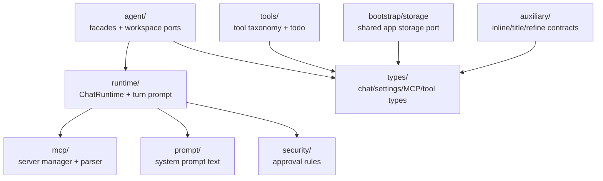

# `src/core/` — Hexagonal core contracts and domain logic

Provider/runtime-neutral layer. `features/` calls into this layer; `src/pi/` implements the contracts. Do not import `src/pi/**`, `src/features/**`, Obsidian UI classes, or runtime SDKs here.

## Core map

## Responsibilities

- Define runtime and workspace contracts (`agent/`, `runtime/`).
- Own provider-neutral prompt assembly, MCP mention semantics, approval/security helpers, and tool taxonomy.
- Define shared domain types consumed by features and adaptors.
- Provide storage/bootstrap ports; concrete Obsidian vault persistence lives outside core.

## Dependency rules

- `core/types/` should stay dependency-free.
- Other core modules may use existing framework-neutral helpers from `src/utils/`, but do not introduce runtime SDK, Obsidian UI, or Pi imports.
- Prefer adding/extending a core port before letting feature code depend on adaptor details.

## Gotchas

- `AgentServices` is the runtime-neutral feature-facing facade; Pi installs the active implementation during bootstrap.
- Static facades throw if bootstrap order is wrong; `main.ts` must install registrations before views open.
- `buildTurnPrompt` returns separate API/display prompt data; keep that split intact.
