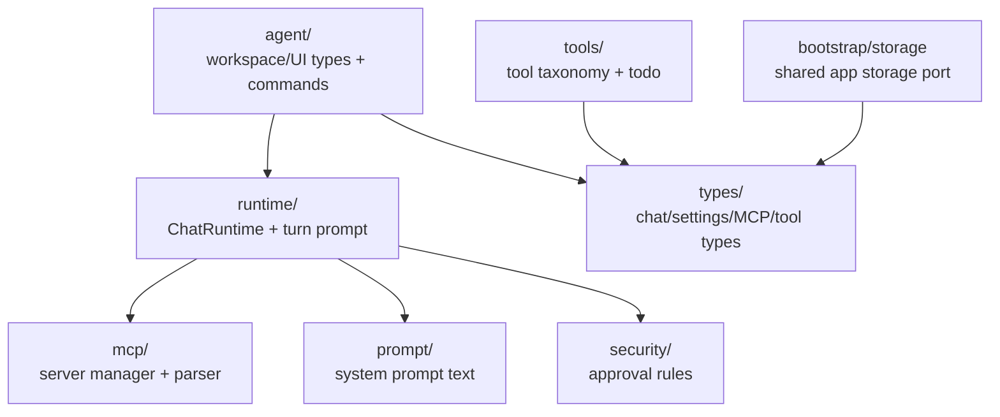

# `src/core/` — Pure helpers, shared DTOs, and domain logic

Core is no longer the mandatory runtime seam. Keep code here only when it is a pure helper, shared DTO, or domain rule that benefits from living outside UI/Pi modules. Do not import `src/pi/**`, `src/features/**`, Obsidian UI classes, MCP SDKs, or Pi SDKs here while these modules stay shared.

## Core map

## Responsibilities

- Own pure prompt assembly, MCP mention semantics, approval/security helpers, and tool taxonomy.
- Define shared domain types consumed by features and Pi modules.
- Provide storage/bootstrap ports; concrete Obsidian vault persistence lives outside core.

## Dependency rules

- `core/types/` should stay dependency-free.
- Other core modules may use existing framework-neutral helpers from `src/utils/`, but do not introduce runtime SDK, Obsidian UI, or Pi imports.
- Prefer moving Pi-only behavior to `src/pi/` or the relevant feature over adding broad core ports.

## Gotchas

- `buildTurnPrompt` returns separate API/display prompt data; keep that split intact.
- Keep `core/agent/types.ts` focused on shared product DTOs and narrow service interfaces; Pi-owned behavior belongs in `src/pi/` or the feature that uses it.
