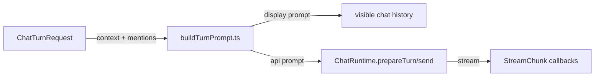

# `src/core/runtime/` — Chat runtime contract and turn prompt assembly

Defines the narrow `ChatRuntime` interface used by chat controllers and builds `PreparedChatTurn` objects from UI requests, context attachments, and MCP mentions.

## Turn preparation flow

## Rules

- Preserve the display/API prompt split; never persist MCP-transformed API text as the user's message.
- Runtime contracts should stay limited to callbacks/features Pi actually implements.
- Context serialization can use existing framework-neutral helpers from `src/utils/`, but avoid UI or Pi imports.
