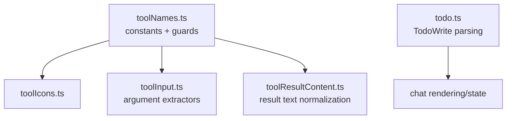

# `src/core/tools/` — Provider-neutral tool taxonomy

Core helpers for naming, categorizing, parsing, and rendering tool activity. These files describe tool semantics for UI/core; concrete execution lives in adaptors such as `src/pi/tools/`.

## Tool helper map

## Rules

- Keep this layer dependency-light and provider-neutral.
- Add new tool names here when renderers/controllers need stable categorization.
- Do not implement tool execution or Pi `AgentTool` schemas here.
