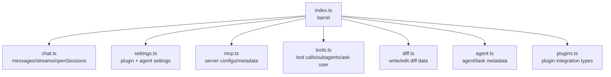

# `src/core/types/` — Dependency-free domain types

Shared type definitions for chat, settings, tools, MCP, diffs, agents, and plugin metadata. This directory should stay dependency-free: no imports from Obsidian, Pi, features, or utilities unless they are type-only and unavoidable.

## Type map

## Rules

- Prefer `export interface` / `export type` and discriminated unions for runtime-state shapes.
- Keep settings extensible only where needed for adaptor-specific fields.
- Do not encode Pi SDK types here; define provider-neutral shapes and map in `src/pi/`.
