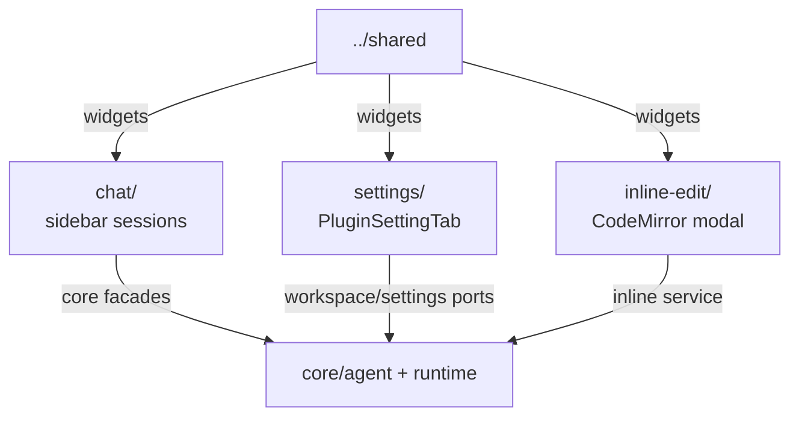

# `src/features/` — Obsidian user-facing features

Feature/application layer for chat, settings, and inline edit. Features may use Obsidian UI APIs, shared widgets, utilities, and core facades; they must not import `src/pi/**` directly.

## Map

## Rules

- Feature code owns UI composition and Obsidian interactions, not provider/runtime implementation.
- Runtime work goes through `AgentServices`, `AgentWorkspace`, or explicit core contracts.
- Keep DOM cleanup and stale-tab guards close to the component/controller that registers async work.
