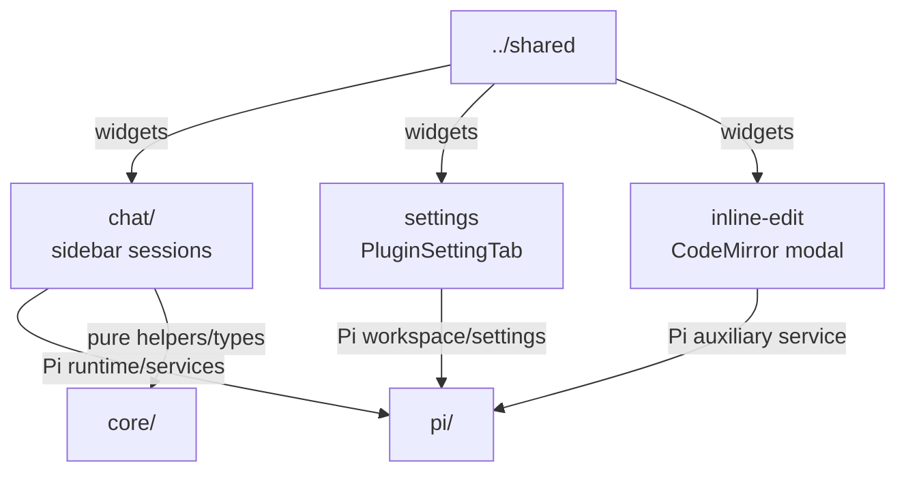

# `src/features/` — Obsidian user-facing features

Feature/application layer for chat, settings, and inline edit. Features may use Obsidian UI APIs, shared widgets, utilities, pure helpers, and Pivi-owned Pi product services. Prefer explicit dependencies over implicit globals.

## Map

## Rules

- Feature code owns UI composition and Obsidian interactions; low-level SDK work still belongs in Pi runtime/tool modules.
- Runtime/workspace dependencies should be explicit Pi services or callbacks supplied by the plugin/view/tab.
- Keep DOM cleanup and stale-tab guards close to the component/controller that registers async work.
